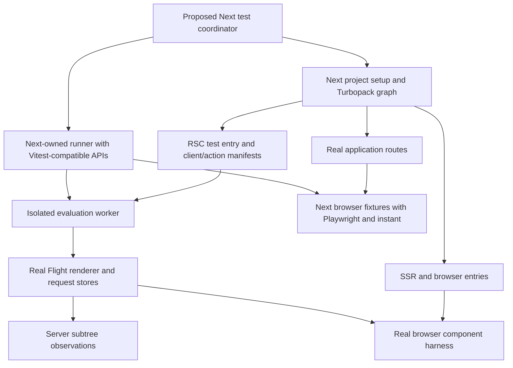

# Testing integrated into Next.js: architecture proposal

Planning draft, 16 September 2026. No implementation or external publication.

Repository baseline: Next.js `602a2aba900e45fb2edd694f463f435430678e1f`; read-only Vitest reference: `0780a8e5b7967a4168173599e9c74fb79aab2483`. Source links below point into those local checkouts. Findings describe these revisions; proposed packages, commands, interfaces, and behavior are explicitly marked as proposals. Source inspection establishes feasibility and extension points, not working compatibility.

**Architecture decision:** Next.js owns compilation and runtime end to end, including test entry loading, module evaluation, worker lifecycle, isolation, RSC rendering, requests, caches, and mocking. A Next-owned test runner implements the Vitest testing API contract: familiar imports, declarations, assertions, hooks, fixtures, snapshots, and spies. Reusable Vitest libraries or independently embeddable execution code are implementation choices within that ownership boundary. Vitest's controller, pools, worker bootstrap, and Vite module pipeline are not prerequisites for running tests.

Keep compilation/rendering and test semantics as separate internal components so each can evolve, but build the initial product around the Next-owned runner. Use Playwright for real browser automation and retain the existing `instant()` helper. Compatibility with Vitest authoring APIs is a primary requirement; compatibility with every Vitest config option, plugin, reporter, IDE protocol, or CLI behavior is a separately specified surface.

The critical invariant is that an application module reached from a test uses the same Next.js/Turbopack compilation context that would reach it from the application. Adding a consumer of the existing compiler configuration is preferable to reproducing it in a Vite plugin, SWC transformer, or custom resolver. Actual RSC rendering is an additional requirement: evaluating `await Component()` is insufficient.

## 1. What exists and what it implies

| Existing implementation                                                                      | Finding                                                                                                                                                                                                             | Architectural consequence                                                                                                                                                                                                                          |
| -------------------------------------------------------------------------------------------- | ------------------------------------------------------------------------------------------------------------------------------------------------------------------------------------------------------------------- | -------------------------------------------------------------------------------------------------------------------------------------------------------------------------------------------------------------------------------------------------- |
| [Development project creation][N01] and [production project creation][N02]                   | Next passes resolved config, define environments, target versions, browser support, build identity, encryption key, and other options into the native project.                                                      | Share the real setup path, including config loading and phase handling. Copying a subset of options into a testing package will drift.                                                                                                             |
| [AppProject RSC contexts][N03], [server export conditions][N04], and [Next import maps][N05] | App RSC, Client Component SSR, browser, route-handler, and Edge contexts differ. RSC transitions connect client references to SSR and browser compilation.                                                          | “Compile with Turbopack” alone is not enough. Each subject needs its actual layer and target, including transitions and manifests.                                                                                                                 |
| [Project/Endpoint JavaScript API][N06] and [AppEndpoint output][N07]                         | The API exposes application route endpoints and their outputs/change subscriptions. App endpoints collect client references and Server Actions and emit their manifests. There is no arbitrary test-entry API here. | Add a test-entry consumer to the native project and binding. Reuse endpoint graph and manifest machinery; do not pretend a public `compileTest()` already exists.                                                                                  |
| [Flight and Fizz rendering][N08], [entry-base][N09]                                          | Next renders a model through Flight and consumes it through a separate SSR/client path. The RSC exports live in the compiled React server layer.                                                                    | Render inside the matching application bundle. A test process importing a separately resolved React or RSC package can violate module identity and layer requirements.                                                                             |
| [Request-store constructor][N10], [work-store entry][N11], and [validation worker][N12]      | Request stores can be built from request-shaped inputs. The validation worker loads a compiled route, registers manifests, and calls back into that bundle to render with its React instance.                       | This is a concrete precedent for a render worker. It is not yet a generic component-test runtime and requires explicit extraction/design.                                                                                                          |
| [Manifest singleton][N13] and [Turbopack runtime caches][N14]                                | Evaluated modules and manifests have mutable realm/global state. Development manifest lookup can fall back to other routes in ways production does not.                                                             | Compile-cache reuse must be separated from evaluation isolation. HMR invalidation is not a complete test reset.                                                                                                                                    |
| [next/jest][N15] and [current Vitest guide][N16]                                             | `next/jest` uses an SWC Jest transformer, mocks assets, and empties `server-only`. The Vitest guide uses Vite/React plugins and states that async Server Components are unsupported.                                | Preserve existing integrations for their current uses. Neither establishes the fidelity required here. The current public guide makes the same async-RSC limitation explicit. [Official guide](https://nextjs.org/docs/app/guides/testing/vitest). |
| [Existing experimental server helpers][N17] and [Playwright test mode][N18]                  | Server helpers cover selected routing/config utilities. Test mode supplies external-fetch interception across client/server via Playwright fixtures and optional MSW.                                               | Reuse their relevant contracts. Fetch interception does not provide arbitrary server module mocking or a renderer.                                                                                                                                 |
| [Repository test scripts][N19] and [router act][N20]                                         | Framework tests use Jest orchestration plus real Next servers and a Playwright wrapper; `createRouterAct` controls and inspects internal router requests.                                                           | Keep the framework's own harness as an oracle for the new user-facing facility. Do not confuse the existing Jest harness with a Turbopack unit-test engine.                                                                                        |

## 2. The fidelity contract

Define a test profile by **Next version + resolved configuration/phase + compilation mode + application layer + runtime target + route context where relevant + explicit test substitutions**. A green result must say which profile ran.

Application code must retain Next's resolution, aliases, package export conditions, transpilation rules, JSX/React Compiler behavior when configured, `server-only`/`client-only` enforcement, `use client` and `use server` transitions, Server Action IDs/references, `use cache` transforms, CSS/assets/fonts, supported browser target, and externalization rules. Check the inputs passed into both project creation paths and the contexts they select; do not maintain a second configuration translation table.

Tests may add discovery entries, engine imports, source observation, and explicitly declared mocks. Those additions must not silently reconfigure the unmocked application graph. Report test substitutions separately from the inherited profile. For non-executed client boundaries in RSC tests, still compile and validate the actual referenced client graph by default: skipping its execution must not conceal invalid imports.

Do not set application compilation to `NODE_ENV=test` merely because the engine normally does. Development and production select different exports and transforms. Next's env loader also treats `NODE_ENV=test` specially and excludes `.env.local`; preserving Vitest's usual test environment implicitly would change the application environment. Proposed default: run application realms with their actual development/production settings, identify testing independently, and allow explicitly supplied test service configuration. Record a non-secret configuration fingerprint and env **names**, not env values. Decide and document how tests opt into `.env.test` data without changing application compiler conditions. [Env loader][N21].

“Same environment” does not mean byte-identical chunks: an isolated entry has a different reachable graph, manifests, IDs, and optimization opportunities from a full application. Acceptance means the same context constructors, resolution decisions, transforms, runtime semantics, and diagnostics for that graph. Exact deployment artifact behavior requires testing the actual built application.

## 3. Architecture and extension points



**Coordinator and compiler service.** Proposed `next test` owns discovery, compilation profiles, worker leases, browser/server startup, cancellation, and results. Its collector implements the advertised Vitest declaration/discovery semantics and registers entries with Turbopack. Watch and affected-test selection use Next dependency information. The normal execution path does not boot a Vitest controller or Vite server.

Extract reusable project-option construction from the current dev/build paths, without flattening their legitimate differences. Add a native test-entry registration operation in `crates/next-api`, surface it through the [native project binding][N31], and expose it beside `Project`/`Endpoint` in `packages/next/src/build/swc`. Candidate new native implementation: `crates/next-api/src/testing.rs`. Existing [endpoint trait][N22] and AppProject contexts are the starting points; this is a new internal interface, not a public bundler abstraction to freeze immediately.

A test entry should declare a file/export, profile, applicable route context, and mock namespace. Its outputs include server/client chunks, client-reference and action manifests, assets, source maps, compilation issues, and a dependency revision. Type names might be `TestEntryDescriptor` and `CompiledTestArtifact`; their exact wire shape is an open design task. Publish immutable revisions atomically so a worker cannot combine yesterday's manifest with today's chunks.

**Test-code and application-code boundary.** For the first RSC suite, compile the spec and its application imports as a test entry rooted in the real App RSC context. In the explicitly selected Next testing mode, resolve supported `vitest` API imports in the test-support graph to a Next-owned compatibility module. That module registers tests and accesses the active assertion/mock context in the Next runner; it does not initialize Vitest's runtime. Helpers and supported matcher packages must reach the same API instance. Test instrumentation applies to test declarations/support edges, not indiscriminately to source modules. Preserve the correct React identity in each application layer and leave application resolution under the normal Next contexts.

A browser component spec belongs in its browser test environment; a Node e2e driver does not directly import and execute RSC components. For browser mounting, refer to a compiled server fixture/export, which the server renders and the browser consumes. Do not pass a React element or arbitrary closures over worker/browser RPC and claim normal RSC serialization semantics.

**Application execution host.** Start with fresh workers/processes and the normal emitted Turbopack runtime. Load manifests and render entry functions from the same bundle that contains the subject. Use `entry-base`/component module exports for React server APIs, with the existing stream-operation helpers; preserve the repository's React server layer boundary. The [validation worker][N12] is a strong implementation precedent, including source-map support, cancellation, and manifest setup. Avoid turning all of `app-render.tsx` into a configurable test harness: extract the minimum request/render setup used by both callers, or initially reuse a synthetic route endpoint while measuring what needs extraction.

**Runner and compatibility contract.** The Next runner owns discovery/collection, evaluated-entry loading, setup/teardown, test/hook/fixture execution, cancellation, timeout ownership, retry identity, assertion state, mock registration/reset, snapshot I/O, console/errors, source mapping, attachments, coverage records, and result events. Implement Vitest-compatible semantics behind the authoring API while keeping the application loader/render services separate. Libraries may supply assertions, spies, formatting, or snapshot primitives; Next supplies their state and lifecycle. A versioned capability manifest identifies supported APIs and fails on unsupported use rather than booting another runtime as a fallback. Optional external tooling adapters consume Next's events and control API; they do not select application transforms or module execution behavior.

**Browser host.** Provide an ephemeral, inaccessible-to-normal-builds component harness served by Next. It accepts only registered fixture IDs/exports, uses real server rendering and browser chunks, and supplies the actual app providers appropriate to the declared context. A standalone mount with supplied providers remains a component integration test; route integration uses a real route/layout tree. The Next runner owns browser fixtures, server lifecycle, isolation, cancellation, and result attribution; Playwright provides real browser automation, tracing, screenshots, and contexts. Reuse `@next/playwright` for `instant()` directly. Existing Playwright Test suites can remain a separate interoperability lane against the same Next app.

## 4. Three rendering levels, plus ordinary unit tests

| Level                                         | Execution and useful assertions                                                                                                                                                                                                                                     | What it cannot establish                                                                                                                                                                            |
| --------------------------------------------- | ------------------------------------------------------------------------------------------------------------------------------------------------------------------------------------------------------------------------------------------------------------------- | --------------------------------------------------------------------------------------------------------------------------------------------------------------------------------------------------- |
| Ordinary module unit test                     | Execute a function/module in its declared Next server or browser context. Assert return values, errors, calls, and side effects.                                                                                                                                    | Calling an async component as a function does not test RSC rendering. A Node target says nothing about browser APIs.                                                                                |
| RSC server-subtree test                       | Render the component element with the real Flight renderer, including nested async components and Suspense. Observe server-produced values, render errors, reference identities, and serializable props crossing client boundaries. Supply explicit request inputs. | No client component execution, DOM, effects, user interactions, layout, hydration, or router navigation guarantees. Observing a server Suspense boundary does not establish what a browser painted. |
| Component/route integration in a real browser | Server renders through Flight and SSR, browser decodes/hydrates actual client references, and assertions use DOM locators and interactions. Test Client Component context/providers, effects, form actions, and request APIs in a chosen harness or real route.     | An isolated harness does not establish omitted parent layouts, middleware/proxy, route interception, metadata, or deployment behavior. Add real-route tests for those.                              |
| Full browser e2e                              | Start/build the app, navigate actual URLs, use the real router, submit Server Actions, and assert shell/full UI, status, cookies, history, and browser behavior.                                                                                                    | Local dev e2e does not establish production optimization, deployment/CDN behavior, or performance under real network conditions.                                                                    |

For RSC tests, define an observation API over the real Flight output rather than snapshotting raw wire bytes. A companion consumer can decode with the matching React client decoder and expose known client references as explicit inert boundary descriptors. That consumer's reference resolver is an **observation adapter**, not a client renderer; verify every descriptor against the emitted manifest and never substitute the renderer/serializer itself. Keep a full-decoder/browser oracle to catch mistakes in the observer. If this observation layer cannot represent a feature faithfully, require a browser integration test instead of silently flattening it.

Proposed results distinguish render completion, errors/control-flow outcomes, pending boundaries, and client references. Timeouts abort and dispose the stream. Tests waiting for all server work must explicitly await completion; tests about a partial stream need controlled async fixtures. React context must follow the relevant layer's actual support: do not invent server `createContext` support. Client providers/context require client execution. Raw Flight byte order, unstable chunk IDs, and development owner stacks should not be the default snapshot contract.

Request setup should use [createRequestStore][N10] and [createWorkStore][N11], real AsyncLocalStorage ownership, patched fetch/cache behavior, and correct phases. `cookies()`, `headers()`, draft mode, URL/params/search params, and root params must exercise production implementations. Rendering should retain read-only cookie restrictions; an action/route-handler phase has different permissions. Return a normalized redirect/not-found outcome for a subtree test, while verifying actual HTTP status, response headers, redirect behavior, and UI at route level. Prerender and `use cache` restrictions need their real work-unit modes, not only a fabricated request store.

Do not initially promise router providers, intercepted routes, metadata, or arbitrary layout inference for isolated components. Allow a component to specify the route context needed for route-scoped APIs; fail descriptively when it is missing.

## 5. Implementation reuse under Next ownership

The checked-out normal runner [extends `vite/module-runner`][V01] and the Vite plugin configures its development transform/externalization behavior [V02]. This is development-module execution, not a Vite production build. Its [TestRunner][V03] uses worker state, assertions, snapshots, `vi`, and RPC. The [worker boot path][V04] selects and creates the loader before executing suites.

There is a small internal [`TestModuleRunner` interface][V05], and the checkout also has an experimental native loader path. Neither is a standalone engine: the native path still has host setup and resolver/mocking dependencies. The current [custom-pool documentation][V06] provides lifecycle/transport and `vitest/worker` initialization hooks. Calling its example `runBaseTests` continues through Vitest's default loader selection. These sources explain why a pool or `importFile` replacement is not the selected foundation. Public docs describe the pool API as experimental and low-level. [Official custom-pool API](https://vitest.dev/guide/advanced/pool).

| Option                                                                            | Fidelity and compatibility                                                                                                                                          | Recommendation                                                                                                                       |
| --------------------------------------------------------------------------------- | ------------------------------------------------------------------------------------------------------------------------------------------------------------------- | ------------------------------------------------------------------------------------------------------------------------------------ |
| Vite plugin approximating Next transforms/resolution                              | Easy migration appearance; leaves application semantics with Vite and needs to recreate RSC transitions, manifests, and rendering.                                  | Reject as the foundation. Does not satisfy the primary requirement.                                                                  |
| Next-owned runner implementing Vitest-compatible APIs, using reusable libraries   | Gives Next control over compilation, runtime, scheduling and state. Lifecycle, mocking and tooling compatibility require deliberate implementation and maintenance. | Selected architecture. Publish a supported API/version contract and validate behavior against Vitest.                                |
| Reuse independently embeddable Vitest execution code or collaborate on extraction | Can reduce semantic duplication if code accepts Next-owned loading, state, scheduling/resource policy and result plumbing.                                          | Evaluate library by library within the selected architecture. No dependency on an upstream extraction or approval to make progress.  |
| Vitest controller + Next custom pool/worker                                       | Can retain existing Vitest tooling but couples the primary execution path to its controller, worker state and bootstrap.                                            | Not the primary architecture. A future optional frontend may delegate to Next's runtime/control API without becoming its owner.      |
| Playwright automation inside Next browser fixtures                                | Real browsers, pages, contexts, traces and the existing `instant()` helper with Next-owned execution lifecycle.                                                     | Primary browser direction. Define browser assertion compatibility explicitly; existing Playwright Test remains an optional frontend. |

Do not build on `@vitest/runner` as if it were an actively maintained standalone engine. The checked-out 5.x [migration guide][V07] deprecates that package. `@vitest/expect`, `@vitest/spy`, `@vitest/snapshot`, `@vitest/pretty-format`, and `@vitest/utils` remain reuse candidates, but must be assessed separately for runtime dependencies, behavior, licensing and maintenance. The same guide says standalone `@vitest/expect` no longer shares state with Vitest's bundled `expect`. The Next compatibility module must expose one assertion instance and wire custom matchers, assertion counts, snapshots and test context into it; importing actual `vitest` alongside it would create a second runtime/state problem. [Official migration guide](https://vitest.dev/guide/migration/).

## 6. Compatibility matrix and shipping promises

These are **targets**, not verified support. Preserve `import { test, describe, expect, vi } from 'vitest'` under `next test` through the explicit Next testing compatibility module described above. Each supported feature needs conformance tests against an explicitly pinned Vitest release/revision, then a documented supported version range. Do not mutate the installed `vitest` package or globally redirect application imports. Supported test helpers must use the same module; unsupported deep imports fail clearly. Provide matching declarations/editor resolution for the advertised API surface, including Next fixture extensions, and report the active compatibility profile.

Prioritize source, type and behavioral compatibility for test authoring. Configuration, reporter APIs, editor protocols and plugins have separate contracts; familiarity of test syntax does not imply those work unchanged.

| Surface                                                                              | Next-owned implementation target                                                                                        | Compatibility boundary / compromise                                                                                                 | Acceptance criterion                                                                                                                                                                |
| ------------------------------------------------------------------------------------ | ----------------------------------------------------------------------------------------------------------------------- | ----------------------------------------------------------------------------------------------------------------------------------- | ----------------------------------------------------------------------------------------------------------------------------------------------------------------------------------- |
| `test`/`it`, `describe`, skip/only/todo, parameterized tests                         | Next collector implements supported forms and types.                                                                    | Matching syntax alone is insufficient; enumeration and modifier semantics must match.                                               | Same collected cases, names, filtering, results, and exit status for the contract corpus.                                                                                           |
| Assertions, async assertions, custom matchers, assertion counts                      | Reuse assertion primitives under one Next-managed `expect` state.                                                       | Third-party matcher imports must resolve to that instance; unsupported integration assumptions need diagnostics.                    | Same matcher outcomes, extension behavior, and async failure ownership; normalize only irrelevant stack paths.                                                                      |
| Hooks, ordering, cleanup on failure                                                  | Next lifecycle implements the selected Vitest semantics.                                                                | Reuse extracted code only if state and resource ownership remain with Next.                                                         | Match ordering and cleanup on failed setup, failed test, timeout, retry, cancellation, and nested suites.                                                                           |
| `test.extend` and fixtures                                                           | Preserve test/file/worker scope and injection behavior from the selected version.                                       | Substantial lifecycle/type work; no “fixtures supported” claim from matching syntax alone.                                          | Match dependency order, lazy/auto behavior, overrides, teardown, and scope lifetime. See [fixture implementation][V08].                                                             |
| Retries, repeat, concurrency, sharding                                               | Next schedules attempts and manages isolated resources with compatible observable semantics.                            | Specify each supported behavior.                                                                                                    | Distinct attempt IDs, correct fixture reset, no lost errors, deterministic shard assignment. Initially reject unsafe concurrent cases sharing mutable mocks/realm state.            |
| Value/file snapshots, serializers                                                    | Reuse snapshot primitives; Next owns naming/state, source mapping, update policy and I/O.                               | Inline updates require original-source locations and a coordinated writer.                                                          | Update/read/prune behavior and CI failures match; existing supported snapshot files round-trip.                                                                                     |
| `vi.fn`, `vi.spyOn`, clear/reset/restore                                             | Reuse spy primitives with Next-managed cleanup and compatible `vi` exports.                                             | Ordinary object spies and spying on optimized/sealed module namespaces are separate capabilities.                                   | Preserve call history, accessors, restoration, async results, types and lifecycle.                                                                                                  |
| Module mocking: factories, automock, `__mocks__`, `importActual`, `doMock`, hoisting | Next implements the API on Turbopack graph/runtime capabilities.                                                        | No Vite mocker/runtime dependency; support each behavior deliberately.                                                              | Gate each feature separately on ESM live bindings, cycles, dynamic import, namespaces, reset, and isolation. Unsupported patterns error explicitly.                                 |
| Fake timers, date, globals/env stubs                                                 | Reuse suitable primitives inside Next-managed unit realms.                                                              | Browser/RSC timing and compile-time env inlining need separate support.                                                             | Restore after failures; do not freeze internal renderer/router scheduling by accident.                                                                                              |
| Configuration                                                                        | Next config owns compilation; Next test config exposes familiar discovery, timeouts, setup, fixtures and retry options. | Existing Vitest configuration import is an optional, documented subset with migration diagnostics.                                  | Reject conflicting `resolve.alias`, transforms, Vite plugins, optimizer settings, and compile-time defines on the application graph. Never silently ignore them.                    |
| Environments and projects                                                            | Next owns RSC/server/browser profiles and multi-project lifecycle.                                                      | Existing Vitest environment plugins are not automatically compatible. jsdom/happy-dom are optional approximations, not RSC support. | Profiles select real contexts; separate project state and errors; unsupported environments fail before tests run.                                                                   |
| Coverage                                                                             | Next owns runtime collection, source maps and provider/event integration.                                               | Existing Vitest coverage-provider internals are not automatically reusable.                                                         | Correct source attribution and deduplication across RSC/SSR/browser copies, excluded wrappers, branches and uncovered files. Initial coverage may be absent with an explicit error. |
| Reporters, JSON/JUnit, attachments, CI                                               | Next event model and basic output formats first.                                                                        | Vitest reporter object/API parity requires an explicit adapter and conformance tests.                                               | Preserve collection/runtime failures, retries, stdout, browser artifacts and source locations.                                                                                      |
| UI, VS Code integration, watch, changed/related tests                                | Next graph/controller supplies run/debug/watch events and commands.                                                     | Vitest UI/editor protocols require dedicated integration; they are not supplied by compatible test APIs.                            | Run/debug one original test, update snapshots, rerun affected tests, and navigate errors without generated-chunk leakage.                                                           |
| Browser Mode and browser matchers                                                    | Next browser harness and fixtures use real Next bundles and Playwright automation.                                      | Existing Vitest Browser Mode is not the implementation. Locator/matcher compatibility needs its own contract.                       | Serve subject code from Next, execute actual client bundles, verify locators/actions in a real browser; reuse `instant()`.                                                          |
| Type tests / benchmarks / ecosystem plugins                                          | Separate projects/features; assess after core contract.                                                                 | Later or unsupported; never load plugins that require taking over compilation/runtime.                                              | Do not equate TS transpilation with type checking, or generic benchmark APIs with representative app performance.                                                                   |

A useful first release need not implement every Vitest API. It must preserve the common path well enough that tests written by users and AI agents work predictably, provide actionable errors for gaps, and never return a passing result after silently skipping unsupported behavior. Test the familiar import paths and examples in scaffolding and documentation as part of the product contract.

## 7. Module mocking belongs in the graph and runtime

Implement this as a deliberate compiler capability after establishing an unmocked oracle, with a small mocking spike early enough to influence the architecture.

1. Collect supported static mock declarations before subject dependencies evaluate. Any hoist transform is test-only, source-mapped, and explicitly specified against Vitest semantics. Mock factories must execute in the intended test realm; closure capture and `vi.hoisted` need a defined contract.
2. Resolve mock targets with the subject's real importer, layer, package conditions, and Next aliases. A textual specifier is insufficient: the same file can have distinct RSC, SSR, browser, and external instances.
3. Represent replacements as test-scoped graph variants or explicit module-factory indirections. Keep original nodes available for `importActual`. Include mock definitions/target contexts in graph revision keys; isolate evaluated factories, registry state, and exports by test execution scope.
4. Account for optimized exports, tree shaking, concatenation, cycles, live bindings, re-exports, top-level await, dynamic imports, CJS externals, and native modules. Ordinary object spies are different from rewriting module binding behavior. `resetModules()` resets evaluation state according to the compatibility contract; it does not automatically reset requests, cache handlers, timers, or native addon state.
5. Never implicitly replace client references with plain functions, or Server Actions with ordinary callable functions, and then claim cross-boundary fidelity. Explicit client boundary observation and transport-level tests serve different purposes. Initially reject mocking framework React/Flight/ALS internals in fidelity suites.

Compare graph variants with runtime indirection in the spike. Variants make dependency identity explicit but can increase compilation work; indirection can support dynamic factories but may require test-specific optimization restrictions. Preserve unmocked chunks when possible. A suite with mocked application modules tests the declared substitution; it does not certify the exact optimized production module graph. Test production artifacts without those substitutions as a separate lane.

Fetch mocking is useful earlier because the existing [test mode][N18] carries request-scoped external-fetch handling. Reuse it for deterministic service responses in route/browser tests, including concurrent tests with different responses. Its external-fetch scope does not cover every SDK, DB client, internal route, or native transport. Server-side service I/O is not intercepted merely by `page.route()`.

## 8. Isolation, caching, and affected-test selection

| Resource                                                      | Proposed lifetime                                                              | Required reset/invalidation                                                                                                                                         |
| ------------------------------------------------------------- | ------------------------------------------------------------------------------ | ------------------------------------------------------------------------------------------------------------------------------------------------------------------- |
| Compiler project and persistent artifacts                     | Reused across files/runs for the same profile and dependency revision.         | Source/config/env-input changes, Next version, target, transforms, and mock variants invalidate affected outputs. Build and dev artifacts remain distinct.          |
| Evaluated modules, React instances, manifests, global patches | Fresh realm/process per test file initially, matching familiar file isolation. | Dispose the worker after the file; do not assume `require.cache` deletion covers Turbopack, native ESM, globals, or addons.                                         |
| Test cases within a file                                      | Engine's documented module/fixture semantics.                                  | Module state may intentionally persist within a file. Per-case request/cache fixtures are fresh; a future fresh-module-per-case mode needs explicit hook semantics. |
| Request context and stream                                    | Fresh per request/render.                                                      | Abort pending work, await cleanup, discard stores, response state, and per-request React memoization.                                                               |
| Next persistent data/cache handlers                           | Fresh test namespace or dedicated server/process by default.                   | Clear/drop namespace at the end; deliberate warm-cache tests share an explicitly scoped fixture. Never rely on globally clearing shared concurrent caches.          |
| Browser context, cookies, storage, router cache               | Fresh per test by default.                                                     | Close context; manage service workers and test server data separately. Shared server caches still need isolation.                                                   |
| Snapshot/report state                                         | Engine-controlled file/run scope.                                              | Serialize writes, retain failed-attempt evidence, avoid duplicate ownership by multiple engines.                                                                    |

The speed opportunity is reusing compilation without preserving evaluated application state accidentally. Fresh workers are the initial correctness baseline; optimize startup only after measuring. HMR can help incremental development but is not a substitute for reset semantics. Pin every test to an artifact revision and discard/cancel results superseded by an edit.

Add a dependency API around the existing endpoint/module graphs rather than parsing imports in the runner. Record input-to-test reachability across RSC/client transitions, mock factories, setup files, config, package manifests, and generated assets. Track failed/unresolved imports and directory dependencies too: adding a previously missing file must rerun the failing test. A whole-app production graph is not assumed to exist in development [N06].

For watch mode, rebuild changed nodes and rerun their dependent tests after the revision settles. For changed/related selection, prefer false positives to missed tests. Data files read through `fs`, external services, computed imports, and config changes need declared dependencies or conservative widening. Full browser tests usually do not import their routes: collect explicit route/fixture dependencies plus observed routes as hints, and run all potentially affected e2e tests when coverage is incomplete. Runtime route traces alone cannot prove that unvisited branches are irrelevant. Full-suite CI remains the oracle while selection matures.

Measure cold project startup, first test, warm rerun, one shared-dependency edit, worker startup, browser startup, memory growth, and artifact reuse separately. Set budgets from measured baselines in phase 0; no speedup claim follows merely from using Turbopack.

## 9. What `instant()` actually does

The existing helper is [`@next/playwright`'s `instant(page, callback, options?)`][N23]. It is experimental and documented as requiring Cache Components [N24]. It uses structural Playwright interfaces and optional Playwright steps, so it can be used by a different Node test engine that has a real Playwright `Page`.

The callback is a controlled navigation scope. The helper sets a `next-instant-navigation-testing` cookie, returns the callback's value, and deletes that cookie in `finally`. It scopes concurrent usage by browser context and rejects nested/concurrent scopes on the same context. An explicit `baseURL` is required for a fresh `about:blank` page unless the application URL can already be inferred. Cleanup deletes only the instant cookie, with bounded retries for cookie resurrection, to avoid disturbing application cookies [N23].

The detailed behavior is in Next's router/server, not in the helper:

- For SPA navigation, [ensurePrefetchThenNavigate][N25] schedules and awaits that navigation's prefetch before normal navigation. The [navigation lock][N26] uses a private segment cache populated under the scope to avoid stale entries from earlier navigations. This tests the UI available with prefetching complete; it does **not** measure whether prefetching finished in time in the user's session.
- The current navigation's dynamic writes are withheld. A later locked navigation releases the previous navigation's gate and creates its own, so “all dynamic data stays frozen throughout the entire callback” is too broad. Out-of-band client `window.fetch` calls are also delayed; Next's internal fetches bypass the blocker and dev-server requests are allowed through [N26]. This is not a general interceptor for every network API.
- For initial load, reload, and MPA navigation, the [server cookie path][N27] selects the static-shell behavior when applicable. It distinguishes document requests from RSC requests. The [bootstrap][N28] and client code establish the matching hydration state. Unlock triggers [a soft refresh or a hard reload before hydration][N29], so do not assume every MPA case resumes the same HTTP stream.
- Availability is enabled in development and requires `experimental.exposeTestingApiInProductionBuild: true` for production testing. The browser implementation is aliased to a disabled module when not exposed: [import map][N05], [package documentation][N24], [lock implementation][N26]. An instrumented production test build differs from the default deployment build.

Use it to assert what the shell contains or excludes, then assert the full UI after release. Prefetch strategy, runtime prefetching, generated/dynamic/root params, cookies, and search params affect that shell. Do not call it a fake timer, React `act`, an isolated component renderer, a generic “await everything” helper, or a latency benchmark. `export const instant = ...` is a separate route configuration/validation feature.

Existing [e2e coverage][N30] includes SPA/MPA/reload, runtime/full prefetch, cleanup after exceptions, stale cookies, separate contexts, fresh-page diagnostics, cookies/params, fetch gating, partial prefetching, and no-Cache-Components behavior. The cookie-in-app-shell SPA case at line 501 is explicitly skipped with an unresolved explanation; it is a known gap, not evidence of support. Browser-engine and additional race coverage should be verified before promising all-browser support.

Retain this helper and its semantics in the browser e2e product. Keep the lower-level [createRouterAct][N20] for framework protocol tests where ordering of requests/responses matters. Exposing all router-act machinery as a user API is unnecessary for an initial release.

## 10. Proposed user-facing shape

Everything in the next two examples is **proposed**, including commands, package names, configuration, and RSC observation methods. It is not runnable today. `next test` loads this configuration itself and initializes the Next-owned runtime. `compatibility: 'vitest'` explicitly selects the test API module and its supported contract; it does not launch Vitest or Vite. The application compiler configuration continues to come from `next.config.*`.

```ts
// next.test.config.ts — proposal
import { defineConfig } from 'next/experimental/testing/config'

export default defineConfig({
  compatibility: 'vitest',
  projects: [
    {
      name: 'server-components',
      environment: 'rsc',
      include: ['**/*.rsc.test.tsx'],
      mode: 'development',
    },
  ],
})
```

```tsx
// product.rsc.test.tsx — proposal; this spec runs in the RSC test realm
import { test, expect } from 'vitest'
import { rsc } from 'next/experimental/testing/rsc'
import Product from './Product'

test('renders server data and supplies the client boundary', async () => {
  const result = await rsc.render(<Product id="shoe" />, {
    request: {
      url: 'http://next.test/products/shoe',
      headers: { 'accept-language': 'en' },
      cookies: { currency: 'EUR' },
    },
    clientBoundaries: 'observe',
  })
  await result.complete()
  expect(result.serverText()).toContain('A shoe')
  expect(result.clientReference('./BuyButton', 'default').props).toMatchObject({
    productId: 'shoe',
  })
})
```

The reference selector above must be resolved through the compiler manifest relative to the spec, not a component function name. It observes the boundary and props; it says nothing about the button's rendered DOM. A browser integration API should mount a registered server fixture and return a browser locator/root, then execute the real `BuyButton` bundle. Its exact API is an open decision after the renderer spike.

Proposed commands: `next test` for watch, `next test --run` for CI, profile selection for development/production, and `next test --e2e` for Next-managed real-browser fixtures using Playwright. The same Vitest-compatible declaration/hook/fixture APIs can author unit, RSC and browser tests; browser fixtures and locator assertions need explicit extensions. Direct `vitest` execution is a different runtime and is not the command that provides Next fidelity. Existing Playwright Test commands can remain available as an optional e2e frontend.

This final example shows the **existing** Playwright Test interoperability lane and `instant()` API, not the proposed Next runner's browser fixture syntax. It requires an actual application with these selectors, Cache Components, and a configured base URL. The Next runner can pass its own Playwright `Page` fixture to the same helper. Enable the production testing flag for the instrumented production lane.

```ts
import { test, expect } from '@playwright/test'
import { instant } from '@next/playwright'

test('dashboard shell and dynamic content', async ({ page }) => {
  await page.goto('/')
  await instant(page, async () => {
    await page.getByRole('link', { name: 'Dashboard' }).click()
    await expect(page.getByTestId('dashboard-shell')).toBeVisible()
    await expect(page.getByTestId('dynamic-content')).toHaveCount(0)
  })
  await expect(page.getByTestId('dynamic-content')).toBeVisible()
})
```

## 11. Implementation phases and decision gates

| Phase                                             | Concrete work and likely files                                                                                                                                                                                                                                                                                                                                                                                            | Required evidence before proceeding                                                                                                                                                                                                                                                              |
| ------------------------------------------------- | ------------------------------------------------------------------------------------------------------------------------------------------------------------------------------------------------------------------------------------------------------------------------------------------------------------------------------------------------------------------------------------------------------------------------- | ------------------------------------------------------------------------------------------------------------------------------------------------------------------------------------------------------------------------------------------------------------------------------------------------ |
| 0. Contract and paired oracle                     | Establish supported Next/Vitest revisions; create a tiny app fixture and identical test subject. Record compiler profiles, diagnostics, baseline rendering, worker/browser startup costs, and initial Vitest conformance corpus. Use current `Project` setup and framework e2e harness. Define the Next-owned runner state/event contract.                                                                                | The fixture runs as a normal Next route in development and production. Verify positive and negative layer/serialization cases. Record explicit performance and compatibility budgets. Pin API behavior independently of a Vitest runtime dependency.                                             |
| 1. Compiler + render feasibility                  | Add a private test-entry consumer in `next-api`, binding/types, and minimal worker. Initially a virtual/synthetic endpoint can reuse normal app endpoint generation; later remove route scaffolding where justified. Load actual client/action manifests and render using the subject bundle.                                                                                                                             | Async server-only dependency + nested async component + Suspense + Client Component produce correct Flight output. Wrong-layer imports and invalid client props fail. Two isolated files/workers cannot leak module state. Source errors point to original files.                                |
| 1b. Next runner and API compatibility feasibility | Implement the compatibility module and minimal collector/lifecycle in the Next-owned worker using the same fixture. Evaluate reusable packages independently. Test familiar `vitest` imports, hooks, one fixture, custom matcher, one file/inline snapshot, a spy, one mock factory, and a watch edit. Compare graph variants/indirection for mocks. Candidate new area: `packages/next/src/experimental/testing/runner`. | The corpus matches pinned Vitest behavior while executing through Next's worker/runtime. No Vitest controller/worker bootstrap or Vite module pipeline is loaded; collector/assertion/mock state has one owner. Decide reuse versus implementation per primitive, not whether Next owns runtime. |
| 2. Request-aware RSC MVP                          | Extract shared request/render setup; request/work stores, render phases, cancellation, redirect/not-found outcomes, fetch/cache fixtures, request isolation, explicit client-boundary observation. Candidate area: `packages/next/src/experimental/testing/rsc`, existing app-render/async-storage modules.                                                                                                               | Request API results and restrictions match normal routes. Two concurrent requests with distinct cookies/data remain independent. Negative cases cannot pass through mocked framework APIs. Run a production compilation smoke test.                                                              |
| 3. Useful Vitest compatibility and watch          | Implement the advertised compatibility subset, source maps/snapshots, diagnostics, isolated mock semantics, config conflict errors, result adapters, graph invalidation and conservative affected selection.                                                                                                                                                                                                              | Contract corpus matches the supported Vitest baseline; unknown features fail clearly. Editing client dependencies and previously missing files reruns the right tests. Full-suite oracle catches no missed cases.                                                                                |
| 4. Browser component integration                  | Add internal server-fixture entries, real SSR/Flight transport and browser hydration, client interactions, router-aware real-route fixtures, Server Action transport, service mocking and browser cleanup under Next-owned fixtures.                                                                                                                                                                                      | DOM/context/effects/actions match the real-route oracle. No hydration errors. Boundary serialization failures are visible. Trace and screenshot artifacts identify the failing fixture/test.                                                                                                     |
| Browser e2e lane, starting in phase 0             | Use existing Playwright tests as the oracle, then add Next-managed page/context/server fixtures and reuse `@next/playwright`; exercise `instant()` without waiting for the new component API.                                                                                                                                                                                                                             | Dev and instrumented-production shell/full-UI tests pass with context/cache isolation in the Next runner. Keep an uninstrumented production smoke lane and existing Playwright Test interoperability checks. This work need not wait for complete module mocking.                                |
| 5. Production hardening and release               | Complete production profiles, whole-app artifact tests, Edge/Pages compatibility decisions, coverage/tooling, platform/browser matrix, performance budgets, packaging/scaffolding/docs.                                                                                                                                                                                                                                   | No test-only entry, fixture, mock registry, dependency or endpoint appears in a normal production artifact. Compatibility gates and unsupported-feature diagnostics pass. Critical flows pass on the actual deployment artifact.                                                                 |

The suggested initial async-RSC/server-only/Client Component fixture is the right starting point, but a single successful render would prove too little. Include nested async work, serialization rejection, and file/worker isolation immediately. Add one production oracle and a small Next-runner compatibility/mocking test before scaling the API. Request APIs follow the initial rendering proof, but they should not be deferred behind a large suite of unrelated unit-test features. Browser e2e is useful from the start because its compilation/rendering path already exists.

## 12. Validation and test matrix

For every row, maintain at least one assertion that would fail if the proposed integration bypassed the actual behavior. A test that merely compares a constructed configuration object to itself is not sufficient.

| Area                          | Unit/RSC checks                                                                                                                                                                                                         | Integration checks                                                                                                                                           | Real browser / build checks                                                                                                                                                        |
| ----------------------------- | ----------------------------------------------------------------------------------------------------------------------------------------------------------------------------------------------------------------------- | ------------------------------------------------------------------------------------------------------------------------------------------------------------ | ---------------------------------------------------------------------------------------------------------------------------------------------------------------------------------- |
| Resolution and transforms     | TS/JSX, aliases, conditional exports, `transpilePackages`, externals, project-root/monorepo resolution, custom Turbopack rules, configured compiler features. Compare resolved identities/conditions with route oracle. | Same dependency imported from RSC, SSR and client reaches expected layer-specific implementation.                                                            | Browser and production route behavior; webpack config does not silently alter Turbopack tests.                                                                                     |
| Server/client boundaries      | Valid server-only dependency; client-only rejection; `use client` reference; functions/nonserializable props rejected where React rejects them.                                                                         | Real SSR/client decoder receives manifest-backed references and assets.                                                                                      | Hydration and interactions; assert server-only code absent from browser output.                                                                                                    |
| Rendering                     | Nested async children, Suspense, rejected thenables, supported React semantics, error/abort completion and stream teardown.                                                                                             | Actual SSR/Flight consumer behavior, client context/providers, effects.                                                                                      | Shell/fallback and final content visibility, hydration errors and aborted navigations.                                                                                             |
| Request APIs                  | Headers/cookies/URL/params/draft inputs; missing context errors; read-only render cookie enforcement.                                                                                                                   | Distinct concurrent requests; route/action phase mutation; middleware/proxy effects when using real routes.                                                  | Response cookies/headers, redirects/not-found, auth-related UI and next navigation.                                                                                                |
| Caching                       | Request memoization vs persistent data cache; fresh namespaces, explicit warm fixtures, rejected/pending work cleanup.                                                                                                  | `use cache`, revalidation/tag behavior and action invalidation across requests.                                                                              | Production prerender/PPR, runtime prefetch, route-cache behavior and deployment-specific cache behavior.                                                                           |
| Server Actions                | Transform/reference correctness and separately identified callable business-logic tests.                                                                                                                                | Encode/decode arguments, bound args, action manifests, returned Flight and errors.                                                                           | Form submission, mutation, refresh, redirect, cookies, origin checks and progressive enhancement where supported. Direct calls do not prove these.                                 |
| Module mocks                  | Factory ordering/hoist, live binding, cycle/re-export, dynamic import, `importActual`, automock, reset and per-file isolation.                                                                                          | Separate RSC/SSR/client variants and concurrency; supported external-module behavior.                                                                        | Explicit service mocks; unmocked production lane prevents substitution-only false confidence.                                                                                      |
| Vitest semantics              | Differential collector, assertions, hooks, fixtures, retries, snapshots, spies, timers, types and failure attribution against pinned Vitest.                                                                            | Existing tests/helpers using `vitest` imports resolve to one Next API instance; mixed Next profiles; source locations; watch/cancel/shutdown.                | IDE run/debug and result artifacts; browser assertion extensions retain their documented semantics.                                                                                |
| Runtime ownership             | Next compiler and worker execute tests without Vitest controller/bootstrap or a Vite server/module runner. Reused libraries have audited runtime dependencies.                                                          | Record loaded modules and worker startup; fail on forbidden runtime dependencies. Verify no actual Vitest state is initialized through a helper/deep import. | Next owns browser/server fixture cleanup, cancellation and attempt attribution. Optional external frontends cannot change application compilation or loader policy.                |
| `instant()` SPA               | Helper misuse/cleanup tests where suitable; no replacement for browser coverage.                                                                                                                                        | Lock and prefetch scheduler protocol tests via existing framework harness.                                                                                   | Loading shell, runtime/full/partial prefetch; warm/stale cache and hover-prefetch pollution; repeated navigation; excludes unavailable dynamic UI, then includes it after release. |
| `instant()` documents         | Bootstrap/config contracts.                                                                                                                                                                                             | Static shell response, RSC request distinction, unlock before/after hydration.                                                                               | Fresh page + `baseURL`, reload, plain anchor/MPA, repeated MPA, cookie/param/search-param distinctions, out-of-band fetch, real app cookies preserved.                             |
| `instant()` failure/isolation | Callback failure cleanup, missing baseURL, nesting rejection.                                                                                                                                                           | Cancellation/release while a prefetch is pending, stale cookie recovery.                                                                                     | Separate contexts concurrently; shared-context rejection; no residual lock after timeout or worker crash; no-Cache-Components behavior; production API absent by default.          |
| Incrementality                | Changed/deleted/added files, missing import becomes resolvable, setup/mock/config changes.                                                                                                                              | Artifact revision consistency, stale result discard, compiler reuse with fresh evaluation.                                                                   | Route/layout dependencies, unknown route/data dependencies widen selection; selected-run results compared with full runs.                                                          |
| Packaging and fidelity        | Unsupported configuration/API failures are explicit.                                                                                                                                                                    | Concurrent projects use distinct config/env/manifests/cache state.                                                                                           | Normal build contains no test artifacts; production DCE/minification/conditions; deployment smoke and actual browser-engine matrix.                                                |

Minimum execution profiles for an MVP: Node App Router RSC and module tests under Turbopack development compilation; a production compilation/render smoke; Chromium browser component and e2e checks; instrumented production `instant()` checks; and uninstrumented production navigation smoke. Expand browser e2e to Chromium, Firefox and WebKit before promising cross-browser helper behavior, especially cookie-store and hydration races. Run supported Node/OS/package-manager combinations, including Windows paths and worker/process cleanup, before general release.

Edge execution is a later capability: its compiler context exists, but Node workers plus polyfilled globals do not establish Edge restrictions or deployed behavior. Pages Router ordinary/e2e tests can coexist; RSC semantics belong to the App Router. Webpack e2e remains useful existing coverage, but the new Turbopack unit API should reject an unsupported webpack profile instead of switching compilers silently.

Production validation has three distinct outputs: isolated tests compiled with production options; the real application built with testing APIs explicitly exposed for `instant()`; and the normal deployable build with those APIs absent. The latter must exercise critical flows and check production-only resolution/DCE, optimized assets, action transport, and cache behavior. `next build --debug-prerender` is an additional diagnostic profile, not equivalent to an ordinary production build.

Use repository verification conventions during implementation: generate new suites with `pnpm new-test --args true <name> e2e` (and the appropriate type for other suites), start the Next watch build for source changes, bootstrap/build changed packages before integration tests, and run `pnpm test-dev-turbo` / `pnpm test-start-turbo` for their respective profiles. Capture each run once. Add Turbopack execution/snapshot fixtures for compiler/runtime behavior and Next e2e fixtures for the actual configured graph and renderer. Use `retry()` or engine assertions, controlled gates, and framework router-act/LinkAccordion patterns rather than fixed sleeps. Exact CI environments and feature flags must match the intended profile.

The planning work did not build or run these suites. Release evidence should include compiler/renderer differential results, the Vitest compatibility report, runtime-dependency/startup audit, production artifact inspection, isolation stress runs across shuffled seeds/concurrent workers, and measured cold/warm performance. Establish performance thresholds at phase 0 and retain the full-run oracle until affected selection demonstrates no omissions. Correctness gates are strict: Next owns the execution path, no unexplained compiler/renderer differences, all advertised compatibility cases pass, no unsupported case is silently skipped, no cross-scope state leaks, and no testing code in the ordinary deployment artifact.

## 13. Risks and decisions to resolve

| Decision / risk                     | Recommended starting position                                                                                                                | What resolves it                                                                                                                                                                                                               |
| ----------------------------------- | -------------------------------------------------------------------------------------------------------------------------------------------- | ------------------------------------------------------------------------------------------------------------------------------------------------------------------------------------------------------------------------------ |
| Reuse and compatibility maintenance | Next ownership is decided. Pin Vitest behavior and reuse independently suitable primitives; implement the rest under Next's state/lifecycle. | Audit package dependencies/licensing, run the phase 1b differential corpus, and set a supported-version/update policy. No reliance on private Vitest worker state.                                                             |
| Test API imports and types          | Explicit Next test mode maps supported `vitest` test-support imports to its compatibility module; RSC specs execute in the real RSC context. | Prove React/collector/fixture/expect identity; test helper imports, editor declarations and unsupported deep-import diagnostics; preserve application resolution.                                                              |
| Component entry vs synthetic route  | Use the smallest real endpoint path for feasibility; extract shared machinery when evidence justifies it.                                    | Compare graph/manifests and output with a real route; identify layout/route assumptions explicitly.                                                                                                                            |
| RSC observation API                 | Explicit client boundaries and normalized observations; DOM claims require the browser.                                                      | React decoder/manifest round-trip tests and browser oracle. Choose a stable assertion surface rather than exposing Flight internals.                                                                                           |
| Isolation vs performance            | Fresh evaluated realm per file, fresh request/cache fixtures per case, reusable compilation.                                                 | Measure startup/memory and stress cancellation/global/native-module leakage. Publish intentional within-file sharing.                                                                                                          |
| Cache handlers and external data    | Scope caches by test or dedicate server/process; use explicit data fixtures.                                                                 | Parallel warm/cold tests and custom handler behavior. In-memory request isolation cannot reset an external DB/cache.                                                                                                           |
| Mock semantics and optimization     | Support an explicit subset; evaluate graph variants and runtime indirection early.                                                           | Cross-layer/cycle/external tests and measured graph cost. Production artifact tests remain unmocked.                                                                                                                           |
| Test configuration and env          | Next owns compiler and runner configuration; familiar Vitest test options have a documented mapping.                                         | Define precedence, reject conflicting configs, and settle `.env.test` ergonomics without changing compiler conditions.                                                                                                         |
| Coverage and IDE promises           | Gate separately from basic test execution.                                                                                                   | Real source-map attribution, inline snapshot edits, single-test debug, and reporter integration checks.                                                                                                                        |
| Browser/server sharing              | Fresh browser contexts plus explicit server cache/data policy.                                                                               | Concurrent test and worker-crash cases, including `instant()` cookie cleanup.                                                                                                                                                  |
| Test-only transport exposure        | Prefer registered fixture IDs and worker IPC. Test servers expose only needed endpoints. Normal builds omit all test code.                   | Build-output checks and entry-point review. Any new nonstandard request header needs review against `filterInternalHeaders()`; test proxy headers are an existing mechanism, not blanket precedent to trust incoming metadata. |
| Scope of first release              | Next-owned runner with Vitest-compatible authoring; App Router + Node + Turbopack first; real-browser e2e via Playwright.                    | Conformance results determine the API subset and remaining Edge, Pages-specific, browser-engine and tooling work. Runtime ownership is not contingent on those decisions.                                                      |

[N01]: /Users/timneutkens/.codex/worktrees/dd75/next.js-2/packages/next/src/server/dev/hot-reloader-turbopack.ts:491
[N02]: /Users/timneutkens/.codex/worktrees/dd75/next.js-2/packages/next/src/build/turbopack-build/impl.ts:74
[N03]: /Users/timneutkens/.codex/worktrees/dd75/next.js-2/crates/next-api/src/app.rs:429
[N04]: /Users/timneutkens/.codex/worktrees/dd75/next.js-2/crates/next-core/src/next_server/context.rs:196
[N05]: /Users/timneutkens/.codex/worktrees/dd75/next.js-2/crates/next-core/src/next_import_map.rs:609
[N06]: /Users/timneutkens/.codex/worktrees/dd75/next.js-2/packages/next/src/build/swc/types.ts:317
[N07]: /Users/timneutkens/.codex/worktrees/dd75/next.js-2/crates/next-api/src/app.rs:1227
[N08]: /Users/timneutkens/.codex/worktrees/dd75/next.js-2/packages/next/src/server/app-render/app-render.tsx:3914
[N09]: /Users/timneutkens/.codex/worktrees/dd75/next.js-2/packages/next/src/server/app-render/entry-base.ts:1
[N10]: /Users/timneutkens/.codex/worktrees/dd75/next.js-2/packages/next/src/server/async-storage/request-store.ts:247
[N11]: /Users/timneutkens/.codex/worktrees/dd75/next.js-2/packages/next/src/server/app-render/app-render.tsx:3377
[N12]: /Users/timneutkens/.codex/worktrees/dd75/next.js-2/packages/next/src/server/dev/dev-validation-worker.ts:299
[N13]: /Users/timneutkens/.codex/worktrees/dd75/next.js-2/packages/next/src/server/app-render/manifests-singleton.ts:91
[N14]: /Users/timneutkens/.codex/worktrees/dd75/next.js-2/turbopack/crates/turbopack-ecmascript-runtime/js/src/nodejs/runtime/runtime-base.ts:17
[N15]: /Users/timneutkens/.codex/worktrees/dd75/next.js-2/packages/next/src/build/jest/jest.ts:151
[N16]: /Users/timneutkens/.codex/worktrees/dd75/next.js-2/docs/01-app/02-guides/testing/vitest.mdx:9
[N17]: /Users/timneutkens/.codex/worktrees/dd75/next.js-2/packages/next/src/experimental/testing/server/README.md:1
[N18]: /Users/timneutkens/.codex/worktrees/dd75/next.js-2/packages/next/src/experimental/testmode/playwright/README.md:1
[N19]: /Users/timneutkens/.codex/worktrees/dd75/next.js-2/package.json:24
[N20]: /Users/timneutkens/.codex/worktrees/dd75/next.js-2/test/lib/router-act.ts:121
[N21]: /Users/timneutkens/.codex/worktrees/dd75/next.js-2/packages/next-env/index.ts:146
[N22]: /Users/timneutkens/.codex/worktrees/dd75/next.js-2/crates/next-api/src/route.rs:50
[N23]: /Users/timneutkens/.codex/worktrees/dd75/next.js-2/packages/next-playwright/src/index.ts:70
[N24]: /Users/timneutkens/.codex/worktrees/dd75/next.js-2/packages/next-playwright/README.md:1
[N25]: /Users/timneutkens/.codex/worktrees/dd75/next.js-2/packages/next/src/client/components/app-router-state.ts:844
[N26]: /Users/timneutkens/.codex/worktrees/dd75/next.js-2/packages/next/src/client/components/segment-cache/navigation-testing-lock.ts:99
[N27]: /Users/timneutkens/.codex/worktrees/dd75/next.js-2/packages/next/src/server/base-server.ts:2578
[N28]: /Users/timneutkens/.codex/worktrees/dd75/next.js-2/packages/next/src/server/app-render/instant-test-bootstrap.ts:10
[N29]: /Users/timneutkens/.codex/worktrees/dd75/next.js-2/packages/next/src/client/components/use-action-queue.ts:17
[N30]: /Users/timneutkens/.codex/worktrees/dd75/next.js-2/test/e2e/app-dir/instant-navigation-testing-api/instant-navigation-testing-api.test.ts:103
[N31]: /Users/timneutkens/.codex/worktrees/dd75/next.js-2/crates/next-napi-bindings/src/next_api/project.rs:1764
[V01]: /Users/timneutkens/projects/vitest/packages/vitest/src/runtime/moduleRunner/moduleRunner.ts:45
[V02]: /Users/timneutkens/projects/vitest/packages/vitest/src/node/plugins/runnerTransform.ts:5
[V03]: /Users/timneutkens/projects/vitest/packages/vitest/src/runtime/runners/test.ts:36
[V04]: /Users/timneutkens/projects/vitest/packages/vitest/src/runtime/workers/base.ts:25
[V05]: /Users/timneutkens/projects/vitest/packages/vitest/src/runtime/moduleRunner/testModuleRunner.ts:4
[V06]: /Users/timneutkens/projects/vitest/docs/guide/advanced/pool.md:62
[V07]: /Users/timneutkens/projects/vitest/docs/guide/migration/index.md:623
[V08]: /Users/timneutkens/projects/vitest/packages/vitest/src/runtime/runner/fixture.ts:9
