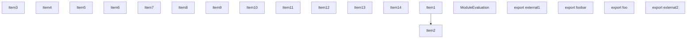
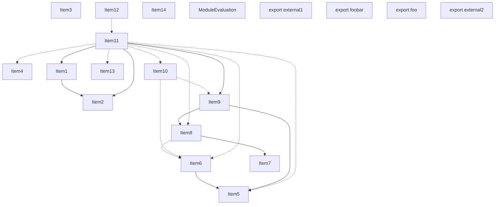
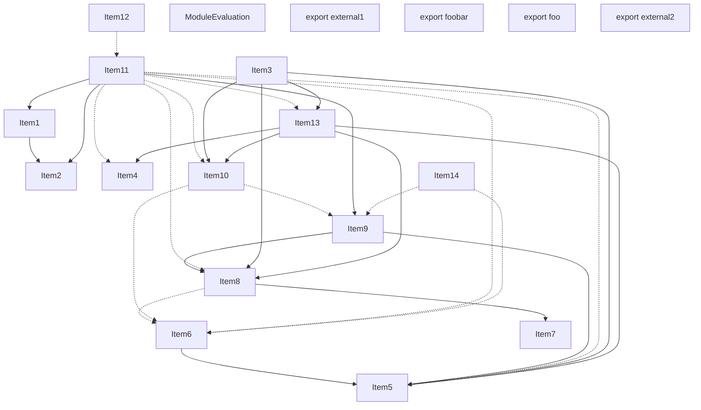
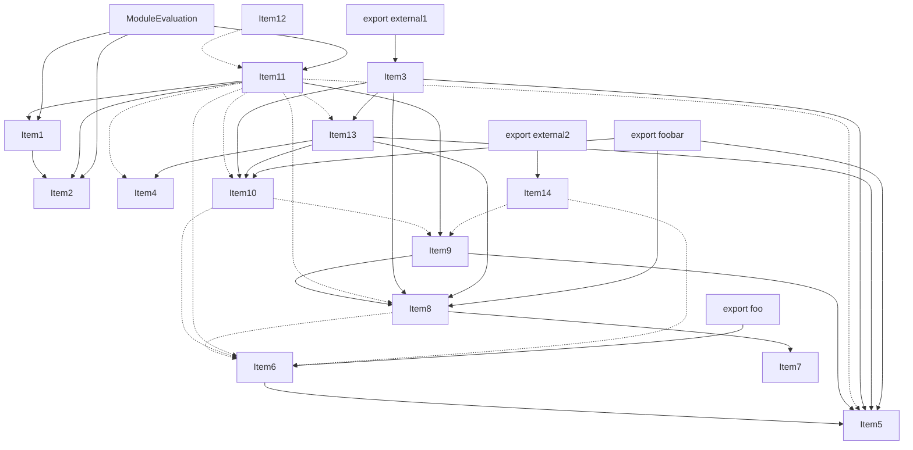

# Items

Count: 19

## Item 1: Stmt 0, `Normal`

```js
export function external1() {
    return internal() + foobar;
}

```

- Hoisted
- Declares: `external1`
- Reads (eventual): `internal`, `foobar`

## Item 2: Stmt 1, `ImportOfModule`

```js
import { upper } from "module";

```

- Hoisted
- Side effects

## Item 3: Stmt 1, `ImportBinding(0)`

```js
import { upper } from "module";

```

- Hoisted
- Declares: `upper`

## Item 4: Stmt 2, `VarDeclarator(0)`

```js
export let foobar = "foo";

```

- Declares: `foobar`
- Write: `foobar`

## Item 5: Stmt 3, `VarDeclarator(0)`

```js
export const foo = foobar;

```

- Declares: `foo`
- Reads: `foobar`
- Write: `foo`

## Item 6: Stmt 4, `VarDeclarator(0)`

```js
const bar = "bar";

```

- Declares: `bar`
- Write: `bar`

## Item 7: Stmt 5, `Normal`

```js
foobar += bar;

```

- Reads: `bar`
- Write: `foobar`

## Item 8: Stmt 6, `VarDeclarator(0)`

```js
let foobarCopy = foobar;

```

- Declares: `foobarCopy`
- Reads: `foobar`
- Write: `foobarCopy`

## Item 9: Stmt 7, `Normal`

```js
foobar += "foo";

```

- Write: `foobar`

## Item 10: Stmt 8, `Normal`

```js
console.log(foobarCopy);

```

- Side effects
- Reads: `console`, `foobarCopy`

## Item 11: Stmt 9, `Normal`

```js
foobarCopy += "Unused";

```

- Write: `foobarCopy`

## Item 12: Stmt 10, `Normal`

```js
function internal() {
    return upper(foobar);
}

```

- Hoisted
- Declares: `internal`
- Reads (eventual): `upper`, `foobar`

## Item 13: Stmt 11, `Normal`

```js
export function external2() {
    foobar += ".";
}

```

- Hoisted
- Declares: `external2`
- Write (eventual): `foobar`

## Item 14: Stmt 12, `ImportOfModule`

```js
import "other";

```

- Hoisted
- Side effects

# Phase 1

# Phase 2

# Phase 3

# Phase 4

# Final
```mermaid
graph TD
    N0["Items: [ItemId(ModuleEvaluation), ItemId(1, ImportOfModule), ItemId(1, ImportBinding(0)), ItemId(8, Normal), ItemId(12, ImportOfModule)]"];
    N1["Items: [ItemId(Export((\"external1\", #0))), ItemId(0, Normal)]"];
    N2["Items: [ItemId(Export((\"foobar\", #0)))]"];
    N3["Items: [ItemId(Export((\"foo\", #0)))]"];
    N4["Items: [ItemId(Export((\"external2\", #0))), ItemId(11, Normal)]"];
    N5["Items: [ItemId(2, VarDeclarator(0))]"];
    N6["Items: [ItemId(3, VarDeclarator(0))]"];
    N7["Items: [ItemId(4, VarDeclarator(0))]"];
    N8["Items: [ItemId(5, Normal)]"];
    N9["Items: [ItemId(6, VarDeclarator(0))]"];
    N10["Items: [ItemId(7, Normal)]"];
    N11["Items: [ItemId(1, ImportBinding(0)), ItemId(10, Normal)]"];
    N0 --> N9;
    N0 --> N11;
    N0 --> N5;
    N0 --> N8;
    N0 --> N10;
    N0 --> N6;
    N1 --> N11;
    N1 --> N5;
    N1 --> N8;
    N1 --> N10;
    N2 --> N5;
    N2 --> N8;
    N2 --> N10;
    N3 --> N6;
    N4 --> N6;
    N4 --> N9;
    N6 --> N5;
    N8 --> N7;
    N8 --> N6;
    N9 --> N5;
    N9 --> N8;
    N10 --> N6;
    N10 --> N9;
    N11 --> N5;
    N11 --> N8;
    N11 --> N10;
```
# Modules (dev)
## Part 0
```js
import { foobarCopy } from "entry.js" assert {
    __turbopack_chunk__: 9
};
import "entry.js" assert {
    __turbopack_chunk__: 11
};
import "entry.js" assert {
    __turbopack_chunk__: 5
};
import "entry.js" assert {
    __turbopack_chunk__: 8
};
import "entry.js" assert {
    __turbopack_chunk__: 10
};
import "entry.js" assert {
    __turbopack_chunk__: 6
};
"module evaluation";
import "module";
import { upper } from "module";
console.log(foobarCopy);
import "other";

```
## Part 1
```js
import { internal } from "entry.js" assert {
    __turbopack_chunk__: 11
};
import { foobar } from "entry.js" assert {
    __turbopack_chunk__: 5
};
import "entry.js" assert {
    __turbopack_chunk__: 8
};
import "entry.js" assert {
    __turbopack_chunk__: 10
};
export { external1 };
function external1() {
    return internal() + foobar;
}

```
## Part 2
```js
import { foobar } from "entry.js" assert {
    __turbopack_chunk__: 5
};
import "entry.js" assert {
    __turbopack_chunk__: 8
};
import "entry.js" assert {
    __turbopack_chunk__: 10
};
export { foobar };

```
## Part 3
```js
import { foo } from "entry.js" assert {
    __turbopack_chunk__: 6
};
export { foo };

```
## Part 4
```js
import "entry.js" assert {
    __turbopack_chunk__: 6
};
import "entry.js" assert {
    __turbopack_chunk__: 9
};
export { external2 };
function external2() {
    foobar += ".";
}

```
## Part 5
```js
let foobar = "foo";
export { foobar };

```
## Part 6
```js
import { foobar } from "entry.js" assert {
    __turbopack_chunk__: 5
};
const foo = foobar;
export { foo };

```
## Part 7
```js
const bar = "bar";
export { bar };

```
## Part 8
```js
import { bar } from "entry.js" assert {
    __turbopack_chunk__: 7
};
import "entry.js" assert {
    __turbopack_chunk__: 6
};
foobar += bar;
export { foobar };

```
## Part 9
```js
import { foobar } from "entry.js" assert {
    __turbopack_chunk__: 5
};
import "entry.js" assert {
    __turbopack_chunk__: 8
};
let foobarCopy = foobar;
export { foobarCopy };

```
## Part 10
```js
import "entry.js" assert {
    __turbopack_chunk__: 6
};
import "entry.js" assert {
    __turbopack_chunk__: 9
};
foobar += "foo";
export { foobar };

```
## Part 11
```js
import { foobar } from "entry.js" assert {
    __turbopack_chunk__: 5
};
import "entry.js" assert {
    __turbopack_chunk__: 8
};
import "entry.js" assert {
    __turbopack_chunk__: 10
};
import { upper } from "module";
function internal() {
    return upper(foobar);
}

```
## Merged (module eval)
```js
import "module";
import { upper } from "module";
import "other";
let foobar = "foo";
export { foobar };
const bar = "bar";
export { bar };
const foo = foobar;
export { foo };
foobar += bar;
export { foobar };
let foobarCopy = foobar;
export { foobarCopy };
import { upper } from "module";
foobar += "foo";
export { foobar };
function internal() {
    return upper(foobar);
}
"module evaluation";
console.log(foobarCopy);

```
# Modules (prod)
## Part 0
```js
import { foobar } from "entry.js" assert {
    __turbopack_chunk__: 5
};
import "entry.js" assert {
    __turbopack_chunk__: 7
};
"module evaluation";
import "module";
let foobarCopy = foobar;
console.log(foobarCopy);
import "other";
export { foobarCopy };

```
## Part 1
```js
import { foobar } from "entry.js" assert {
    __turbopack_chunk__: 5
};
import "entry.js" assert {
    __turbopack_chunk__: 7
};
import "entry.js" assert {
    __turbopack_chunk__: 8
};
export { external1 };
function external1() {
    return internal() + foobar;
}
import { upper } from "module";
function internal() {
    return upper(foobar);
}

```
## Part 2
```js
import { foobar } from "entry.js" assert {
    __turbopack_chunk__: 5
};
import "entry.js" assert {
    __turbopack_chunk__: 7
};
import "entry.js" assert {
    __turbopack_chunk__: 8
};
export { foobar };

```
## Part 3
```js
import { foobar } from "entry.js" assert {
    __turbopack_chunk__: 5
};
export { foo };
const foo = foobar;
export { foo };

```
## Part 4
```js
export { external2 };
function external2() {
    foobar += ".";
}

```
## Part 5
```js
let foobar = "foo";
export { foobar };

```
## Part 6
```js
const bar = "bar";
export { bar };

```
## Part 7
```js
import { bar } from "entry.js" assert {
    __turbopack_chunk__: 6
};
foobar += bar;
export { foobar };

```
## Part 8
```js
foobar += "foo";
export { foobar };

```
## Merged (module eval)
```js
import "module";
import "other";
let foobar = "foo";
export { foobar };
const bar = "bar";
export { bar };
foobar += bar;
export { foobar };
"module evaluation";
let foobarCopy = foobar;
console.log(foobarCopy);
export { foobarCopy };

```
