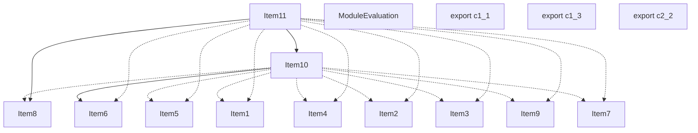
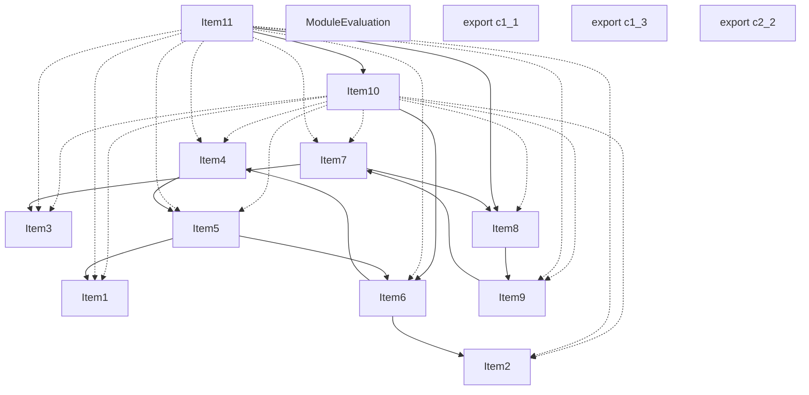
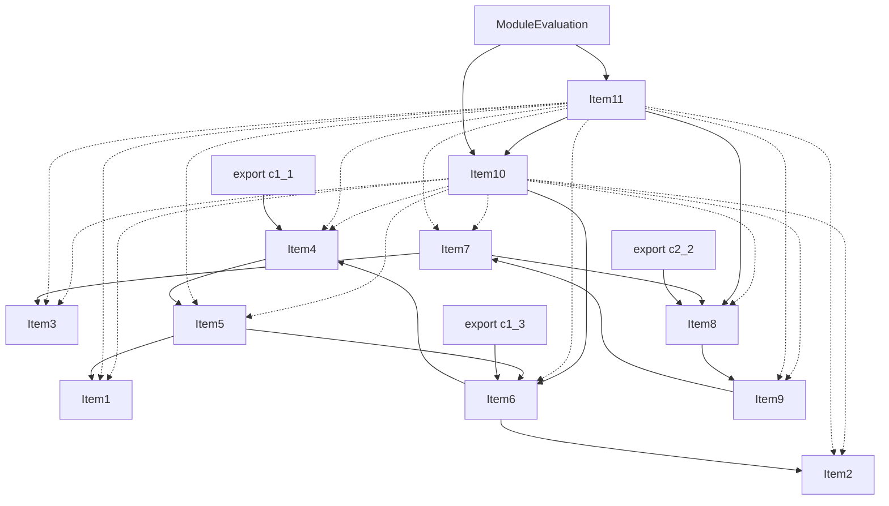

# Items

Count: 15

## Item 1: Stmt 0, `Normal`

```js
function d1() {}

```

- Hoisted
- Declares: `d1`

## Item 2: Stmt 1, `Normal`

```js
function d2() {}

```

- Hoisted
- Declares: `d2`

## Item 3: Stmt 2, `Normal`

```js
function d3() {}

```

- Hoisted
- Declares: `d3`

## Item 4: Stmt 3, `Normal`

```js
export function c1_1() {
    return c1_2();
}

```

- Hoisted
- Declares: `c1_1`
- Reads (eventual): `c1_2`

## Item 5: Stmt 4, `Normal`

```js
function c1_2() {
    return c1_3(d1);
}

```

- Hoisted
- Declares: `c1_2`
- Reads (eventual): `c1_3`, `d1`

## Item 6: Stmt 5, `Normal`

```js
export function c1_3() {
    return c1_1(d2);
}

```

- Hoisted
- Declares: `c1_3`
- Reads (eventual): `c1_1`, `d2`

## Item 7: Stmt 6, `Normal`

```js
function c2_1() {
    return c2_2(d3);
}

```

- Hoisted
- Declares: `c2_1`
- Reads (eventual): `c2_2`, `d3`

## Item 8: Stmt 7, `Normal`

```js
export function c2_2() {
    return c2_3();
}

```

- Hoisted
- Declares: `c2_2`
- Reads (eventual): `c2_3`

## Item 9: Stmt 8, `Normal`

```js
function c2_3() {
    return c2_1();
}

```

- Hoisted
- Declares: `c2_3`
- Reads (eventual): `c2_1`

## Item 10: Stmt 9, `Normal`

```js
c1_3();

```

- Side effects
- Reads: `c1_3`

## Item 11: Stmt 10, `Normal`

```js
c2_2();

```

- Side effects
- Reads: `c2_2`

# Phase 1

```mermaid
graph TD
    Item1;
    Item2;
    Item3;
    Item4;
    Item5;
    Item6;
    Item7;
    Item8;
    Item9;
    Item10;
    Item11;
    Item12;
    Item12["ModuleEvaluation"];
    Item13;
    Item13["export c1_1"];
    Item14;
    Item14["export c1_3"];
    Item15;
    Item15["export c2_2"];
```

# Phase 2

# Phase 3

# Phase 4

# Final
```mermaid
graph TD
    N0["Items: [ItemId(ModuleEvaluation), ItemId(9, Normal), ItemId(10, Normal)]"];
    N1["Items: [ItemId(Export((\"c1_1\", #0)))]"];
    N2["Items: [ItemId(Export((\"c1_3\", #0)))]"];
    N3["Items: [ItemId(Export((\"c2_2\", #0)))]"];
    N4["Items: [ItemId(3, Normal), ItemId(4, Normal), ItemId(5, Normal)]"];
    N5["Items: [ItemId(6, Normal), ItemId(7, Normal), ItemId(8, Normal)]"];
    N6["Items: [ItemId(0, Normal)]"];
    N7["Items: [ItemId(1, Normal)]"];
    N8["Items: [ItemId(2, Normal)]"];
    N0 --> N4;
    N0 --> N6;
    N0 --> N7;
    N0 --> N5;
    N0 --> N8;
    N1 --> N4;
    N2 --> N4;
    N3 --> N5;
    N4 --> N6;
    N4 --> N7;
    N5 --> N8;
```
# Modules (dev)
## Part 0
```js
import { c1_3 } from "entry.js" assert {
    __turbopack_chunk__: 4
};
import "entry.js" assert {
    __turbopack_chunk__: 6
};
import "entry.js" assert {
    __turbopack_chunk__: 7
};
import { c2_2 } from "entry.js" assert {
    __turbopack_chunk__: 5
};
import "entry.js" assert {
    __turbopack_chunk__: 8
};
"module evaluation";
c1_3();
c2_2();

```
## Part 1
```js
import { c1_1 } from "entry.js" assert {
    __turbopack_chunk__: 4
};
export { c1_1 };

```
## Part 2
```js
import { c1_3 } from "entry.js" assert {
    __turbopack_chunk__: 4
};
export { c1_3 };

```
## Part 3
```js
import { c2_2 } from "entry.js" assert {
    __turbopack_chunk__: 5
};
export { c2_2 };

```
## Part 4
```js
import { d1 } from "entry.js" assert {
    __turbopack_chunk__: 6
};
import { d2 } from "entry.js" assert {
    __turbopack_chunk__: 7
};
function c1_1() {
    return c1_2();
}
function c1_2() {
    return c1_3(d1);
}
function c1_3() {
    return c1_1(d2);
}

```
## Part 5
```js
import { d3 } from "entry.js" assert {
    __turbopack_chunk__: 8
};
function c2_1() {
    return c2_2(d3);
}
function c2_2() {
    return c2_3();
}
function c2_3() {
    return c2_1();
}

```
## Part 6
```js
function d1() {}

```
## Part 7
```js
function d2() {}

```
## Part 8
```js
function d3() {}

```
## Merged (module eval)
```js
function d1() {}
function d2() {}
function c1_1() {
    return c1_2();
}
function c1_2() {
    return c1_3(d1);
}
function c1_3() {
    return c1_1(d2);
}
function d3() {}
function c2_1() {
    return c2_2(d3);
}
function c2_2() {
    return c2_3();
}
function c2_3() {
    return c2_1();
}
"module evaluation";
c1_3();
c2_2();

```
# Modules (prod)
## Part 0
```js
import { c1_3 } from "entry.js" assert {
    __turbopack_chunk__: 4
};
import { c2_2 } from "entry.js" assert {
    __turbopack_chunk__: 5
};
"module evaluation";
c1_3();
c2_2();

```
## Part 1
```js
import { c1_1 } from "entry.js" assert {
    __turbopack_chunk__: 4
};
export { c1_1 };

```
## Part 2
```js
import { c1_3 } from "entry.js" assert {
    __turbopack_chunk__: 4
};
export { c1_3 };

```
## Part 3
```js
import { c2_2 } from "entry.js" assert {
    __turbopack_chunk__: 5
};
export { c2_2 };

```
## Part 4
```js
import { d1 } from "entry.js" assert {
    __turbopack_chunk__: 6
};
import { d2 } from "entry.js" assert {
    __turbopack_chunk__: 7
};
function c1_1() {
    return c1_2();
}
function c1_2() {
    return c1_3(d1);
}
function c1_3() {
    return c1_1(d2);
}

```
## Part 5
```js
import { d3 } from "entry.js" assert {
    __turbopack_chunk__: 8
};
function c2_1() {
    return c2_2(d3);
}
function c2_2() {
    return c2_3();
}
function c2_3() {
    return c2_1();
}

```
## Part 6
```js
function d1() {}

```
## Part 7
```js
function d2() {}

```
## Part 8
```js
function d3() {}

```
## Merged (module eval)
```js
function d1() {}
function d2() {}
function c1_1() {
    return c1_2();
}
function c1_2() {
    return c1_3(d1);
}
function c1_3() {
    return c1_1(d2);
}
function d3() {}
function c2_1() {
    return c2_2(d3);
}
function c2_2() {
    return c2_3();
}
function c2_3() {
    return c2_1();
}
"module evaluation";
c1_3();
c2_2();

```
## Merged (c1_3)
```js
function d1() {}
function d2() {}
function c1_1() {
    return c1_2();
}
function c1_2() {
    return c1_3(d1);
}
function c1_3() {
    return c1_1(d2);
}
export { c1_3 };

```
## Merged (c1_3,c2_2)
```js
function d1() {}
function d2() {}
function c1_1() {
    return c1_2();
}
function c1_2() {
    return c1_3(d1);
}
function c1_3() {
    return c1_1(d2);
}
export { c1_3 };
function d3() {}
function c2_1() {
    return c2_2(d3);
}
function c2_2() {
    return c2_3();
}
function c2_3() {
    return c2_1();
}
export { c2_2 };

```
