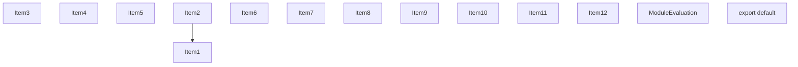
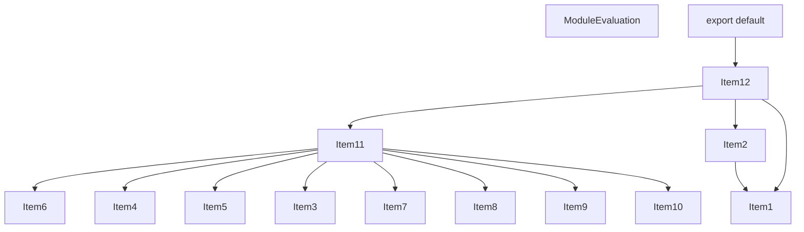
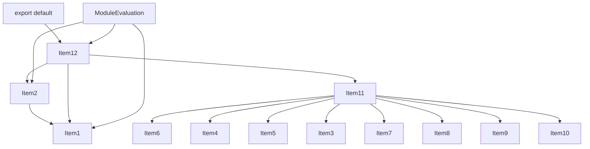
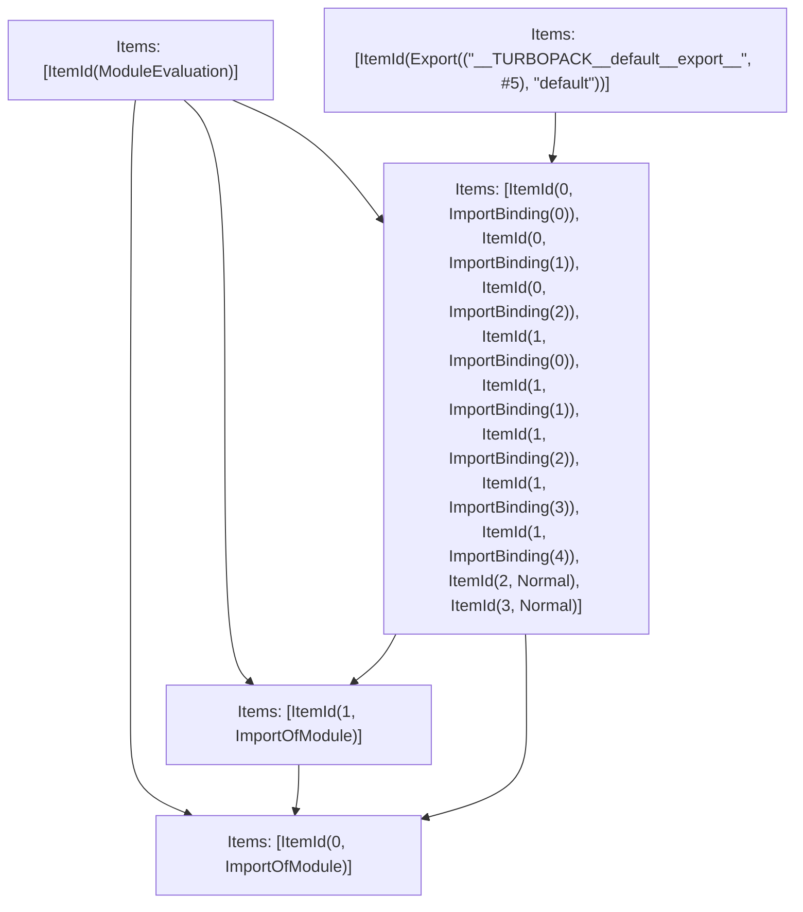

# Items

Count: 14

## Item 1: Stmt 0, `ImportOfModule`

```js
import { jsx as _jsx, jsxs as _jsxs, Fragment as _Fragment } from "react/jsx-runtime";

```

- Hoisted
- Side effects

## Item 2: Stmt 0, `ImportBinding(0)`

```js
import { jsx as _jsx, jsxs as _jsxs, Fragment as _Fragment } from "react/jsx-runtime";

```

- Hoisted
- Declares: `_jsx`

## Item 3: Stmt 0, `ImportBinding(1)`

```js
import { jsx as _jsx, jsxs as _jsxs, Fragment as _Fragment } from "react/jsx-runtime";

```

- Hoisted
- Declares: `_jsxs`

## Item 4: Stmt 0, `ImportBinding(2)`

```js
import { jsx as _jsx, jsxs as _jsxs, Fragment as _Fragment } from "react/jsx-runtime";

```

- Hoisted
- Declares: `_Fragment`

## Item 5: Stmt 1, `ImportOfModule`

```js
import Document, { Html, Head, Main, NextScript } from 'next/document';

```

- Hoisted
- Side effects

## Item 6: Stmt 1, `ImportBinding(0)`

```js
import Document, { Html, Head, Main, NextScript } from 'next/document';

```

- Hoisted
- Declares: `Document`

## Item 7: Stmt 1, `ImportBinding(1)`

```js
import Document, { Html, Head, Main, NextScript } from 'next/document';

```

- Hoisted
- Declares: `Html`

## Item 8: Stmt 1, `ImportBinding(2)`

```js
import Document, { Html, Head, Main, NextScript } from 'next/document';

```

- Hoisted
- Declares: `Head`

## Item 9: Stmt 1, `ImportBinding(3)`

```js
import Document, { Html, Head, Main, NextScript } from 'next/document';

```

- Hoisted
- Declares: `Main`

## Item 10: Stmt 1, `ImportBinding(4)`

```js
import Document, { Html, Head, Main, NextScript } from 'next/document';

```

- Hoisted
- Declares: `NextScript`

## Item 11: Stmt 2, `Normal`

```js
class MyDocument extends Document {
    static async getInitialProps(ctx) {
        const initialProps = await Document.getInitialProps(ctx);
        return {
            ...initialProps,
            styles: _jsxs(_Fragment, {
                children: [
                    initialProps.styles,
                    _jsx("style", {
                        dangerouslySetInnerHTML: {
                            __html: `html { background: hotpink; }`
                        }
                    })
                ]
            })
        };
    }
    render() {
        return _jsxs(Html, {
            children: [
                _jsx(Head, {}),
                _jsxs("body", {
                    children: [
                        _jsx(Main, {}),
                        _jsx(NextScript, {})
                    ]
                })
            ]
        });
    }
}

```

- Declares: `MyDocument`
- Reads: `Document`, `_jsxs`, `_Fragment`, `_jsx`, `Html`, `Head`, `Main`, `NextScript`
- Write: `Document`, `MyDocument`

## Item 12: Stmt 3, `Normal`

```js
export default MyDocument;

```

- Side effects
- Declares: `__TURBOPACK__default__export__`
- Reads: `MyDocument`
- Write: `__TURBOPACK__default__export__`

# Phase 1

# Phase 2

# Phase 3

# Phase 4

# Final

# Entrypoints

```
{
    ModuleEvaluation: 0,
    Export(
        "default",
    ): 1,
    Exports: 5,
}
```


# Modules (dev)
## Part 0
```js
import "__TURBOPACK_PART__" assert {
    __turbopack_part__: 2
};
import "__TURBOPACK_PART__" assert {
    __turbopack_part__: 3
};
import "__TURBOPACK_PART__" assert {
    __turbopack_part__: 4
};
"module evaluation";

```
## Part 1
```js
import { __TURBOPACK__default__export__ } from "__TURBOPACK_PART__" assert {
    __turbopack_part__: 4
};
export { __TURBOPACK__default__export__ as default };

```
## Part 2
```js
import "react/jsx-runtime";

```
## Part 3
```js
import "__TURBOPACK_PART__" assert {
    __turbopack_part__: 2
};
import 'next/document';

```
## Part 4
```js
import "__TURBOPACK_PART__" assert {
    __turbopack_part__: 2
};
import "__TURBOPACK_PART__" assert {
    __turbopack_part__: 3
};
import { jsx as _jsx } from "react/jsx-runtime";
import { jsxs as _jsxs } from "react/jsx-runtime";
import { Fragment as _Fragment } from "react/jsx-runtime";
import Document from 'next/document';
import { Html } from 'next/document';
import { Head } from 'next/document';
import { Main } from 'next/document';
import { NextScript } from 'next/document';
class MyDocument extends Document {
    static async getInitialProps(ctx) {
        const initialProps = await Document.getInitialProps(ctx);
        return {
            ...initialProps,
            styles: _jsxs(_Fragment, {
                children: [
                    initialProps.styles,
                    _jsx("style", {
                        dangerouslySetInnerHTML: {
                            __html: `html { background: hotpink; }`
                        }
                    })
                ]
            })
        };
    }
    render() {
        return _jsxs(Html, {
            children: [
                _jsx(Head, {}),
                _jsxs("body", {
                    children: [
                        _jsx(Main, {}),
                        _jsx(NextScript, {})
                    ]
                })
            ]
        });
    }
}
const __TURBOPACK__default__export__ = MyDocument;
export { _jsx } from "__TURBOPACK_VAR__" assert {
    __turbopack_var__: true
};
export { _jsxs } from "__TURBOPACK_VAR__" assert {
    __turbopack_var__: true
};
export { _Fragment } from "__TURBOPACK_VAR__" assert {
    __turbopack_var__: true
};
export { Document } from "__TURBOPACK_VAR__" assert {
    __turbopack_var__: true
};
export { Html } from "__TURBOPACK_VAR__" assert {
    __turbopack_var__: true
};
export { Head } from "__TURBOPACK_VAR__" assert {
    __turbopack_var__: true
};
export { Main } from "__TURBOPACK_VAR__" assert {
    __turbopack_var__: true
};
export { NextScript } from "__TURBOPACK_VAR__" assert {
    __turbopack_var__: true
};
export { MyDocument } from "__TURBOPACK_VAR__" assert {
    __turbopack_var__: true
};
export { __TURBOPACK__default__export__ } from "__TURBOPACK_VAR__" assert {
    __turbopack_var__: true
};

```
## Part 5
```js
export { default } from "__TURBOPACK_PART__" assert {
    __turbopack_part__: "export default"
};

```
## Merged (module eval)
```js
import "__TURBOPACK_PART__" assert {
    __turbopack_part__: 2
};
import "__TURBOPACK_PART__" assert {
    __turbopack_part__: 3
};
import "__TURBOPACK_PART__" assert {
    __turbopack_part__: 4
};
"module evaluation";

```
# Entrypoints

```
{
    ModuleEvaluation: 0,
    Export(
        "default",
    ): 1,
    Exports: 5,
}
```


# Modules (prod)
## Part 0
```js
import "__TURBOPACK_PART__" assert {
    __turbopack_part__: 2
};
import "__TURBOPACK_PART__" assert {
    __turbopack_part__: 3
};
import "__TURBOPACK_PART__" assert {
    __turbopack_part__: 4
};
"module evaluation";

```
## Part 1
```js
import { __TURBOPACK__default__export__ } from "__TURBOPACK_PART__" assert {
    __turbopack_part__: 4
};
export { __TURBOPACK__default__export__ as default };

```
## Part 2
```js
import "react/jsx-runtime";

```
## Part 3
```js
import "__TURBOPACK_PART__" assert {
    __turbopack_part__: 2
};
import 'next/document';

```
## Part 4
```js
import "__TURBOPACK_PART__" assert {
    __turbopack_part__: 2
};
import "__TURBOPACK_PART__" assert {
    __turbopack_part__: 3
};
import { jsx as _jsx } from "react/jsx-runtime";
import { jsxs as _jsxs } from "react/jsx-runtime";
import { Fragment as _Fragment } from "react/jsx-runtime";
import Document from 'next/document';
import { Html } from 'next/document';
import { Head } from 'next/document';
import { Main } from 'next/document';
import { NextScript } from 'next/document';
class MyDocument extends Document {
    static async getInitialProps(ctx) {
        const initialProps = await Document.getInitialProps(ctx);
        return {
            ...initialProps,
            styles: _jsxs(_Fragment, {
                children: [
                    initialProps.styles,
                    _jsx("style", {
                        dangerouslySetInnerHTML: {
                            __html: `html { background: hotpink; }`
                        }
                    })
                ]
            })
        };
    }
    render() {
        return _jsxs(Html, {
            children: [
                _jsx(Head, {}),
                _jsxs("body", {
                    children: [
                        _jsx(Main, {}),
                        _jsx(NextScript, {})
                    ]
                })
            ]
        });
    }
}
const __TURBOPACK__default__export__ = MyDocument;
export { _jsx } from "__TURBOPACK_VAR__" assert {
    __turbopack_var__: true
};
export { _jsxs } from "__TURBOPACK_VAR__" assert {
    __turbopack_var__: true
};
export { _Fragment } from "__TURBOPACK_VAR__" assert {
    __turbopack_var__: true
};
export { Document } from "__TURBOPACK_VAR__" assert {
    __turbopack_var__: true
};
export { Html } from "__TURBOPACK_VAR__" assert {
    __turbopack_var__: true
};
export { Head } from "__TURBOPACK_VAR__" assert {
    __turbopack_var__: true
};
export { Main } from "__TURBOPACK_VAR__" assert {
    __turbopack_var__: true
};
export { NextScript } from "__TURBOPACK_VAR__" assert {
    __turbopack_var__: true
};
export { MyDocument } from "__TURBOPACK_VAR__" assert {
    __turbopack_var__: true
};
export { __TURBOPACK__default__export__ } from "__TURBOPACK_VAR__" assert {
    __turbopack_var__: true
};

```
## Part 5
```js
export { default } from "__TURBOPACK_PART__" assert {
    __turbopack_part__: "export default"
};

```
## Merged (module eval)
```js
import "__TURBOPACK_PART__" assert {
    __turbopack_part__: 2
};
import "__TURBOPACK_PART__" assert {
    __turbopack_part__: 3
};
import "__TURBOPACK_PART__" assert {
    __turbopack_part__: 4
};
"module evaluation";

```
