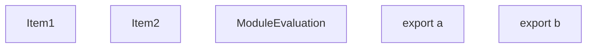
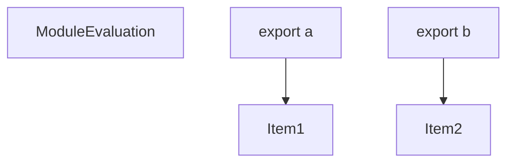
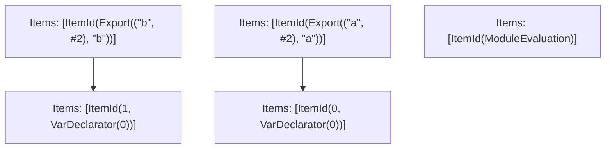

# Items

Count: 5

## Item 1: Stmt 0, `VarDeclarator(0)`

```js
const a = "a";

```

- Declares: `a`
- Write: `a`

## Item 2: Stmt 1, `VarDeclarator(0)`

```js
const b = "b";

```

- Declares: `b`
- Write: `b`

# Phase 1

# Phase 2

# Phase 3

# Phase 4

# Final

# Entrypoints

```
{
    ModuleEvaluation: 4,
    Exports: 5,
    Export(
        "b",
    ): 1,
    Export(
        "a",
    ): 3,
}
```


# Modules (dev)
## Part 0
```js
const b = "b";
export { b } from "__TURBOPACK_VAR__" assert {
    __turbopack_var__: true
};

```
## Part 1
```js
import "__TURBOPACK_PART__" assert {
    __turbopack_part__: 0
};
import { b } from "__TURBOPACK_PART__" assert {
    __turbopack_part__: 0
};
export { b as b };

```
## Part 2
```js
const a = "a";
export { a } from "__TURBOPACK_VAR__" assert {
    __turbopack_var__: true
};

```
## Part 3
```js
import "__TURBOPACK_PART__" assert {
    __turbopack_part__: 2
};
import { a } from "__TURBOPACK_PART__" assert {
    __turbopack_part__: 2
};
export { a as a };

```
## Part 4
```js
"module evaluation";

```
## Part 5
```js
export { b } from "__TURBOPACK_PART__" assert {
    __turbopack_part__: "export b"
};
export { a } from "__TURBOPACK_PART__" assert {
    __turbopack_part__: "export a"
};

```
## Merged (module eval)
```js
"module evaluation";

```
# Entrypoints

```
{
    ModuleEvaluation: 4,
    Exports: 5,
    Export(
        "b",
    ): 1,
    Export(
        "a",
    ): 3,
}
```


# Modules (prod)
## Part 0
```js
const b = "b";
export { b } from "__TURBOPACK_VAR__" assert {
    __turbopack_var__: true
};

```
## Part 1
```js
import "__TURBOPACK_PART__" assert {
    __turbopack_part__: 0
};
import { b } from "__TURBOPACK_PART__" assert {
    __turbopack_part__: 0
};
export { b as b };

```
## Part 2
```js
const a = "a";
export { a } from "__TURBOPACK_VAR__" assert {
    __turbopack_var__: true
};

```
## Part 3
```js
import "__TURBOPACK_PART__" assert {
    __turbopack_part__: 2
};
import { a } from "__TURBOPACK_PART__" assert {
    __turbopack_part__: 2
};
export { a as a };

```
## Part 4
```js
"module evaluation";

```
## Part 5
```js
export { b } from "__TURBOPACK_PART__" assert {
    __turbopack_part__: "export b"
};
export { a } from "__TURBOPACK_PART__" assert {
    __turbopack_part__: "export a"
};

```
## Merged (module eval)
```js
"module evaluation";

```
