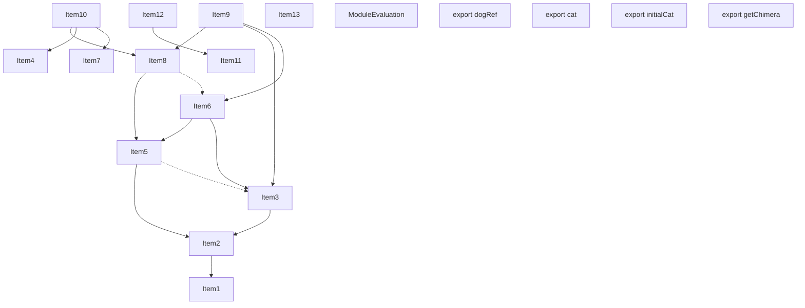
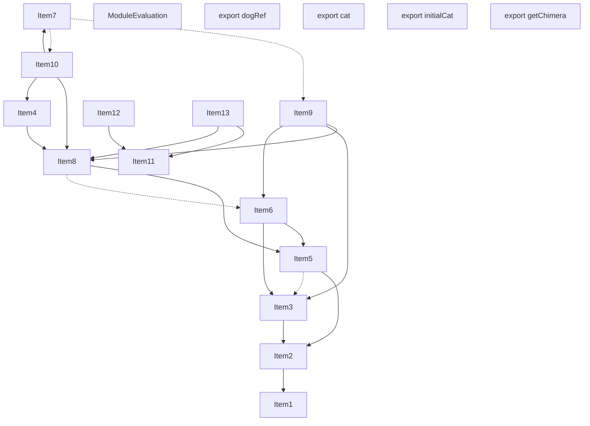
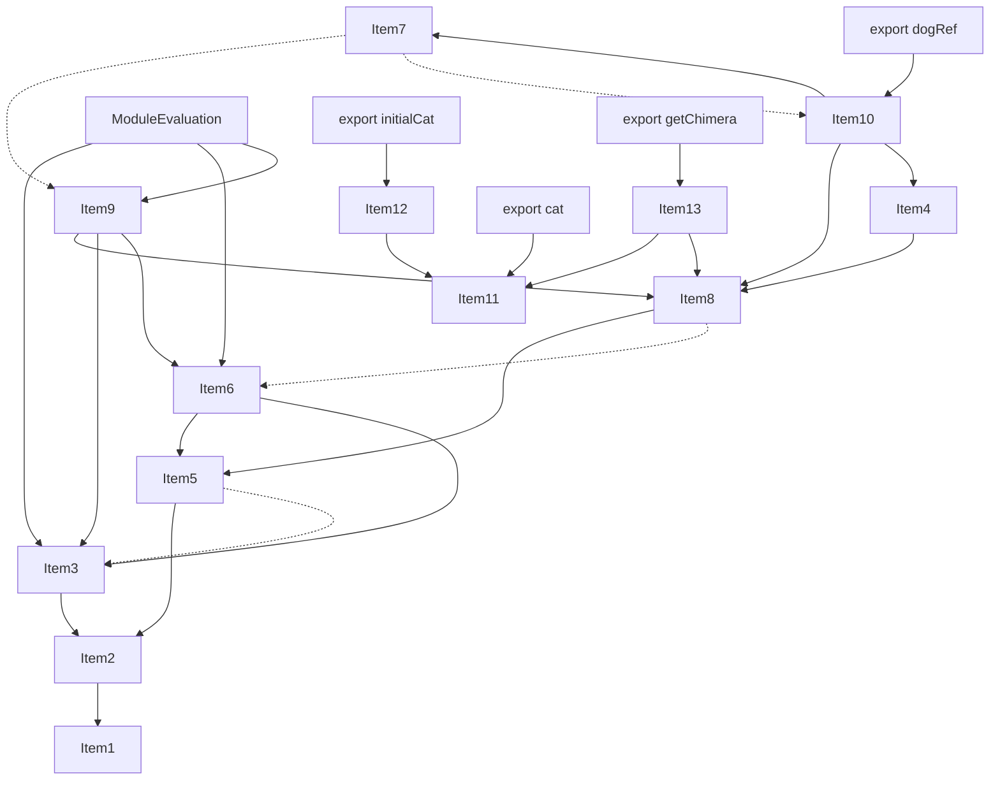
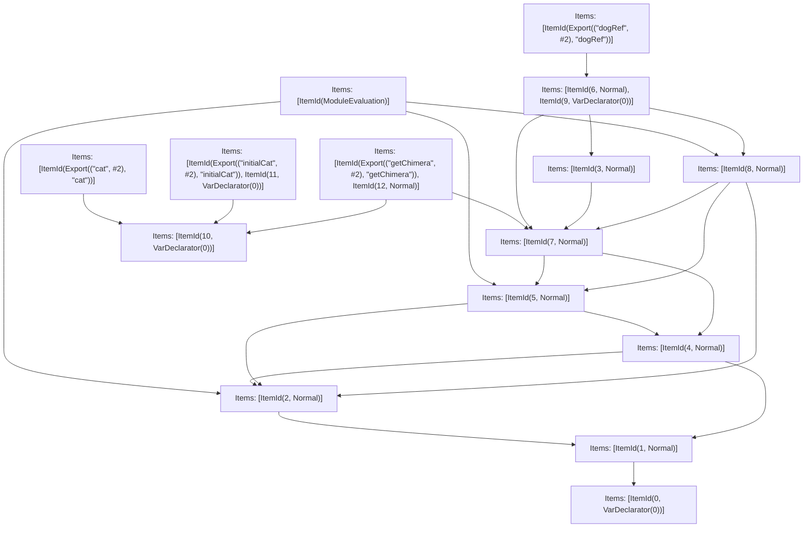

# Items

Count: 18

## Item 1: Stmt 0, `VarDeclarator(0)`

```js
let dog = "dog";

```

- Declares: `dog`
- Write: `dog`

## Item 2: Stmt 1, `Normal`

```js
dog += "!";

```

- Reads: `dog`
- Write: `dog`

## Item 3: Stmt 2, `Normal`

```js
console.log(dog);

```

- Side effects
- Reads: `dog`

## Item 4: Stmt 3, `Normal`

```js
function getDog() {
    return dog;
}

```

- Hoisted
- Declares: `getDog`
- Reads (eventual): `dog`
- Write: `getDog`

## Item 5: Stmt 4, `Normal`

```js
dog += "!";

```

- Reads: `dog`
- Write: `dog`

## Item 6: Stmt 5, `Normal`

```js
console.log(dog);

```

- Side effects
- Reads: `dog`

## Item 7: Stmt 6, `Normal`

```js
function setDog(newDog) {
    dog = newDog;
}

```

- Hoisted
- Declares: `setDog`
- Write: `setDog`
- Write (eventual): `dog`

## Item 8: Stmt 7, `Normal`

```js
dog += "!";

```

- Reads: `dog`
- Write: `dog`

## Item 9: Stmt 8, `Normal`

```js
console.log(dog);

```

- Side effects
- Reads: `dog`

## Item 10: Stmt 9, `VarDeclarator(0)`

```js
export const dogRef = {
    initial: dog,
    get: getDog,
    set: setDog
};

```

- Declares: `dogRef`
- Reads: `dog`, `getDog`, `setDog`
- Write: `dogRef`

## Item 11: Stmt 10, `VarDeclarator(0)`

```js
export let cat = "cat";

```

- Declares: `cat`
- Write: `cat`

## Item 12: Stmt 11, `VarDeclarator(0)`

```js
export const initialCat = cat;

```

- Declares: `initialCat`
- Reads: `cat`
- Write: `initialCat`

## Item 13: Stmt 12, `Normal`

```js
export function getChimera() {
    return cat + dog;
}

```

- Hoisted
- Declares: `getChimera`
- Reads (eventual): `cat`, `dog`
- Write: `getChimera`

# Phase 1

```mermaid
graph TD
    Item1;
    Item2;
    Item3;
    Item4;
    Item5;
    Item6;
    Item7;
    Item8;
    Item9;
    Item10;
    Item11;
    Item12;
    Item13;
    Item14;
    Item14["ModuleEvaluation"];
    Item15;
    Item15["export dogRef"];
    Item16;
    Item16["export cat"];
    Item17;
    Item17["export initialCat"];
    Item18;
    Item18["export getChimera"];
```

# Phase 2

# Phase 3

# Phase 4

# Final

# Entrypoints

```
{
    ModuleEvaluation: 0,
    Export(
        "getChimera",
    ): 4,
    Export(
        "initialCat",
    ): 3,
    Export(
        "cat",
    ): 2,
    Export(
        "dogRef",
    ): 1,
}
```


# Modules (dev)
## Part 0
```js
import "__TURBOPACK_PART__" assert {
    __turbopack_part__: 8
};
import "__TURBOPACK_PART__" assert {
    __turbopack_part__: 11
};
import "__TURBOPACK_PART__" assert {
    __turbopack_part__: 13
};
"module evaluation";

```
## Part 1
```js
import { dogRef } from "__TURBOPACK_PART__" assert {
    __turbopack_part__: 5
};
export { dogRef };

```
## Part 2
```js
import { cat } from "__TURBOPACK_PART__" assert {
    __turbopack_part__: 14
};
export { cat };

```
## Part 3
```js
import { cat } from "__TURBOPACK_PART__" assert {
    __turbopack_part__: 14
};
export { initialCat };
const initialCat = cat;
export { initialCat } from "__TURBOPACK_VAR__" assert {
    __turbopack_var__: true
};

```
## Part 4
```js
import { cat } from "__TURBOPACK_PART__" assert {
    __turbopack_part__: 14
};
import { dog } from "__TURBOPACK_PART__" assert {
    __turbopack_part__: 12
};
export { getChimera };
function getChimera() {
    return cat + dog;
}
export { getChimera } from "__TURBOPACK_VAR__" assert {
    __turbopack_var__: true
};

```
## Part 5
```js
import "__TURBOPACK_PART__" assert {
    __turbopack_part__: 13
};
import { dog } from "__TURBOPACK_PART__" assert {
    __turbopack_part__: 12
};
import { getDog } from "__TURBOPACK_PART__" assert {
    __turbopack_part__: 9
};
function setDog(newDog) {
    dog = newDog;
}
const dogRef = {
    initial: dog,
    get: getDog,
    set: setDog
};
export { setDog } from "__TURBOPACK_VAR__" assert {
    __turbopack_var__: true
};
export { dogRef } from "__TURBOPACK_VAR__" assert {
    __turbopack_var__: true
};

```
## Part 6
```js
let dog = "dog";
export { dog } from "__TURBOPACK_VAR__" assert {
    __turbopack_var__: true
};

```
## Part 7
```js
import { dog } from "__TURBOPACK_PART__" assert {
    __turbopack_part__: 6
};
dog += "!";
export { dog } from "__TURBOPACK_VAR__" assert {
    __turbopack_var__: true
};

```
## Part 8
```js
import { dog } from "__TURBOPACK_PART__" assert {
    __turbopack_part__: 7
};
console.log(dog);

```
## Part 9
```js
import { dog } from "__TURBOPACK_PART__" assert {
    __turbopack_part__: 12
};
function getDog() {
    return dog;
}
export { getDog } from "__TURBOPACK_VAR__" assert {
    __turbopack_var__: true
};

```
## Part 10
```js
import { dog } from "__TURBOPACK_PART__" assert {
    __turbopack_part__: 7
};
import "__TURBOPACK_PART__" assert {
    __turbopack_part__: 8
};
dog += "!";
export { dog } from "__TURBOPACK_VAR__" assert {
    __turbopack_var__: true
};

```
## Part 11
```js
import { dog } from "__TURBOPACK_PART__" assert {
    __turbopack_part__: 10
};
import "__TURBOPACK_PART__" assert {
    __turbopack_part__: 8
};
console.log(dog);

```
## Part 12
```js
import { dog } from "__TURBOPACK_PART__" assert {
    __turbopack_part__: 10
};
import "__TURBOPACK_PART__" assert {
    __turbopack_part__: 11
};
dog += "!";
export { dog } from "__TURBOPACK_VAR__" assert {
    __turbopack_var__: true
};

```
## Part 13
```js
import { dog } from "__TURBOPACK_PART__" assert {
    __turbopack_part__: 12
};
import "__TURBOPACK_PART__" assert {
    __turbopack_part__: 8
};
import "__TURBOPACK_PART__" assert {
    __turbopack_part__: 11
};
console.log(dog);

```
## Part 14
```js
let cat = "cat";
export { cat } from "__TURBOPACK_VAR__" assert {
    __turbopack_var__: true
};

```
## Merged (module eval)
```js
import "__TURBOPACK_PART__" assert {
    __turbopack_part__: 8
};
import "__TURBOPACK_PART__" assert {
    __turbopack_part__: 11
};
import "__TURBOPACK_PART__" assert {
    __turbopack_part__: 13
};
"module evaluation";

```
# Entrypoints

```
{
    ModuleEvaluation: 0,
    Export(
        "getChimera",
    ): 4,
    Export(
        "initialCat",
    ): 3,
    Export(
        "cat",
    ): 2,
    Export(
        "dogRef",
    ): 1,
}
```


# Modules (prod)
## Part 0
```js
import { dog } from "__TURBOPACK_PART__" assert {
    __turbopack_part__: 6
};
import "__TURBOPACK_PART__" assert {
    __turbopack_part__: 7
};
import "__TURBOPACK_PART__" assert {
    __turbopack_part__: 8
};
"module evaluation";
console.log(dog);
console.log(dog);
console.log(dog);

```
## Part 1
```js
import { dog } from "__TURBOPACK_PART__" assert {
    __turbopack_part__: 8
};
export { dogRef };
function getDog() {
    return dog;
}
function setDog(newDog) {
    dog = newDog;
}
const dogRef = {
    initial: dog,
    get: getDog,
    set: setDog
};
export { getDog } from "__TURBOPACK_VAR__" assert {
    __turbopack_var__: true
};
export { setDog } from "__TURBOPACK_VAR__" assert {
    __turbopack_var__: true
};
export { dogRef } from "__TURBOPACK_VAR__" assert {
    __turbopack_var__: true
};

```
## Part 2
```js
import { cat } from "__TURBOPACK_PART__" assert {
    __turbopack_part__: 9
};
export { cat };

```
## Part 3
```js
import { cat } from "__TURBOPACK_PART__" assert {
    __turbopack_part__: 9
};
export { initialCat };
const initialCat = cat;
export { initialCat } from "__TURBOPACK_VAR__" assert {
    __turbopack_var__: true
};

```
## Part 4
```js
import { cat } from "__TURBOPACK_PART__" assert {
    __turbopack_part__: 9
};
import { dog } from "__TURBOPACK_PART__" assert {
    __turbopack_part__: 8
};
export { getChimera };
function getChimera() {
    return cat + dog;
}
export { getChimera } from "__TURBOPACK_VAR__" assert {
    __turbopack_var__: true
};

```
## Part 5
```js
let dog = "dog";
export { dog } from "__TURBOPACK_VAR__" assert {
    __turbopack_var__: true
};

```
## Part 6
```js
import { dog } from "__TURBOPACK_PART__" assert {
    __turbopack_part__: 5
};
dog += "!";
export { dog } from "__TURBOPACK_VAR__" assert {
    __turbopack_var__: true
};

```
## Part 7
```js
import { dog } from "__TURBOPACK_PART__" assert {
    __turbopack_part__: 6
};
dog += "!";
export { dog } from "__TURBOPACK_VAR__" assert {
    __turbopack_var__: true
};

```
## Part 8
```js
import { dog } from "__TURBOPACK_PART__" assert {
    __turbopack_part__: 7
};
dog += "!";
export { dog } from "__TURBOPACK_VAR__" assert {
    __turbopack_var__: true
};

```
## Part 9
```js
let cat = "cat";
export { cat } from "__TURBOPACK_VAR__" assert {
    __turbopack_var__: true
};

```
## Merged (module eval)
```js
import { dog } from "__TURBOPACK_PART__" assert {
    __turbopack_part__: 6
};
import "__TURBOPACK_PART__" assert {
    __turbopack_part__: 7
};
import "__TURBOPACK_PART__" assert {
    __turbopack_part__: 8
};
"module evaluation";
console.log(dog);
console.log(dog);
console.log(dog);

```
