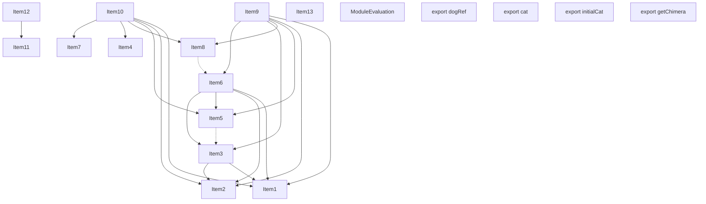
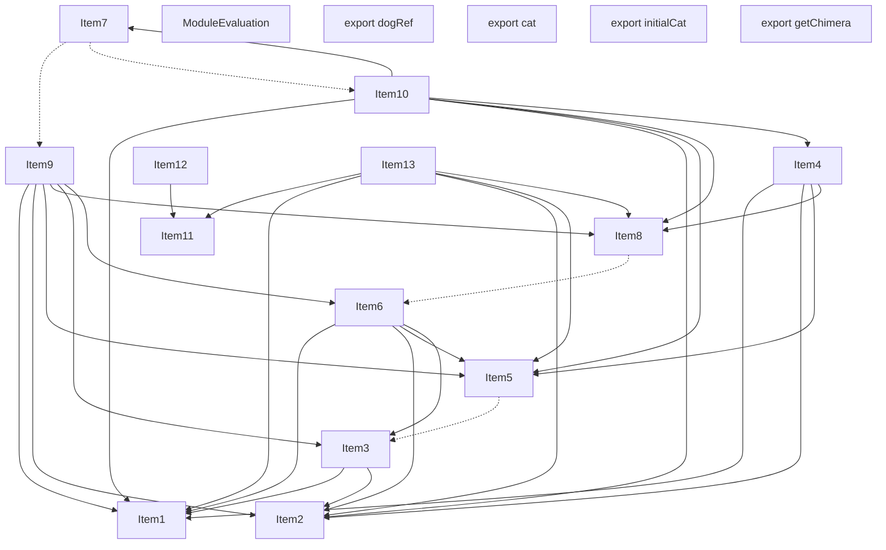
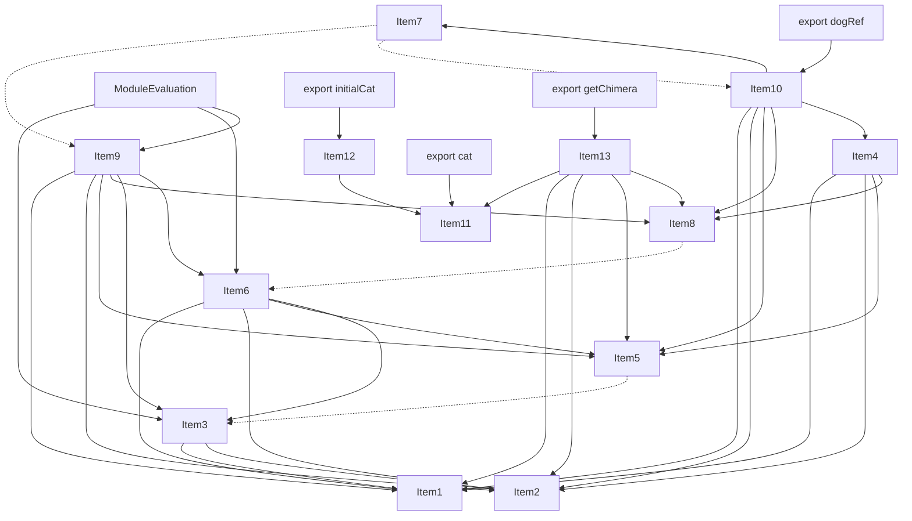

# Items

Count: 18

## Item 1: Stmt 0, `VarDeclarator(0)`

```js
let dog = "dog";

```

- Declares: `dog`
- Write: `dog`

## Item 2: Stmt 1, `Normal`

```js
dog += "!";

```

- Write: `dog`

## Item 3: Stmt 2, `Normal`

```js
console.log(dog);

```

- Side effects
- Reads: `console`, `dog`

## Item 4: Stmt 3, `Normal`

```js
function getDog() {
    return dog;
}

```

- Hoisted
- Declares: `getDog`
- Reads (eventual): `dog`

## Item 5: Stmt 4, `Normal`

```js
dog += "!";

```

- Write: `dog`

## Item 6: Stmt 5, `Normal`

```js
console.log(dog);

```

- Side effects
- Reads: `console`, `dog`

## Item 7: Stmt 6, `Normal`

```js
function setDog(newDog) {
    dog = newDog;
}

```

- Hoisted
- Declares: `setDog`
- Reads (eventual): `newDog`
- Write (eventual): `newDog`, `dog`

## Item 8: Stmt 7, `Normal`

```js
dog += "!";

```

- Write: `dog`

## Item 9: Stmt 8, `Normal`

```js
console.log(dog);

```

- Side effects
- Reads: `console`, `dog`

## Item 10: Stmt 9, `VarDeclarator(0)`

```js
export const dogRef = {
    initial: dog,
    get: getDog,
    set: setDog
};

```

- Declares: `dogRef`
- Reads: `dog`, `getDog`, `setDog`
- Write: `dogRef`

## Item 11: Stmt 10, `VarDeclarator(0)`

```js
export let cat = "cat";

```

- Declares: `cat`
- Write: `cat`

## Item 12: Stmt 11, `VarDeclarator(0)`

```js
export const initialCat = cat;

```

- Declares: `initialCat`
- Reads: `cat`
- Write: `initialCat`

## Item 13: Stmt 12, `Normal`

```js
export function getChimera() {
    return cat + dog;
}

```

- Hoisted
- Declares: `getChimera`
- Reads (eventual): `cat`, `dog`

# Phase 1

```mermaid
graph TD
    Item1;
    Item2;
    Item3;
    Item4;
    Item5;
    Item6;
    Item7;
    Item8;
    Item9;
    Item10;
    Item11;
    Item12;
    Item13;
    Item14;
    Item14["ModuleEvaluation"];
    Item15;
    Item15["export dogRef"];
    Item16;
    Item16["export cat"];
    Item17;
    Item17["export initialCat"];
    Item18;
    Item18["export getChimera"];
```

# Phase 2

# Phase 3

# Phase 4

# Final
```mermaid
graph TD
    N0["Items: [ItemId(ModuleEvaluation)]"];
    N1["Items: [ItemId(Export((\"dogRef\", #0)))]"];
    N2["Items: [ItemId(Export((\"cat\", #0)))]"];
    N3["Items: [ItemId(Export((\"initialCat\", #0))), ItemId(11, VarDeclarator(0))]"];
    N4["Items: [ItemId(Export((\"getChimera\", #0))), ItemId(12, Normal)]"];
    N5["Items: [ItemId(6, Normal), ItemId(9, VarDeclarator(0))]"];
    N6["Items: [ItemId(0, VarDeclarator(0))]"];
    N7["Items: [ItemId(1, Normal)]"];
    N8["Items: [ItemId(2, Normal)]"];
    N9["Items: [ItemId(3, Normal)]"];
    N10["Items: [ItemId(4, Normal)]"];
    N11["Items: [ItemId(5, Normal)]"];
    N12["Items: [ItemId(7, Normal)]"];
    N13["Items: [ItemId(8, Normal)]"];
    N14["Items: [ItemId(10, VarDeclarator(0))]"];
    N0 --> N8;
    N0 --> N11;
    N0 --> N13;
    N1 --> N5;
    N2 --> N14;
    N3 --> N14;
    N4 --> N14;
    N4 --> N6;
    N4 --> N7;
    N4 --> N10;
    N4 --> N12;
    N5 --> N13;
    N5 --> N6;
    N5 --> N7;
    N5 --> N10;
    N5 --> N12;
    N5 --> N9;
    N8 --> N6;
    N8 --> N7;
    N9 --> N6;
    N9 --> N7;
    N9 --> N10;
    N9 --> N12;
    N10 --> N8;
    N11 --> N6;
    N11 --> N7;
    N11 --> N10;
    N11 --> N8;
    N12 --> N11;
    N13 --> N6;
    N13 --> N7;
    N13 --> N10;
    N13 --> N12;
    N13 --> N8;
    N13 --> N11;
```
# Modules (dev)
## Part 0
```js
import "entry.js" assert {
    __turbopack_chunk__: 8
};
import "entry.js" assert {
    __turbopack_chunk__: 11
};
import "entry.js" assert {
    __turbopack_chunk__: 13
};
"module evaluation";

```
## Part 1
```js
import { dogRef } from "entry.js" assert {
    __turbopack_chunk__: 5
};
export { dogRef };

```
## Part 2
```js
import { cat } from "entry.js" assert {
    __turbopack_chunk__: 14
};
export { cat };

```
## Part 3
```js
import { cat } from "entry.js" assert {
    __turbopack_chunk__: 14
};
export { initialCat };
const initialCat = cat;
export { initialCat };

```
## Part 4
```js
import { cat } from "entry.js" assert {
    __turbopack_chunk__: 14
};
import { dog } from "entry.js" assert {
    __turbopack_chunk__: 6
};
import "entry.js" assert {
    __turbopack_chunk__: 7
};
import "entry.js" assert {
    __turbopack_chunk__: 10
};
import "entry.js" assert {
    __turbopack_chunk__: 12
};
export { getChimera };
function getChimera() {
    return cat + dog;
}

```
## Part 5
```js
import "entry.js" assert {
    __turbopack_chunk__: 13
};
import { dog } from "entry.js" assert {
    __turbopack_chunk__: 6
};
import "entry.js" assert {
    __turbopack_chunk__: 7
};
import "entry.js" assert {
    __turbopack_chunk__: 10
};
import "entry.js" assert {
    __turbopack_chunk__: 12
};
import { getDog } from "entry.js" assert {
    __turbopack_chunk__: 9
};
function setDog(newDog) {
    dog = newDog;
}
const dogRef = {
    initial: dog,
    get: getDog,
    set: setDog
};
export { dogRef };

```
## Part 6
```js
let dog = "dog";
export { dog };

```
## Part 7
```js
dog += "!";
export { dog };

```
## Part 8
```js
import { dog } from "entry.js" assert {
    __turbopack_chunk__: 6
};
import "entry.js" assert {
    __turbopack_chunk__: 7
};
console.log(dog);

```
## Part 9
```js
import { dog } from "entry.js" assert {
    __turbopack_chunk__: 6
};
import "entry.js" assert {
    __turbopack_chunk__: 7
};
import "entry.js" assert {
    __turbopack_chunk__: 10
};
import "entry.js" assert {
    __turbopack_chunk__: 12
};
function getDog() {
    return dog;
}

```
## Part 10
```js
import "entry.js" assert {
    __turbopack_chunk__: 8
};
dog += "!";
export { dog };

```
## Part 11
```js
import { dog } from "entry.js" assert {
    __turbopack_chunk__: 6
};
import "entry.js" assert {
    __turbopack_chunk__: 7
};
import "entry.js" assert {
    __turbopack_chunk__: 10
};
import "entry.js" assert {
    __turbopack_chunk__: 8
};
console.log(dog);

```
## Part 12
```js
import "entry.js" assert {
    __turbopack_chunk__: 11
};
dog += "!";
export { dog };

```
## Part 13
```js
import { dog } from "entry.js" assert {
    __turbopack_chunk__: 6
};
import "entry.js" assert {
    __turbopack_chunk__: 7
};
import "entry.js" assert {
    __turbopack_chunk__: 10
};
import "entry.js" assert {
    __turbopack_chunk__: 12
};
import "entry.js" assert {
    __turbopack_chunk__: 8
};
import "entry.js" assert {
    __turbopack_chunk__: 11
};
console.log(dog);

```
## Part 14
```js
let cat = "cat";
export { cat };

```
## Merged (module eval)
```js
let dog = "dog";
export { dog };
dog += "!";
export { dog };
console.log(dog);
dog += "!";
export { dog };
console.log(dog);
dog += "!";
export { dog };
console.log(dog);
"module evaluation";

```
# Modules (prod)
## Part 0
```js
import { dog } from "entry.js" assert {
    __turbopack_chunk__: 5
};
import "entry.js" assert {
    __turbopack_chunk__: 6
};
import "entry.js" assert {
    __turbopack_chunk__: 7
};
import "entry.js" assert {
    __turbopack_chunk__: 8
};
"module evaluation";
console.log(dog);
console.log(dog);
console.log(dog);

```
## Part 1
```js
import { dog } from "entry.js" assert {
    __turbopack_chunk__: 5
};
import "entry.js" assert {
    __turbopack_chunk__: 6
};
import "entry.js" assert {
    __turbopack_chunk__: 7
};
import "entry.js" assert {
    __turbopack_chunk__: 8
};
export { dogRef };
function getDog() {
    return dog;
}
function setDog(newDog) {
    dog = newDog;
}
const dogRef = {
    initial: dog,
    get: getDog,
    set: setDog
};
export { dogRef };

```
## Part 2
```js
import { cat } from "entry.js" assert {
    __turbopack_chunk__: 9
};
export { cat };

```
## Part 3
```js
import { cat } from "entry.js" assert {
    __turbopack_chunk__: 9
};
export { initialCat };
const initialCat = cat;
export { initialCat };

```
## Part 4
```js
import { cat } from "entry.js" assert {
    __turbopack_chunk__: 9
};
import { dog } from "entry.js" assert {
    __turbopack_chunk__: 5
};
import "entry.js" assert {
    __turbopack_chunk__: 6
};
import "entry.js" assert {
    __turbopack_chunk__: 7
};
import "entry.js" assert {
    __turbopack_chunk__: 8
};
export { getChimera };
function getChimera() {
    return cat + dog;
}

```
## Part 5
```js
let dog = "dog";
export { dog };

```
## Part 6
```js
dog += "!";
export { dog };

```
## Part 7
```js
dog += "!";
export { dog };

```
## Part 8
```js
dog += "!";
export { dog };

```
## Part 9
```js
let cat = "cat";
export { cat };

```
## Merged (module eval)
```js
let dog = "dog";
export { dog };
dog += "!";
export { dog };
dog += "!";
export { dog };
dog += "!";
export { dog };
"module evaluation";
console.log(dog);
console.log(dog);
console.log(dog);

```
