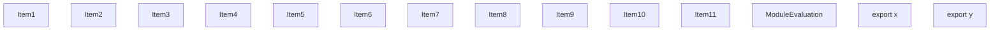
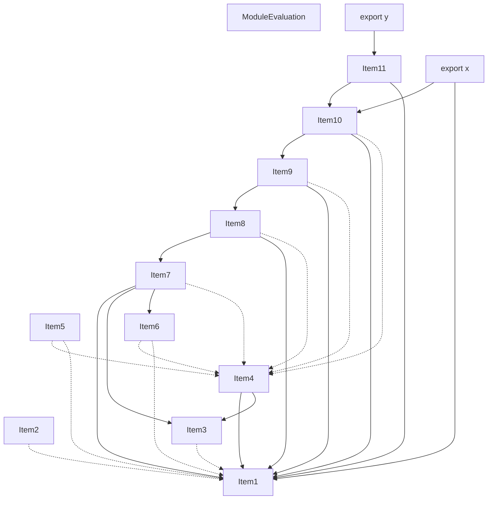
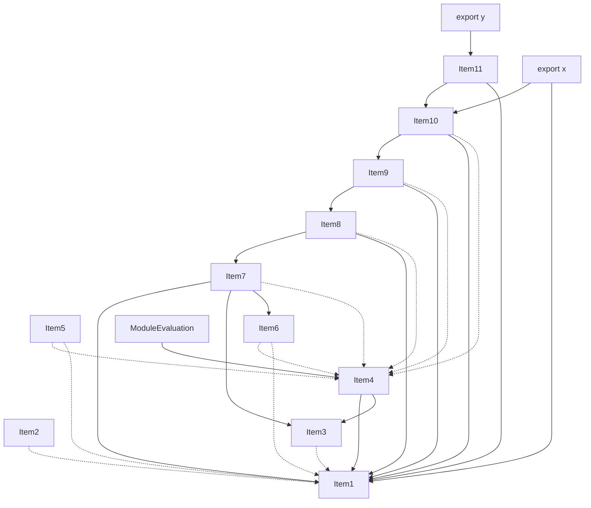
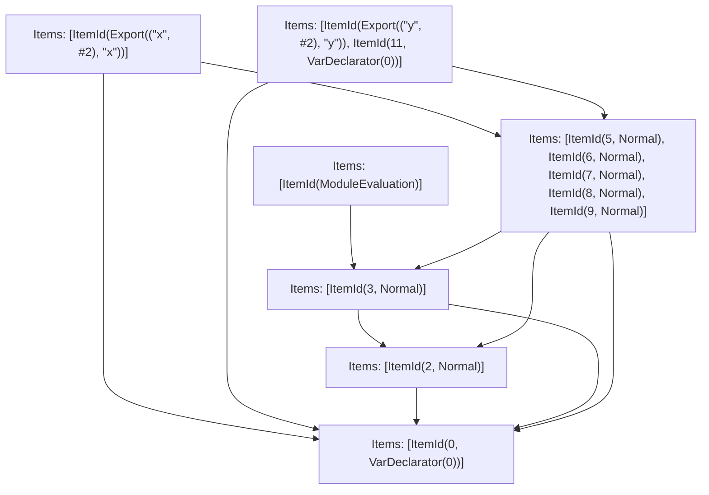

# Items

Count: 14

## Item 1: Stmt 0, `VarDeclarator(0)`

```js
let x = 1;

```

- Declares: `x`
- Write: `x`

## Item 2: Stmt 1, `Normal`

```js
x = 2;

```

- Write: `x`

## Item 3: Stmt 2, `Normal`

```js
x = 3;

```

- Write: `x`

## Item 4: Stmt 3, `Normal`

```js
console.log(x);

```

- Side effects
- Reads: `x`

## Item 5: Stmt 4, `Normal`

```js
x = 4;

```

- Write: `x`

## Item 6: Stmt 5, `Normal`

```js
x = 5;

```

- Write: `x`

## Item 7: Stmt 6, `Normal`

```js
x += 6;

```

- Reads: `x`
- Write: `x`

## Item 8: Stmt 7, `Normal`

```js
x += 7;

```

- Reads: `x`
- Write: `x`

## Item 9: Stmt 8, `Normal`

```js
x += 8;

```

- Reads: `x`
- Write: `x`

## Item 10: Stmt 9, `Normal`

```js
x += 9;

```

- Reads: `x`
- Write: `x`

## Item 11: Stmt 11, `VarDeclarator(0)`

```js
export const y = x;

```

- Declares: `y`
- Reads: `x`
- Write: `y`

# Phase 1

# Phase 2

# Phase 3

# Phase 4

# Final

# Entrypoints

```
{
    ModuleEvaluation: 0,
    Exports: 7,
    Export(
        "y",
    ): 2,
    Export(
        "x",
    ): 1,
}
```


# Modules (dev)
## Part 0
```js
import "__TURBOPACK_PART__" assert {
    __turbopack_part__: 5
};
"module evaluation";

```
## Part 1
```js
import "__TURBOPACK_PART__" assert {
    __turbopack_part__: 6
};
import { x } from "__TURBOPACK_PART__" assert {
    __turbopack_part__: 3
};
export { x as x };

```
## Part 2
```js
import "__TURBOPACK_PART__" assert {
    __turbopack_part__: 6
};
import { x } from "__TURBOPACK_PART__" assert {
    __turbopack_part__: 3
};
export { y };
const y = x;
export { y } from "__TURBOPACK_VAR__" assert {
    __turbopack_var__: true
};

```
## Part 3
```js
let x = 1;
export { x } from "__TURBOPACK_VAR__" assert {
    __turbopack_var__: true
};

```
## Part 4
```js
import { x } from "__TURBOPACK_PART__" assert {
    __turbopack_part__: 3
};
x = 3;

```
## Part 5
```js
import { x } from "__TURBOPACK_PART__" assert {
    __turbopack_part__: 3
};
import "__TURBOPACK_PART__" assert {
    __turbopack_part__: 4
};
console.log(x);

```
## Part 6
```js
import "__TURBOPACK_PART__" assert {
    __turbopack_part__: 5
};
import { x } from "__TURBOPACK_PART__" assert {
    __turbopack_part__: 3
};
import "__TURBOPACK_PART__" assert {
    __turbopack_part__: 4
};
x = 5;
x += 6;
x += 7;
x += 8;
x += 9;

```
## Part 7
```js
export { x } from "__TURBOPACK_PART__" assert {
    __turbopack_part__: "export x"
};
export { y } from "__TURBOPACK_PART__" assert {
    __turbopack_part__: "export y"
};

```
## Merged (module eval)
```js
import "__TURBOPACK_PART__" assert {
    __turbopack_part__: 5
};
"module evaluation";

```
# Entrypoints

```
{
    ModuleEvaluation: 0,
    Exports: 6,
    Export(
        "y",
    ): 2,
    Export(
        "x",
    ): 1,
}
```


# Modules (prod)
## Part 0
```js
import { x } from "__TURBOPACK_PART__" assert {
    __turbopack_part__: 3
};
import "__TURBOPACK_PART__" assert {
    __turbopack_part__: 4
};
"module evaluation";
console.log(x);

```
## Part 1
```js
import "__TURBOPACK_PART__" assert {
    __turbopack_part__: 5
};
import { x } from "__TURBOPACK_PART__" assert {
    __turbopack_part__: 3
};
export { x as x };

```
## Part 2
```js
import "__TURBOPACK_PART__" assert {
    __turbopack_part__: 5
};
import { x } from "__TURBOPACK_PART__" assert {
    __turbopack_part__: 3
};
export { y };
const y = x;
export { y } from "__TURBOPACK_VAR__" assert {
    __turbopack_var__: true
};

```
## Part 3
```js
let x = 1;
export { x } from "__TURBOPACK_VAR__" assert {
    __turbopack_var__: true
};

```
## Part 4
```js
x = 3;

```
## Part 5
```js
import { x } from "__TURBOPACK_PART__" assert {
    __turbopack_part__: 3
};
import "__TURBOPACK_PART__" assert {
    __turbopack_part__: 4
};
x = 5;
x += 6;
x += 7;
x += 8;
x += 9;

```
## Part 6
```js
export { x } from "__TURBOPACK_PART__" assert {
    __turbopack_part__: "export x"
};
export { y } from "__TURBOPACK_PART__" assert {
    __turbopack_part__: "export y"
};

```
## Merged (module eval)
```js
import { x } from "__TURBOPACK_PART__" assert {
    __turbopack_part__: 3
};
import "__TURBOPACK_PART__" assert {
    __turbopack_part__: 4
};
"module evaluation";
console.log(x);

```
