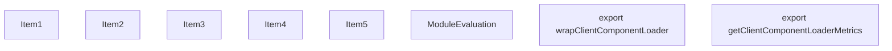
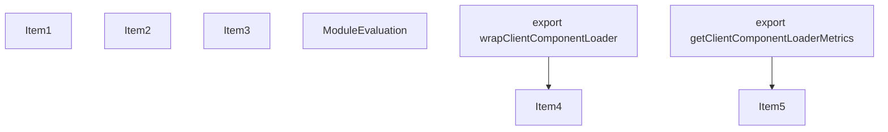
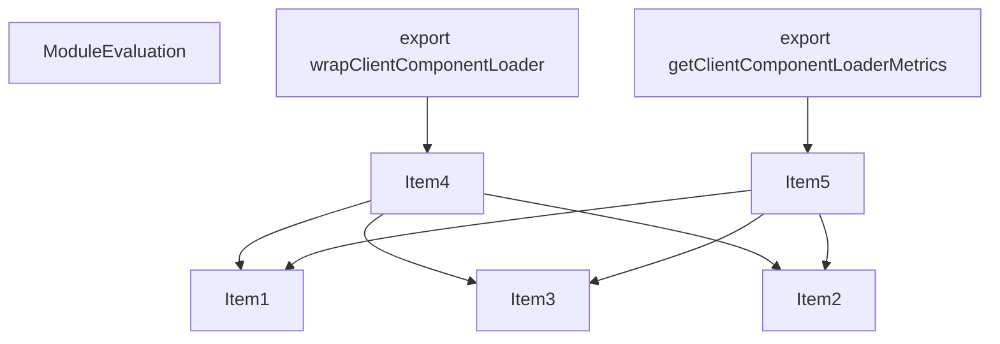
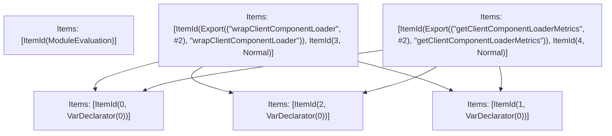

# Items

Count: 8

## Item 1: Stmt 0, `VarDeclarator(0)`

```js
let clientComponentLoadStart = 0;

```

- Declares: `clientComponentLoadStart`
- Write: `clientComponentLoadStart`

## Item 2: Stmt 1, `VarDeclarator(0)`

```js
let clientComponentLoadTimes = 0;

```

- Declares: `clientComponentLoadTimes`
- Write: `clientComponentLoadTimes`

## Item 3: Stmt 2, `VarDeclarator(0)`

```js
let clientComponentLoadCount = 0;

```

- Declares: `clientComponentLoadCount`
- Write: `clientComponentLoadCount`

## Item 4: Stmt 3, `Normal`

```js
export function wrapClientComponentLoader(ComponentMod) {
    if (!('performance' in globalThis)) {
        return ComponentMod.__next_app__;
    }
    return {
        require: (...args)=>{
            if (clientComponentLoadStart === 0) {
                clientComponentLoadStart = performance.now();
            }
            const startTime = performance.now();
            try {
                clientComponentLoadCount += 1;
                return ComponentMod.__next_app__.require(...args);
            } finally{
                clientComponentLoadTimes += performance.now() - startTime;
            }
        },
        loadChunk: (...args)=>{
            const startTime = performance.now();
            try {
                clientComponentLoadCount += 1;
                return ComponentMod.__next_app__.loadChunk(...args);
            } finally{
                clientComponentLoadTimes += performance.now() - startTime;
            }
        }
    };
}

```

- Hoisted
- Declares: `wrapClientComponentLoader`
- Reads (eventual): `clientComponentLoadStart`
- Write: `wrapClientComponentLoader`
- Write (eventual): `clientComponentLoadStart`, `clientComponentLoadCount`, `clientComponentLoadTimes`

## Item 5: Stmt 4, `Normal`

```js
export function getClientComponentLoaderMetrics(options = {}) {
    const metrics = clientComponentLoadStart === 0 ? undefined : {
        clientComponentLoadStart,
        clientComponentLoadTimes,
        clientComponentLoadCount
    };
    if (options.reset) {
        clientComponentLoadStart = 0;
        clientComponentLoadTimes = 0;
        clientComponentLoadCount = 0;
    }
    return metrics;
}

```

- Hoisted
- Declares: `getClientComponentLoaderMetrics`
- Reads (eventual): `clientComponentLoadStart`, `clientComponentLoadTimes`, `clientComponentLoadCount`
- Write: `getClientComponentLoaderMetrics`
- Write (eventual): `clientComponentLoadStart`, `clientComponentLoadTimes`, `clientComponentLoadCount`

# Phase 1

# Phase 2

# Phase 3

# Phase 4

# Final

# Entrypoints

```
{
    ModuleEvaluation: 0,
    Export(
        "getClientComponentLoaderMetrics",
    ): 2,
    Exports: 6,
    Export(
        "wrapClientComponentLoader",
    ): 1,
}
```


# Modules (dev)
## Part 0
```js
"module evaluation";

```
## Part 1
```js
import { clientComponentLoadStart } from "__TURBOPACK_PART__" assert {
    __turbopack_part__: 3
};
import { clientComponentLoadCount } from "__TURBOPACK_PART__" assert {
    __turbopack_part__: 5
};
import { clientComponentLoadTimes } from "__TURBOPACK_PART__" assert {
    __turbopack_part__: 4
};
export { wrapClientComponentLoader };
function wrapClientComponentLoader(ComponentMod) {
    if (!('performance' in globalThis)) {
        return ComponentMod.__next_app__;
    }
    return {
        require: (...args)=>{
            if (clientComponentLoadStart === 0) {
                clientComponentLoadStart = performance.now();
            }
            const startTime = performance.now();
            try {
                clientComponentLoadCount += 1;
                return ComponentMod.__next_app__.require(...args);
            } finally{
                clientComponentLoadTimes += performance.now() - startTime;
            }
        },
        loadChunk: (...args)=>{
            const startTime = performance.now();
            try {
                clientComponentLoadCount += 1;
                return ComponentMod.__next_app__.loadChunk(...args);
            } finally{
                clientComponentLoadTimes += performance.now() - startTime;
            }
        }
    };
}
export { wrapClientComponentLoader } from "__TURBOPACK_VAR__" assert {
    __turbopack_var__: true
};

```
## Part 2
```js
import { clientComponentLoadStart } from "__TURBOPACK_PART__" assert {
    __turbopack_part__: 3
};
import { clientComponentLoadTimes } from "__TURBOPACK_PART__" assert {
    __turbopack_part__: 4
};
import { clientComponentLoadCount } from "__TURBOPACK_PART__" assert {
    __turbopack_part__: 5
};
export { getClientComponentLoaderMetrics };
function getClientComponentLoaderMetrics(options = {}) {
    const metrics = clientComponentLoadStart === 0 ? undefined : {
        clientComponentLoadStart,
        clientComponentLoadTimes,
        clientComponentLoadCount
    };
    if (options.reset) {
        clientComponentLoadStart = 0;
        clientComponentLoadTimes = 0;
        clientComponentLoadCount = 0;
    }
    return metrics;
}
export { getClientComponentLoaderMetrics } from "__TURBOPACK_VAR__" assert {
    __turbopack_var__: true
};

```
## Part 3
```js
let clientComponentLoadStart = 0;
export { clientComponentLoadStart } from "__TURBOPACK_VAR__" assert {
    __turbopack_var__: true
};

```
## Part 4
```js
let clientComponentLoadTimes = 0;
export { clientComponentLoadTimes } from "__TURBOPACK_VAR__" assert {
    __turbopack_var__: true
};

```
## Part 5
```js
let clientComponentLoadCount = 0;
export { clientComponentLoadCount } from "__TURBOPACK_VAR__" assert {
    __turbopack_var__: true
};

```
## Part 6
```js
export { wrapClientComponentLoader } from "__TURBOPACK_PART__" assert {
    __turbopack_part__: "export wrapClientComponentLoader"
};
export { getClientComponentLoaderMetrics } from "__TURBOPACK_PART__" assert {
    __turbopack_part__: "export getClientComponentLoaderMetrics"
};

```
## Merged (module eval)
```js
"module evaluation";

```
# Entrypoints

```
{
    ModuleEvaluation: 0,
    Export(
        "getClientComponentLoaderMetrics",
    ): 2,
    Exports: 6,
    Export(
        "wrapClientComponentLoader",
    ): 1,
}
```


# Modules (prod)
## Part 0
```js
"module evaluation";

```
## Part 1
```js
import { clientComponentLoadStart } from "__TURBOPACK_PART__" assert {
    __turbopack_part__: 3
};
import { clientComponentLoadCount } from "__TURBOPACK_PART__" assert {
    __turbopack_part__: 5
};
import { clientComponentLoadTimes } from "__TURBOPACK_PART__" assert {
    __turbopack_part__: 4
};
export { wrapClientComponentLoader };
function wrapClientComponentLoader(ComponentMod) {
    if (!('performance' in globalThis)) {
        return ComponentMod.__next_app__;
    }
    return {
        require: (...args)=>{
            if (clientComponentLoadStart === 0) {
                clientComponentLoadStart = performance.now();
            }
            const startTime = performance.now();
            try {
                clientComponentLoadCount += 1;
                return ComponentMod.__next_app__.require(...args);
            } finally{
                clientComponentLoadTimes += performance.now() - startTime;
            }
        },
        loadChunk: (...args)=>{
            const startTime = performance.now();
            try {
                clientComponentLoadCount += 1;
                return ComponentMod.__next_app__.loadChunk(...args);
            } finally{
                clientComponentLoadTimes += performance.now() - startTime;
            }
        }
    };
}
export { wrapClientComponentLoader } from "__TURBOPACK_VAR__" assert {
    __turbopack_var__: true
};

```
## Part 2
```js
import { clientComponentLoadStart } from "__TURBOPACK_PART__" assert {
    __turbopack_part__: 3
};
import { clientComponentLoadTimes } from "__TURBOPACK_PART__" assert {
    __turbopack_part__: 4
};
import { clientComponentLoadCount } from "__TURBOPACK_PART__" assert {
    __turbopack_part__: 5
};
export { getClientComponentLoaderMetrics };
function getClientComponentLoaderMetrics(options = {}) {
    const metrics = clientComponentLoadStart === 0 ? undefined : {
        clientComponentLoadStart,
        clientComponentLoadTimes,
        clientComponentLoadCount
    };
    if (options.reset) {
        clientComponentLoadStart = 0;
        clientComponentLoadTimes = 0;
        clientComponentLoadCount = 0;
    }
    return metrics;
}
export { getClientComponentLoaderMetrics } from "__TURBOPACK_VAR__" assert {
    __turbopack_var__: true
};

```
## Part 3
```js
let clientComponentLoadStart = 0;
export { clientComponentLoadStart } from "__TURBOPACK_VAR__" assert {
    __turbopack_var__: true
};

```
## Part 4
```js
let clientComponentLoadTimes = 0;
export { clientComponentLoadTimes } from "__TURBOPACK_VAR__" assert {
    __turbopack_var__: true
};

```
## Part 5
```js
let clientComponentLoadCount = 0;
export { clientComponentLoadCount } from "__TURBOPACK_VAR__" assert {
    __turbopack_var__: true
};

```
## Part 6
```js
export { wrapClientComponentLoader } from "__TURBOPACK_PART__" assert {
    __turbopack_part__: "export wrapClientComponentLoader"
};
export { getClientComponentLoaderMetrics } from "__TURBOPACK_PART__" assert {
    __turbopack_part__: "export getClientComponentLoaderMetrics"
};

```
## Merged (module eval)
```js
"module evaluation";

```
