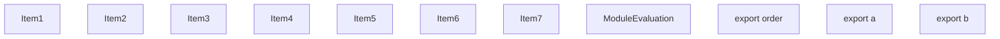
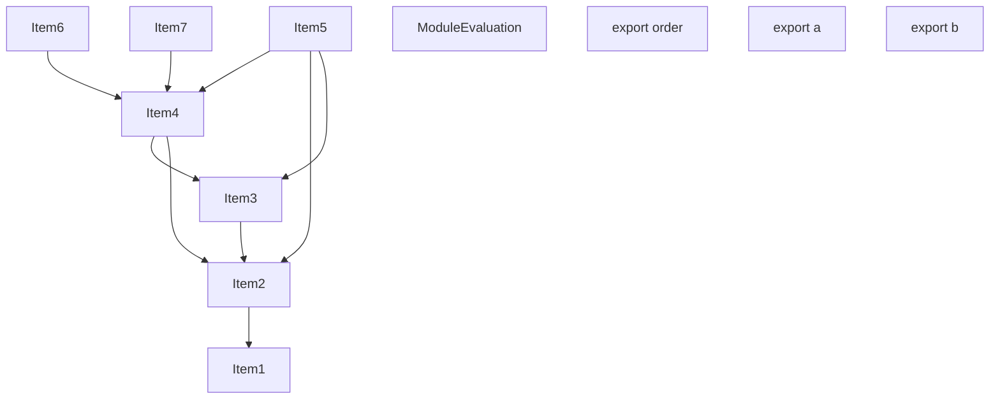
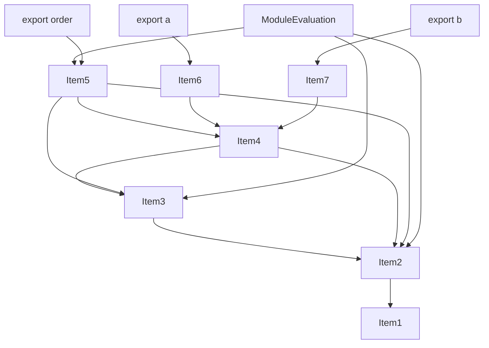
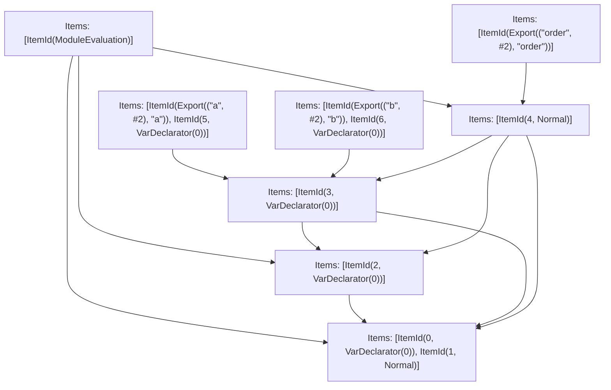

# Items

Count: 11

## Item 1: Stmt 0, `VarDeclarator(0)`

```js
export const order = [];

```

- Declares: `order`
- Write: `order`

## Item 2: Stmt 1, `Normal`

```js
order.push("a");

```

- Side effects
- Reads: `order`
- Write: `order`

## Item 3: Stmt 2, `VarDeclarator(0)`

```js
const random = Math.random();

```

- Side effects
- Declares: `random`
- Write: `random`

## Item 4: Stmt 3, `VarDeclarator(0)`

```js
const shared = {
    random,
    effect: order.push("b")
};

```

- Declares: `shared`
- Reads: `random`, `order`
- Write: `shared`, `order`

## Item 5: Stmt 4, `Normal`

```js
order.push("c");

```

- Side effects
- Reads: `order`
- Write: `order`

## Item 6: Stmt 5, `VarDeclarator(0)`

```js
export const a = {
    shared,
    a: "aaaaaaaaaaa"
};

```

- Declares: `a`
- Reads: `shared`
- Write: `a`

## Item 7: Stmt 6, `VarDeclarator(0)`

```js
export const b = {
    shared,
    b: "bbbbbbbbbbb"
};

```

- Declares: `b`
- Reads: `shared`
- Write: `b`

# Phase 1

# Phase 2

# Phase 3

# Phase 4

# Final

# Entrypoints

```
{
    ModuleEvaluation: 0,
    Export(
        "order",
    ): 1,
    Export(
        "b",
    ): 3,
    Export(
        "a",
    ): 2,
}
```


# Modules (dev)
## Part 0
```js
import "__TURBOPACK_PART__" assert {
    __turbopack_part__: 4
};
import "__TURBOPACK_PART__" assert {
    __turbopack_part__: 5
};
import "__TURBOPACK_PART__" assert {
    __turbopack_part__: 7
};
"module evaluation";

```
## Part 1
```js
import { order } from "__TURBOPACK_PART__" assert {
    __turbopack_part__: 7
};
export { order };

```
## Part 2
```js
import { shared } from "__TURBOPACK_PART__" assert {
    __turbopack_part__: 6
};
export { a };
const a = {
    shared,
    a: "aaaaaaaaaaa"
};
export { a } from "__TURBOPACK_VAR__" assert {
    __turbopack_var__: true
};

```
## Part 3
```js
import { shared } from "__TURBOPACK_PART__" assert {
    __turbopack_part__: 6
};
export { b };
const b = {
    shared,
    b: "bbbbbbbbbbb"
};
export { b } from "__TURBOPACK_VAR__" assert {
    __turbopack_var__: true
};

```
## Part 4
```js
const order = [];
order.push("a");
export { order } from "__TURBOPACK_VAR__" assert {
    __turbopack_var__: true
};
export { order } from "__TURBOPACK_VAR__" assert {
    __turbopack_var__: true
};

```
## Part 5
```js
import "__TURBOPACK_PART__" assert {
    __turbopack_part__: 4
};
const random = Math.random();
export { random } from "__TURBOPACK_VAR__" assert {
    __turbopack_var__: true
};

```
## Part 6
```js
import { random } from "__TURBOPACK_PART__" assert {
    __turbopack_part__: 5
};
import { order } from "__TURBOPACK_PART__" assert {
    __turbopack_part__: 4
};
const shared = {
    random,
    effect: order.push("b")
};
export { shared } from "__TURBOPACK_VAR__" assert {
    __turbopack_var__: true
};
export { order } from "__TURBOPACK_VAR__" assert {
    __turbopack_var__: true
};

```
## Part 7
```js
import { order } from "__TURBOPACK_PART__" assert {
    __turbopack_part__: 6
};
import "__TURBOPACK_PART__" assert {
    __turbopack_part__: 4
};
import "__TURBOPACK_PART__" assert {
    __turbopack_part__: 5
};
order.push("c");
export { order } from "__TURBOPACK_VAR__" assert {
    __turbopack_var__: true
};

```
## Merged (module eval)
```js
import "__TURBOPACK_PART__" assert {
    __turbopack_part__: 4
};
import "__TURBOPACK_PART__" assert {
    __turbopack_part__: 5
};
import "__TURBOPACK_PART__" assert {
    __turbopack_part__: 7
};
"module evaluation";

```
# Entrypoints

```
{
    ModuleEvaluation: 0,
    Export(
        "order",
    ): 1,
    Export(
        "b",
    ): 3,
    Export(
        "a",
    ): 2,
}
```


# Modules (prod)
## Part 0
```js
import "__TURBOPACK_PART__" assert {
    __turbopack_part__: 4
};
import "__TURBOPACK_PART__" assert {
    __turbopack_part__: 5
};
import "__TURBOPACK_PART__" assert {
    __turbopack_part__: 7
};
"module evaluation";

```
## Part 1
```js
import { order } from "__TURBOPACK_PART__" assert {
    __turbopack_part__: 7
};
export { order };

```
## Part 2
```js
import { shared } from "__TURBOPACK_PART__" assert {
    __turbopack_part__: 6
};
export { a };
const a = {
    shared,
    a: "aaaaaaaaaaa"
};
export { a } from "__TURBOPACK_VAR__" assert {
    __turbopack_var__: true
};

```
## Part 3
```js
import { shared } from "__TURBOPACK_PART__" assert {
    __turbopack_part__: 6
};
export { b };
const b = {
    shared,
    b: "bbbbbbbbbbb"
};
export { b } from "__TURBOPACK_VAR__" assert {
    __turbopack_var__: true
};

```
## Part 4
```js
const order = [];
order.push("a");
export { order } from "__TURBOPACK_VAR__" assert {
    __turbopack_var__: true
};
export { order } from "__TURBOPACK_VAR__" assert {
    __turbopack_var__: true
};

```
## Part 5
```js
import "__TURBOPACK_PART__" assert {
    __turbopack_part__: 4
};
const random = Math.random();
export { random } from "__TURBOPACK_VAR__" assert {
    __turbopack_var__: true
};

```
## Part 6
```js
import { random } from "__TURBOPACK_PART__" assert {
    __turbopack_part__: 5
};
import { order } from "__TURBOPACK_PART__" assert {
    __turbopack_part__: 4
};
const shared = {
    random,
    effect: order.push("b")
};
export { shared } from "__TURBOPACK_VAR__" assert {
    __turbopack_var__: true
};
export { order } from "__TURBOPACK_VAR__" assert {
    __turbopack_var__: true
};

```
## Part 7
```js
import { order } from "__TURBOPACK_PART__" assert {
    __turbopack_part__: 6
};
import "__TURBOPACK_PART__" assert {
    __turbopack_part__: 4
};
import "__TURBOPACK_PART__" assert {
    __turbopack_part__: 5
};
order.push("c");
export { order } from "__TURBOPACK_VAR__" assert {
    __turbopack_var__: true
};

```
## Merged (module eval)
```js
import "__TURBOPACK_PART__" assert {
    __turbopack_part__: 4
};
import "__TURBOPACK_PART__" assert {
    __turbopack_part__: 5
};
import "__TURBOPACK_PART__" assert {
    __turbopack_part__: 7
};
"module evaluation";

```
