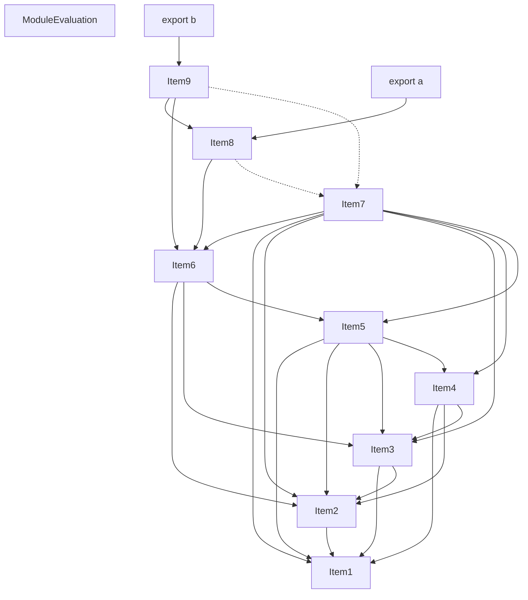
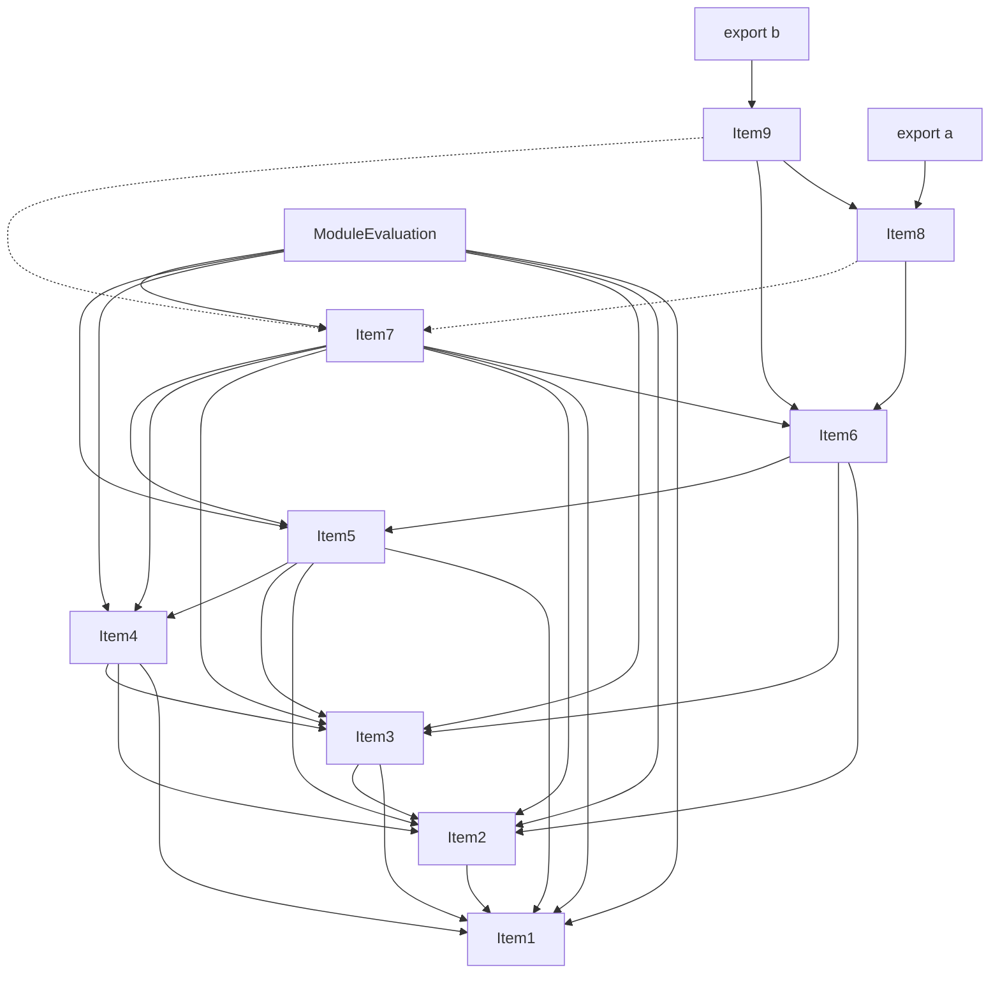
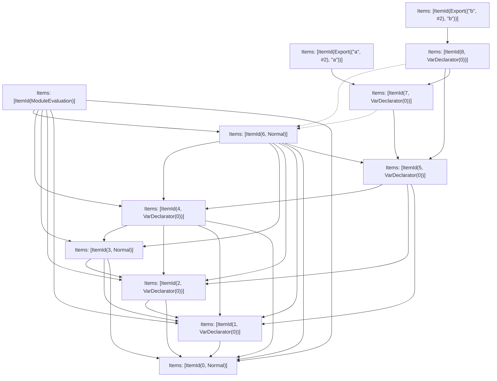

# Items

Count: 12

## Item 1: Stmt 0, `Normal`

```js
console.log("Hello");

```

- Side effects

## Item 2: Stmt 1, `VarDeclarator(0)`

```js
const value = externalFunction();

```

- Side effects
- Declares: `value`
- Write: `value`

## Item 3: Stmt 2, `VarDeclarator(0)`

```js
const value2 = externalObject.propertyWithGetter;

```

- Side effects
- Declares: `value2`
- Write: `value2`

## Item 4: Stmt 3, `Normal`

```js
externalObject.propertyWithSetter = 42;

```

- Side effects

## Item 5: Stmt 4, `VarDeclarator(0)`

```js
const value3 = externalFunction();

```

- Side effects
- Declares: `value3`
- Write: `value3`

## Item 6: Stmt 5, `VarDeclarator(0)`

```js
const shared = {
    value,
    value2,
    value3
};

```

- Declares: `shared`
- Reads: `value`, `value2`, `value3`
- Write: `value`, `value2`, `value3`, `shared`

## Item 7: Stmt 6, `Normal`

```js
console.log(shared);

```

- Side effects
- Reads: `shared`

## Item 8: Stmt 7, `VarDeclarator(0)`

```js
export const a = {
    shared,
    a: "aaaaaaaaaaa"
};

```

- Declares: `a`
- Reads: `shared`
- Write: `shared`, `a`

## Item 9: Stmt 8, `VarDeclarator(0)`

```js
export const b = {
    shared,
    b: "bbbbbbbbbbb"
};

```

- Declares: `b`
- Reads: `shared`
- Write: `shared`, `b`

# Phase 1

# Phase 2

# Phase 3

# Phase 4

# Final

# Entrypoints

```
{
    ModuleEvaluation: 7,
    Exports: 12,
    Export(
        "b",
    ): 11,
    Export(
        "a",
    ): 9,
}
```


# Modules (dev)
## Part 0
```js
console.log("Hello");

```
## Part 1
```js
import "__TURBOPACK_PART__" assert {
    __turbopack_part__: 0
};
const value = externalFunction();
export { value } from "__TURBOPACK_VAR__" assert {
    __turbopack_var__: true
};

```
## Part 2
```js
import "__TURBOPACK_PART__" assert {
    __turbopack_part__: 0
};
import "__TURBOPACK_PART__" assert {
    __turbopack_part__: 1
};
const value2 = externalObject.propertyWithGetter;
export { value2 } from "__TURBOPACK_VAR__" assert {
    __turbopack_var__: true
};

```
## Part 3
```js
import "__TURBOPACK_PART__" assert {
    __turbopack_part__: 0
};
import "__TURBOPACK_PART__" assert {
    __turbopack_part__: 1
};
import "__TURBOPACK_PART__" assert {
    __turbopack_part__: 2
};
externalObject.propertyWithSetter = 42;

```
## Part 4
```js
import "__TURBOPACK_PART__" assert {
    __turbopack_part__: 0
};
import "__TURBOPACK_PART__" assert {
    __turbopack_part__: 1
};
import "__TURBOPACK_PART__" assert {
    __turbopack_part__: 2
};
import "__TURBOPACK_PART__" assert {
    __turbopack_part__: 3
};
const value3 = externalFunction();
export { value3 } from "__TURBOPACK_VAR__" assert {
    __turbopack_var__: true
};

```
## Part 5
```js
import "__TURBOPACK_PART__" assert {
    __turbopack_part__: 1
};
import "__TURBOPACK_PART__" assert {
    __turbopack_part__: 2
};
import "__TURBOPACK_PART__" assert {
    __turbopack_part__: 4
};
import { value } from "__TURBOPACK_PART__" assert {
    __turbopack_part__: 1
};
import { value2 } from "__TURBOPACK_PART__" assert {
    __turbopack_part__: 2
};
import { value3 } from "__TURBOPACK_PART__" assert {
    __turbopack_part__: 4
};
const shared = {
    value,
    value2,
    value3
};
export { shared } from "__TURBOPACK_VAR__" assert {
    __turbopack_var__: true
};

```
## Part 6
```js
import "__TURBOPACK_PART__" assert {
    __turbopack_part__: 5
};
import "__TURBOPACK_PART__" assert {
    __turbopack_part__: 0
};
import "__TURBOPACK_PART__" assert {
    __turbopack_part__: 1
};
import "__TURBOPACK_PART__" assert {
    __turbopack_part__: 2
};
import "__TURBOPACK_PART__" assert {
    __turbopack_part__: 3
};
import "__TURBOPACK_PART__" assert {
    __turbopack_part__: 4
};
import { shared } from "__TURBOPACK_PART__" assert {
    __turbopack_part__: 5
};
console.log(shared);

```
## Part 7
```js
import "__TURBOPACK_PART__" assert {
    __turbopack_part__: 0
};
import "__TURBOPACK_PART__" assert {
    __turbopack_part__: 1
};
import "__TURBOPACK_PART__" assert {
    __turbopack_part__: 2
};
import "__TURBOPACK_PART__" assert {
    __turbopack_part__: 3
};
import "__TURBOPACK_PART__" assert {
    __turbopack_part__: 4
};
import "__TURBOPACK_PART__" assert {
    __turbopack_part__: 6
};
"module evaluation";

```
## Part 8
```js
import "__TURBOPACK_PART__" assert {
    __turbopack_part__: 5
};
import "__TURBOPACK_PART__" assert {
    __turbopack_part__: 6
};
import { shared } from "__TURBOPACK_PART__" assert {
    __turbopack_part__: 5
};
const a = {
    shared,
    a: "aaaaaaaaaaa"
};
export { a } from "__TURBOPACK_VAR__" assert {
    __turbopack_var__: true
};

```
## Part 9
```js
import "__TURBOPACK_PART__" assert {
    __turbopack_part__: 8
};
import { a } from "__TURBOPACK_PART__" assert {
    __turbopack_part__: 8
};
export { a };

```
## Part 10
```js
import "__TURBOPACK_PART__" assert {
    __turbopack_part__: 8
};
import "__TURBOPACK_PART__" assert {
    __turbopack_part__: 5
};
import "__TURBOPACK_PART__" assert {
    __turbopack_part__: 6
};
import { shared } from "__TURBOPACK_PART__" assert {
    __turbopack_part__: 5
};
const b = {
    shared,
    b: "bbbbbbbbbbb"
};
export { b } from "__TURBOPACK_VAR__" assert {
    __turbopack_var__: true
};

```
## Part 11
```js
import "__TURBOPACK_PART__" assert {
    __turbopack_part__: 10
};
import { b } from "__TURBOPACK_PART__" assert {
    __turbopack_part__: 10
};
export { b };

```
## Part 12
```js
export { a } from "__TURBOPACK_PART__" assert {
    __turbopack_part__: "export a"
};
export { b } from "__TURBOPACK_PART__" assert {
    __turbopack_part__: "export b"
};

```
## Merged (module eval)
```js
import "__TURBOPACK_PART__" assert {
    __turbopack_part__: 0
};
import "__TURBOPACK_PART__" assert {
    __turbopack_part__: 1
};
import "__TURBOPACK_PART__" assert {
    __turbopack_part__: 2
};
import "__TURBOPACK_PART__" assert {
    __turbopack_part__: 3
};
import "__TURBOPACK_PART__" assert {
    __turbopack_part__: 4
};
import "__TURBOPACK_PART__" assert {
    __turbopack_part__: 6
};
"module evaluation";

```
# Entrypoints

```
{
    ModuleEvaluation: 11,
    Exports: 12,
    Export(
        "b",
    ): 9,
    Export(
        "a",
    ): 7,
}
```


# Modules (prod)
## Part 0
```js
console.log("Hello");

```
## Part 1
```js
import "__TURBOPACK_PART__" assert {
    __turbopack_part__: 0
};
const value = externalFunction();
export { value } from "__TURBOPACK_VAR__" assert {
    __turbopack_var__: true
};

```
## Part 2
```js
import "__TURBOPACK_PART__" assert {
    __turbopack_part__: 0
};
import "__TURBOPACK_PART__" assert {
    __turbopack_part__: 1
};
const value2 = externalObject.propertyWithGetter;
export { value2 } from "__TURBOPACK_VAR__" assert {
    __turbopack_var__: true
};

```
## Part 3
```js
import "__TURBOPACK_PART__" assert {
    __turbopack_part__: 0
};
import "__TURBOPACK_PART__" assert {
    __turbopack_part__: 1
};
import "__TURBOPACK_PART__" assert {
    __turbopack_part__: 2
};
externalObject.propertyWithSetter = 42;

```
## Part 4
```js
import "__TURBOPACK_PART__" assert {
    __turbopack_part__: 0
};
import "__TURBOPACK_PART__" assert {
    __turbopack_part__: 1
};
import "__TURBOPACK_PART__" assert {
    __turbopack_part__: 2
};
import "__TURBOPACK_PART__" assert {
    __turbopack_part__: 3
};
const value3 = externalFunction();
export { value3 } from "__TURBOPACK_VAR__" assert {
    __turbopack_var__: true
};

```
## Part 5
```js
import "__TURBOPACK_PART__" assert {
    __turbopack_part__: 1
};
import "__TURBOPACK_PART__" assert {
    __turbopack_part__: 2
};
import "__TURBOPACK_PART__" assert {
    __turbopack_part__: 4
};
import { value } from "__TURBOPACK_PART__" assert {
    __turbopack_part__: 1
};
import { value2 } from "__TURBOPACK_PART__" assert {
    __turbopack_part__: 2
};
import { value3 } from "__TURBOPACK_PART__" assert {
    __turbopack_part__: 4
};
const shared = {
    value,
    value2,
    value3
};
export { shared } from "__TURBOPACK_VAR__" assert {
    __turbopack_var__: true
};

```
## Part 6
```js
import "__TURBOPACK_PART__" assert {
    __turbopack_part__: 5
};
import { shared } from "__TURBOPACK_PART__" assert {
    __turbopack_part__: 5
};
const a = {
    shared,
    a: "aaaaaaaaaaa"
};
export { a } from "__TURBOPACK_VAR__" assert {
    __turbopack_var__: true
};

```
## Part 7
```js
import "__TURBOPACK_PART__" assert {
    __turbopack_part__: 6
};
import { a } from "__TURBOPACK_PART__" assert {
    __turbopack_part__: 6
};
export { a };

```
## Part 8
```js
import "__TURBOPACK_PART__" assert {
    __turbopack_part__: 6
};
import "__TURBOPACK_PART__" assert {
    __turbopack_part__: 5
};
import { shared } from "__TURBOPACK_PART__" assert {
    __turbopack_part__: 5
};
const b = {
    shared,
    b: "bbbbbbbbbbb"
};
export { b } from "__TURBOPACK_VAR__" assert {
    __turbopack_var__: true
};

```
## Part 9
```js
import "__TURBOPACK_PART__" assert {
    __turbopack_part__: 8
};
import { b } from "__TURBOPACK_PART__" assert {
    __turbopack_part__: 8
};
export { b };

```
## Part 10
```js
import "__TURBOPACK_PART__" assert {
    __turbopack_part__: 5
};
import "__TURBOPACK_PART__" assert {
    __turbopack_part__: 0
};
import "__TURBOPACK_PART__" assert {
    __turbopack_part__: 1
};
import "__TURBOPACK_PART__" assert {
    __turbopack_part__: 2
};
import "__TURBOPACK_PART__" assert {
    __turbopack_part__: 3
};
import "__TURBOPACK_PART__" assert {
    __turbopack_part__: 4
};
import { shared } from "__TURBOPACK_PART__" assert {
    __turbopack_part__: 5
};
console.log(shared);

```
## Part 11
```js
import "__TURBOPACK_PART__" assert {
    __turbopack_part__: 10
};
import "__TURBOPACK_PART__" assert {
    __turbopack_part__: 4
};
import "__TURBOPACK_PART__" assert {
    __turbopack_part__: 0
};
import "__TURBOPACK_PART__" assert {
    __turbopack_part__: 1
};
import "__TURBOPACK_PART__" assert {
    __turbopack_part__: 2
};
import "__TURBOPACK_PART__" assert {
    __turbopack_part__: 3
};
"module evaluation";

```
## Part 12
```js
export { a } from "__TURBOPACK_PART__" assert {
    __turbopack_part__: "export a"
};
export { b } from "__TURBOPACK_PART__" assert {
    __turbopack_part__: "export b"
};

```
## Merged (module eval)
```js
import "__TURBOPACK_PART__" assert {
    __turbopack_part__: 10
};
import "__TURBOPACK_PART__" assert {
    __turbopack_part__: 4
};
import "__TURBOPACK_PART__" assert {
    __turbopack_part__: 0
};
import "__TURBOPACK_PART__" assert {
    __turbopack_part__: 1
};
import "__TURBOPACK_PART__" assert {
    __turbopack_part__: 2
};
import "__TURBOPACK_PART__" assert {
    __turbopack_part__: 3
};
"module evaluation";

```
