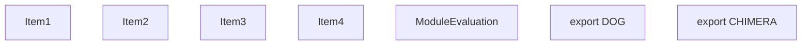
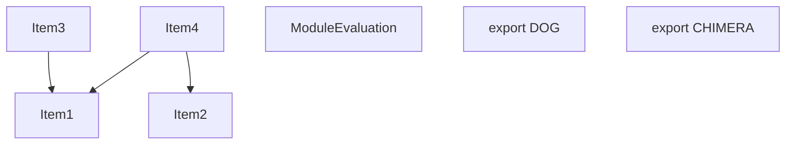
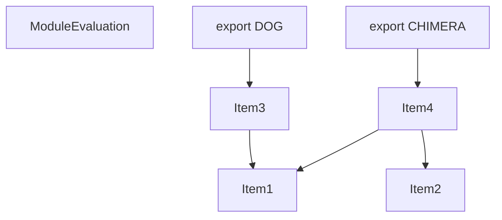

# Items

Count: 7

## Item 1: Stmt 0, `VarDeclarator(0)`

```js
const dog = "dog";

```

- Declares: `dog`
- Write: `dog`

## Item 2: Stmt 1, `VarDeclarator(0)`

```js
const cat = "cat";

```

- Declares: `cat`
- Write: `cat`

## Item 3: Stmt 2, `VarDeclarator(0)`

```js
export const DOG = dog;

```

- Declares: `DOG`
- Reads: `dog`
- Write: `DOG`

## Item 4: Stmt 3, `VarDeclarator(0)`

```js
export const CHIMERA = cat + dog;

```

- Declares: `CHIMERA`
- Reads: `cat`, `dog`
- Write: `CHIMERA`

# Phase 1

# Phase 2

# Phase 3

# Phase 4

# Final
```mermaid
graph TD
    N0["Items: [ItemId(ModuleEvaluation)]"];
    N1["Items: [ItemId(Export((\"DOG\", #0))), ItemId(2, VarDeclarator(0))]"];
    N2["Items: [ItemId(Export((\"CHIMERA\", #0))), ItemId(1, VarDeclarator(0)), ItemId(3, VarDeclarator(0))]"];
    N3["Items: [ItemId(0, VarDeclarator(0))]"];
    N1 --> N3;
    N2 --> N3;
```
# Modules (dev)
## Part 0
```js
"module evaluation";

```
## Part 1
```js
import { dog } from "entry.js" assert {
    __turbopack_chunk__: 3
};
export { DOG };
const DOG = dog;
export { DOG };

```
## Part 2
```js
import { dog } from "entry.js" assert {
    __turbopack_chunk__: 3
};
export { CHIMERA };
const cat = "cat";
const CHIMERA = cat + dog;
export { cat };
export { CHIMERA };

```
## Part 3
```js
const dog = "dog";
export { dog };

```
## Merged (module eval)
```js
"module evaluation";

```
# Modules (prod)
## Part 0
```js
"module evaluation";

```
## Part 1
```js
import { dog } from "entry.js" assert {
    __turbopack_chunk__: 3
};
export { DOG };
const DOG = dog;
export { DOG };

```
## Part 2
```js
import { dog } from "entry.js" assert {
    __turbopack_chunk__: 3
};
export { CHIMERA };
const cat = "cat";
const CHIMERA = cat + dog;
export { cat };
export { CHIMERA };

```
## Part 3
```js
const dog = "dog";
export { dog };

```
## Merged (module eval)
```js
"module evaluation";

```
