# Items

Count: 37

## Item 1: Stmt 0, `ImportOfModule`

```js
import { PagesRouteModule } from '../../server/future/route-modules/pages/module.compiled';

```

- Hoisted
- Side effects

## Item 2: Stmt 0, `ImportBinding(0)`

```js
import { PagesRouteModule } from '../../server/future/route-modules/pages/module.compiled';

```

- Hoisted
- Declares: `PagesRouteModule`

## Item 3: Stmt 1, `ImportOfModule`

```js
import { RouteKind } from '../../server/future/route-kind';

```

- Hoisted
- Side effects

## Item 4: Stmt 1, `ImportBinding(0)`

```js
import { RouteKind } from '../../server/future/route-kind';

```

- Hoisted
- Declares: `RouteKind`

## Item 5: Stmt 2, `ImportOfModule`

```js
import { hoist } from './helpers';

```

- Hoisted
- Side effects

## Item 6: Stmt 2, `ImportBinding(0)`

```js
import { hoist } from './helpers';

```

- Hoisted
- Declares: `hoist`

## Item 7: Stmt 3, `ImportOfModule`

```js
import Document from 'VAR_MODULE_DOCUMENT';

```

- Hoisted
- Side effects

## Item 8: Stmt 3, `ImportBinding(0)`

```js
import Document from 'VAR_MODULE_DOCUMENT';

```

- Hoisted
- Declares: `Document`

## Item 9: Stmt 4, `ImportOfModule`

```js
import App from 'VAR_MODULE_APP';

```

- Hoisted
- Side effects

## Item 10: Stmt 4, `ImportBinding(0)`

```js
import App from 'VAR_MODULE_APP';

```

- Hoisted
- Declares: `App`

## Item 11: Stmt 5, `ImportOfModule`

```js
import * as userland from 'VAR_USERLAND';

```

- Hoisted
- Side effects

## Item 12: Stmt 5, `ImportBinding(0)`

```js
import * as userland from 'VAR_USERLAND';

```

- Hoisted
- Declares: `userland`

## Item 13: Stmt 6, `Normal`

```js
export default hoist(userland, 'default');

```

- Side effects
- Declares: `__TURBOPACK__default__export__`
- Reads: `hoist`, `userland`
- Write: `__TURBOPACK__default__export__`

## Item 14: Stmt 7, `VarDeclarator(0)`

```js
export const getStaticProps = hoist(userland, 'getStaticProps');

```

- Declares: `getStaticProps`
- Reads: `hoist`, `userland`
- Write: `getStaticProps`

## Item 15: Stmt 8, `VarDeclarator(0)`

```js
export const getStaticPaths = hoist(userland, 'getStaticPaths');

```

- Declares: `getStaticPaths`
- Reads: `hoist`, `userland`
- Write: `getStaticPaths`

## Item 16: Stmt 9, `VarDeclarator(0)`

```js
export const getServerSideProps = hoist(userland, 'getServerSideProps');

```

- Declares: `getServerSideProps`
- Reads: `hoist`, `userland`
- Write: `getServerSideProps`

## Item 17: Stmt 10, `VarDeclarator(0)`

```js
export const config = hoist(userland, 'config');

```

- Declares: `config`
- Reads: `hoist`, `userland`
- Write: `config`

## Item 18: Stmt 11, `VarDeclarator(0)`

```js
export const reportWebVitals = hoist(userland, 'reportWebVitals');

```

- Declares: `reportWebVitals`
- Reads: `hoist`, `userland`
- Write: `reportWebVitals`

## Item 19: Stmt 12, `VarDeclarator(0)`

```js
export const unstable_getStaticProps = hoist(userland, 'unstable_getStaticProps');

```

- Declares: `unstable_getStaticProps`
- Reads: `hoist`, `userland`
- Write: `unstable_getStaticProps`

## Item 20: Stmt 13, `VarDeclarator(0)`

```js
export const unstable_getStaticPaths = hoist(userland, 'unstable_getStaticPaths');

```

- Declares: `unstable_getStaticPaths`
- Reads: `hoist`, `userland`
- Write: `unstable_getStaticPaths`

## Item 21: Stmt 14, `VarDeclarator(0)`

```js
export const unstable_getStaticParams = hoist(userland, 'unstable_getStaticParams');

```

- Declares: `unstable_getStaticParams`
- Reads: `hoist`, `userland`
- Write: `unstable_getStaticParams`

## Item 22: Stmt 15, `VarDeclarator(0)`

```js
export const unstable_getServerProps = hoist(userland, 'unstable_getServerProps');

```

- Declares: `unstable_getServerProps`
- Reads: `hoist`, `userland`
- Write: `unstable_getServerProps`

## Item 23: Stmt 16, `VarDeclarator(0)`

```js
export const unstable_getServerSideProps = hoist(userland, 'unstable_getServerSideProps');

```

- Declares: `unstable_getServerSideProps`
- Reads: `hoist`, `userland`
- Write: `unstable_getServerSideProps`

## Item 24: Stmt 17, `VarDeclarator(0)`

```js
export const routeModule = new PagesRouteModule({
    definition: {
        kind: RouteKind.PAGES,
        page: 'VAR_DEFINITION_PAGE',
        pathname: 'VAR_DEFINITION_PATHNAME',
        bundlePath: '',
        filename: ''
    },
    components: {
        App,
        Document
    },
    userland
});

```

- Declares: `routeModule`
- Reads: `PagesRouteModule`, `RouteKind`, `App`, `Document`, `userland`
- Write: `RouteKind`, `App`, `Document`, `userland`, `routeModule`

# Phase 1

```mermaid
graph TD
    Item1;
    Item7;
    Item2;
    Item8;
    Item3;
    Item9;
    Item4;
    Item10;
    Item5;
    Item11;
    Item6;
    Item12;
    Item13;
    Item14;
    Item15;
    Item16;
    Item17;
    Item18;
    Item19;
    Item20;
    Item21;
    Item22;
    Item23;
    Item24;
    Item25;
    Item25["ModuleEvaluation"];
    Item26;
    Item26["export default"];
    Item27;
    Item27["export getStaticProps"];
    Item28;
    Item28["export getStaticPaths"];
    Item29;
    Item29["export getServerSideProps"];
    Item30;
    Item30["export config"];
    Item31;
    Item31["export reportWebVitals"];
    Item32;
    Item32["export unstable_getStaticProps"];
    Item33;
    Item33["export unstable_getStaticPaths"];
    Item34;
    Item34["export unstable_getStaticParams"];
    Item35;
    Item35["export unstable_getServerProps"];
    Item36;
    Item36["export unstable_getServerSideProps"];
    Item37;
    Item37["export routeModule"];
    Item2 --> Item1;
    Item3 --> Item1;
    Item3 --> Item2;
    Item4 --> Item1;
    Item4 --> Item2;
    Item4 --> Item3;
    Item5 --> Item1;
    Item5 --> Item2;
    Item5 --> Item3;
    Item5 --> Item4;
    Item6 --> Item1;
    Item6 --> Item2;
    Item6 --> Item3;
    Item6 --> Item4;
    Item6 --> Item5;
```

# Phase 2

```mermaid
graph TD
    Item1;
    Item7;
    Item2;
    Item8;
    Item3;
    Item9;
    Item4;
    Item10;
    Item5;
    Item11;
    Item6;
    Item12;
    Item13;
    Item14;
    Item15;
    Item16;
    Item17;
    Item18;
    Item19;
    Item20;
    Item21;
    Item22;
    Item23;
    Item24;
    Item25;
    Item25["ModuleEvaluation"];
    Item26;
    Item26["export default"];
    Item27;
    Item27["export getStaticProps"];
    Item28;
    Item28["export getStaticPaths"];
    Item29;
    Item29["export getServerSideProps"];
    Item30;
    Item30["export config"];
    Item31;
    Item31["export reportWebVitals"];
    Item32;
    Item32["export unstable_getStaticProps"];
    Item33;
    Item33["export unstable_getStaticPaths"];
    Item34;
    Item34["export unstable_getStaticParams"];
    Item35;
    Item35["export unstable_getServerProps"];
    Item36;
    Item36["export unstable_getServerSideProps"];
    Item37;
    Item37["export routeModule"];
    Item2 --> Item1;
    Item3 --> Item1;
    Item3 --> Item2;
    Item4 --> Item1;
    Item4 --> Item2;
    Item4 --> Item3;
    Item5 --> Item1;
    Item5 --> Item2;
    Item5 --> Item3;
    Item5 --> Item4;
    Item6 --> Item1;
    Item6 --> Item2;
    Item6 --> Item3;
    Item6 --> Item4;
    Item6 --> Item5;
    Item13 --> Item9;
    Item13 --> Item12;
    Item13 --> Item1;
    Item13 --> Item2;
    Item13 --> Item3;
    Item13 --> Item4;
    Item13 --> Item5;
    Item13 --> Item6;
    Item14 --> Item9;
    Item14 --> Item12;
    Item15 --> Item9;
    Item15 --> Item12;
    Item16 --> Item9;
    Item16 --> Item12;
    Item17 --> Item9;
    Item17 --> Item12;
    Item18 --> Item9;
    Item18 --> Item12;
    Item19 --> Item9;
    Item19 --> Item12;
    Item20 --> Item9;
    Item20 --> Item12;
    Item21 --> Item9;
    Item21 --> Item12;
    Item22 --> Item9;
    Item22 --> Item12;
    Item23 --> Item9;
    Item23 --> Item12;
    Item24 --> Item7;
    Item24 --> Item8;
    Item24 --> Item11;
    Item24 --> Item10;
    Item24 --> Item12;
    Item24 -.-> Item13;
    Item24 -.-> Item14;
    Item24 -.-> Item15;
    Item24 -.-> Item16;
    Item24 -.-> Item17;
    Item24 -.-> Item18;
    Item24 -.-> Item19;
    Item24 -.-> Item20;
    Item24 -.-> Item21;
    Item24 -.-> Item22;
    Item24 -.-> Item23;
    Item26 --> Item13;
    Item27 --> Item14;
    Item28 --> Item15;
    Item29 --> Item16;
    Item30 --> Item17;
    Item31 --> Item18;
    Item32 --> Item19;
    Item33 --> Item20;
    Item34 --> Item21;
    Item35 --> Item22;
    Item36 --> Item23;
    Item37 --> Item24;
```

# Phase 3

# Phase 4

```mermaid
graph TD
    Item1;
    Item7;
    Item2;
    Item8;
    Item3;
    Item9;
    Item4;
    Item10;
    Item5;
    Item11;
    Item6;
    Item12;
    Item13;
    Item14;
    Item15;
    Item16;
    Item17;
    Item18;
    Item19;
    Item20;
    Item21;
    Item22;
    Item23;
    Item24;
    Item25;
    Item25["ModuleEvaluation"];
    Item26;
    Item26["export default"];
    Item27;
    Item27["export getStaticProps"];
    Item28;
    Item28["export getStaticPaths"];
    Item29;
    Item29["export getServerSideProps"];
    Item30;
    Item30["export config"];
    Item31;
    Item31["export reportWebVitals"];
    Item32;
    Item32["export unstable_getStaticProps"];
    Item33;
    Item33["export unstable_getStaticPaths"];
    Item34;
    Item34["export unstable_getStaticParams"];
    Item35;
    Item35["export unstable_getServerProps"];
    Item36;
    Item36["export unstable_getServerSideProps"];
    Item37;
    Item37["export routeModule"];
    Item2 --> Item1;
    Item3 --> Item1;
    Item3 --> Item2;
    Item4 --> Item1;
    Item4 --> Item2;
    Item4 --> Item3;
    Item5 --> Item1;
    Item5 --> Item2;
    Item5 --> Item3;
    Item5 --> Item4;
    Item6 --> Item1;
    Item6 --> Item2;
    Item6 --> Item3;
    Item6 --> Item4;
    Item6 --> Item5;
    Item13 --> Item9;
    Item13 --> Item12;
    Item13 --> Item1;
    Item13 --> Item2;
    Item13 --> Item3;
    Item13 --> Item4;
    Item13 --> Item5;
    Item13 --> Item6;
    Item14 --> Item9;
    Item14 --> Item12;
    Item15 --> Item9;
    Item15 --> Item12;
    Item16 --> Item9;
    Item16 --> Item12;
    Item17 --> Item9;
    Item17 --> Item12;
    Item18 --> Item9;
    Item18 --> Item12;
    Item19 --> Item9;
    Item19 --> Item12;
    Item20 --> Item9;
    Item20 --> Item12;
    Item21 --> Item9;
    Item21 --> Item12;
    Item22 --> Item9;
    Item22 --> Item12;
    Item23 --> Item9;
    Item23 --> Item12;
    Item24 --> Item7;
    Item24 --> Item8;
    Item24 --> Item11;
    Item24 --> Item10;
    Item24 --> Item12;
    Item24 -.-> Item13;
    Item24 -.-> Item14;
    Item24 -.-> Item15;
    Item24 -.-> Item16;
    Item24 -.-> Item17;
    Item24 -.-> Item18;
    Item24 -.-> Item19;
    Item24 -.-> Item20;
    Item24 -.-> Item21;
    Item24 -.-> Item22;
    Item24 -.-> Item23;
    Item26 --> Item13;
    Item27 --> Item14;
    Item28 --> Item15;
    Item29 --> Item16;
    Item30 --> Item17;
    Item31 --> Item18;
    Item32 --> Item19;
    Item33 --> Item20;
    Item34 --> Item21;
    Item35 --> Item22;
    Item36 --> Item23;
    Item37 --> Item24;
    Item25 --> Item1;
    Item25 --> Item2;
    Item25 --> Item3;
    Item25 --> Item4;
    Item25 --> Item5;
    Item25 --> Item6;
    Item25 --> Item13;
```

# Final

```mermaid
graph TD
    N0["Items: [ItemId(3, ImportBinding(0))]"];
    N1["Items: [ItemId(4, ImportBinding(0))]"];
    N2["Items: [ItemId(1, ImportBinding(0))]"];
    N3["Items: [ItemId(0, ImportBinding(0))]"];
    N4["Items: [ItemId(5, ImportBinding(0))]"];
    N5["Items: [ItemId(2, ImportBinding(0))]"];
    N6["Items: [ItemId(16, VarDeclarator(0))]"];
    N7["Items: [ItemId(Export((&quot;unstable_getServerSideProps&quot;, #2), &quot;unstable_getServerSideProps&quot;))]"];
    N8["Items: [ItemId(15, VarDeclarator(0))]"];
    N9["Items: [ItemId(Export((&quot;unstable_getServerProps&quot;, #2), &quot;unstable_getServerProps&quot;))]"];
    N10["Items: [ItemId(14, VarDeclarator(0))]"];
    N11["Items: [ItemId(Export((&quot;unstable_getStaticParams&quot;, #2), &quot;unstable_getStaticParams&quot;))]"];
    N12["Items: [ItemId(13, VarDeclarator(0))]"];
    N13["Items: [ItemId(Export((&quot;unstable_getStaticPaths&quot;, #2), &quot;unstable_getStaticPaths&quot;))]"];
    N14["Items: [ItemId(12, VarDeclarator(0))]"];
    N15["Items: [ItemId(Export((&quot;unstable_getStaticProps&quot;, #2), &quot;unstable_getStaticProps&quot;))]"];
    N16["Items: [ItemId(11, VarDeclarator(0))]"];
    N17["Items: [ItemId(Export((&quot;reportWebVitals&quot;, #2), &quot;reportWebVitals&quot;))]"];
    N18["Items: [ItemId(10, VarDeclarator(0))]"];
    N19["Items: [ItemId(Export((&quot;config&quot;, #2), &quot;config&quot;))]"];
    N20["Items: [ItemId(9, VarDeclarator(0))]"];
    N21["Items: [ItemId(Export((&quot;getServerSideProps&quot;, #2), &quot;getServerSideProps&quot;))]"];
    N22["Items: [ItemId(8, VarDeclarator(0))]"];
    N23["Items: [ItemId(Export((&quot;getStaticPaths&quot;, #2), &quot;getStaticPaths&quot;))]"];
    N24["Items: [ItemId(7, VarDeclarator(0))]"];
    N25["Items: [ItemId(Export((&quot;getStaticProps&quot;, #2), &quot;getStaticProps&quot;))]"];
    N26["Items: [ItemId(0, ImportOfModule)]"];
    N27["Items: [ItemId(1, ImportOfModule)]"];
    N28["Items: [ItemId(2, ImportOfModule)]"];
    N29["Items: [ItemId(3, ImportOfModule)]"];
    N30["Items: [ItemId(4, ImportOfModule)]"];
    N31["Items: [ItemId(5, ImportOfModule)]"];
    N32["Items: [ItemId(6, Normal)]"];
    N33["Items: [ItemId(ModuleEvaluation)]"];
    N34["Items: [ItemId(Export((&quot;__TURBOPACK__default__export__&quot;, #3), &quot;default&quot;))]"];
    N35["Items: [ItemId(17, VarDeclarator(0))]"];
    N36["Items: [ItemId(Export((&quot;routeModule&quot;, #2), &quot;routeModule&quot;))]"];
    N27 --> N26;
    N28 --> N26;
    N28 --> N27;
    N29 --> N26;
    N29 --> N27;
    N29 --> N28;
    N30 --> N26;
    N30 --> N27;
    N30 --> N28;
    N30 --> N29;
    N31 --> N26;
    N31 --> N27;
    N31 --> N28;
    N31 --> N29;
    N31 --> N30;
    N32 --> N5;
    N32 --> N4;
    N32 --> N26;
    N32 --> N27;
    N32 --> N28;
    N32 --> N29;
    N32 --> N30;
    N32 --> N31;
    N24 --> N5;
    N24 --> N4;
    N22 --> N5;
    N22 --> N4;
    N20 --> N5;
    N20 --> N4;
    N18 --> N5;
    N18 --> N4;
    N16 --> N5;
    N16 --> N4;
    N14 --> N5;
    N14 --> N4;
    N12 --> N5;
    N12 --> N4;
    N10 --> N5;
    N10 --> N4;
    N8 --> N5;
    N8 --> N4;
    N6 --> N5;
    N6 --> N4;
    N35 --> N3;
    N35 --> N2;
    N35 --> N1;
    N35 --> N0;
    N35 --> N4;
    N35 -.-> N32;
    N35 -.-> N24;
    N35 -.-> N22;
    N35 -.-> N20;
    N35 -.-> N18;
    N35 -.-> N16;
    N35 -.-> N14;
    N35 -.-> N12;
    N35 -.-> N10;
    N35 -.-> N8;
    N35 -.-> N6;
    N34 --> N32;
    N25 --> N24;
    N23 --> N22;
    N21 --> N20;
    N19 --> N18;
    N17 --> N16;
    N15 --> N14;
    N13 --> N12;
    N11 --> N10;
    N9 --> N8;
    N7 --> N6;
    N36 --> N35;
    N33 --> N26;
    N33 --> N27;
    N33 --> N28;
    N33 --> N29;
    N33 --> N30;
    N33 --> N31;
    N33 --> N32;
```

# Entrypoints

```
{
    Export(
        "unstable_getServerSideProps",
    ): 7,
    ModuleEvaluation: 33,
    Export(
        "default",
    ): 34,
    Export(
        "unstable_getServerProps",
    ): 9,
    Export(
        "reportWebVitals",
    ): 17,
    Export(
        "routeModule",
    ): 36,
    Export(
        "unstable_getStaticParams",
    ): 11,
    Export(
        "config",
    ): 19,
    Export(
        "getStaticProps",
    ): 25,
    Export(
        "unstable_getStaticProps",
    ): 15,
    Exports: 37,
    Export(
        "unstable_getStaticPaths",
    ): 13,
    Export(
        "getServerSideProps",
    ): 21,
    Export(
        "getStaticPaths",
    ): 23,
}
```


# Modules (dev)
## Part 0
```js
import Document from 'VAR_MODULE_DOCUMENT';
export { Document } from "__TURBOPACK_VAR__" assert {
    __turbopack_var__: true
};

```
## Part 1
```js
import App from 'VAR_MODULE_APP';
export { App } from "__TURBOPACK_VAR__" assert {
    __turbopack_var__: true
};

```
## Part 2
```js
import { RouteKind } from '../../server/future/route-kind';
export { RouteKind } from "__TURBOPACK_VAR__" assert {
    __turbopack_var__: true
};

```
## Part 3
```js
import { PagesRouteModule } from '../../server/future/route-modules/pages/module.compiled';
export { PagesRouteModule } from "__TURBOPACK_VAR__" assert {
    __turbopack_var__: true
};

```
## Part 4
```js
import * as userland from 'VAR_USERLAND';
export { userland } from "__TURBOPACK_VAR__" assert {
    __turbopack_var__: true
};

```
## Part 5
```js
import { hoist } from './helpers';
export { hoist } from "__TURBOPACK_VAR__" assert {
    __turbopack_var__: true
};

```
## Part 6
```js
import "__TURBOPACK_PART__" assert {
    __turbopack_part__: 5
};
import "__TURBOPACK_PART__" assert {
    __turbopack_part__: 4
};
import { hoist } from "__TURBOPACK_PART__" assert {
    __turbopack_part__: 5
};
import { userland } from "__TURBOPACK_PART__" assert {
    __turbopack_part__: 4
};
const unstable_getServerSideProps = hoist(userland, 'unstable_getServerSideProps');
export { unstable_getServerSideProps } from "__TURBOPACK_VAR__" assert {
    __turbopack_var__: true
};

```
## Part 7
```js
import "__TURBOPACK_PART__" assert {
    __turbopack_part__: 6
};
import { unstable_getServerSideProps } from "__TURBOPACK_PART__" assert {
    __turbopack_part__: 6
};
export { unstable_getServerSideProps };

```
## Part 8
```js
import "__TURBOPACK_PART__" assert {
    __turbopack_part__: 5
};
import "__TURBOPACK_PART__" assert {
    __turbopack_part__: 4
};
import { hoist } from "__TURBOPACK_PART__" assert {
    __turbopack_part__: 5
};
import { userland } from "__TURBOPACK_PART__" assert {
    __turbopack_part__: 4
};
const unstable_getServerProps = hoist(userland, 'unstable_getServerProps');
export { unstable_getServerProps } from "__TURBOPACK_VAR__" assert {
    __turbopack_var__: true
};

```
## Part 9
```js
import "__TURBOPACK_PART__" assert {
    __turbopack_part__: 8
};
import { unstable_getServerProps } from "__TURBOPACK_PART__" assert {
    __turbopack_part__: 8
};
export { unstable_getServerProps };

```
## Part 10
```js
import "__TURBOPACK_PART__" assert {
    __turbopack_part__: 5
};
import "__TURBOPACK_PART__" assert {
    __turbopack_part__: 4
};
import { hoist } from "__TURBOPACK_PART__" assert {
    __turbopack_part__: 5
};
import { userland } from "__TURBOPACK_PART__" assert {
    __turbopack_part__: 4
};
const unstable_getStaticParams = hoist(userland, 'unstable_getStaticParams');
export { unstable_getStaticParams } from "__TURBOPACK_VAR__" assert {
    __turbopack_var__: true
};

```
## Part 11
```js
import "__TURBOPACK_PART__" assert {
    __turbopack_part__: 10
};
import { unstable_getStaticParams } from "__TURBOPACK_PART__" assert {
    __turbopack_part__: 10
};
export { unstable_getStaticParams };

```
## Part 12
```js
import "__TURBOPACK_PART__" assert {
    __turbopack_part__: 5
};
import "__TURBOPACK_PART__" assert {
    __turbopack_part__: 4
};
import { hoist } from "__TURBOPACK_PART__" assert {
    __turbopack_part__: 5
};
import { userland } from "__TURBOPACK_PART__" assert {
    __turbopack_part__: 4
};
const unstable_getStaticPaths = hoist(userland, 'unstable_getStaticPaths');
export { unstable_getStaticPaths } from "__TURBOPACK_VAR__" assert {
    __turbopack_var__: true
};

```
## Part 13
```js
import "__TURBOPACK_PART__" assert {
    __turbopack_part__: 12
};
import { unstable_getStaticPaths } from "__TURBOPACK_PART__" assert {
    __turbopack_part__: 12
};
export { unstable_getStaticPaths };

```
## Part 14
```js
import "__TURBOPACK_PART__" assert {
    __turbopack_part__: 5
};
import "__TURBOPACK_PART__" assert {
    __turbopack_part__: 4
};
import { hoist } from "__TURBOPACK_PART__" assert {
    __turbopack_part__: 5
};
import { userland } from "__TURBOPACK_PART__" assert {
    __turbopack_part__: 4
};
const unstable_getStaticProps = hoist(userland, 'unstable_getStaticProps');
export { unstable_getStaticProps } from "__TURBOPACK_VAR__" assert {
    __turbopack_var__: true
};

```
## Part 15
```js
import "__TURBOPACK_PART__" assert {
    __turbopack_part__: 14
};
import { unstable_getStaticProps } from "__TURBOPACK_PART__" assert {
    __turbopack_part__: 14
};
export { unstable_getStaticProps };

```
## Part 16
```js
import "__TURBOPACK_PART__" assert {
    __turbopack_part__: 5
};
import "__TURBOPACK_PART__" assert {
    __turbopack_part__: 4
};
import { hoist } from "__TURBOPACK_PART__" assert {
    __turbopack_part__: 5
};
import { userland } from "__TURBOPACK_PART__" assert {
    __turbopack_part__: 4
};
const reportWebVitals = hoist(userland, 'reportWebVitals');
export { reportWebVitals } from "__TURBOPACK_VAR__" assert {
    __turbopack_var__: true
};

```
## Part 17
```js
import "__TURBOPACK_PART__" assert {
    __turbopack_part__: 16
};
import { reportWebVitals } from "__TURBOPACK_PART__" assert {
    __turbopack_part__: 16
};
export { reportWebVitals };

```
## Part 18
```js
import "__TURBOPACK_PART__" assert {
    __turbopack_part__: 5
};
import "__TURBOPACK_PART__" assert {
    __turbopack_part__: 4
};
import { hoist } from "__TURBOPACK_PART__" assert {
    __turbopack_part__: 5
};
import { userland } from "__TURBOPACK_PART__" assert {
    __turbopack_part__: 4
};
const config = hoist(userland, 'config');
export { config } from "__TURBOPACK_VAR__" assert {
    __turbopack_var__: true
};

```
## Part 19
```js
import "__TURBOPACK_PART__" assert {
    __turbopack_part__: 18
};
import { config } from "__TURBOPACK_PART__" assert {
    __turbopack_part__: 18
};
export { config };

```
## Part 20
```js
import "__TURBOPACK_PART__" assert {
    __turbopack_part__: 5
};
import "__TURBOPACK_PART__" assert {
    __turbopack_part__: 4
};
import { hoist } from "__TURBOPACK_PART__" assert {
    __turbopack_part__: 5
};
import { userland } from "__TURBOPACK_PART__" assert {
    __turbopack_part__: 4
};
const getServerSideProps = hoist(userland, 'getServerSideProps');
export { getServerSideProps } from "__TURBOPACK_VAR__" assert {
    __turbopack_var__: true
};

```
## Part 21
```js
import "__TURBOPACK_PART__" assert {
    __turbopack_part__: 20
};
import { getServerSideProps } from "__TURBOPACK_PART__" assert {
    __turbopack_part__: 20
};
export { getServerSideProps };

```
## Part 22
```js
import "__TURBOPACK_PART__" assert {
    __turbopack_part__: 5
};
import "__TURBOPACK_PART__" assert {
    __turbopack_part__: 4
};
import { hoist } from "__TURBOPACK_PART__" assert {
    __turbopack_part__: 5
};
import { userland } from "__TURBOPACK_PART__" assert {
    __turbopack_part__: 4
};
const getStaticPaths = hoist(userland, 'getStaticPaths');
export { getStaticPaths } from "__TURBOPACK_VAR__" assert {
    __turbopack_var__: true
};

```
## Part 23
```js
import "__TURBOPACK_PART__" assert {
    __turbopack_part__: 22
};
import { getStaticPaths } from "__TURBOPACK_PART__" assert {
    __turbopack_part__: 22
};
export { getStaticPaths };

```
## Part 24
```js
import "__TURBOPACK_PART__" assert {
    __turbopack_part__: 5
};
import "__TURBOPACK_PART__" assert {
    __turbopack_part__: 4
};
import { hoist } from "__TURBOPACK_PART__" assert {
    __turbopack_part__: 5
};
import { userland } from "__TURBOPACK_PART__" assert {
    __turbopack_part__: 4
};
const getStaticProps = hoist(userland, 'getStaticProps');
export { getStaticProps } from "__TURBOPACK_VAR__" assert {
    __turbopack_var__: true
};

```
## Part 25
```js
import "__TURBOPACK_PART__" assert {
    __turbopack_part__: 24
};
import { getStaticProps } from "__TURBOPACK_PART__" assert {
    __turbopack_part__: 24
};
export { getStaticProps };

```
## Part 26
```js
import '../../server/future/route-modules/pages/module.compiled';

```
## Part 27
```js
import "__TURBOPACK_PART__" assert {
    __turbopack_part__: 26
};
import '../../server/future/route-kind';

```
## Part 28
```js
import "__TURBOPACK_PART__" assert {
    __turbopack_part__: 26
};
import "__TURBOPACK_PART__" assert {
    __turbopack_part__: 27
};
import './helpers';

```
## Part 29
```js
import "__TURBOPACK_PART__" assert {
    __turbopack_part__: 26
};
import "__TURBOPACK_PART__" assert {
    __turbopack_part__: 27
};
import "__TURBOPACK_PART__" assert {
    __turbopack_part__: 28
};
import 'VAR_MODULE_DOCUMENT';

```
## Part 30
```js
import "__TURBOPACK_PART__" assert {
    __turbopack_part__: 26
};
import "__TURBOPACK_PART__" assert {
    __turbopack_part__: 27
};
import "__TURBOPACK_PART__" assert {
    __turbopack_part__: 28
};
import "__TURBOPACK_PART__" assert {
    __turbopack_part__: 29
};
import 'VAR_MODULE_APP';

```
## Part 31
```js
import "__TURBOPACK_PART__" assert {
    __turbopack_part__: 26
};
import "__TURBOPACK_PART__" assert {
    __turbopack_part__: 27
};
import "__TURBOPACK_PART__" assert {
    __turbopack_part__: 28
};
import "__TURBOPACK_PART__" assert {
    __turbopack_part__: 29
};
import "__TURBOPACK_PART__" assert {
    __turbopack_part__: 30
};
import 'VAR_USERLAND';

```
## Part 32
```js
import "__TURBOPACK_PART__" assert {
    __turbopack_part__: 5
};
import "__TURBOPACK_PART__" assert {
    __turbopack_part__: 4
};
import "__TURBOPACK_PART__" assert {
    __turbopack_part__: 26
};
import "__TURBOPACK_PART__" assert {
    __turbopack_part__: 27
};
import "__TURBOPACK_PART__" assert {
    __turbopack_part__: 28
};
import "__TURBOPACK_PART__" assert {
    __turbopack_part__: 29
};
import "__TURBOPACK_PART__" assert {
    __turbopack_part__: 30
};
import "__TURBOPACK_PART__" assert {
    __turbopack_part__: 31
};
import { hoist } from "__TURBOPACK_PART__" assert {
    __turbopack_part__: 5
};
import { userland } from "__TURBOPACK_PART__" assert {
    __turbopack_part__: 4
};
const __TURBOPACK__default__export__ = hoist(userland, 'default');
export { __TURBOPACK__default__export__ } from "__TURBOPACK_VAR__" assert {
    __turbopack_var__: true
};

```
## Part 33
```js
import "__TURBOPACK_PART__" assert {
    __turbopack_part__: 26
};
import "__TURBOPACK_PART__" assert {
    __turbopack_part__: 27
};
import "__TURBOPACK_PART__" assert {
    __turbopack_part__: 28
};
import "__TURBOPACK_PART__" assert {
    __turbopack_part__: 29
};
import "__TURBOPACK_PART__" assert {
    __turbopack_part__: 30
};
import "__TURBOPACK_PART__" assert {
    __turbopack_part__: 31
};
import "__TURBOPACK_PART__" assert {
    __turbopack_part__: 32
};
"module evaluation";

```
## Part 34
```js
import "__TURBOPACK_PART__" assert {
    __turbopack_part__: 32
};
import { __TURBOPACK__default__export__ } from "__TURBOPACK_PART__" assert {
    __turbopack_part__: 32
};
export { __TURBOPACK__default__export__ as default };

```
## Part 35
```js
import "__TURBOPACK_PART__" assert {
    __turbopack_part__: 3
};
import "__TURBOPACK_PART__" assert {
    __turbopack_part__: 2
};
import "__TURBOPACK_PART__" assert {
    __turbopack_part__: 1
};
import "__TURBOPACK_PART__" assert {
    __turbopack_part__: 0
};
import "__TURBOPACK_PART__" assert {
    __turbopack_part__: 4
};
import "__TURBOPACK_PART__" assert {
    __turbopack_part__: 32
};
import "__TURBOPACK_PART__" assert {
    __turbopack_part__: 24
};
import "__TURBOPACK_PART__" assert {
    __turbopack_part__: 22
};
import "__TURBOPACK_PART__" assert {
    __turbopack_part__: 20
};
import "__TURBOPACK_PART__" assert {
    __turbopack_part__: 18
};
import "__TURBOPACK_PART__" assert {
    __turbopack_part__: 16
};
import "__TURBOPACK_PART__" assert {
    __turbopack_part__: 14
};
import "__TURBOPACK_PART__" assert {
    __turbopack_part__: 12
};
import "__TURBOPACK_PART__" assert {
    __turbopack_part__: 10
};
import "__TURBOPACK_PART__" assert {
    __turbopack_part__: 8
};
import "__TURBOPACK_PART__" assert {
    __turbopack_part__: 6
};
import { PagesRouteModule } from "__TURBOPACK_PART__" assert {
    __turbopack_part__: 3
};
import { RouteKind } from "__TURBOPACK_PART__" assert {
    __turbopack_part__: 2
};
import { App } from "__TURBOPACK_PART__" assert {
    __turbopack_part__: 1
};
import { Document } from "__TURBOPACK_PART__" assert {
    __turbopack_part__: 0
};
import { userland } from "__TURBOPACK_PART__" assert {
    __turbopack_part__: 4
};
const routeModule = new PagesRouteModule({
    definition: {
        kind: RouteKind.PAGES,
        page: 'VAR_DEFINITION_PAGE',
        pathname: 'VAR_DEFINITION_PATHNAME',
        bundlePath: '',
        filename: ''
    },
    components: {
        App,
        Document
    },
    userland
});
export { routeModule } from "__TURBOPACK_VAR__" assert {
    __turbopack_var__: true
};

```
## Part 36
```js
import "__TURBOPACK_PART__" assert {
    __turbopack_part__: 35
};
import { routeModule } from "__TURBOPACK_PART__" assert {
    __turbopack_part__: 35
};
export { routeModule };

```
## Part 37
```js
export { unstable_getServerSideProps } from "__TURBOPACK_PART__" assert {
    __turbopack_part__: "export unstable_getServerSideProps"
};
export { unstable_getServerProps } from "__TURBOPACK_PART__" assert {
    __turbopack_part__: "export unstable_getServerProps"
};
export { unstable_getStaticParams } from "__TURBOPACK_PART__" assert {
    __turbopack_part__: "export unstable_getStaticParams"
};
export { unstable_getStaticPaths } from "__TURBOPACK_PART__" assert {
    __turbopack_part__: "export unstable_getStaticPaths"
};
export { unstable_getStaticProps } from "__TURBOPACK_PART__" assert {
    __turbopack_part__: "export unstable_getStaticProps"
};
export { reportWebVitals } from "__TURBOPACK_PART__" assert {
    __turbopack_part__: "export reportWebVitals"
};
export { config } from "__TURBOPACK_PART__" assert {
    __turbopack_part__: "export config"
};
export { getServerSideProps } from "__TURBOPACK_PART__" assert {
    __turbopack_part__: "export getServerSideProps"
};
export { getStaticPaths } from "__TURBOPACK_PART__" assert {
    __turbopack_part__: "export getStaticPaths"
};
export { getStaticProps } from "__TURBOPACK_PART__" assert {
    __turbopack_part__: "export getStaticProps"
};
export { default } from "__TURBOPACK_PART__" assert {
    __turbopack_part__: "export default"
};
export { routeModule } from "__TURBOPACK_PART__" assert {
    __turbopack_part__: "export routeModule"
};

```
## Merged (module eval)
```js
import "__TURBOPACK_PART__" assert {
    __turbopack_part__: 26
};
import "__TURBOPACK_PART__" assert {
    __turbopack_part__: 27
};
import "__TURBOPACK_PART__" assert {
    __turbopack_part__: 28
};
import "__TURBOPACK_PART__" assert {
    __turbopack_part__: 29
};
import "__TURBOPACK_PART__" assert {
    __turbopack_part__: 30
};
import "__TURBOPACK_PART__" assert {
    __turbopack_part__: 31
};
import "__TURBOPACK_PART__" assert {
    __turbopack_part__: 32
};
"module evaluation";

```
# Entrypoints

```
{
    Export(
        "unstable_getServerSideProps",
    ): 9,
    Export(
        "default",
    ): 35,
    ModuleEvaluation: 36,
    Export(
        "unstable_getServerProps",
    ): 11,
    Export(
        "reportWebVitals",
    ): 19,
    Export(
        "routeModule",
    ): 6,
    Export(
        "unstable_getStaticParams",
    ): 13,
    Export(
        "config",
    ): 21,
    Export(
        "getStaticProps",
    ): 27,
    Export(
        "unstable_getStaticProps",
    ): 17,
    Exports: 37,
    Export(
        "unstable_getStaticPaths",
    ): 15,
    Export(
        "getServerSideProps",
    ): 23,
    Export(
        "getStaticPaths",
    ): 25,
}
```


# Modules (prod)
## Part 0
```js
import Document from 'VAR_MODULE_DOCUMENT';
export { Document } from "__TURBOPACK_VAR__" assert {
    __turbopack_var__: true
};

```
## Part 1
```js
import App from 'VAR_MODULE_APP';
export { App } from "__TURBOPACK_VAR__" assert {
    __turbopack_var__: true
};

```
## Part 2
```js
import { RouteKind } from '../../server/future/route-kind';
export { RouteKind } from "__TURBOPACK_VAR__" assert {
    __turbopack_var__: true
};

```
## Part 3
```js
import { PagesRouteModule } from '../../server/future/route-modules/pages/module.compiled';
export { PagesRouteModule } from "__TURBOPACK_VAR__" assert {
    __turbopack_var__: true
};

```
## Part 4
```js
import * as userland from 'VAR_USERLAND';
export { userland } from "__TURBOPACK_VAR__" assert {
    __turbopack_var__: true
};

```
## Part 5
```js
import "__TURBOPACK_PART__" assert {
    __turbopack_part__: 3
};
import "__TURBOPACK_PART__" assert {
    __turbopack_part__: 2
};
import "__TURBOPACK_PART__" assert {
    __turbopack_part__: 1
};
import "__TURBOPACK_PART__" assert {
    __turbopack_part__: 0
};
import "__TURBOPACK_PART__" assert {
    __turbopack_part__: 4
};
import { PagesRouteModule } from "__TURBOPACK_PART__" assert {
    __turbopack_part__: 3
};
import { RouteKind } from "__TURBOPACK_PART__" assert {
    __turbopack_part__: 2
};
import { App } from "__TURBOPACK_PART__" assert {
    __turbopack_part__: 1
};
import { Document } from "__TURBOPACK_PART__" assert {
    __turbopack_part__: 0
};
import { userland } from "__TURBOPACK_PART__" assert {
    __turbopack_part__: 4
};
const routeModule = new PagesRouteModule({
    definition: {
        kind: RouteKind.PAGES,
        page: 'VAR_DEFINITION_PAGE',
        pathname: 'VAR_DEFINITION_PATHNAME',
        bundlePath: '',
        filename: ''
    },
    components: {
        App,
        Document
    },
    userland
});
export { routeModule } from "__TURBOPACK_VAR__" assert {
    __turbopack_var__: true
};

```
## Part 6
```js
import "__TURBOPACK_PART__" assert {
    __turbopack_part__: 5
};
import { routeModule } from "__TURBOPACK_PART__" assert {
    __turbopack_part__: 5
};
export { routeModule };

```
## Part 7
```js
import { hoist } from './helpers';
export { hoist } from "__TURBOPACK_VAR__" assert {
    __turbopack_var__: true
};

```
## Part 8
```js
import "__TURBOPACK_PART__" assert {
    __turbopack_part__: 7
};
import "__TURBOPACK_PART__" assert {
    __turbopack_part__: 4
};
import { hoist } from "__TURBOPACK_PART__" assert {
    __turbopack_part__: 7
};
import { userland } from "__TURBOPACK_PART__" assert {
    __turbopack_part__: 4
};
const unstable_getServerSideProps = hoist(userland, 'unstable_getServerSideProps');
export { unstable_getServerSideProps } from "__TURBOPACK_VAR__" assert {
    __turbopack_var__: true
};

```
## Part 9
```js
import "__TURBOPACK_PART__" assert {
    __turbopack_part__: 8
};
import { unstable_getServerSideProps } from "__TURBOPACK_PART__" assert {
    __turbopack_part__: 8
};
export { unstable_getServerSideProps };

```
## Part 10
```js
import "__TURBOPACK_PART__" assert {
    __turbopack_part__: 7
};
import "__TURBOPACK_PART__" assert {
    __turbopack_part__: 4
};
import { hoist } from "__TURBOPACK_PART__" assert {
    __turbopack_part__: 7
};
import { userland } from "__TURBOPACK_PART__" assert {
    __turbopack_part__: 4
};
const unstable_getServerProps = hoist(userland, 'unstable_getServerProps');
export { unstable_getServerProps } from "__TURBOPACK_VAR__" assert {
    __turbopack_var__: true
};

```
## Part 11
```js
import "__TURBOPACK_PART__" assert {
    __turbopack_part__: 10
};
import { unstable_getServerProps } from "__TURBOPACK_PART__" assert {
    __turbopack_part__: 10
};
export { unstable_getServerProps };

```
## Part 12
```js
import "__TURBOPACK_PART__" assert {
    __turbopack_part__: 7
};
import "__TURBOPACK_PART__" assert {
    __turbopack_part__: 4
};
import { hoist } from "__TURBOPACK_PART__" assert {
    __turbopack_part__: 7
};
import { userland } from "__TURBOPACK_PART__" assert {
    __turbopack_part__: 4
};
const unstable_getStaticParams = hoist(userland, 'unstable_getStaticParams');
export { unstable_getStaticParams } from "__TURBOPACK_VAR__" assert {
    __turbopack_var__: true
};

```
## Part 13
```js
import "__TURBOPACK_PART__" assert {
    __turbopack_part__: 12
};
import { unstable_getStaticParams } from "__TURBOPACK_PART__" assert {
    __turbopack_part__: 12
};
export { unstable_getStaticParams };

```
## Part 14
```js
import "__TURBOPACK_PART__" assert {
    __turbopack_part__: 7
};
import "__TURBOPACK_PART__" assert {
    __turbopack_part__: 4
};
import { hoist } from "__TURBOPACK_PART__" assert {
    __turbopack_part__: 7
};
import { userland } from "__TURBOPACK_PART__" assert {
    __turbopack_part__: 4
};
const unstable_getStaticPaths = hoist(userland, 'unstable_getStaticPaths');
export { unstable_getStaticPaths } from "__TURBOPACK_VAR__" assert {
    __turbopack_var__: true
};

```
## Part 15
```js
import "__TURBOPACK_PART__" assert {
    __turbopack_part__: 14
};
import { unstable_getStaticPaths } from "__TURBOPACK_PART__" assert {
    __turbopack_part__: 14
};
export { unstable_getStaticPaths };

```
## Part 16
```js
import "__TURBOPACK_PART__" assert {
    __turbopack_part__: 7
};
import "__TURBOPACK_PART__" assert {
    __turbopack_part__: 4
};
import { hoist } from "__TURBOPACK_PART__" assert {
    __turbopack_part__: 7
};
import { userland } from "__TURBOPACK_PART__" assert {
    __turbopack_part__: 4
};
const unstable_getStaticProps = hoist(userland, 'unstable_getStaticProps');
export { unstable_getStaticProps } from "__TURBOPACK_VAR__" assert {
    __turbopack_var__: true
};

```
## Part 17
```js
import "__TURBOPACK_PART__" assert {
    __turbopack_part__: 16
};
import { unstable_getStaticProps } from "__TURBOPACK_PART__" assert {
    __turbopack_part__: 16
};
export { unstable_getStaticProps };

```
## Part 18
```js
import "__TURBOPACK_PART__" assert {
    __turbopack_part__: 7
};
import "__TURBOPACK_PART__" assert {
    __turbopack_part__: 4
};
import { hoist } from "__TURBOPACK_PART__" assert {
    __turbopack_part__: 7
};
import { userland } from "__TURBOPACK_PART__" assert {
    __turbopack_part__: 4
};
const reportWebVitals = hoist(userland, 'reportWebVitals');
export { reportWebVitals } from "__TURBOPACK_VAR__" assert {
    __turbopack_var__: true
};

```
## Part 19
```js
import "__TURBOPACK_PART__" assert {
    __turbopack_part__: 18
};
import { reportWebVitals } from "__TURBOPACK_PART__" assert {
    __turbopack_part__: 18
};
export { reportWebVitals };

```
## Part 20
```js
import "__TURBOPACK_PART__" assert {
    __turbopack_part__: 7
};
import "__TURBOPACK_PART__" assert {
    __turbopack_part__: 4
};
import { hoist } from "__TURBOPACK_PART__" assert {
    __turbopack_part__: 7
};
import { userland } from "__TURBOPACK_PART__" assert {
    __turbopack_part__: 4
};
const config = hoist(userland, 'config');
export { config } from "__TURBOPACK_VAR__" assert {
    __turbopack_var__: true
};

```
## Part 21
```js
import "__TURBOPACK_PART__" assert {
    __turbopack_part__: 20
};
import { config } from "__TURBOPACK_PART__" assert {
    __turbopack_part__: 20
};
export { config };

```
## Part 22
```js
import "__TURBOPACK_PART__" assert {
    __turbopack_part__: 7
};
import "__TURBOPACK_PART__" assert {
    __turbopack_part__: 4
};
import { hoist } from "__TURBOPACK_PART__" assert {
    __turbopack_part__: 7
};
import { userland } from "__TURBOPACK_PART__" assert {
    __turbopack_part__: 4
};
const getServerSideProps = hoist(userland, 'getServerSideProps');
export { getServerSideProps } from "__TURBOPACK_VAR__" assert {
    __turbopack_var__: true
};

```
## Part 23
```js
import "__TURBOPACK_PART__" assert {
    __turbopack_part__: 22
};
import { getServerSideProps } from "__TURBOPACK_PART__" assert {
    __turbopack_part__: 22
};
export { getServerSideProps };

```
## Part 24
```js
import "__TURBOPACK_PART__" assert {
    __turbopack_part__: 7
};
import "__TURBOPACK_PART__" assert {
    __turbopack_part__: 4
};
import { hoist } from "__TURBOPACK_PART__" assert {
    __turbopack_part__: 7
};
import { userland } from "__TURBOPACK_PART__" assert {
    __turbopack_part__: 4
};
const getStaticPaths = hoist(userland, 'getStaticPaths');
export { getStaticPaths } from "__TURBOPACK_VAR__" assert {
    __turbopack_var__: true
};

```
## Part 25
```js
import "__TURBOPACK_PART__" assert {
    __turbopack_part__: 24
};
import { getStaticPaths } from "__TURBOPACK_PART__" assert {
    __turbopack_part__: 24
};
export { getStaticPaths };

```
## Part 26
```js
import "__TURBOPACK_PART__" assert {
    __turbopack_part__: 7
};
import "__TURBOPACK_PART__" assert {
    __turbopack_part__: 4
};
import { hoist } from "__TURBOPACK_PART__" assert {
    __turbopack_part__: 7
};
import { userland } from "__TURBOPACK_PART__" assert {
    __turbopack_part__: 4
};
const getStaticProps = hoist(userland, 'getStaticProps');
export { getStaticProps } from "__TURBOPACK_VAR__" assert {
    __turbopack_var__: true
};

```
## Part 27
```js
import "__TURBOPACK_PART__" assert {
    __turbopack_part__: 26
};
import { getStaticProps } from "__TURBOPACK_PART__" assert {
    __turbopack_part__: 26
};
export { getStaticProps };

```
## Part 28
```js
import '../../server/future/route-modules/pages/module.compiled';

```
## Part 29
```js
import "__TURBOPACK_PART__" assert {
    __turbopack_part__: 28
};
import '../../server/future/route-kind';

```
## Part 30
```js
import "__TURBOPACK_PART__" assert {
    __turbopack_part__: 28
};
import "__TURBOPACK_PART__" assert {
    __turbopack_part__: 29
};
import './helpers';

```
## Part 31
```js
import "__TURBOPACK_PART__" assert {
    __turbopack_part__: 28
};
import "__TURBOPACK_PART__" assert {
    __turbopack_part__: 29
};
import "__TURBOPACK_PART__" assert {
    __turbopack_part__: 30
};
import 'VAR_MODULE_DOCUMENT';

```
## Part 32
```js
import "__TURBOPACK_PART__" assert {
    __turbopack_part__: 28
};
import "__TURBOPACK_PART__" assert {
    __turbopack_part__: 29
};
import "__TURBOPACK_PART__" assert {
    __turbopack_part__: 30
};
import "__TURBOPACK_PART__" assert {
    __turbopack_part__: 31
};
import 'VAR_MODULE_APP';

```
## Part 33
```js
import "__TURBOPACK_PART__" assert {
    __turbopack_part__: 28
};
import "__TURBOPACK_PART__" assert {
    __turbopack_part__: 29
};
import "__TURBOPACK_PART__" assert {
    __turbopack_part__: 30
};
import "__TURBOPACK_PART__" assert {
    __turbopack_part__: 31
};
import "__TURBOPACK_PART__" assert {
    __turbopack_part__: 32
};
import 'VAR_USERLAND';

```
## Part 34
```js
import "__TURBOPACK_PART__" assert {
    __turbopack_part__: 7
};
import "__TURBOPACK_PART__" assert {
    __turbopack_part__: 4
};
import "__TURBOPACK_PART__" assert {
    __turbopack_part__: 28
};
import "__TURBOPACK_PART__" assert {
    __turbopack_part__: 29
};
import "__TURBOPACK_PART__" assert {
    __turbopack_part__: 30
};
import "__TURBOPACK_PART__" assert {
    __turbopack_part__: 31
};
import "__TURBOPACK_PART__" assert {
    __turbopack_part__: 32
};
import "__TURBOPACK_PART__" assert {
    __turbopack_part__: 33
};
import { hoist } from "__TURBOPACK_PART__" assert {
    __turbopack_part__: 7
};
import { userland } from "__TURBOPACK_PART__" assert {
    __turbopack_part__: 4
};
const __TURBOPACK__default__export__ = hoist(userland, 'default');
export { __TURBOPACK__default__export__ } from "__TURBOPACK_VAR__" assert {
    __turbopack_var__: true
};

```
## Part 35
```js
import "__TURBOPACK_PART__" assert {
    __turbopack_part__: 34
};
import { __TURBOPACK__default__export__ } from "__TURBOPACK_PART__" assert {
    __turbopack_part__: 34
};
export { __TURBOPACK__default__export__ as default };

```
## Part 36
```js
import "__TURBOPACK_PART__" assert {
    __turbopack_part__: 34
};
import "__TURBOPACK_PART__" assert {
    __turbopack_part__: 33
};
import "__TURBOPACK_PART__" assert {
    __turbopack_part__: 32
};
import "__TURBOPACK_PART__" assert {
    __turbopack_part__: 31
};
import "__TURBOPACK_PART__" assert {
    __turbopack_part__: 30
};
import "__TURBOPACK_PART__" assert {
    __turbopack_part__: 29
};
import "__TURBOPACK_PART__" assert {
    __turbopack_part__: 28
};
"module evaluation";

```
## Part 37
```js
export { routeModule } from "__TURBOPACK_PART__" assert {
    __turbopack_part__: "export routeModule"
};
export { unstable_getServerSideProps } from "__TURBOPACK_PART__" assert {
    __turbopack_part__: "export unstable_getServerSideProps"
};
export { unstable_getServerProps } from "__TURBOPACK_PART__" assert {
    __turbopack_part__: "export unstable_getServerProps"
};
export { unstable_getStaticParams } from "__TURBOPACK_PART__" assert {
    __turbopack_part__: "export unstable_getStaticParams"
};
export { unstable_getStaticPaths } from "__TURBOPACK_PART__" assert {
    __turbopack_part__: "export unstable_getStaticPaths"
};
export { unstable_getStaticProps } from "__TURBOPACK_PART__" assert {
    __turbopack_part__: "export unstable_getStaticProps"
};
export { reportWebVitals } from "__TURBOPACK_PART__" assert {
    __turbopack_part__: "export reportWebVitals"
};
export { config } from "__TURBOPACK_PART__" assert {
    __turbopack_part__: "export config"
};
export { getServerSideProps } from "__TURBOPACK_PART__" assert {
    __turbopack_part__: "export getServerSideProps"
};
export { getStaticPaths } from "__TURBOPACK_PART__" assert {
    __turbopack_part__: "export getStaticPaths"
};
export { getStaticProps } from "__TURBOPACK_PART__" assert {
    __turbopack_part__: "export getStaticProps"
};
export { default } from "__TURBOPACK_PART__" assert {
    __turbopack_part__: "export default"
};

```
## Merged (module eval)
```js
import "__TURBOPACK_PART__" assert {
    __turbopack_part__: 34
};
import "__TURBOPACK_PART__" assert {
    __turbopack_part__: 33
};
import "__TURBOPACK_PART__" assert {
    __turbopack_part__: 32
};
import "__TURBOPACK_PART__" assert {
    __turbopack_part__: 31
};
import "__TURBOPACK_PART__" assert {
    __turbopack_part__: 30
};
import "__TURBOPACK_PART__" assert {
    __turbopack_part__: 29
};
import "__TURBOPACK_PART__" assert {
    __turbopack_part__: 28
};
"module evaluation";

```
