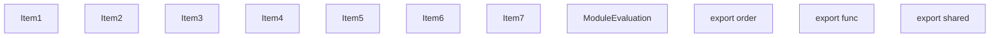
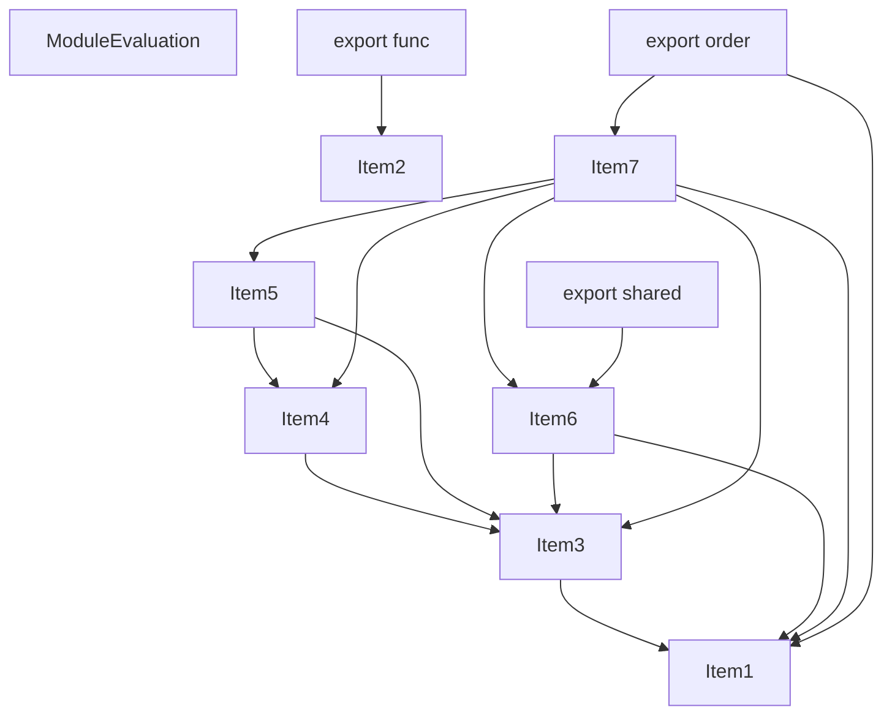
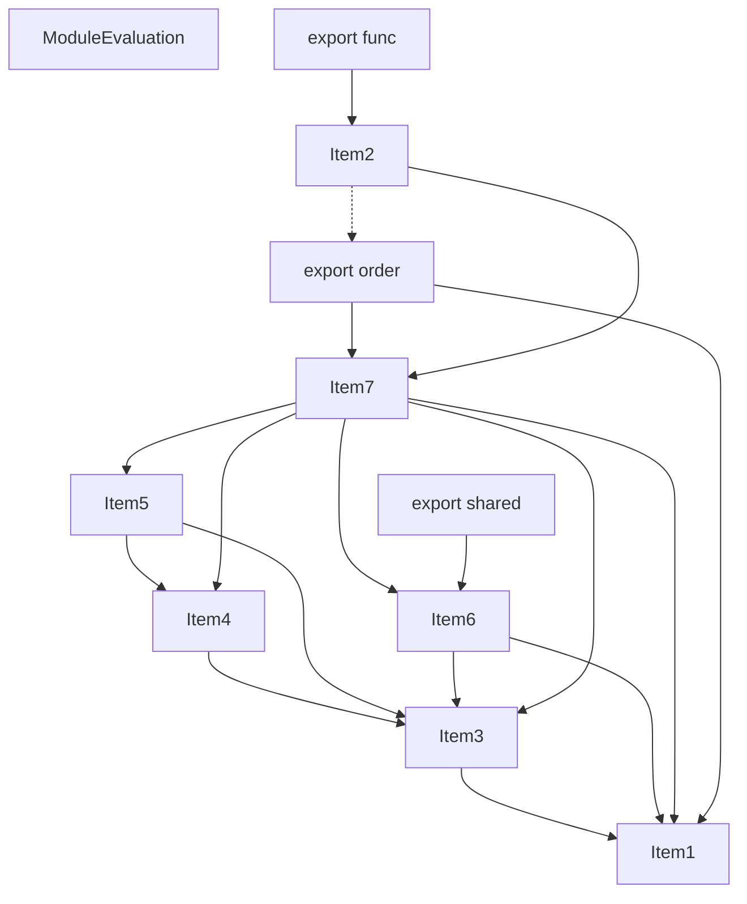
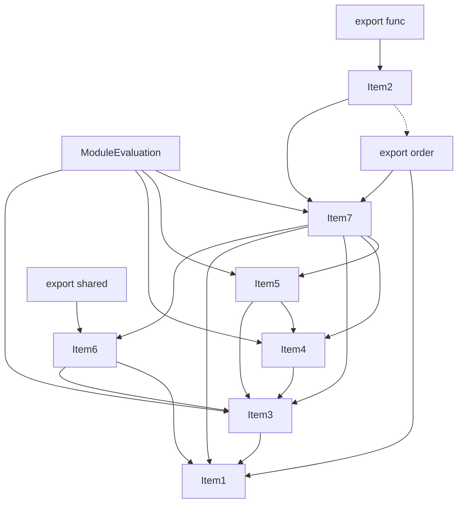
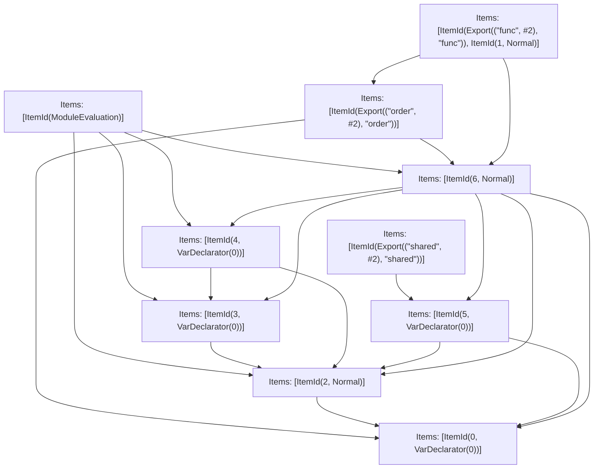

# Items

Count: 11

## Item 1: Stmt 0, `VarDeclarator(0)`

```js
export const order = [];

```

- Declares: `order`
- Write: `order`

## Item 2: Stmt 1, `Normal`

```js
export function func() {
    order.push("d");
}

```

- Hoisted
- Declares: `func`
- Reads (eventual): `order`
- Write: `func`
- Write (eventual): `order`

## Item 3: Stmt 2, `Normal`

```js
order.push("a");

```

- Side effects
- Reads: `order`
- Write: `order`

## Item 4: Stmt 3, `VarDeclarator(0)`

```js
const x1 = externalFunction();

```

- Side effects
- Declares: `x1`
- Write: `x1`

## Item 5: Stmt 4, `VarDeclarator(0)`

```js
const x2 = externalFunction();

```

- Side effects
- Declares: `x2`
- Write: `x2`

## Item 6: Stmt 5, `VarDeclarator(0)`

```js
export const shared = {
    effect: order.push("b")
};

```

- Declares: `shared`
- Reads: `order`
- Write: `shared`, `order`

## Item 7: Stmt 6, `Normal`

```js
order.push("c");

```

- Side effects
- Reads: `order`
- Write: `order`

# Phase 1

# Phase 2

# Phase 3

# Phase 4

# Final

# Entrypoints

```
{
    ModuleEvaluation: 0,
    Export(
        "order",
    ): 1,
    Export(
        "func",
    ): 2,
    Export(
        "shared",
    ): 3,
}
```


# Modules (dev)
## Part 0
```js
import "__TURBOPACK_PART__" assert {
    __turbopack_part__: 5
};
import "__TURBOPACK_PART__" assert {
    __turbopack_part__: 6
};
import "__TURBOPACK_PART__" assert {
    __turbopack_part__: 7
};
import "__TURBOPACK_PART__" assert {
    __turbopack_part__: 9
};
"module evaluation";

```
## Part 1
```js
import "__TURBOPACK_PART__" assert {
    __turbopack_part__: 9
};
import { order } from "__TURBOPACK_PART__" assert {
    __turbopack_part__: 4
};
export { order };

```
## Part 2
```js
import "__TURBOPACK_PART__" assert {
    __turbopack_part__: 9
};
import "__TURBOPACK_PART__" assert {
    __turbopack_part__: 1
};
export { func };
function func() {
    order.push("d");
}
export { func } from "__TURBOPACK_VAR__" assert {
    __turbopack_var__: true
};

```
## Part 3
```js
import { shared } from "__TURBOPACK_PART__" assert {
    __turbopack_part__: 8
};
export { shared };

```
## Part 4
```js
const order = [];
export { order } from "__TURBOPACK_VAR__" assert {
    __turbopack_var__: true
};

```
## Part 5
```js
import { order } from "__TURBOPACK_PART__" assert {
    __turbopack_part__: 4
};
order.push("a");

```
## Part 6
```js
import "__TURBOPACK_PART__" assert {
    __turbopack_part__: 5
};
const x1 = externalFunction();
export { x1 } from "__TURBOPACK_VAR__" assert {
    __turbopack_var__: true
};

```
## Part 7
```js
import "__TURBOPACK_PART__" assert {
    __turbopack_part__: 5
};
import "__TURBOPACK_PART__" assert {
    __turbopack_part__: 6
};
const x2 = externalFunction();
export { x2 } from "__TURBOPACK_VAR__" assert {
    __turbopack_var__: true
};

```
## Part 8
```js
import "__TURBOPACK_PART__" assert {
    __turbopack_part__: 5
};
import { order } from "__TURBOPACK_PART__" assert {
    __turbopack_part__: 4
};
const shared = {
    effect: order.push("b")
};
export { shared } from "__TURBOPACK_VAR__" assert {
    __turbopack_var__: true
};

```
## Part 9
```js
import "__TURBOPACK_PART__" assert {
    __turbopack_part__: 8
};
import { order } from "__TURBOPACK_PART__" assert {
    __turbopack_part__: 4
};
import "__TURBOPACK_PART__" assert {
    __turbopack_part__: 5
};
import "__TURBOPACK_PART__" assert {
    __turbopack_part__: 6
};
import "__TURBOPACK_PART__" assert {
    __turbopack_part__: 7
};
order.push("c");

```
## Merged (module eval)
```js
import "__TURBOPACK_PART__" assert {
    __turbopack_part__: 5
};
import "__TURBOPACK_PART__" assert {
    __turbopack_part__: 6
};
import "__TURBOPACK_PART__" assert {
    __turbopack_part__: 7
};
import "__TURBOPACK_PART__" assert {
    __turbopack_part__: 9
};
"module evaluation";

```
# Entrypoints

```
{
    ModuleEvaluation: 0,
    Export(
        "order",
    ): 1,
    Export(
        "func",
    ): 2,
    Export(
        "shared",
    ): 3,
}
```


# Modules (prod)
## Part 0
```js
import "__TURBOPACK_PART__" assert {
    __turbopack_part__: 5
};
import "__TURBOPACK_PART__" assert {
    __turbopack_part__: 6
};
import "__TURBOPACK_PART__" assert {
    __turbopack_part__: 7
};
import "__TURBOPACK_PART__" assert {
    __turbopack_part__: 9
};
"module evaluation";

```
## Part 1
```js
import "__TURBOPACK_PART__" assert {
    __turbopack_part__: 9
};
import { order } from "__TURBOPACK_PART__" assert {
    __turbopack_part__: 4
};
export { order };

```
## Part 2
```js
import "__TURBOPACK_PART__" assert {
    __turbopack_part__: 9
};
export { func };
function func() {
    order.push("d");
}
export { func } from "__TURBOPACK_VAR__" assert {
    __turbopack_var__: true
};

```
## Part 3
```js
import { shared } from "__TURBOPACK_PART__" assert {
    __turbopack_part__: 8
};
export { shared };

```
## Part 4
```js
const order = [];
export { order } from "__TURBOPACK_VAR__" assert {
    __turbopack_var__: true
};

```
## Part 5
```js
import { order } from "__TURBOPACK_PART__" assert {
    __turbopack_part__: 4
};
order.push("a");

```
## Part 6
```js
import "__TURBOPACK_PART__" assert {
    __turbopack_part__: 5
};
const x1 = externalFunction();
export { x1 } from "__TURBOPACK_VAR__" assert {
    __turbopack_var__: true
};

```
## Part 7
```js
import "__TURBOPACK_PART__" assert {
    __turbopack_part__: 5
};
import "__TURBOPACK_PART__" assert {
    __turbopack_part__: 6
};
const x2 = externalFunction();
export { x2 } from "__TURBOPACK_VAR__" assert {
    __turbopack_var__: true
};

```
## Part 8
```js
import "__TURBOPACK_PART__" assert {
    __turbopack_part__: 5
};
import { order } from "__TURBOPACK_PART__" assert {
    __turbopack_part__: 4
};
const shared = {
    effect: order.push("b")
};
export { shared } from "__TURBOPACK_VAR__" assert {
    __turbopack_var__: true
};

```
## Part 9
```js
import "__TURBOPACK_PART__" assert {
    __turbopack_part__: 8
};
import { order } from "__TURBOPACK_PART__" assert {
    __turbopack_part__: 4
};
import "__TURBOPACK_PART__" assert {
    __turbopack_part__: 5
};
import "__TURBOPACK_PART__" assert {
    __turbopack_part__: 6
};
import "__TURBOPACK_PART__" assert {
    __turbopack_part__: 7
};
order.push("c");

```
## Merged (module eval)
```js
import "__TURBOPACK_PART__" assert {
    __turbopack_part__: 5
};
import "__TURBOPACK_PART__" assert {
    __turbopack_part__: 6
};
import "__TURBOPACK_PART__" assert {
    __turbopack_part__: 7
};
import "__TURBOPACK_PART__" assert {
    __turbopack_part__: 9
};
"module evaluation";

```
