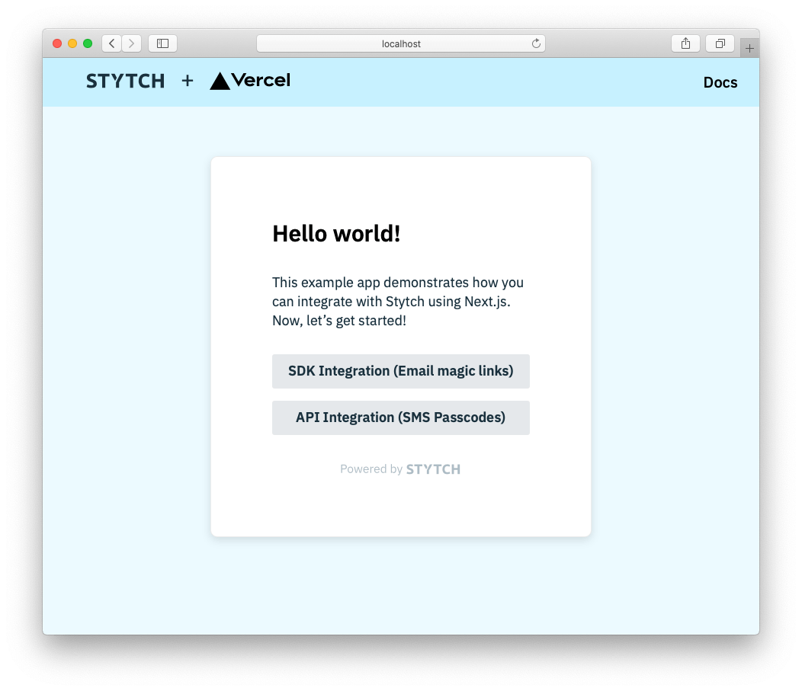

# Stytch + Next.js example app on Vercel

This is a [Stytch](https://stytch.com) + [Next.js](https://nextjs.org/) project that showcases how to enable elegant authentication in your applicaiton.

<p align="center"></p>

In this repo, we have two sample auth flows:

- SDK integration: This flow uses Stytch's React component to create a login and sign-up flow using [Email Magic Links](https://stytch.com/docs/api/send-by-email).
- API integration: This flow uses a custom UI with Stytch's backend API for [Onetime Passcodes(OTP) via SMS](https://stytch.com/docs/api/sms-otp-overview) authentication.

Both flows use Stytch's [Node client library](https://github.com/stytchauth/stytch-node) and [`iron-session`](https://github.com/vvo/next-iron-session) for session management.

**Note:** By default this example app enables three of our OAuth providers, Google, Microsoft, and Apple. If you haven't set up these OAuth providers in your [Dashboard](https://stytch.com/dashboard/oauth), you'll receive a redirect error when you attempt to login via those providers. You may remove all OAuth methods by removing `SDKProductTypes.oauth` from the `products` array in [pages/index.tsx](pages/index.tsx) or adjust which ones are displayed by via `oauthOptions.providers` in the same file. More detail on working with OAuth providers in our SDK may be found in our [Docs](https://stytch.com/docs/javascript-sdk#javascript-sdk/oauth).

# Deploy on Vercel

## Setting up Stytch

The first step is to configure the appropriate redirect URLs for your project. You'll set these magic link redirect URLs in the [Redirect URLs](https://stytch.com/dashboard/redirect-urls) section of your Dashboard. Add `https://*.vercel.app:3000` as both a login and sign-up redirect URL.

## Running the example app

Now just click the deploy button below! Once you're signed in to your Vercel account, you'll be guided through how to get up and running quickly. Check out [.env.template](/.env.template) for pointers on filling in the appropriate environment variables for this step.

[](https://vercel.com/new/clone?repository-url=https%3A%2F%2Fgithub.com%2Fvercel%2Fnext.js%2Fblob%2Fcanary%2Fexamples%2Fauth-with-stytch%2F&env=STYTCH_PROJECT_ENV,STYTCH_PROJECT_ID,STYTCH_SECRET,NEXT_PUBLIC_STYTCH_PUBLIC_TOKEN,IRON_SESSION_PASSWORD,IRON_SESSION_COOKIE_NAME&envDescription=All%20variables%20here%20need%20values%2C%20see%20the%20following%20link%20for%20pointers%20on%20how%20to%20feel%20these%20out.&envLink=https%3A%2F%2Fgithub.com%2Fvercel%2Fnext.js%2Fblob%2Fcanary%2Fexamples%2Fauth-with-stytch%2F.env.template&project-name=stytch-nextjs-vercel&repo-name=stytch-nextjs-vercel&demo-title=Stytch%20on%20Next.js%20with%20Vercel&demo-description=Next.js%20example%20app%20using%20Stytch%20authentication&demo-url=https%3A%2F%2Fgithub.com%2Fvercel%2Fnext.js%2Fblob%2Fcanary%2Fexamples%2Fauth-with-stytch&demo-image=https%3A%2F%2Fstytch.com%2Flogo-preview.png)

# Running locally via `vercel dev`

## Setting up Stytch

After signing up for Stytch, you'll need your Project's `project_id`, `secret`, and `public_token`. You can find these in the [API keys tab](https://stytch.com/dashboard/api-keys).

Once you've gathered these values, add them to a new .env.local file.
Example:

```bash
cp .env.template .env.local
# Replace your keys in new .env.local file
```

Next we'll configure the appropriate redirect URLs for your project, you'll set these magic link URLs for your project in the [Redirect URLs](https://stytch.com/dashboard/redirect-urls) section of your Dashboard. Add `http://localhost:3000/api/authenticate_magic_link` as both a login and sign-up redirect URL.

## Running the example app

Install dependencies by running

```bash
npm install
# or
yarn install
```

You can then run a development server using:

```bash
vercel dev
```

Open [http://localhost:3000](http://localhost:3000) with your browser to see the result.

## Documentation

Learn more about some of Stytch's products used in this example app:

- [Stytch React](https://www.npmjs.com/package/@stytch/stytch-react)
- [Stytch's node client library](https://www.npmjs.com/package/stytch)
- [iron-session](https://github.com/vvo/next-iron-session)
