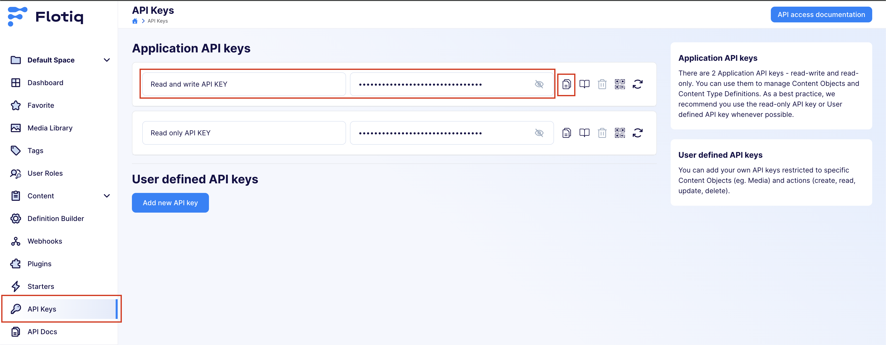
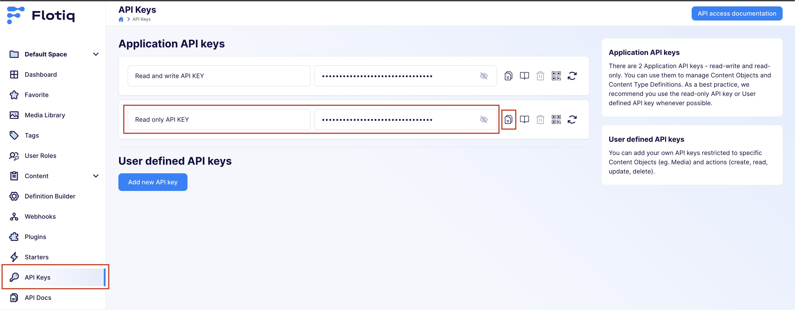
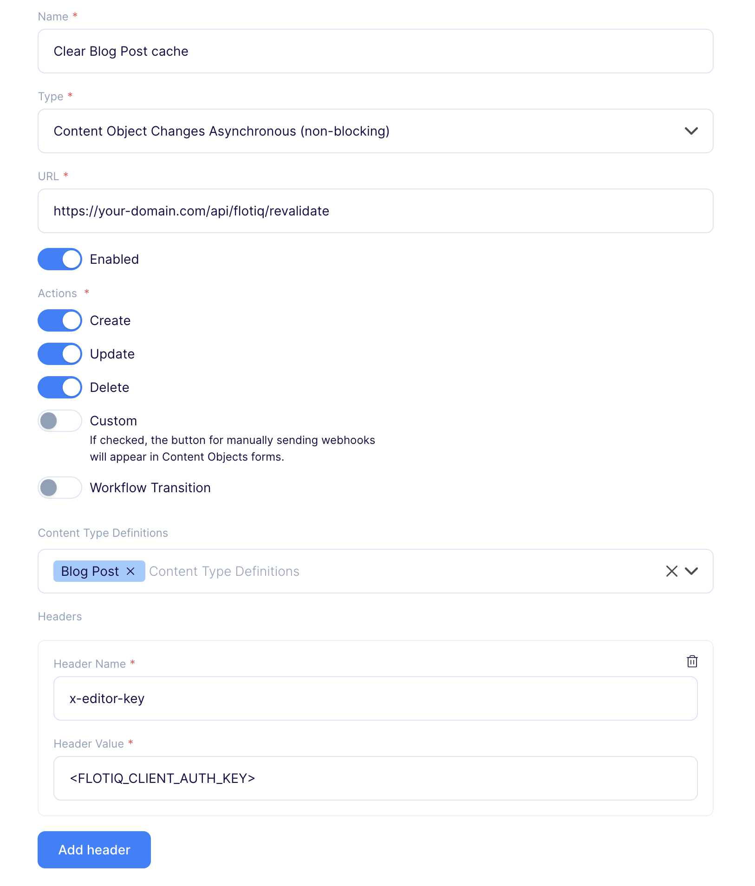

# A dynamically generated blog example using Next.js and Flotiq

This example showcases Next.js's [Server Side Generation](https://nextjs.org/docs/app/building-your-application/rendering/server-components#dynamic-rendering) with Next.js [Data Cache](https://nextjs.org/docs/app/building-your-application/caching#data-cache) feature using [Flotiq](https://www.flotiq.com/) as the data source.

## Deploy your own

Deploy the example using [Vercel](https://vercel.com?utm_source=github&utm_medium=readme&utm_campaign=next-example)

[](https://vercel.com/new/clone?repository-url=https://github.com/vercel/next.js/tree/canary/examples/cms-flotiq&project-name=cms-flotiq&repository-name=cms-flotiq)

To deploy the project, you have to configure:

1. [you account](#configuration)
2. [environment variables](#env-variables)
3. (additional) [webhooks](#nextjs-data-cache) to clear the data cache

## How to use

Execute [`create-next-app`](https://github.com/vercel/next.js/tree/canary/packages/create-next-app) with [npm](https://docs.npmjs.com/cli/init), [Yarn](https://yarnpkg.com/lang/en/docs/cli/create/), [pnpm](https://pnpm.io), or [Bun](https://bun.sh/docs/cli/bunx) to bootstrap the example:

```bash
npx create-next-app --example cms-flotiq cms-flotiq-app
```

```bash
yarn create next-app --example cms-flotiq cms-flotiq-app
```

```bash
pnpm create next-app --example cms-flotiq cms-flotiq-app
```

```bash
bunx create-next-app --example cms-flotiq cms-flotiq-app
```

Deploy it to the cloud with [Vercel](https://vercel.com/new?utm_source=github&utm_medium=readme&utm_campaign=next-example) ([Documentation](https://nextjs.org/docs/app/building-your-application/deploying)).

## Configuration

1. Create an account in Flotiq

   If you already have an account, you can skip this step.

   Go to the [Flotiq registration page](https://editor.flotiq.com/register) and fill out the form. You will receive an email with an activation link. Activate your account and log in to your dashboard.

2. Import example data from starter to Flotiq

   After logging in to the [Flotiq panel](https://editor.flotiq.com/), go to the API keys tab and copy **Read and write API KEY**.

   

   Use the command below to import data to your account. Use the read and write API key you copied.

   ```bash
   npm i -g flotiq-cli
   cd flotiq-nextjs-blog-starter
   flotiq import .flotiq [flotiqApiKey]
   ```

   _Note: You don't need any content types in your account._

3. Configure application

   The next step is to configure our application to know from where it has to fetch the data.

   Flotiq provides a tool named [flotiq-setup](https://github.com/flotiq/flotiq-setup)
   for automatically populating`.env` files with your Flotiq API keys.

   ```bash
   npx flotiq-setup
   ```

   After executing this command, a browser window will open with the Flotiq login screen. Upon successful authentication,
   the command will automatically generate appropriately filled `.env` files for you.

   _Note: If there are existing .env files in the project, flotiq-setup may overwrite them._

4. Install dependencies

   Navigate into your new site’s directory and run command to install dependencies with [npm](https://docs.npmjs.com/cli/init), [Yarn](https://yarnpkg.com/lang/en/docs/cli/create/), [pnpm](https://pnpm.io), or [Bun](https://bun.sh/docs/cli/bunx)

   ```bash
   npm install
   ```

   ```bash
   yarn install
   ```

   ```bash
   pnpm install
   ```

   ```bash
   bun install
   ```

5. Flotiq API SDK - types

   This starter uses [@flotiq/flotiq-api-sdk](https://www.npmjs.com/package/@flotiq/flotiq-api-sdk) package as an API client. It includes type generation for autocompletion of user data types.

   With types generated using our typegen command, it enables fast and typesafe development with Flotiq as a data backend.
   You can still use all the API features without type generation. TypeScript user types can be added or removed at any point in development without code changes required.

   Generated `flotiq-api.d.ts` types can be either committed with your code, or .gitignore-d and generated during development and CI/CD.
   For is of use we already include `flotiq-api.d.ts` file with types containing type definitions for this starter.

   To regenerate Flotiq SDK you can use [flotiq-api-typegen CLI](https://www.npmjs.com/package/@flotiq/flotiq-api-sdk#flotiq-api-typegen), simply run one of the commands:

   ```bash
      npm exec flotiq-api-typegen
   ```

   ```bash
      yarn run flotiq-api-typegen
   ```

   ```bash
      pnpm exec flotiq-api-typegen
   ```

   ```bash
      bun run flotiq-api-typegen
   ```

   Usage examples:

   ```typescript
   import { Flotiq } from "@flotiq/flotiq-api-sdk";

   const api = new Flotiq({
     apiKey: "<YOUR API KEY>",
   });

   await api.content._media.list().then((response) => {
     console.log("media > list", response);
   });
   ```

   More examples of its usage can be found in the [@flotiq/flotiq-api-sdk readme](https://www.npmjs.com/package/@flotiq/flotiq-api-sdk#usage-examples)

   _Note: If you make any changes (additions or deletions) to the `content type definitions` in your Flotiq account, you will need to rerun the `flotiq-api-typegen` command.
   If you are making changes during development, you can use `--watch` option, which will regenerate types for you, every time you change content type definition._

6. Developing

   Navigate into your new site’s directory and start it up.

   ```bash
   npm run dev
   ```

   ```bash
   yarn run dev
   ```

   ```bash
   pnpm run dev
   ```

   ```bash
   bun run dev
   ```

   Your site is now running at `http://localhost:3000`!

   Open the `flotiq-nextjs-blog-starter` directory in your code editor of choice and edit `src/app/page.tsx`. Save your changes and the browser will update in real time!

7. Manage your content using Flotiq editor

   You can now easily manage your content using [Flotiq editor](https://editor.flotiq.com)

   _Note: If you make any changes (additions or deletions) to the `content type definitions` in your Flotiq account, you will need to rerun the `flotiq-api-typegen` command.
   If you are making changes during development, you can use `--watch` option, which will regenerate types for you, every time you change content type definition._

## Deployment

Deploy using the template:

[](https://vercel.com/new/clone?repository-url=https://github.com/vercel/next.js/tree/canary/examples/cms-flotiq&project-name=cms-flotiq&repository-name=cms-flotiq)

### Env variables:

Project requires the following variables to start:

| Name                     | Description                                            |
| ------------------------ | ------------------------------------------------------ |
| `FLOTIQ_CLIENT_AUTH_KEY` | The key used to [revalidate cache](#nextjs-data-cache) |
| `FLOTIQ_API_KEY`         | Flotiq Read API key for blogpost content objects       |

You can find the read-only API key on the API keys page in the [Flotiq panel](https://editor.flotiq.com/)

 

### Next.js Data Cache

This starter utilizes a [data caching mechanism in the Next.js application](https://nextjs.org/docs/app/building-your-application/caching#data-cache). After fetching, the data is cached, which means that to see the latest data, the cache must be cleared. In this starter, we provide a special API endpoint that clears the cache. You can call it directly or use webhooks that will do it automatically after saving a blog post (both for adding a new entry and editing an existing one).

#### API Enpoint

To send a request to the endpoint that clears cache, use following command:

```bash
curl -X POST https://your-domain.com/api/flotiq/revalidate \
     -H "x-editor-key: <FLOTIQ_CLIENT_AUTH_KEY>"
```

Replace `https://your-domain.com` with your actual `URL` and `FLOTIQ_CLIENT_AUTH_KEY` with the appropriate authorization key value.

#### Webhooks in Flotiq space

To add a webhook that automatically clears the cache after saving a blog post, follow these instructions:

1. Go to [Flotiq dashboard](https://editor.flotiq.com/login)
2. Go to the _Webhooks_ page and click _Add new webhook_
3. Name the webhook (e.g. Clear Blog Post cache)
4. Paste URL to your revalidate enpoint, eg. `https://your-domain.com/api/flotiq/revalidate`
5. As a webhook type choose **Content Object Changes Asynchronous (non-blocking)**
6. Enable the webhook
7. As a trigger, choose **Create**, **Update** and **Delete** actions on the **Blog Post** Content Type
8. Add new header with following fields:
   - **Header Name** - `x-editor-key`
   - **Header Value** - value for `FLOTIQ_CLIENT_AUTH_KEY` env variable in your deployment
9. Save the webhook

Example webhook configuration:



**Warning!** The webhook URL must be public. In development mode, caching is not applied, so the user does not need to worry about manually clearing the cache on `http://localhost:3000`.

## Issues

If you wish to talk with Flotiq team about this project, feel free to hop on [Flotiq Discord ](https://discord.gg/FwXcHnX).
