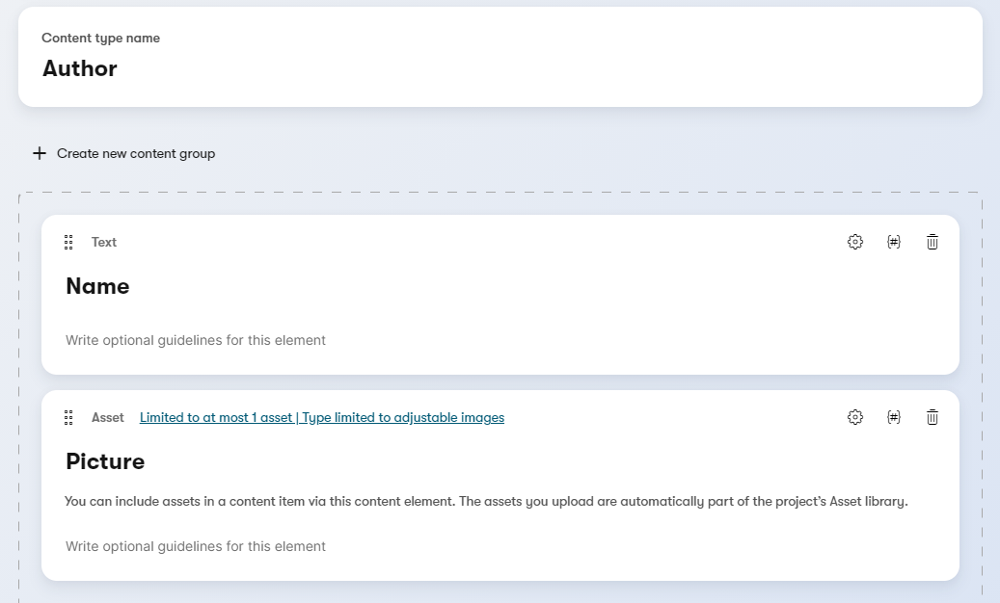
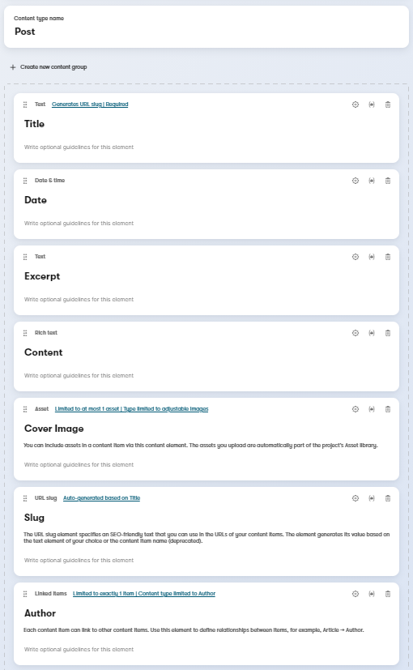
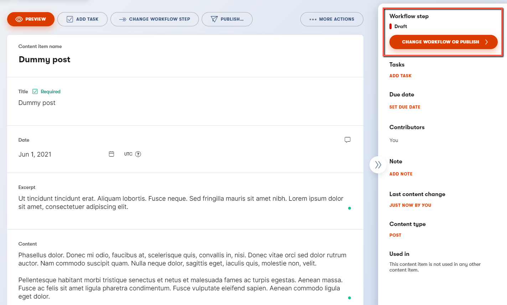
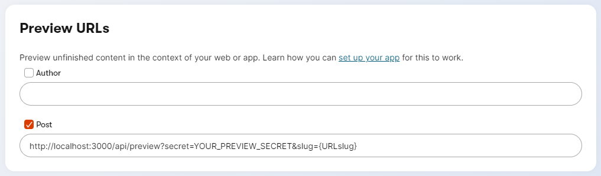
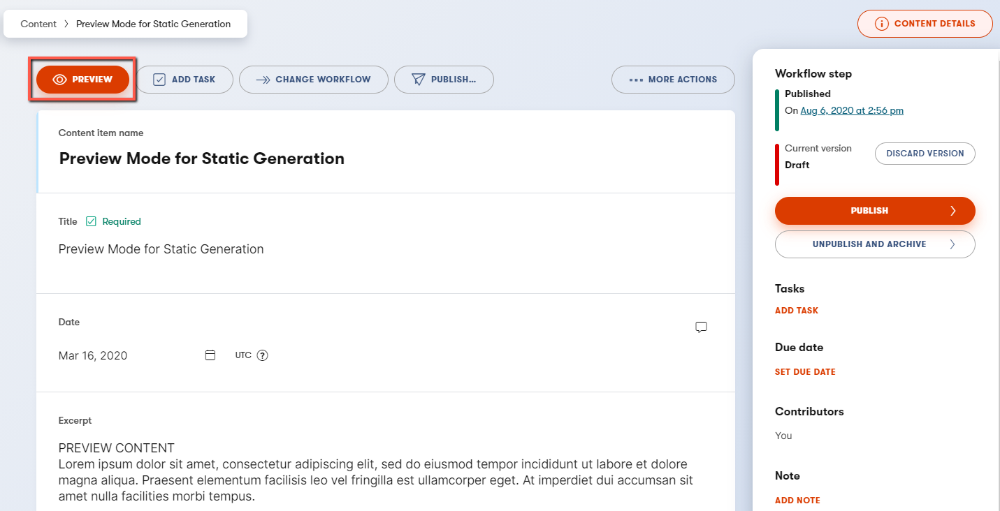

# A statically generated blog example using Next.js and Kontent.ai

This example showcases Next.js's [Static Generation](https://nextjs.org/docs/basic-features/pages) feature using [Kontent.ai](https://kontent.ai) as the data source.

## Demo

[https://next-blog-kontent-ai.vercel.app/](https://next-blog-kontent-ai.vercel.app/)

## Deploy your own

Once you have access to [the environment variables you'll need](#step-3-set-up-environment-variables), deploy the example using [Vercel](https://vercel.com?utm_source=github&utm_medium=readme&utm_campaign=next-example) or preview live with [StackBlitz](https://stackblitz.com/github/vercel/next.js/tree/canary/examples/cms-kontent-ai)

[](https://vercel.com/new/clone?repository-url=https://github.com/vercel/next.js/tree/canary/examples/cms-kontent-ai&project-name=cms-kontent-ai&repository-name=cms-kontent-ai&env=KONTENT_PROJECT_ID,KONTENT_PREVIEW_API_KEY,KONTENT_PREVIEW_SECRET&envDescription=Required%20to%20connect%20the%20app%20with%20Kontent.ai&envLink=https://github.com/vercel/next.js/tree/canary/examples/cms-kontent-ai)

### Related examples

- [AgilityCMS](/examples/cms-agilitycms)
- [Builder.io](/examples/cms-builder-io)
- [ButterCMS](/examples/cms-buttercms)
- [Contentful](/examples/cms-contentful)
- [Cosmic](/examples/cms-cosmic)
- [DatoCMS](/examples/cms-datocms)
- [DotCMS](/examples/cms-dotcms)
- [Drupal](/examples/cms-drupal)
- [Enterspeed](/examples/cms-enterspeed)
- [Ghost](/examples/cms-ghost)
- [GraphCMS](/examples/cms-graphcms)
- [Kontent.ai](/examples/cms-kontent-ai)
- [MakeSwift](/examples/cms-makeswift)
- [Payload](/examples/cms-payload)
- [Plasmic](/examples/cms-plasmic)
- [Prepr](/examples/cms-prepr)
- [Prismic](/examples/cms-prismic)
- [Sanity](/examples/cms-sanity)
- [Sitecore XM Cloud](/examples/cms-sitecore-xmcloud)
- [Sitefinity](/examples/cms-sitefinity)
- [Storyblok](/examples/cms-storyblok)
- [TakeShape](/examples/cms-takeshape)
- [Tina](/examples/cms-tina)
- [Umbraco](/examples/cms-umbraco)
- [Umbraco heartcore](/examples/cms-umbraco-heartcore)
- [Webiny](/examples/cms-webiny)
- [WordPress](/examples/cms-wordpress)
- [Blog Starter](/examples/blog-starter)

## How to use

Execute [`create-next-app`](https://github.com/vercel/next.js/tree/canary/packages/create-next-app) with [npm](https://docs.npmjs.com/cli/init), [Yarn](https://yarnpkg.com/lang/en/docs/cli/create/), or [pnpm](https://pnpm.io) to bootstrap the example:

```bash
npx create-next-app --example cms-kontent-ai cms-kontent-app
```

```bash
yarn create next-app --example cms-kontent-ai cms-kontent-app
```

```bash
pnpm create next-app --example cms-kontent-ai cms-kontent-app
```

## Configuration

### **1. Create an account on Kontent.ai**

First, [create an account on Kontent.ai](https://app.kontent.ai/sign-up?utm_source=nextjs_docs_example&utm_medium=devrel&utm_campaign=extended_trial).

> The link above will provide you with the 30-days trial. Once you finish the trial, or even during the trial period, you can switch to the [**developer plan**](https://kontent.ai/developer-plan) which is **free of charge** and offers all the features you'll need to test out the example capabilities.

After signing up, [create an empty project](https://docs.kontent.ai/tutorials/set-up-kontent/projects/manage-projects#a-creating-projects).

### **2. Create the content models and fill them with data**

The [content model](https://docs.kontent.ai/tutorials/set-up-kontent/content-modeling/what-is-content-modeling) defines the data structures of your application/websites. The structures are flexible and you can tailor them to your needs.

For this example, you need to create a content model that defines an `author` and a `post` content type. **You can import these automatically or by doing it manually** to familiarize yourself with the Kontent.ai user interface.

To import the content models with their data follow the next steps:

1. Enter [Kontent.ai application](https://app.kontent.ai)
1. Go to "Project Settings" and select API keys
1. Activate Management API
1. Copy `Project ID` and `Management API` key
1. Install [Kontent.ai Backup Manager](https://github.com/kontent-ai/backup-manager) and import data to the newly created project from kontent-ai-backup.zip file (don't forget to place appropriate values for apiKey and projectId arguments):

   ```sh
   npm i -g @kontent-ai/backup-manager
   kbm --action=restore --apiKey=<Management API key> --projectId=<Project ID> --zipFilename=kontent-ai-backup
   ```

1. Go to your Kontent.ai project and publish all the imported items.
   > Note: You can deactivate the Management API key, as it is not necessary anymore.

#### **2.1. (Optional) Create the content models manually**

You can ignore this step if you already imported the content models in Step 2.

#### Create an `Author` content type

In your Kontent.ai project, go to the **Content models** and add a new `Content type`:

> you don't have to modify the element configuration unless specified

- Content type name: `Author`
- Add the following content elements
  - `Name` - **Text** element
  - `Picture` - **Asset** element - configure to allow to select `At most 1` asset and `Limit file types` only to `Adjustable images`

Save the content type.

The content type should look like this:



#### Create a `Post` content type

In your Kontent.ai project, go to **Content models** and add a new content type:

> you don't have to modify the element configuration unless specified

- Content type name: `Post`
- Add the following content elements
  - `Title` - **Text** element
  - `Date` - **Date & time** element
  - `Excerpt` - **Text** element
  - `Content` - **Rich Text** element
  - `Cover Image` - **Asset Text** element - configure to allow to select `At most 1` asset and `Limit file types` only to `Adjustable images` - `Content` - `Slug` - **URL slug** element - auto-generated from `Title` element
  - `Author` - **Linked items** element - configure to accept `Exactly 1` item of type `Author`

Save the content type.

The content type should look like this:



#### Fill content models with data

Go to `Content & Assets` section in your project and click `Create new` on the `Content` tab and select `Author` content type.

- You just need **1 author item** first.
- Use dummy data for his name.
- For the image, you can download one from [Unsplash](https://unsplash.com/).

Next, create another item based on **Post** content type:

- It's recommended to create at least **2 post items**.
- Use dummy data for the text.
- For images, you can download them from [Unsplash](https://unsplash.com/).
- Pick the **author** you created earlier.

**Important:** For each item, you need to click on **Publish**. If not, the entry will be in the draft workflow step.



### **3. Set up environment variables**

Copy the `.env.local.example` file in this directory to `.env.local` (which will be ignored by Git):

```bash
cp .env.local.example .env.local
```

Then set each variable on `.env.local` using the keys `Project settings` > `API keys`:

- `KONTENT_PROJECT_ID` - Should be the Project ID in `Project settings` > `API keys`.
- `KONTENT_PREVIEW_API_KEY` - One of the Preview API keys in `Project settings` > `API keys`.
- `KONTENT_PREVIEW_SECRET` - Can be any random string (but avoid spaces), like `MY_SECRET` - this is used for [Preview Mode](https://nextjs.org/docs/advanced-features/preview-mode).

### **4. Run Next.js in development mode**

```bash
npm install
npm run dev

# or

yarn
yarn dev
```

Your blog should be up and running on [http://localhost:3000](http://localhost:3000)! If it doesn't work, post on [GitHub discussions](https://github.com/vercel/next.js/discussions).

### **5. Try preview mode**

In your Kontent.ai project, go to **Project Settings > Preview URLs** and set a new preview URL for the `Post` content type to:

```plain
http://localhost:3000/api/preview?secret=<KONTENT_PREVIEW_SECRET>&slug={URLslug}
```

Replace `<KONTENT_PREVIEW_SECRET>` with its respective value in `.env.local`:



Once saved, go to one of the posts you've created and:

- Create a new version of the post
- **Update the title**. For example, you can add `[Draft]` in front of the title.
  > Mind the title also regenerates the URL slug, if you want to change any other field that does not influence the URL slug, feel free to do so.
- **Do not** publish it. By not publishing it, the post will be in the draft workflow step.
- On the menu, you will see the **Preview** button. Click on it!

.

You will now be able to see the updated title. To exit preview mode, you can click on **Click here to exit preview mode** at the top of the page.

### **6. Deploy on Vercel**

You can deploy this app to the cloud with [Vercel](https://vercel.com?utm_source=github&utm_medium=readme&utm_campaign=next-example) ([Documentation](https://nextjs.org/docs/deployment)).

#### Deploy Your Local Project

To deploy your local project to Vercel, push it to GitHub/GitLab/Bitbucket and [import it to Vercel](https://vercel.com/new?utm_source=github&utm_medium=readme&utm_campaign=next-example).

**Important**: When you import your project on Vercel, make sure to click on **Environment Variables** and set them to match your `.env.local` file.

#### Deploy from Our Template

Alternatively, you can deploy using our template by clicking on the Deploy button below.

[](https://vercel.com/new/clone?repository-url=https://github.com/vercel/next.js/tree/canary/examples/cms-kontent&project-name=cms-kontent&repository-name=cms-kontent&env=KONTENT_PROJECT_ID,KONTENT_PREVIEW_API_KEY,KONTENT_PREVIEW_SECRET&envDescription=Required%20to%20connect%20the%20app%20with%20Kontent&envLink=https://github.com/vercel/next.js/tree/canary/examples/cms-kontent%23step-3-set-up-environment-variables)
