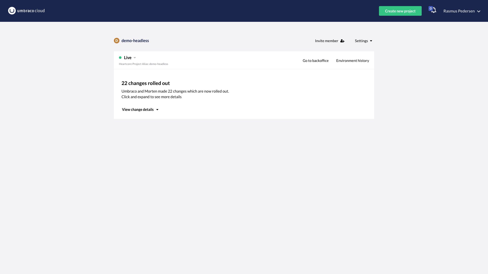
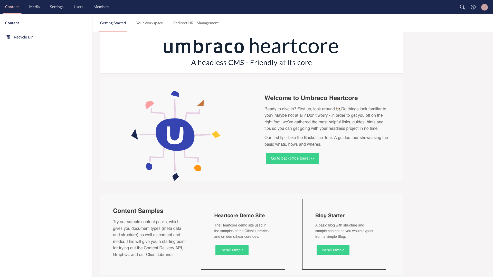
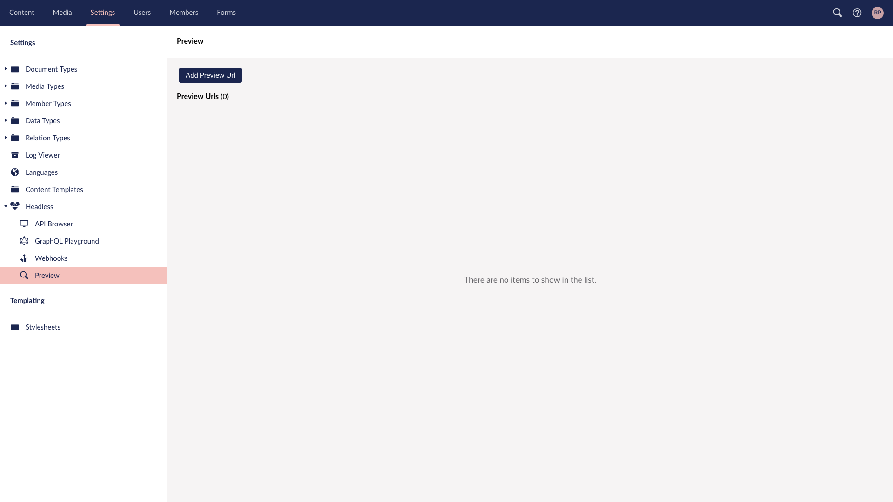
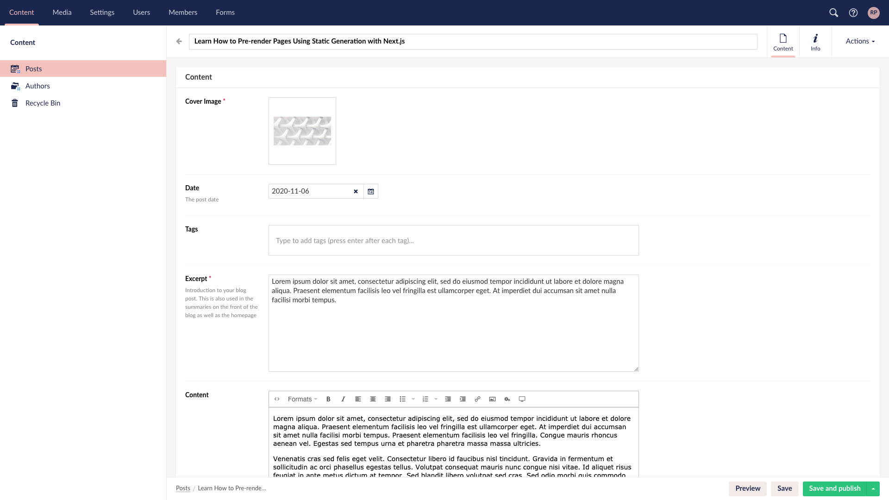

# A statically generated blog example using Next.js and Umbraco Heartcore

This example showcases Next.js's [Static Generation](https://nextjs.org/docs/basic-features/pages) feature using [Umbraco Heartcore](https://umbraco.com/heartcore) as the data source.

## Demo

- **Live**: [https://next-blog-umbraco-heartcore.vercel.app/](https://next-blog-umbraco-heartcore.vercel.app/)
- **Preview Mode**: [https://next-blog-umbraco-heartcore.vercel.app/api/preview...](https://next-blog-umbraco-heartcore.vercel.app/api/preview?secret=ivfgc53v8d8ikh7z4nnd5hzwgs298ma6&slug=/posts/learn-how-to-pre-render-pages-using-static-generation-with-next-js)

## Deploy your own

Once you have access to [the environment variables you'll need](#step-3-set-up-environment-variables), deploy the example using [Vercel](https://vercel.com?utm_source=github&utm_medium=readme&utm_campaign=next-example):

[](https://vercel.com/import/git?c=1&s=https://github.com/vercel/next.js/tree/canary/examples/cms-umbraco-heartcore&env=UMBRACO_PROJECT_ALIAS,UMBRACO_API_KEY,UMBRACO_PREVIEW_SECRET&envDescription=Required%20to%20connect%20the%20app%20with%20Umbraco%20Heartcore&envLink=https://vercel.link/cms-umbraco-heartcore-env)

### Related examples

- [WordPress](/examples/cms-wordpress)
- [DatoCMS](/examples/cms-datocms)
- [Sanity](/examples/cms-sanity)
- [TakeShape](/examples/cms-takeshape)
- [Prismic](/examples/cms-prismic)
- [Contentful](/examples/cms-contentful)
- [Strapi](/examples/cms-strapi)
- [Agility CMS](/examples/cms-agilitycms)
- [Cosmic](/examples/cms-cosmic)
- [ButterCMS](/examples/cms-buttercms)
- [Storyblok](/examples/cms-storyblok)
- [GraphCMS](/examples/cms-graphcms)
- [Kontent](/examples/cms-kontent)
- [Ghost](/examples/cms-ghost)
- [Blog Starter](/examples/blog-starter)
- [DotCMS](/examples/cms-dotcms)
- [Enterspeed](/examples/cms-enterspeed)

## How to use

Execute [`create-next-app`](https://github.com/vercel/next.js/tree/canary/packages/create-next-app) with [npm](https://docs.npmjs.com/cli/init), [Yarn](https://yarnpkg.com/lang/en/docs/cli/create/), or [pnpm](https://pnpm.io) to bootstrap the example:

```bash
npx create-next-app --example cms-umbraco-heartcore cms-umbraco-heartcore-app
```

```bash
yarn create next-app --example cms-umbraco-heartcore cms-umbraco-heartcore-app
```

```bash
pnpm create next-app --example cms-umbraco-heartcore cms-umbraco-heartcore-app
```

## Configuration

### Step 1. Create an account and a project in Umbraco Heartcore

First, [create an account in Umbraco Heartcore](https://umbraco.com/heartcore), this will also create an empty project.

### Step 2. Login into Umbraco Heartcore and install sample data

After your account has been created, you are redirected to the Umbraco Cloud Portal, from here you click on the **Go to backoffice** link and login to your new Umbraco Heartcore project.



From the dashboard click **Install sample** on the **Blog Starter** sample.



### Step 3. Set up environment variables

Copy the `.env.local.example` file in this directory to `.env.local` (which will be ignored by Git):

```bash
cp .env.local.example .env.local
```

Then set each variable in `.env.local`:

- `UMBRACO_PROJECT_ALIAS`: Set it to the project alias, which can be found under **Settings** -> **Headless**.
- `UMBRACO_API_KEY`: Create a new API Key under **Users > "Your Username" > API Keys**.
- `UMBRACO_PREVIEW_SECRET` can be any random string (but avoid spaces), like `MY_SECRET` - this is used for [Preview Mode](https://nextjs.org/docs/advanced-features/preview-mode).

Your `.env.local` file should look like this:

```bash
UMBRACO_PROJECT_ALIAS=...
UMBRACO_API_KEY=...
UMBRACO_PREVIEW_SECRET=...
```

### Step 4. Run Next.js in development mode

```bash
npm install
npm run dev

# or

yarn install
yarn dev
```

Your blog should be up and running on [http://localhost:3000](http://localhost:3000)! If it doesn't work, post on [GitHub discussions](https://github.com/vercel/next.js/discussions).

### Step 5. Try preview mode

Then click save and go back to the **Content** section, click on _Posts_ and then on a post and:

- **Update the title**. For example, you can add `[Draft]` in front of the title.
- Click **Save**, but **DO NOT** click **Publish**. By doing this, the post will be in the draft state.

Now, if you go to the post page on localhost, you won't see the updated title. However, if you use **Preview Mode**, you'll be able to see the change ([Documentation](/docs/advanced-features/preview-mode.md)).

To enable the Preview Mode, go to this URL:

```
http://localhost:3000/api/preview?secret=<secret>&slug=<slug>
```

- `<secret>` should be the string you entered for `STRAPI_PREVIEW_SECRET`.
- `<slug>` should be the post's `url`, which can be found under **Info**.

You should now be able to see the draft post. To exit the preview mode, you can click **Click here to exit preview mode** at the top of the page.

To make it easier to go into **Preview Mode** you can enable a preview button on the posts in the backoffice.

In Umbraco Heartcore, go to **Settings > Headless > Preview**. From here you can add a new Preview Url by clicking the **Add Preview Url** button.

Fill in the form with the following values:



- **Root Content**: Select the **Posts** node
- **Culture**: en-US
- **Url**: http://localhost:3000/api/preview?secret=YOUR_PREVIEW_SECRET
- **Name**: Local Test
- **Path type**: Path in querystring
- **Querystring parameter nam**: slug

If you go back to one of the posts, you should now see a **Preview** button at the bottom right of the screen next to the **Save** button. If you click it, you should be in **Preview Mode**.



### Step 6. Deploy on Vercel

You can deploy this app to the cloud with [Vercel](https://vercel.com?utm_source=github&utm_medium=readme&utm_campaign=next-example) ([Documentation](https://nextjs.org/docs/deployment)).

#### Deploy Your Local Project

To deploy your local project to Vercel, push it to GitHub/GitLab/Bitbucket and [import to Vercel](https://vercel.com/import/git?utm_source=github&utm_medium=readme&utm_campaign=next-example).

**Important**: When you import your project on Vercel, make sure to click on **Environment Variables** and set them to match your `.env.local` file.

#### Deploy from Our Template

Alternatively, you can deploy using our template by clicking on the Deploy button below.

[](https://vercel.com/import/git?c=1&s=https://github.com/vercel/next.js/tree/canary/examples/cms-umbraco-heartcore&env=UMBRACO_PROJECT_ALIAS,UMBRACO_API_KEY,UMBRACO_PREVIEW_SECRET&envDescription=Required%20to%20connect%20the%20app%20with%20Umbraco%20Heartcore&envLink=https://vercel.link/cms-umbraco-heartcore-env)
