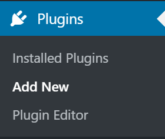
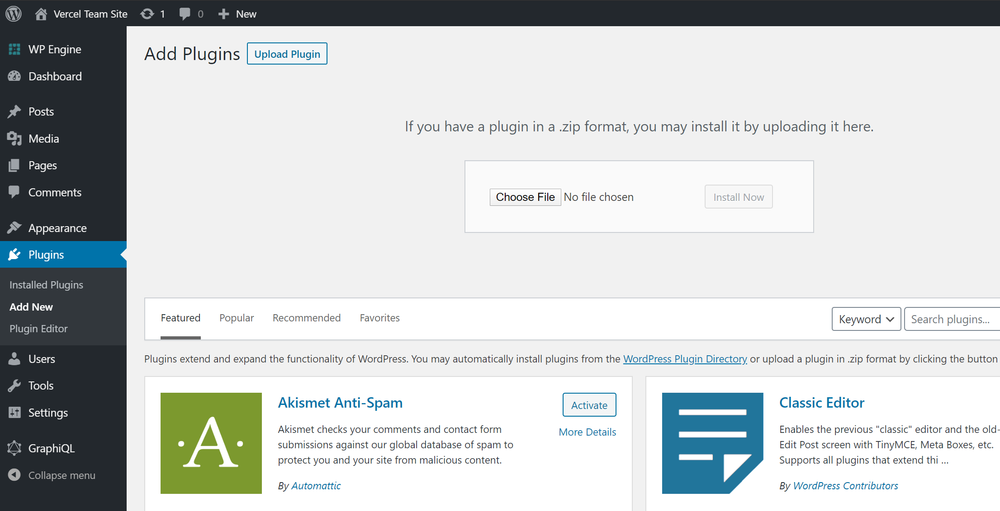
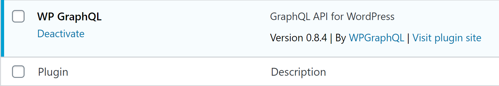
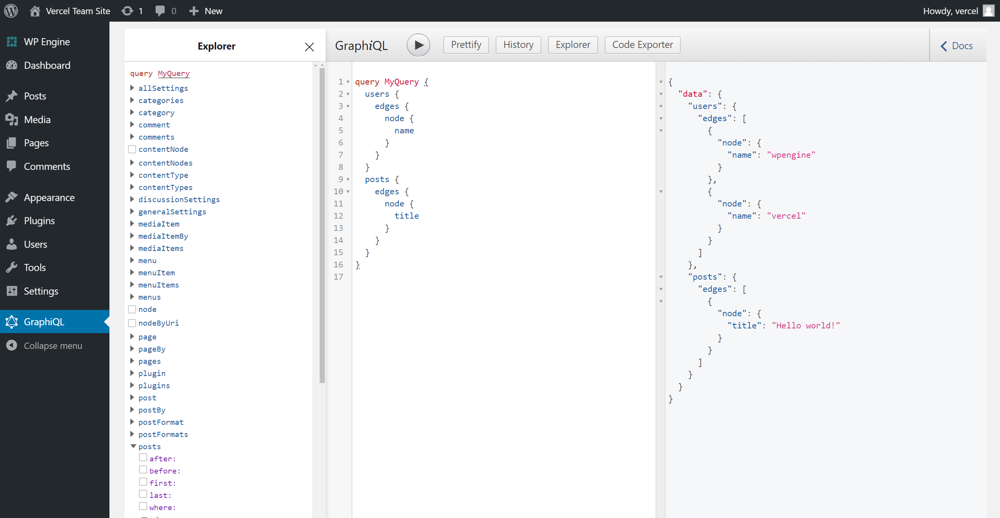
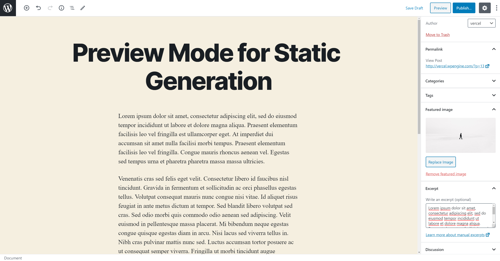

# A statically generated blog example using Next.js and WordPress

This example showcases Next.js's [Static Generation](https://nextjs.org/docs/basic-features/pages) feature using [WordPress](https://wordpress.org) as the data source.

## Demo

### [https://next-blog-wordpress.vercel.app](https://next-blog-wordpress.vercel.app)

## Deploy your own

Once you have access to [the environment variables you'll need](#step-3-set-up-environment-variables), deploy the example using [Vercel](https://vercel.com?utm_source=github&utm_medium=readme&utm_campaign=next-example):

[](https://vercel.com/new/git/external?repository-url=https://github.com/vercel/next.js/tree/canary/examples/cms-wordpress&project-name=cms-wordpress&repository-name=cms-wordpress&env=WORDPRESS_API_URL&envDescription=Required%20to%20connect%20the%20app%20with%20WordPress&envLink=https://vercel.link/cms-wordpress-env)

### Related examples

- [DatoCMS](/examples/cms-datocms)
- [Sanity](/examples/cms-sanity)
- [TakeShape](/examples/cms-takeshape)
- [Prismic](/examples/cms-prismic)
- [Contentful](/examples/cms-contentful)
- [Strapi](/examples/cms-strapi)
- [Agility CMS](/examples/cms-agilitycms)
- [Cosmic](/examples/cms-cosmic)
- [ButterCMS](/examples/cms-buttercms)
- [Storyblok](/examples/cms-storyblok)
- [GraphCMS](/examples/cms-graphcms)
- [Kontent](/examples/cms-kontent)
- [Ghost](/examples/cms-ghost)
- [Blog Starter](/examples/blog-starter)

## How to use

Execute [`create-next-app`](https://github.com/vercel/next.js/tree/canary/packages/create-next-app) with [npm](https://docs.npmjs.com/cli/init) or [Yarn](https://yarnpkg.com/lang/en/docs/cli/create/) to bootstrap the example:

```bash
npx create-next-app --example cms-wordpress cms-wordpress-app
# or
yarn create next-app --example cms-wordpress cms-wordpress-app
```

## Configuration

### Step 1. Prepare your WordPress site

First, you need a WordPress site. There are many solutions for WordPress hosting, such as [WP Engine](https://wpengine.com/) and [WordPress.com](https://wordpress.com/).

Once the site is ready, you'll need to install the [WPGraphQL](https://www.wpgraphql.com/) plugin. It will add GraphQL API to your WordPress site, which we'll use to query the posts. Follow these steps to install it:

- Download the [WPGraphQL repo](https://github.com/wp-graphql/wp-graphql) as a ZIP archive.
- Inside your WordPress admin, go to **Plugins** and then click **Add New**.



- Click the **Upload Plugin** button at the top of the page and upload the WPGraphQL plugin.



- Once the plugin has been added, activate it from either the **Activate Plugin** button displayed after uploading or from the **Plugins** page.



#### Optional: Add WPGraphiQL

The [WPGraphiQL](https://github.com/wp-graphql/wp-graphiql) plugin gives you access to a GraphQL IDE directly from your WordPress Admin, allowing you to inspect and play around with the GraphQL API.

The process to add WPGraphiQL is the same as the one for WPGraphQL: Go to the [WPGraphiQL repo](https://github.com/wp-graphql/wp-graphiql), download the ZIP archive, and install it as a plugin in your WordPress site. Once that's done you should be able to access the GraphiQL page in the admin:



### Step 2. Populate Content

Inside your WordPress admin, go to **Posts** and start adding new posts:

- We recommend creating at least **2 posts**
- Use dummy data for the content
- Pick an author from your WordPress users
- Add a **Featured Image**. You can download one from [Unsplash](https://unsplash.com/)
- Fill the **Excerpt** field



When you’re done, make sure to **Publish** the posts.

> **Note:** Only **published** posts and public fields will be rendered by the app unless [Preview Mode](https://nextjs.org/docs/advanced-features/preview-mode) is enabled.

### Step 3. Set up environment variables

Copy the `.env.local.example` file in this directory to `.env.local` (which will be ignored by Git):

```bash
cp .env.local.example .env.local
```

Then open `.env.local` and set `WORDPRESS_API_URL` to be the URL to your GraphQL endpoint in WordPress. For example: `https://myapp.wpengine.com/graphql`.

Your `.env.local` file should look like this:

```bash
WORDPRESS_API_URL=...

# Only required if you want to enable preview mode
# WORDPRESS_AUTH_REFRESH_TOKEN=
# WORDPRESS_PREVIEW_SECRET=
```

### Step 4. Run Next.js in development mode

```bash
npm install
npm run dev

# or

yarn install
yarn dev
```

Your blog should be up and running on [http://localhost:3000](http://localhost:3000)! If it doesn't work, post on [GitHub discussions](https://github.com/vercel/next.js/discussions).

### Step 5. Add authentication for Preview Mode (Optional)

**This step is optional.** By default, the blog will work with public posts from your WordPress site. Private content such as unpublished posts and private fields cannot be retrieved. To have access to unpublished posts you'll need to set up authentication.

To add [authentication to WPGraphQL](https://docs.wpgraphql.com/guides/authentication-and-authorization/), first you need to add the [WPGraphQL JWT plugin](https://github.com/wp-graphql/wp-graphql-jwt-authentication) to your WordPress Admin following the same process you used to add the WPGraphQL plugin.

> Adding the WPGraphQL JWT plugin will disable your GraphQL API until you add a JWT secret ([GitHub issue](https://github.com/wp-graphql/wp-graphql-jwt-authentication/issues/91)).

Once that's done, you'll need to access the WordPress filesystem to add the secret required to validate JWT tokens. We recommend using SFTP — the instructions vary depending on your hosting provider. For example:

- [SFTP guide for WP Engine](https://wpengine.com/support/sftp/)
- [SFTP guide for WordPress.com](https://wordpress.com/support/sftp/)

Once you have SFTP access, open `wp-config.php` and add a secret for your JWT:

```php
define( 'GRAPHQL_JWT_AUTH_SECRET_KEY', 'YOUR_STRONG_SECRET' );
```

> You can read more about this in the documentation for [WPGraphQL JWT Authentication](https://docs.wpgraphql.com/extensions/wpgraphql-jwt-authentication/).

Now, you need to get a **refresh token** to make authenticated requests with GraphQL. Make the following GraphQL mutation to your WordPress site from the GraphQL IDE (See notes about WPGraphiQL from earlier). Replace `your_username` with the **username** of a user with the `Administrator` role, and `your_password` with the user's password.

```graphql
mutation Login {
  login(
    input: {
      clientMutationId: "uniqueId"
      password: "your_password"
      username: "your_username"
    }
  ) {
    refreshToken
  }
}
```

Copy the `refreshToken` returned by the mutation, then open `.env.local`, and make the following changes:

- Uncomment `WORDPRESS_AUTH_REFRESH_TOKEN` and set it to be the `refreshToken` you just received.
- Uncomment `WORDPRESS_PREVIEW_SECRET` and set it to be any random string (ideally URL friendly).

Your `.env.local` file should look like this:

```bash
WORDPRESS_API_URL=...

# Only required if you want to enable preview mode
WORDPRESS_AUTH_REFRESH_TOKEN=...
WORDPRESS_PREVIEW_SECRET=...
```

**Important:** Restart your Next.js server to update the environment variables.

### Step 6. Try preview mode

On your WordPress admin, create a new post like before, but **do not publish** it.

Now, if you go to `http://localhost:3000`, you won’t see the post. However, if you enable **Preview Mode**, you'll be able to see the change ([Documentation](https://nextjs.org/docs/advanced-features/preview-mode)).

To enable Preview Mode, go to this URL:

```
http://localhost:3000/api/preview?secret=<secret>&id=<id>
```

- `<secret>` should be the string you entered for `WORDPRESS_PREVIEW_SECRET`.
- `<id>` should be the post's `databaseId` field, which is the integer that you usually see in the URL (`?post=18` → 18).
- Alternatively, you can use `<slug>` instead of `<id>`. `<slug>` is generated based on the title.

You should now be able to see this post. To exit Preview Mode, you can click on **Click here to exit preview mode** at the top.

### Step 7. Deploy on Vercel

You can deploy this app to the cloud with [Vercel](https://vercel.com?utm_source=github&utm_medium=readme&utm_campaign=next-example) ([Documentation](https://nextjs.org/docs/deployment)).

#### Deploy Your Local Project

To deploy your local project to Vercel, push it to GitHub/GitLab/Bitbucket and [import to Vercel](https://vercel.com/new?utm_source=github&utm_medium=readme&utm_campaign=next-example).

**Important**: When you import your project on Vercel, make sure to click on **Environment Variables** and set them to match your `.env.local` file.

#### Deploy from Our Template

Alternatively, you can deploy using our template by clicking on the Deploy button below.

[](https://vercel.com/new/git/external?repository-url=https://github.com/vercel/next.js/tree/canary/examples/cms-wordpress&project-name=cms-wordpress&repository-name=cms-wordpress&env=WORDPRESS_API_URL&envDescription=Required%20to%20connect%20the%20app%20with%20WordPress&envLink=https://vercel.link/cms-wordpress-env)
