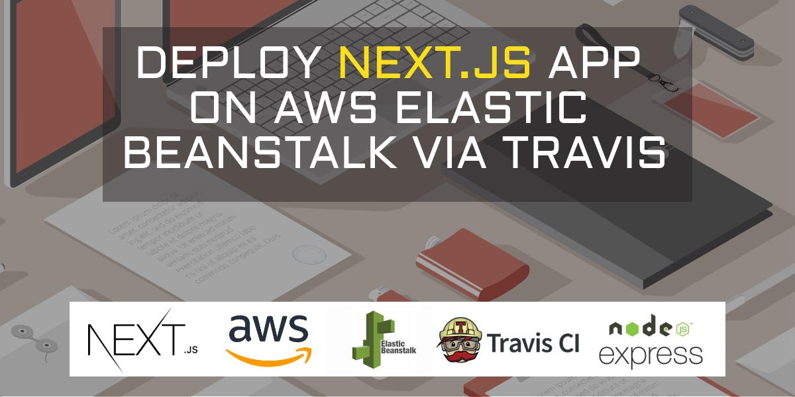
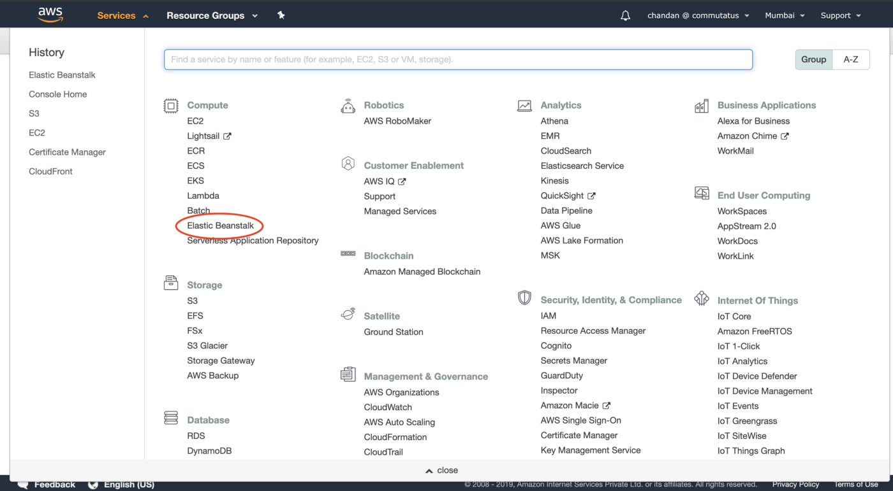
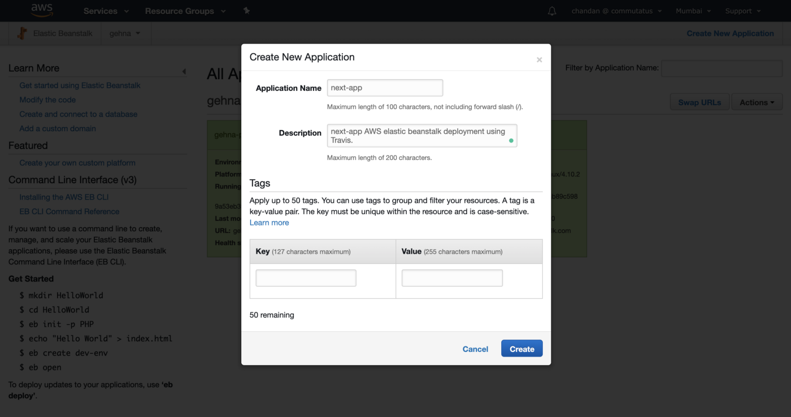
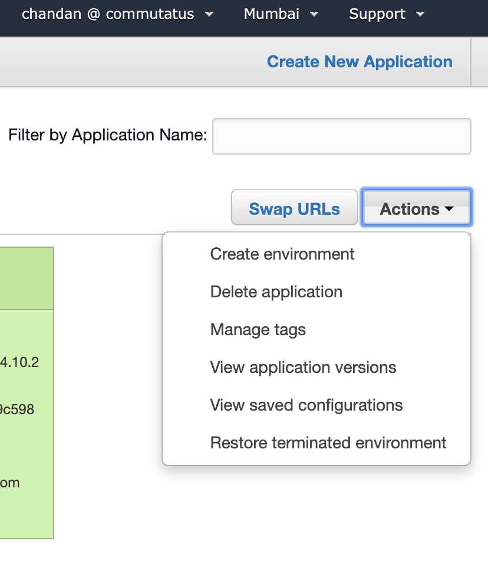
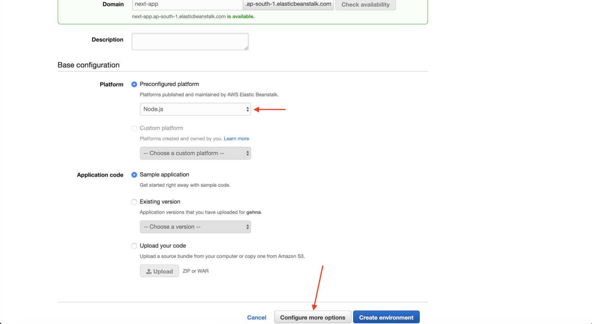
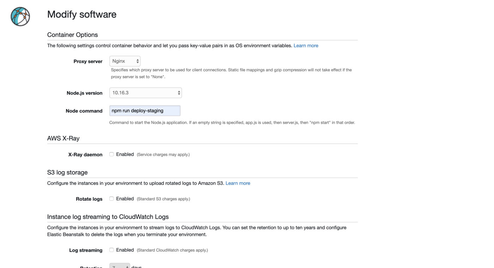
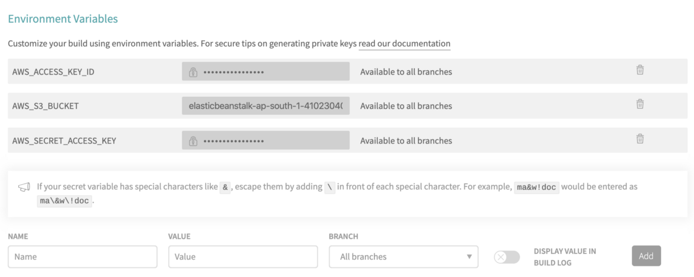
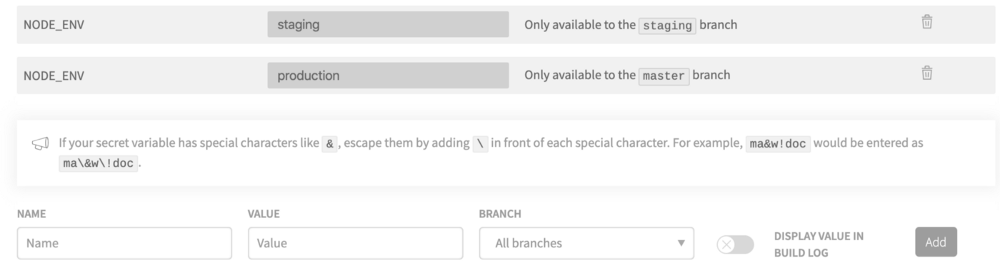

# Deploy Next.Js on AWS Elastic Beanstalk

This example shows how to build a server rendered web application with NextJS and AWS Elastic Beanstalk via Travis CI. We use AWS Elastic Beanstalk to host Next.Js applications running on a custom express server. However if you are building a serverless Next.js app, you can directly deploy it to cloud easily with [Vercel](https://vercel.com/import?filter=next.js&utm_source=github&utm_medium=readme&utm_campaign=next-example) ([Documentation](https://nextjs.org/docs/deployment)).

## How to use

### Using `create-next-app`

Execute [`create-next-app`](https://github.com/zeit/next.js/tree/canary/packages/create-next-app) with [npm](https://docs.npmjs.com/cli/init) or [Yarn](https://yarnpkg.com/lang/en/docs/cli/create/) to bootstrap the example:

```bash
npm init next-app --example with-aws-elastic-beanstalk nextjs-aws-elastic-beanstalk-app
# or
yarn create next-app --example with-aws-elastic-beanstalk nextjs-aws-elastic-beanstalk-app
```

### Download manually

Download the example:

```bash
curl https://codeload.github.com/zeit/next.js/tar.gz/canary | tar -xz --strip=2 next.js-canary/examples/with-aws-elastic-beanstalk
cd with-aws-elastic-beanstalk
```

Install it and run:

```bash
npm install
npm run dev
# or
yarn
yarn dev
```

### Steps to host your Next.js app on AWS Elastic beanstalk:



##### Step 1: Make sure your app has a server for example Express and next.config.js doesn’t have the target set to serverless.

server.js

```
const express = require('express');
const next = require('next');
const port = process.env.PORT || 3000;
const app = next({ dev });
const handle = app.getRequestHandler();

app.prepare()
.then(() => {
  const server = express();

  server.get('*', (req, res) => {
    return handle(req, res);
  });

  server.listen(port, (err) => {
    if (err) throw err;
    console.log(`> App running on http://localhost:${port}`);
  });
})
.catch((ex) => {
  console.error(ex.stack);
  process.exit(1);
});
```

##### Step 2: Edit package.json to execute your scripts for development, staging and production environments.

package.json

```
"scripts": {
        "dev": "NODE_ENV=development node ./server.js",
        "build": "next build",
        "start": "next start",
        "deploy-staging": "NODE_ENV=staging next build && NODE_ENV=staging node ./server.js",
        "deploy-production": "NODE_ENV=production next build && NODE_ENV=production node ./server.js"
},
```

##### Step 3: Go to your AWS dashboard and click on Elastic Beanstalk.



##### Step 4: Click on Create New Application and enter a name for your application.



##### Step 5: Once you have created the application, under Actions dropdown, click on Create environment



##### Step 6: Choose Web server environment and click select.


##### Step 7: Now, enter the environment name for example next-app-staging or next-app-production and choose a domain. Make sure to select Node.js under Platform settings and click on Configure more options at the bottom.



##### Step 8: Click on modify of the Software tab and type npm run deploy-staging or npm run deploy-production in the Node command field based on your environment.



##### Step 9: Click on Create Environment and wait for a few minutes to let AWS set up everything for you.

Note: Don’t worry if your application Health status shows Severe because we still didn’t upload our app to run the node command. At this point, if you want to upload the app manually, you can do so by simply zipping the entire project folder without next build folder or follow just one more step to automate the whole deployment process.

##### Step 10: Now let’s integrate Travis for CI. You can check out several online tutorials on how to set up Travis with your GitHub repository. Create a travis.yml file in the root directory and configure it as follows:

```
language: node_js
node_js:
 - "11.6.0"
branches:
  only:
  - staging
  - master
deploy:
  - provider: elasticbeanstalk
    access_key_id: ${AWS_ACCESS_KEY_ID}
    secret_access_key: ${AWS_SECRET_ACCESS_KEY}
    region: "ap-south-1"
    app: "next-app"
    env: "next-app-staging"
    bucket_name: ${AWS_S3_BUCKET}
    on:
      branch: "staging"

  - provider: elasticbeanstalk
    access_key_id: ${AWS_ACCESS_KEY_ID}
    secret_access_key: ${AWS_SECRET_ACCESS_KEY}
    region: "ap-south-1"
    app: "next-app"
    env: "next-app-production"
    bucket_name: ${AWS_S3_BUCKET}
    on:
      branch: "master"

after_deploy:
  - echo "Application Deployed!"
```

Note: The above configuration lets you deploy to different environments staging and production.
Step 11: Login to your Travis dashboard and click on your project repository. Go to more options > settings > Environment variables and add your AWS access keys and S3 bucket.



Note: You can copy the S3 bucket name after Step: 9 is completed by going to AWS Console > Services > S3. We just need to copy the bucket name and not the path.

##### Step 12: That’s it! Just push your code to Github, sit back and relax. Travis will automatically trigger a build and deploy the latest version of your Next.js app on AWS Elastic Beanstalk.

Bonus tip: To avoid any downtime of 5–10 min during the deployment process, create multiple EC2 instances/load balancers and enable rolling updates.

#### Additional Information: (Alternative build process)

The above steps will build and run your Next.js application on AWS Elastic Beanstalk and Travis is just used to push your code from GitHub to AWS. But if you want to build your app on Travis and then run it on AWS, here are the configuration changes you will have to make:
In package.json,

```
"scripts": {
"dev": "NODE_ENV=development node ./server.js",
"build": "next build",
"start": "next start",
"build-staging": "NODE_ENV=staging next build",
"deploy-staging": "NODE_ENV=staging node ./server.js",
"build-production": "NODE_ENV=production next build",
"deploy-production": "NODE_ENV=production node ./server.js"
},
```

In travis.yml, add the following lines before deploy:

```
before_script:
 - npm install
script:
 - npm run build-${NODE_ENV}
before_deploy:
 - cd $TRAVIS_BUILD_DIR
 - sed -i '/.next/d' .gitignore
 - git add . && git commit -m "latest build"
```

The above code will install npm on travis virtual machine and build your application. You can add an NODE_ENV environment variable in travis available only to a specific branch. For example:



This will ensure the right build (staging/production) is made on travis. Finally, the before_deploy: will go to your build directory, remove .next from .gitignore and commit the changes temporarily on travis.
Now that your application is built on Travis, you just need to start your app server on AWS.
