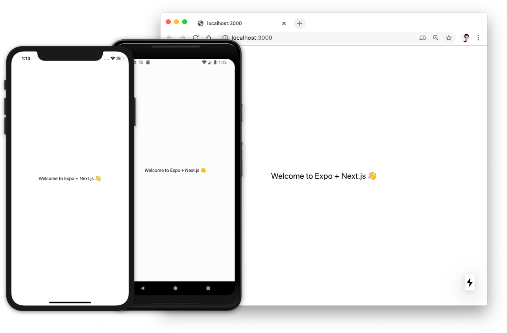

# With Expo TypeScript

[](https://itunes.apple.com/app/apple-store/id982107779)
[](https://play.google.com/store/apps/details?id=host.exp.exponent&referrer=www)
[](https://docs.expo.io/workflow/web/)

This is a starter project for creating universal React apps with Next.js, Expo, and TypeScript.

> 💡 For the most updated info, see the [Expo + Next.js Docs](https://docs.expo.io/guides/using-nextjs/)!



- Next.js cannot be used for SSR in your native app.
- The native bundle is built using the [Metro bundler](https://facebook.github.io/metro/) and may not have the same level of optimization as the web bundle which is compiled using the Next.js Webpack configuration.
- Expo transpiles `react-native-web` packages by default to enable the use of `react-native` in a browser or Node.js environment.
- All [Expo packages](https://docs.expo.io/versions/latest/) work in the browser. If you experience issues using them in a Node environment, please report them here: [Expo issues](https://github.com/expo/expo/issues).
- Most community `react-native-*` packages do not support web, please refer to [reactnative.directory](https://reactnative.directory/?web=true) for a list of web compatible packages.
- Eject the `pages/_document` component by running `yarn next-expo customize`.
- To use fonts and images, see [the Expo docs](https://docs.expo.io/guides/using-nextjs/#image-support).

## Deploy your own

Deploy the example using [Vercel](https://vercel.com?utm_source=github&utm_medium=readme&utm_campaign=next-example) (web only):

[](https://vercel.com/new/git/external?repository-url=https://github.com/vercel/next.js/tree/canary/examples/with-expo&project-name=with-expo&repository-name=with-expo)

Deploy the native app to the App store and Play store using [Expo deployment](https://docs.expo.io/distribution/app-stores/).

## How to use

Execute [`create-next-app`](https://github.com/vercel/next.js/tree/canary/packages/create-next-app) with [npm](https://docs.npmjs.com/cli/init), [Yarn](https://yarnpkg.com/lang/en/docs/cli/create/), or [pnpm](https://pnpm.io) to bootstrap the example:

```bash
npx create-next-app --example with-expo-typescript with-expo-typescript-app
```

```bash
yarn create next-app --example with-expo-typescript with-expo-typescript-app
```

```bash
pnpm create next-app --example with-expo-typescript with-expo-typescript-app
```

### Running web

> 🚨 Using default Expo web with Next.js is not supported.

- Start the Next.js project with `yarn dev` (`yarn next dev`).

Deploy the web app to the cloud with [Vercel](https://vercel.com/new?utm_source=github&utm_medium=readme&utm_campaign=next-example) ([Documentation](https://nextjs.org/docs/deployment)).

### Running native

- Install the Expo CLI `npm i -g expo-cli`.
- Start the Metro bundler with `yarn ios` or `yarn android` -- This runs `expo start` with the Expo CLI.
- You can run the mobile app using the [Expo client app](https://expo.io/tools), or by running `yarn eject` and building the project manually (this requires a macbook for iOS).

Deploy the native app to the App store and Play store using [Expo deployment](https://docs.expo.io/distribution/app-stores/).

## Troubleshooting

You may find that certain packages like `@ui-kitten/components` do not work in the browser. This is because they need to be transpiled by Next.js, you can fix this by doing the following:

- Install the following:

```sh
yarn add -D next-compose-plugins next-transpile-modules
```

- Modify the Next.js config `next.config.js`:

```js
const { withExpo } = require('@expo/next-adapter')
const withPlugins = require('next-compose-plugins')
const withTM = require('next-transpile-modules')([
  // Add the name of your package here...
  '@ui-kitten/components',
])

module.exports = withPlugins([withTM, [withExpo, { projectRoot: __dirname }]], {
  // ...
})
```
