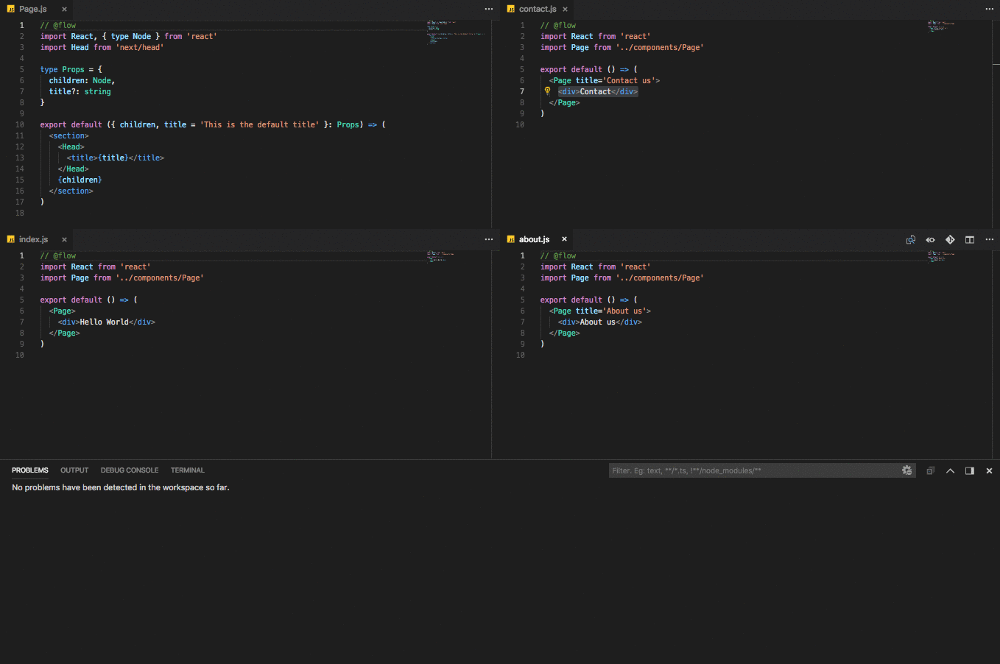

[](https://deploy.now.sh/?repo=https://github.com/zeit/next.js/tree/master/examples/with-flow)
# Example app with [Flow](https://flowtype.org/)

## How to use

### Using `create-next-app`

Download [`create-next-app`](https://github.com/segmentio/create-next-app) to bootstrap the example:

```
npm i -g create-next-app
create-next-app --example with-flow with-flow-app
```

### Download manually

Download the example [or clone the repo](https://github.com/zeit/next.js):

```bash
curl https://codeload.github.com/zeit/next.js/tar.gz/canary | tar -xz --strip=2 next.js-canary/examples/with-flow
cd with-flow
```

Install it and run:

```bash
npm install
npm run dev
```

Deploy it to the cloud with [now](https://zeit.co/now) ([download](https://zeit.co/download))

```bash
now
```

## The idea behind the example

This example shows how you can use Flow, with the transform-flow-strip-types babel plugin stripping flow type annotations from your output code.


