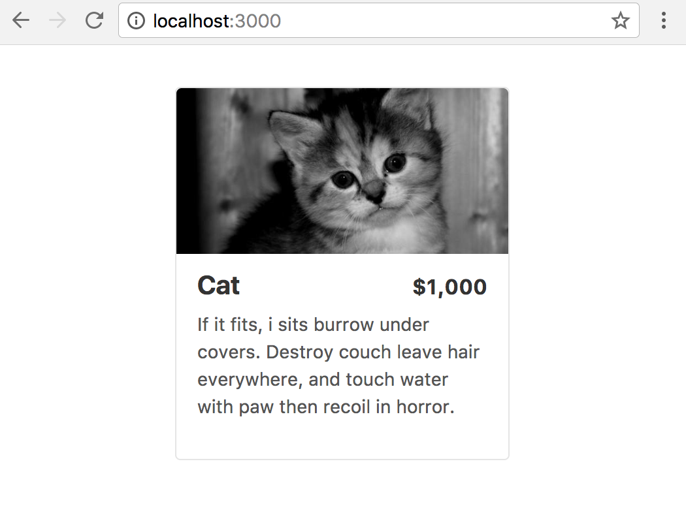

[](https://deploy.now.sh/?repo=https://github.com/zeit/next.js/tree/master/examples/with-global-stylesheet-simple)

# Global Stylesheet Example (Simple Version - CSS inside `node_modules`)

## How to use

### Using `create-next-app`

Execute [`create-next-app`](https://github.com/segmentio/create-next-app) with [Yarn](https://yarnpkg.com/lang/en/docs/cli/create/) or [npx](https://github.com/zkat/npx#readme) to bootstrap the example:

```bash
npx create-next-app --example with-global-stylesheet-simple with-global-stylesheet-simple-app
# or
yarn create next-app --example with-global-stylesheet-simple with-global-stylesheet-simple-app
```

### Download manually

Download the example:

```bash
curl https://codeload.github.com/zeit/next.js/tar.gz/master | tar -xz --strip=2 next.js-master/examples/with-global-stylesheet-simple
cd with-global-stylesheet-simple
```

Install it and run:

```bash
npm install
npm run dev
# or
yarn
yarn dev
```

Deploy it to the cloud with [now](https://zeit.co/now) ([download](https://zeit.co/download))

```bash
now
```

## The idea behind the example

This is an example of importing a CSS file located inside `node_modules` (ones you downloaded using `npm` or `yarn`).

This would be useful for importing CSS libraries such as [`normalize.css`](https://necolas.github.io/normalize.css/).

### What if I want to import my own CSS, such as `styles/foo.css`?

Check out the [with-global-stylesheet](../with-global-stylesheet) example.

### How It Works

* Install `babel-plugin-inline-import` using `npm` or `yarn`
* Then, add this to your `.babelrc`:

```js
{
  "plugins": [
    [
      "inline-import",
      {
        "extensions": [".css"]
      }
    ]
  ],
  "presets": ["next/babel"],
  "ignore": []
}
```

* Install any CSS library using `npm` or `yarn`. In this example, I installed [`tachyons`](https://tachyons.io/).
* Import the CSS file. Here, I'm importing a CSS file located at `node_modules/tachyons/css/tachyons.min.css`.

```js
import tachyons from "tachyons/css/tachyons.min.css";
```

* Add it globally using `styled-jsx`:

```js
<style jsx global>
  {tachyons}
</style>
```

### Result ([`index.js`](pages/index.js)):


