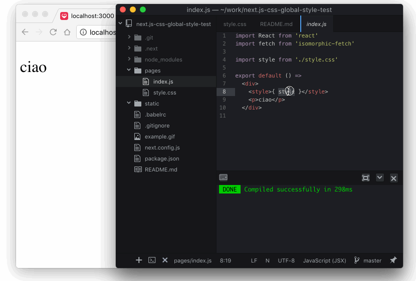

[](https://deploy.now.sh/?repo=https://github.com/zeit/next.js/tree/master/examples/with-global-stylesheet)
# Global Stylesheet example

This is an example of how you can include a global stylesheet in a next.js webapp.


## How to use

### Using `create-next-app`

Download [`create-next-app`](https://github.com/segmentio/create-next-app) to bootstrap the example:

```bash
npx create-next-app --example with-global-stylesheet with-global-stylesheet-app
# or
yarn create next-app --example with-global-stylesheet with-global-stylesheet-app
```

### Download manually

Download the example [or clone the repo](https://github.com/zeit/next.js):

```bash
curl https://codeload.github.com/zeit/next.js/tar.gz/canary | tar -xz --strip=2 next.js-canary/examples/with-global-stylesheet
cd with-global-stylesheet
```

To get this example running you just need to

    npm install .
    npm run dev

Visit [http://localhost:3000](http://localhost:3000) and try to modify `styles/index.scss` changing color. Your changes should be picked up instantly.

Also see it working with plain css here


Deploy it to the cloud with [now](https://zeit.co/now) ([download](https://zeit.co/download))

```bash
now
```


## The idea behind the example

The strategy here is to transpile the stylesheet file to a css-in-js file so that it can be loaded and hot reloaded both on the server and the client. For this purpose I created a babel loader plugin called [babel-loader-wrap-in-js](https://github.com/davibe/babel-plugin-wrap-in-js).

Another babel plugin [module-resolver](https://github.com/tleunen/babel-plugin-module-resolver) enables us to import stylesheets from js (e.g. pages or components) through a `styles` directory alias rather than relative paths.

The `sass-loader` is configured with `includePaths: ['styles', 'node_modules']` so that your scss can `@import` from those places, again without relative paths, for maximum convenience and ability to use npm-published libraries.  Furthermore, `glob` paths are also supported, so one could for example add `'node_modules/@material/*'` to the `includePaths`, which would make [material-components-web](https://github.com/material-components/material-components-web) (if you'd like) even easier to work with.

Furthermore, PostCSS is used to [pre-process](https://medium.com/@ddprrt/deconfusing-pre-and-post-processing-d68e3bd078a3) both `css` and `scss` stylesheets, the latter after Sass pre-processing.  This is to illustrate `@import 'normalize.css';` from `node_modules` thanks to `postcss-easy-import`.  [Autoprefixer](https://github.com/postcss/autoprefixer) is also added as a "best practice".  Consider [cssnext](http://cssnext.io) instead, which includes `autoprefixer` as well as many other CSS spec features.

This project shows how you can set it up. Have a look at:
- .babelrc
- next.config.js
- pages/index.js
- postcss.config.js
- styles/index.scss

Please, report any issue on enhancement related to this example to its original
github repository https://github.com/davibe/next.js-css-global-style-test

## If your stylesheets import fonts

Install `postcss-url` and insert `require('postcss-url')({ url: 'inline' })` as the 2nd element of the `plugins` array in `postcss.config.js`.
