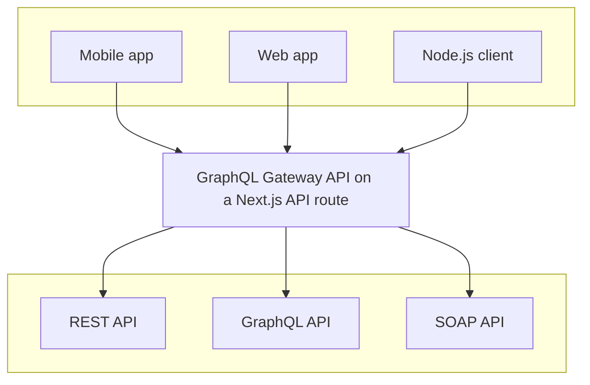

# GraphQL Gateway using GraphQL Mesh and Next.js API routes

This is a simple set up for Next.js using [GraphQL Mesh](https://www.graphql-mesh.com/docs/introduction) to build a GraphQL Gateway based on a REST API.

GraphQL Mesh is a framework that allows to build GraphQL Gateway server, based on one or multiple source APIs (REST, SOAP, gRPC, GraphQL or Databases).



Configuring GraphQL Mesh only requires installing the required packages and providing a `.meshrc.yaml` configuration file.

This project translate the PetStore REST API (https://petstore.swagger.io/) to a GraphQL API by simply providing the following configuration:

_[`.meshrc.yaml`](./.meshrc.yaml)_

```yaml
sources:
  - name: PetStore
    handler:
      newOpenapi:
        baseUrl: https://petstore.swagger.io/v2/
        oasFilePath: https://petstore.swagger.io/v2/swagger.json
```

More information on GraphQL Mesh configuration and concepts [are available in our documentation](https://www.graphql-mesh.com/docs/getting-started/overview).

---

## Deploy your own

Deploy the example using [Vercel](https://vercel.com?utm_source=github&utm_medium=readme&utm_campaign=next-example):

[](https://vercel.com/new/clone?repository-url=https://github.com/vercel/next.js/tree/canary/examples/with-graphql-gateway&project-name=with-graphql-gateway&repository-name=with-graphql-gateway&env=NEO4J_URI,NEO4J_USER,NEO4J_PASSWORD&envDescription=Required%20to%20connect%20the%20app%20with%20a%20Neo4j%20database&envLink=https://github.com/vercel/next.js/tree/canary/examples/with-graphql-gateway%23step-3-set-up-environment-variables)

---

## How to use

Execute [`create-next-app`](https://github.com/vercel/next.js/tree/canary/packages/create-next-app) with [npm](https://docs.npmjs.com/cli/init), [Yarn](https://yarnpkg.com/lang/en/docs/cli/create/), or [pnpm](https://pnpm.io) to bootstrap the example:

```bash
npx create-next-app --example with-graphql-gateway with-graphql-gateway-app
```

```bash
yarn create next-app --example with-graphql-gateway with-graphql-gateway-app
```

```bash
pnpm create next-app --example with-graphql-gateway with-graphql-gateway-app
```
