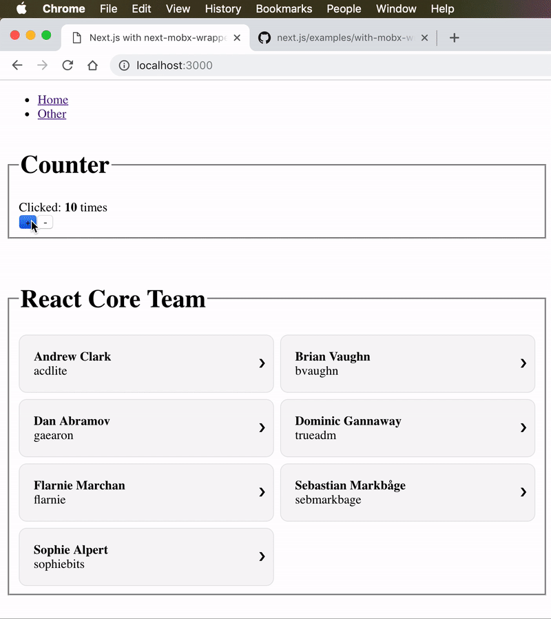

[](https://deploy.now.sh/?repo=https://github.com/zeit/next.js/tree/master/examples/with-mobx-wrapper)

# MobX example

> Multiple stores with [next-mobx-wrapper](https://github.com/nghiepit/next-mobx-wrapper)

## How to use

### Using `create-next-app`

Execute [`create-next-app`](https://github.com/segmentio/create-next-app) with [Yarn](https://yarnpkg.com/lang/en/docs/cli/create/) or [npx](https://github.com/zkat/npx#readme) to bootstrap the example:

```bash
npx create-next-app --example with-mobx-wrapper with-mobx-wrapper-app
# or
yarn create next-app --example with-mobx-wrapper with-mobx-wrapper-app
```

### Download manually

Download the example:

```bash
curl https://codeload.github.com/zeit/next.js/tar.gz/canary | tar -xz --strip=2 next.js-canary/examples/with-mobx-wrapper
cd with-mobx-wrapper
```

Install it and run:

```bash
npm install
npm run dev
# or
yarn
yarn dev
```

Deploy it to the cloud with [now](https://zeit.co/now) ([download](https://zeit.co/download))

```bash
now
```

## Notes

Decorator support is activated by adding a `.babelrc` file at the root of the project:

```json
{
  "presets": ["next/babel"],
  "plugins": [
    ["@babel/plugin-proposal-decorators", {"legacy": true}],
    ["@babel/plugin-proposal-class-properties", {"loose": true}]
  ]
}
```

### Rehydrating with server data

Be aware that data that was used on the server (and provided via `getInitialProps`) will be stringified in order to rehydrate the client with it. ~~That means, if you create a store that is, say, an `ObservableMap` and give it as prop to a page, then the server will render appropriately. But stringifying it for the client will turn the `ObservableMap` to an ordinary JavaScript object (which does not have `Map`-style methods and is not an observable). So it is better to create the store as a normal object and turn it into a `Observable` in the `render()` method. This way both sides have an `Observable` to work with.~~

## The idea behind the example

Usually splitting your app state into `pages` feels natural but sometimes you'll want to have global state for your app. This is an example on how you can use mobx that also works with our universal rendering approach. This is just a way you can do it but it's not the only one.

In this example we are going to display a digital clock that updates every second. The first render is happening in the server and then the browser will take over. To illustrate this, the server rendered clock will have a different background color than the client one.



Our page is located at `pages/index.js` so it will map the route `/`. To get the initial data for rendering we are implementing the static method `getInitialProps`, initializing the mobx store and returning the initial timestamp to be rendered. The root component for the render method is the `mobx-react Provider` that allows us to send the store down to children components so they can access to the state when required.

The trick here for supporting universal mobx is to separate the cases for the client and the server. When we are on the server we want to create a new store every time, otherwise different users data will be mixed up. If we are in the client we want to use always the same store.
