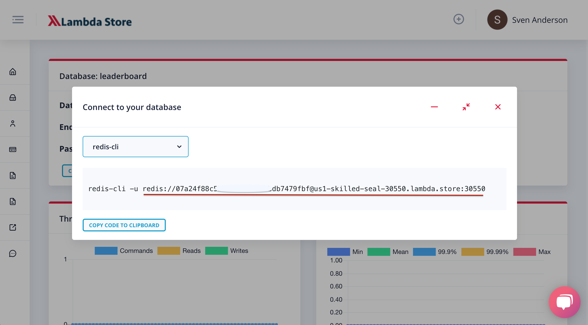
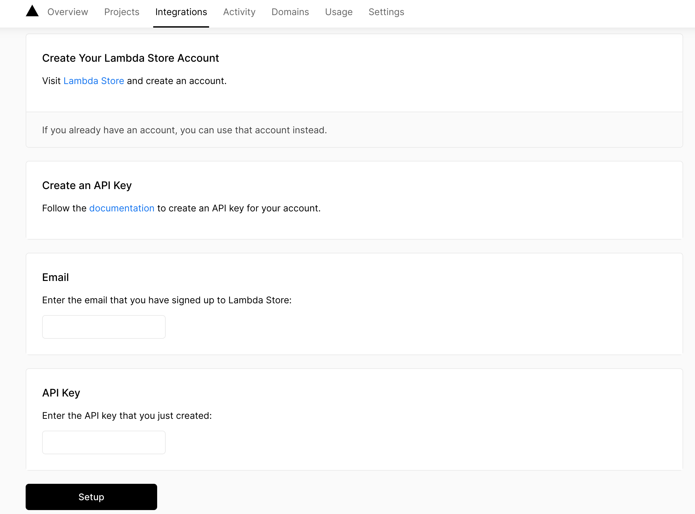
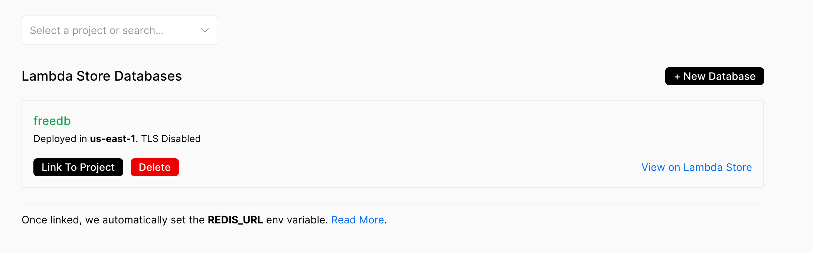
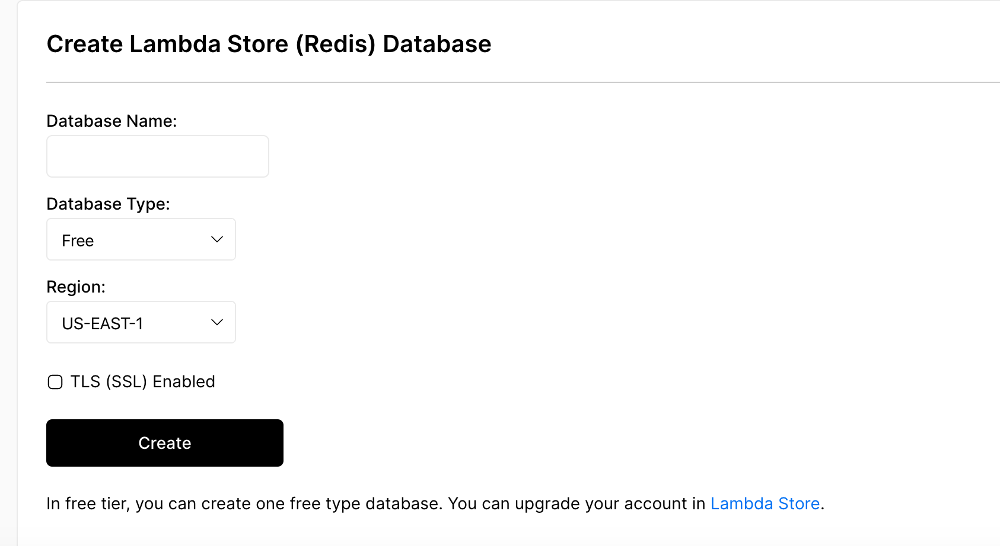
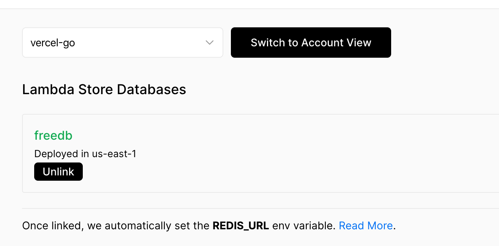
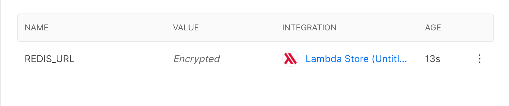

# Redis Example

This example showcases how to use Redis as a data store in a Next.js project. [Lambda Store](https://lambda.store/) is used as managed Redis service.

The example is a basic roadmap voting application where users can enter and vote for feature requests. It features the following:

- Users can add and upvote items (features in the roadmap), and enter their email addresses to be notified about the released items.
- The API records the ip-addresses of the voters, so it does not allow multiple votes on the same item from the same IP address.
- To find the id of any item, click the vote button, you will see its id on the url.

## Demo

[https://roadmap-voting-demo.vercel.app/](https://roadmap-voting-demo.vercel.app/)

## Deploy your own

Once you have access to [the environment variables you'll need](#configuration), deploy the example using [Vercel](https://vercel.com?utm_source=github&utm_medium=readme&utm_campaign=next-example):

[](https://vercel.com/import/git?c=1&s=https://github.com/vercel/next.js/tree/canary/examples/with-redis&env=REDIS_URL&envDescription=Required%20to%20connect%20the%20app%20to%20Redis&envLink=https://github.com/vercel/next.js/tree/canary/examples/with-redis%23configuration)

## How to use

Execute [`create-next-app`](https://github.com/vercel/next.js/tree/canary/packages/create-next-app) with [npm](https://docs.npmjs.com/cli/init) or [Yarn](https://yarnpkg.com/lang/en/docs/cli/create/) to bootstrap the example:

```bash
npx create-next-app --example with-redis with-redis-app
# or
yarn create next-app --example with-redis with-redis-app
```

## Configuration

A data store with Redis is required for the app to work. In the steps below we'll integrate Lambda Store as the data store.

### Without Vercel

If you are planning to deploy your application to somewhere other than Vercel, you'll need to integrate Lambda Store by setting an environment variable.

First, create an account and a database in the [Lambda Store console](https://console.lambda.store/).

To connect to Redis, you will need your Redis connection string. You can get the connection string by clicking on **Connect** in the Database page within the Lambda Store dashboard as below:



Next, create a file called `.env.local` in the root directory and copy your connection string:

```bash
REDIS_URL="YOUR_REDIS_CONNECTION_STRING"
```

Your app is now connected to a remote Redis database!

### Using Vercel

You can add the Lambda Store integration to your Vercel account. Once you set up the integration you won't have to visit the Lambda Store console anymore. Follow the next steps to setup the integration:

#### Step 1. Deploy Your Local Project

To deploy your local project to Vercel, push it to GitHub/GitLab/Bitbucket and [import to Vercel](https://vercel.com/import/git?utm_source=github&utm_medium=readme&utm_campaign=next-example).

#### Step 2. Add the Lambda Store Integration to Your Vercel Account

Visit Vercel [Lambda Store Integration](https://vercel.com/integrations/lambdastore) page and click the `Add` button.

#### Step 3. Configure the Integration

The integration requires a [Developer API Key](howto/developerapi.md) that can be created from the [Lambda Store console](https://console.lambda.store).

Enter the API key and your registered email address in the integration setup page:



#### Step 4. Create a Database

In the next page of the integration setup, your databases will be automatically listed. A new database can be created from the Vercel Integration page as well as in the Lambda Store Console:



Click the **New Database**, you should be able to see the page below:



Fill out the form and click on **Create** to have your new database.

#### Step 5. Link the Database to Your Project

Select your project from the dropdown menu then click on **Link To Project** for any database.

`REDIS_URL` will be automatically set as an environment variable for your application.





**Important:** You will need to re-deploy your application for the change to be effective.
