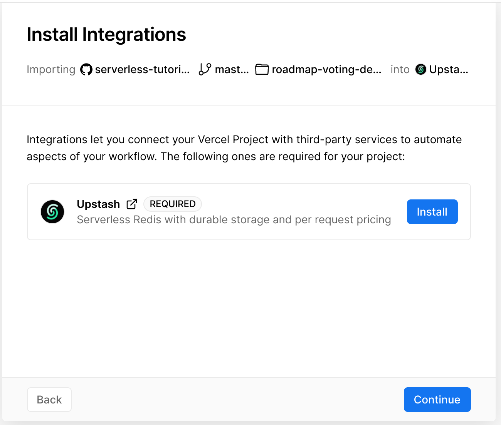
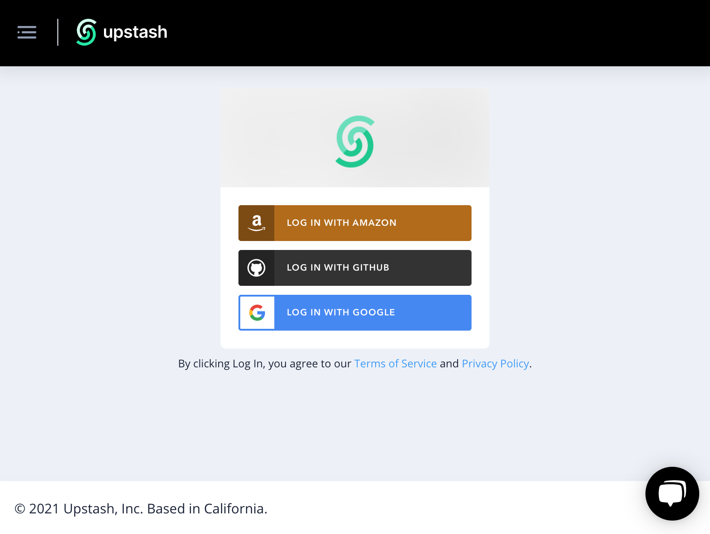
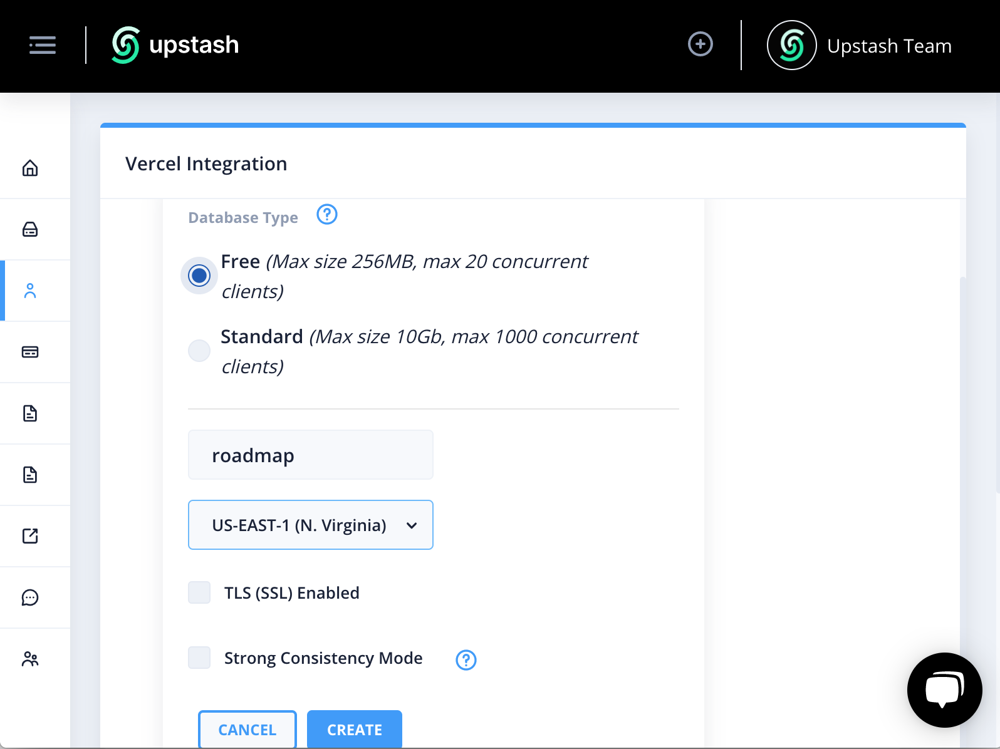
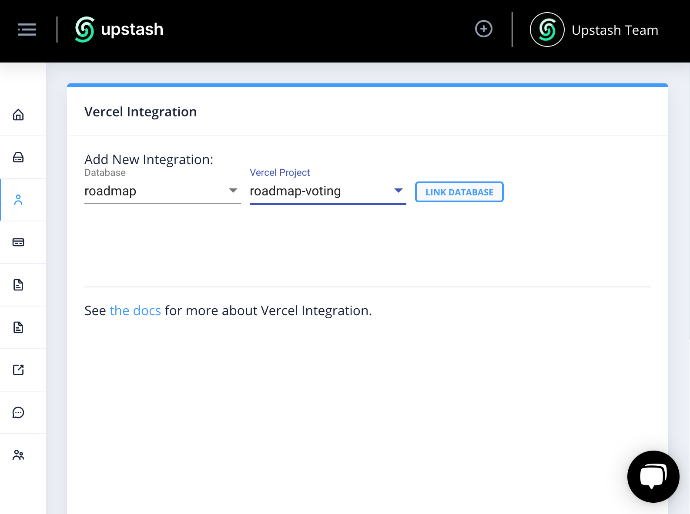
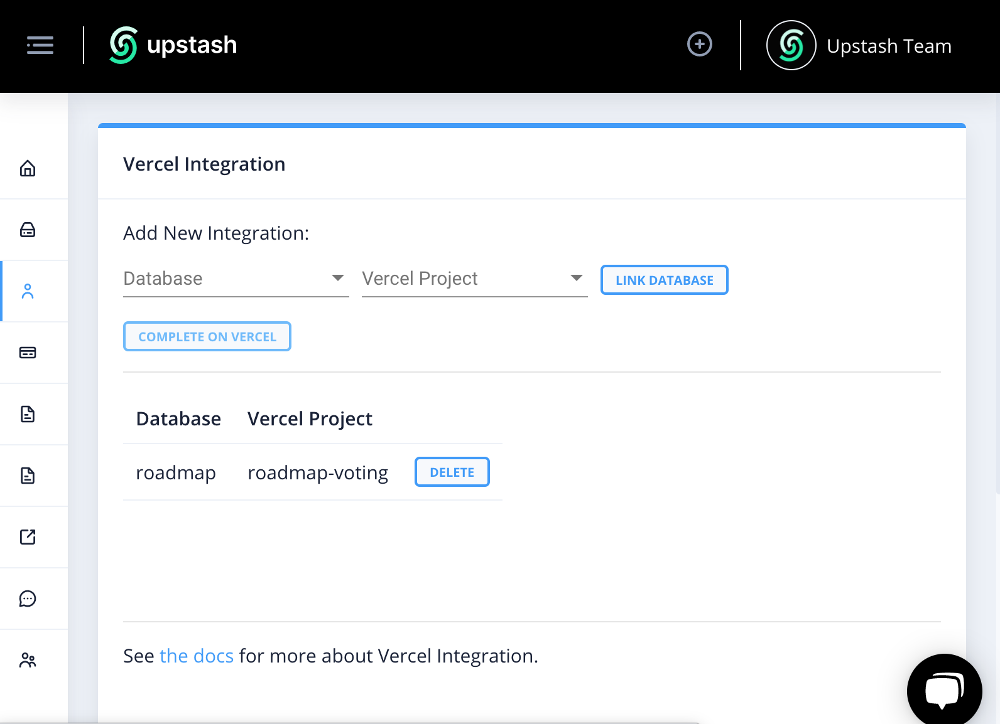
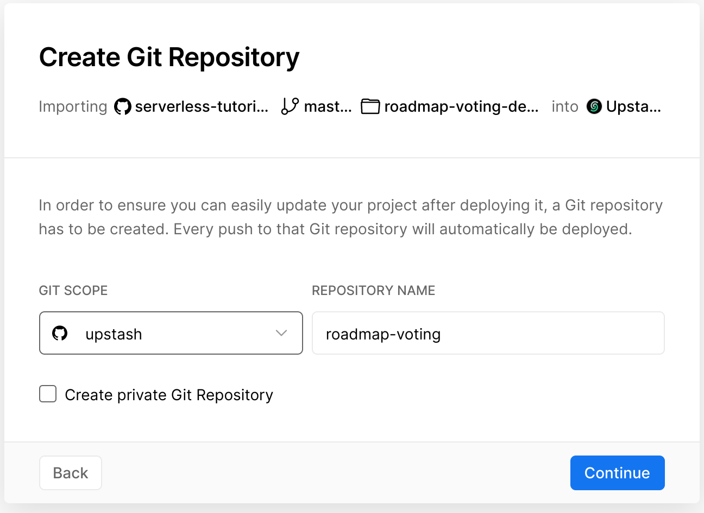
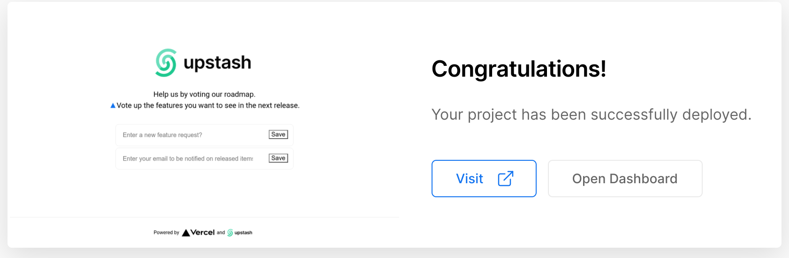

# Redis Example (with Upstash)

This example showcases how to use Redis as a data store in a Next.js project. 

The example is a roadmap voting application where users can enter and vote for feature requests. It features the following:

- Users can add and upvote items (features in the roadmap), and enter their email addresses to be notified about the released items.
- The API records the ip-addresses of the voters, so it does not allow multiple votes on the same item from the same IP address.

## Demo
See
[https://roadmap.upstash.com](https://roadmap.upstash.com)
                                    
## Deploy Your Own
You can deploy Roadmap Voting App for your project/company using [Vercel and Upstash](https://vercel.com/integrations/upstash) clicking the below button:
[](https://vercel.com/new/git/external?repository-url=https%3A%2F%2Fgithub.com%2Fupstash%2Fserverless-tutorials%2Ftree%2Fmaster%2Froadmap-voting-app&env=LOGO&envDescription=Enter%20URL%20for%20your%20project%2Fcompany%20logo&envLink=https%3A%2F%2Fdocs.upstash.com%2Fdocs%2Ftutorials%2Froadmap_voting_app&project-name=roadmap-voting&repo-name=roadmap-voting&demo-title=Roadmap%20Voting&demo-description=Roadmap%20Voting%20Page%20for%20Your%20Project&demo-url=https%3A%2F%2Froadmap.upstash.com&integration-ids=oac_V3R1GIpkoJorr6fqyiwdhl17)

## Configuration
The application uses [Upstash](https://upstash.com) (Serverless Redis Database) as its data storage. During deployment, you will be asked to integrate Upstash. The integration dialog will help you create an Upstash database for free and link it to your Vercel project with the following steps:

### Deployment Steps
After clicking the deploy button, enter a name for your project. Then you will be asked to install Upstash integration.
 

 

You can sign up/sign in the following dialog:
 

 

Create a free database:
 

 

Select your database and the Vercel project:
 

 

Click `COMPLETE ON VERCEL` button:
 

 

Finish you deployment by choosing a repository to host the project. In the next step, set the URL of your project's logo:
 

 

Your Roadmap Voting Page should be ready:
 

 

### Maintenance
The application uses a Redis database to store the feature requests and emails. The features requests are kept in a sorted set with name `roadmap`. You can connect to it via Redis-cli and manage the data using the command `zrange roadmap 0 1000 WITHSCORES`. The emails are stored in a set with name `emails`. So you can get the list by the command `smembers emails`.  

       
