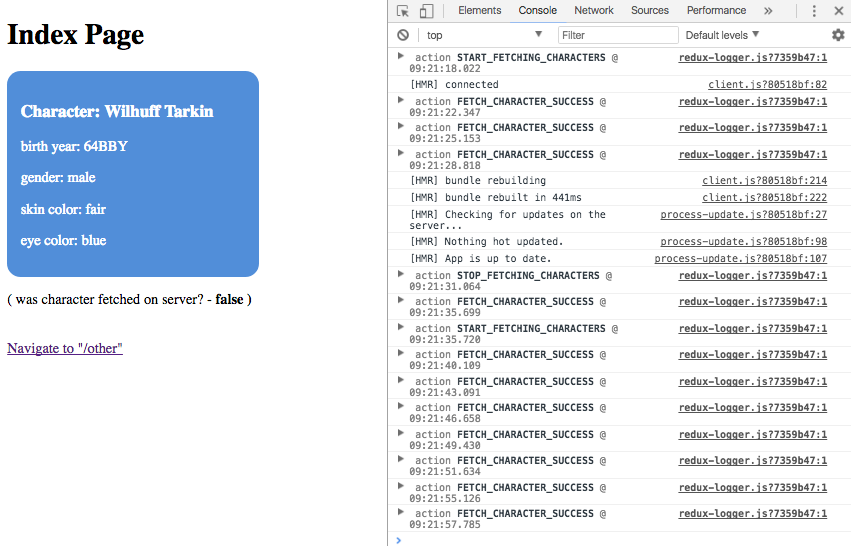

# Redux-Observable example

This example is a page that renders information about Star-Wars characters. It
fetches new character every 3 seconds having the initial character fetched on
a server.

Example also uses `redux-logger` to log every action.



## Deploy your own

Deploy the example using [Vercel](https://vercel.com?utm_source=github&utm_medium=readme&utm_campaign=next-example):

[](https://vercel.com/new/git/external?repository-url=https://github.com/vercel/next.js/tree/canary/examples/with-redux-observable&project-name=with-redux-observable&repository-name=with-redux-observable)

## How to use

Execute [`create-next-app`](https://github.com/vercel/next.js/tree/canary/packages/create-next-app) with [npm](https://docs.npmjs.com/cli/init) or [Yarn](https://yarnpkg.com/lang/en/docs/cli/create/) to bootstrap the example:

```bash
npx create-next-app --example with-redux-observable with-redux-observable-app
# or
yarn create next-app --example with-redux-observable with-redux-observable-app
```

Deploy it to the cloud with [Vercel](https://vercel.com/new?utm_source=github&utm_medium=readme&utm_campaign=next-example) ([Documentation](https://nextjs.org/docs/deployment)).

Note: we are not using `AjaxObservable` from the `rxjs` library; as of rxjs
v5.5.6, it will not work on both the server- and client-side. Instead we call
the default export from
[universal-rxjs-ajax](https://www.npmjs.com/package/universal-rxjs-ajax) (as
`request`).

We transform the Observable we get from `ajax` into a Promise in order to await
its resolution. That resolution should be a action (since the epic returns
Observables of actions). We immediately dispatch that action to the store.

This server-side solution allows compatibility with Next. It may not be
something you wish to emulate. In other situations, calling or awaiting epics
directly and passing their result to the store would be an anti-pattern. You
should only trigger epics by dispatching actions. This solution may not
generalise to resolving more complicated sets of actions.

The layout of the redux related functionality is split between:

    - actions (in `redux/actions.js`)
    - actionTypes (in `redux/actionTypes.js`)
    - epics (in `redux/epics.js`)
    - reducer (in `redux/reducer.js`)

and organized in `redux/index.js`.

Excepting in those manners discussed above, the configuration is similar the
configuration found in [with-redux example](https://github.com/vercel/next.js/tree/canary/examples/with-redux)
and [redux-observable docs](https://redux-observable.js.org/).
