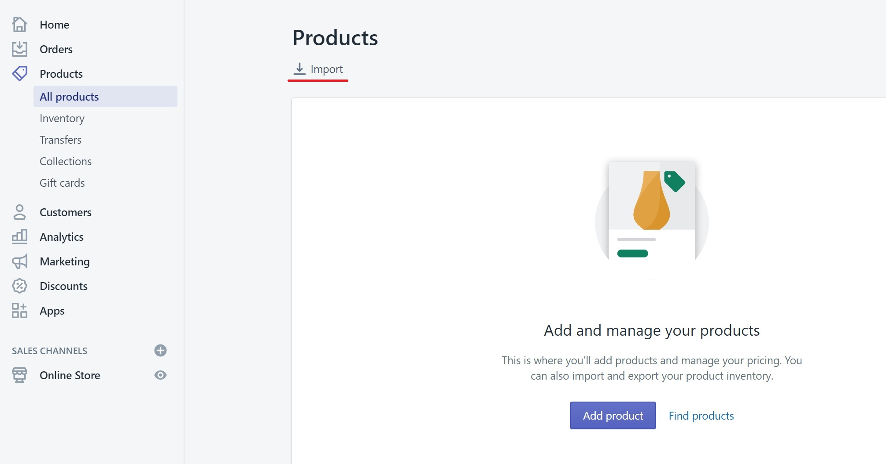
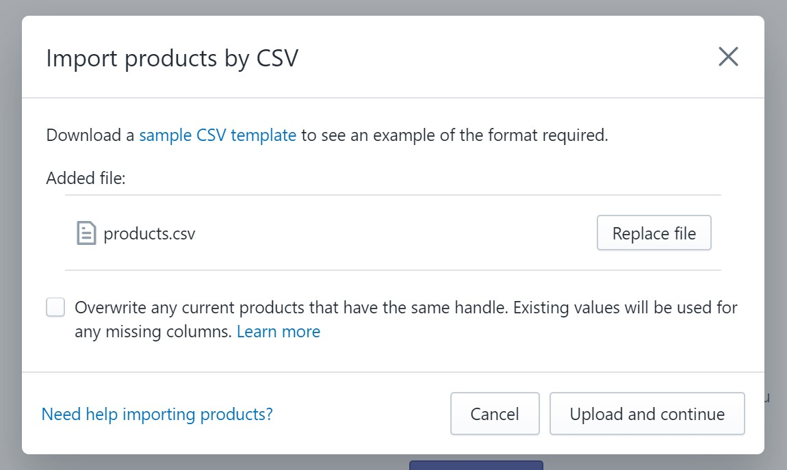
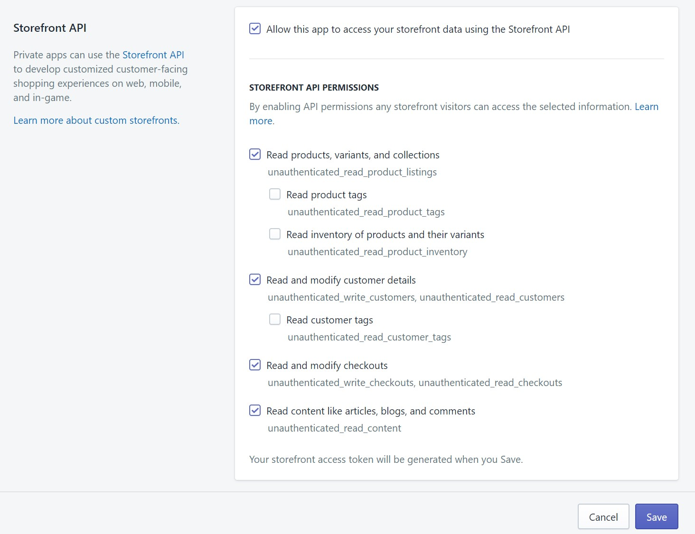

# A statically generated ecommerce example using Next.js and Shopify

This example showcases Next.js's [Static Generation](https://nextjs.org/docs/basic-features/pages) feature using [Shopify](https://www.shopify.com/) as the data source.

## Demo

TODO

## Deploy your own

Deploy the example using [Vercel](https://vercel.com?utm_source=github&utm_medium=readme&utm_campaign=next-example):

[](https://vercel.com/import/git?c=1&s=https://github.com/vercel/next.js/tree/canary/examples/with-shopify)

## How to use

### Using `create-next-app`

Execute [`create-next-app`](https://github.com/vercel/next.js/tree/canary/packages/create-next-app) with [npm](https://docs.npmjs.com/cli/init) or [Yarn](https://yarnpkg.com/lang/en/docs/cli/create/) to bootstrap the example:

```bash
npx create-next-app --example with-shopify with-shopify-app
# or
yarn create next-app --example with-shopify with-shopify-app
```

### Download manually

Download the example:

```bash
curl https://codeload.github.com/vercel/next.js/tar.gz/canary | tar -xz --strip=2 next.js-canary/examples/with-shopify
cd with-shopify
```

## Configuration

The app includes the environment variables of our development store ([`.env`](./.env)), those are there only for example purposes and should be replaced with the ones in your Shopify Store. The following steps will guide you through the process of creating a Shopify account and setting up your store.

### Step 1. Create an account and a project on Shopify

First, [create an account on Shopify](https://www.shopify.com/signup).

### Step 2. Populate Products

From your Shopify admin, go to **Products** and then click on **Import**:



Inside the import modal, paste the [`products.csv`](./products.csv) that's in the main directory:



Click on **Upload and continue**, and then on **Import products** to start the import process. After the import is done, you should be able to see the products.

> **Note:** Importing the products may take some minutes

You can manually add products too, the example currently supports products that have a title, description, price, and at least one image. You can also add discounts, variants for `Size` and `Color`, and multiple images.

### Step 3. Set up environment variables

The example uses the [Shopify Storefront API](https://shopify.dev/docs/storefront-api). Follow the steps in [this guide](https://shopify.dev/docs/storefront-api/getting-started#private-app) to create a new private app for your store that has Storefront enabled.

In your custom app, under the **Storefront API** section, the default permissions should be enough to get the example working, it should look like this:



Now that you have a custom app, copy the **Storefront access token** (it's under **Storefront API**) and open the `.env` file in this directory:

- `NEXT_PUBLIC_SHOPIFY_GRAPHQL_API_URL` should be `https://<my-domain.com>/api/2020-04/graphql`, where `<my-domain.com>` should be the domain of your store. For example: `next-js-example.myshopify.com`
- `NEXT_PUBLIC_SHOPIFY_STOREFRONT_ACCESS_TOKEN` should match the **Storefront access token** that's under the **Storefront API** section in the custom app you created

### Step 4. Run Next.js in development mode

```bash
npm install
npm run dev

# or

yarn install
yarn dev
```

### Step 5. Optionally add another page

[Shopify Pages](https://help.shopify.com/en/manual/online-store/legacy/pages) allow you to have custom pages and are also supported by the example.

Follow the [steps in the official guide](https://help.shopify.com/en/manual/online-store/legacy/pages#add-a-new-webpage-to-your-online-store) to create a new page. A good use case would be to have an `About` page like in [our demo](TODO).

### Step 6. Optionally add store policies

[Store Policies](https://help.shopify.com/en/manual/checkout-settings/refund-privacy-tos) allow you to have custom pages for policies similar to the way Shopify Pages work.

Follow the [steps in the official guide](https://help.shopify.com/en/manual/checkout-settings/refund-privacy-tos#add-or-generate-store-policies) to create a policy page. You can see an example in [our demo](TODO).

### Step 7. Deploy on Vercel

You can deploy this app to the cloud with [Vercel](https://vercel.com?utm_source=github&utm_medium=readme&utm_campaign=next-example) ([Documentation](https://nextjs.org/docs/deployment)).

#### Deploy Your Local Project

To deploy your local project to Vercel, push it to GitHub/GitLab/Bitbucket and [import to Vercel](https://vercel.com/import/git?utm_source=github&utm_medium=readme&utm_campaign=next-example).

#### Deploy from Our Template

Alternatively, you can deploy using our template by clicking on the Deploy button below.

[](https://vercel.com/import/git?c=1&s=https://github.com/vercel/next.js/tree/canary/examples/with-shopify)
