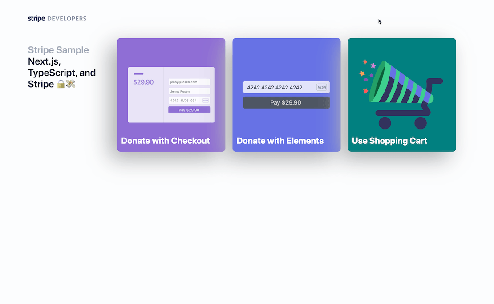
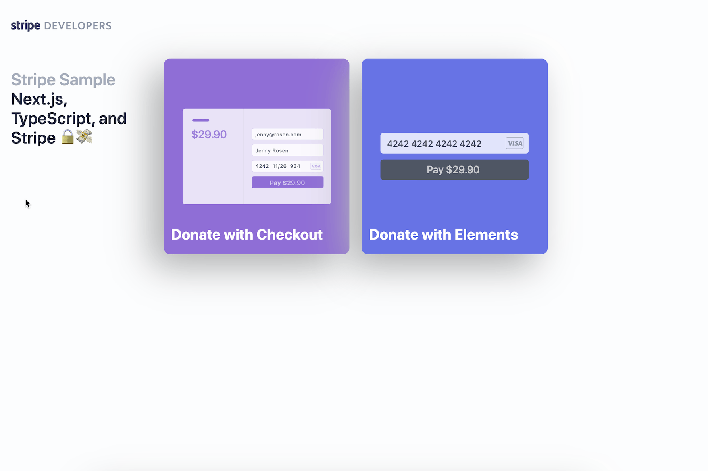
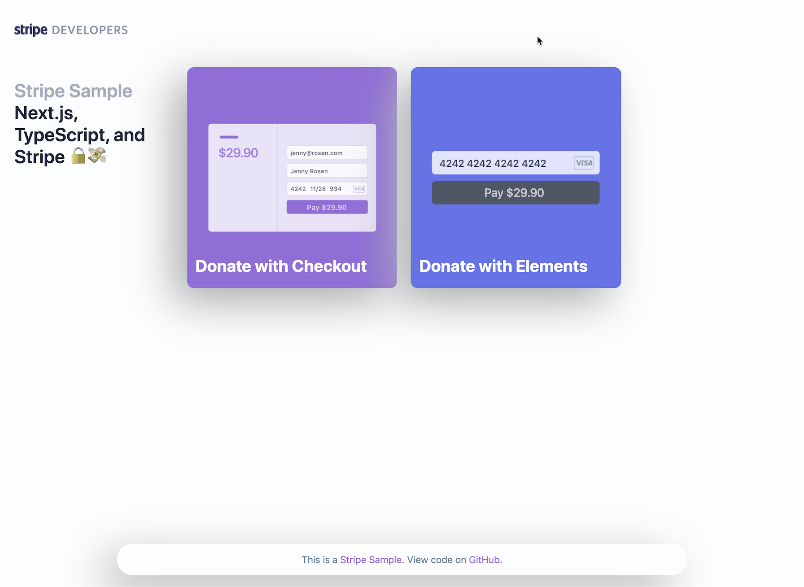

# Example using Stripe with TypeScript and react-stripe-js

This is a full-stack TypeScript example using:

- Frontend:
  - Next.js and [SWR](https://github.com/zeit/swr)
  - [react-stripe-js](https://github.com/stripe/react-stripe-js) for [Checkout](https://stripe.com/checkout) and [Elements](https://stripe.com/elements)
- Backend
  - Next.js [API routes](https://nextjs.org/docs/api-routes/introduction)
  - [stripe-node with TypeScript](https://github.com/stripe/stripe-node#usage-with-typescript)

## Demo

- Live demo: https://nextjs-typescript-react-stripe-js.vercel.app/
- CodeSandbox: https://codesandbox.io/s/github/stripe-samples/nextjs-typescript-react-stripe-js
- Tutorial: https://dev.to/thorwebdev/type-safe-payments-with-next-js-typescript-and-stripe-4jo7

The demo is running in test mode -- use `4242424242424242` as a test card number with any CVC + future expiration date.

Use the `4000000000003220` test card number to trigger a 3D Secure challenge flow.

Read more about testing on Stripe at https://stripe.com/docs/testing.

<details open><summary>Shopping Cart Checkout Demo</summary>

</details>

<details><summary>Checkout Donations Demo</summary>

</details>

<details><summary>Elements Donations Demo</summary>

</details>

## Deploy your own

Once you have access to [the environment variables you'll need](#required-configuration) from the [Stripe Dashboard](https://dashboard.stripe.com/apikeys), deploy the example using [Vercel](https://vercel.com?utm_source=github&utm_medium=readme&utm_campaign=next-example):

[](https://vercel.com/new/git/external?repository-url=https://github.com/vercel/next.js/tree/canary/examples/with-stripe-typescript&project-name=with-stripe-typescript&repository-name=with-stripe-typescript&env=NEXT_PUBLIC_STRIPE_PUBLISHABLE_KEY,STRIPE_SECRET_KEY&envDescription=Enter%20your%20Stripe%20Keys&envLink=https://github.com/vercel/next.js/tree/canary/examples/with-stripe-typescript%23required-configuration)

## Included functionality

- [Global CSS styles](https://nextjs.org/blog/next-9-2#built-in-css-support-for-global-stylesheets)
- Implementation of a Layout component that loads and sets up Stripe.js and Elements for usage with SSR via `loadStripe` helper: [components/Layout.tsx](components/Layout.tsx).
- Stripe Checkout
  - Custom Amount Donation with redirect to Stripe Checkout:
    - Frontend: [pages/donate-with-checkout.tsx](pages/donate-with-checkout.tsx)
    - Backend: [pages/api/checkout_sessions/](pages/api/checkout_sessions/)
    - Checkout payment result page that uses [SWR](https://github.com/zeit/swr) hooks to fetch the CheckoutSession status from the API route: [pages/result.tsx](pages/result.tsx).
- Stripe Elements
  - Custom Amount Donation with Stripe Elements & PaymentIntents (no redirect):
    - Frontend: [pages/donate-with-elements.tsx](pages/donate-with-checkout.tsx)
    - Backend: [pages/api/payment_intents/](pages/api/payment_intents/)
- Webhook handling for [post-payment events](https://stripe.com/docs/payments/accept-a-payment#web-fulfillment)
  - By default Next.js API routes are same-origin only. To allow Stripe webhook event requests to reach our API route, we need to add `micro-cors` and [verify the webhook signature](https://stripe.com/docs/webhooks/signatures) of the event. All of this happens in [pages/api/webhooks/index.ts](pages/api/webhooks/index.ts).
- Helpers
  - [utils/api-helpers.ts](utils/api-helpers.ts)
    - helpers for GET and POST requests.
  - [utils/stripe-helpers.ts](utils/stripe-helpers.ts)
    - Format amount strings properly using `Intl.NumberFormat`.
    - Format amount for usage with Stripe, including zero decimal currency detection.

## How to use

Execute [`create-next-app`](https://github.com/vercel/next.js/tree/canary/packages/create-next-app) with [npm](https://docs.npmjs.com/cli/init) or [Yarn](https://yarnpkg.com/lang/en/docs/cli/create/) to bootstrap the example:

```bash
npx create-next-app --example with-stripe-typescript with-stripe-typescript-app
# or
yarn create next-app --example with-stripe-typescript with-stripe-typescript-app
```

### Required configuration

Copy the `.env.local.example` file into a file named `.env.local` in the root directory of this project:

```bash
cp .env.local.example .env.local
```

You will need a Stripe account ([register](https://dashboard.stripe.com/register)) to run this sample. Go to the Stripe [developer dashboard](https://stripe.com/docs/development#api-keys) to find your API keys and replace them in the `.env.local` file.

```bash
NEXT_PUBLIC_STRIPE_PUBLISHABLE_KEY=<replace-with-your-publishable-key>
STRIPE_SECRET_KEY=<replace-with-your-secret-key>
```

Now install the dependencies and start the development server.

```bash
npm install
npm run dev
# or
yarn
yarn dev
```

### Forward webhooks to your local dev server

First [install the CLI](https://stripe.com/docs/stripe-cli) and [link your Stripe account](https://stripe.com/docs/stripe-cli#link-account).

Next, start the webhook forwarding:

```bash
stripe listen --forward-to localhost:3000/api/webhooks
```

The CLI will print a webhook secret key to the console. Set `STRIPE_WEBHOOK_SECRET` to this value in your `.env.local` file.

### Setting up a live webhook endpoint

After deploying, copy the deployment URL with the webhook path (`https://your-url.vercel.app/api/webhooks`) and create a live webhook endpoint [in your Stripe dashboard](https://stripe.com/docs/webhooks/setup#configure-webhook-settings).

Once created, you can click to reveal your webhook's signing secret. Copy the webhook secret (`whsec_***`) and add it as a new environment variable in your [Vercel Dashboard](https://vercel.com/dashboard):

- Select your newly created project.
- Navigate to the Settings tab.
- In the general settings scroll to the "Environment Variables" section.

After adding an environment variable you will need to rebuild your project for it to become within your code. Within your project Dashboard, navigate to the "Deployments" tab, select the most recent deployment, click the overflow menu button (next to the "Visit" button) and select "Redeploy".

### Deploy on Vercel

You can deploy this app to the cloud with [Vercel](https://vercel.com?utm_source=github&utm_medium=readme&utm_campaign=next-example) ([Documentation](https://nextjs.org/docs/deployment)).

#### Deploy Your Local Project

To deploy your local project to Vercel, push it to GitHub/GitLab/Bitbucket and [import to Vercel](https://vercel.com/new?utm_source=github&utm_medium=readme&utm_campaign=next-example).

**Important**: When you import your project on Vercel, make sure to click on **Environment Variables** and set them to match your `.env.local` file.

#### Deploy from Our Template

Alternatively, you can deploy using our template by clicking on the Deploy button below.

[](https://vercel.com/new/git/external?repository-url=https://github.com/vercel/next.js/tree/canary/examples/with-stripe-typescript&project-name=with-stripe-typescript&repository-name=with-stripe-typescript&env=NEXT_PUBLIC_STRIPE_PUBLISHABLE_KEY,STRIPE_SECRET_KEY&envDescription=Enter%20your%20Stripe%20Keys&envLink=https://github.com/vercel/next.js/tree/canary/examples/with-stripe-typescript%23required-configuration)

## Authors

- [@thorsten-stripe](https://twitter.com/thorwebdev)
- [@lfades](https://twitter.com/luis_fades)
