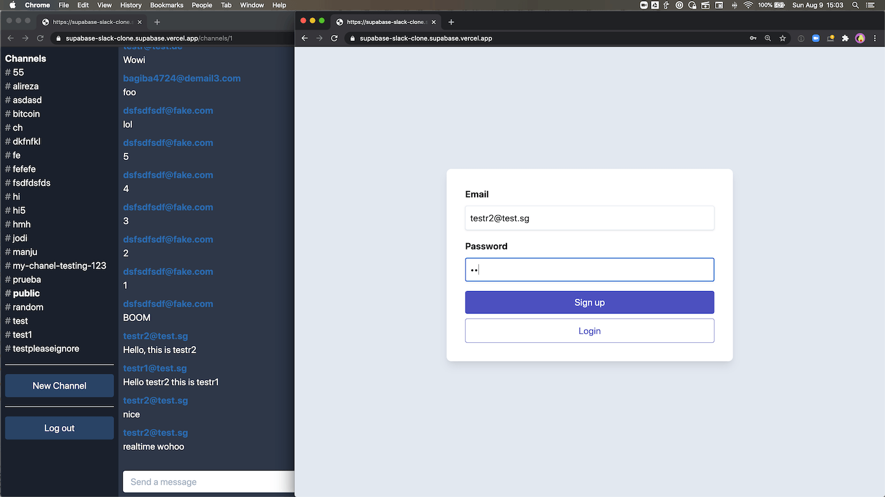

# Realtime chat example using Supabase

This is a full-stack Slack clone example using:

- Frontend:
  - Next.js.
  - [Supabase](https://supabase.io/docs/library/getting-started) for user management and realtime data syncing.
- Backend:
  - [app.supabase.io](https://app.supabase.io/): hosted Postgres database with restful API for usage with Supabase.js.



This example is a clone of the [Slack Clone example](https://github.com/supabase/supabase/tree/master/examples/slack-clone) in the supabase repo, feel free to check it out!

## Deploy your own

Once you have access to [the environment variables you'll need](#step-3-set-up-environment-variables), deploy the example using [Vercel](https://vercel.com?utm_source=github&utm_medium=readme&utm_campaign=next-example):

[](https://vercel.com/import/git?c=1&s=https://github.com/vercel/next.js/tree/canary/examples/with-supabase-auth-realtime-db&env=NEXT_PUBLIC_SUPABASE_URL,NEXT_PUBLIC_SUPABASE_KEY&envDescription=Required%20to%20connect%20the%20app%to%Supabase&envLink=https://github.com/vercel/next.js/tree/canary/examples/with-supabase-auth-realtime-db%23step-3-set-up-environment-variables&project-name=supabase-slack-clone&repo-name=supabase-slack-clone)

## How to use

Execute [`create-next-app`](https://github.com/vercel/next.js/tree/canary/packages/create-next-app) with [npm](https://docs.npmjs.com/cli/init) or [Yarn](https://yarnpkg.com/lang/en/docs/cli/create/) to bootstrap the example:

```bash
npx create-next-app --example with-supabase-auth-realtime-db realtime-chat-app
# or
yarn create next-app --example with-supabase-auth-realtime-db realtime-chat-app
```

## Configuration

### Step 1. Create a new Supabase project

Sign up to Supabase - [https://app.supabase.io](https://app.supabase.io) and create a new project. Wait for your database to start.

### Step 2. Run the "Slack Clone" Quickstart

Once your database has started, run the "Slack Clone" quickstart.


### Step 3. Set up environment variables

In your Supabase project, go to Project Settings (the cog icon), open the API tab, and find your **API URL** and **anon** key, you'll need these in the next step.


Next, copy the `.env.local.example` file in this directory to `.env.local` (which will be ignored by Git):

```bash
cp .env.local.example .env.local
```

Then set each variable on `.env.local`:

- `NEXT_PUBLIC_SUPABASE_URL` should be the **API URL**
- `NEXT_PUBLIC_SUPABASE_KEY` should be the **anon** key

The **anon** key is your client-side API key. It allows "anonymous access" to your database, until the user has logged in. Once they have logged in, the keys will switch to the user's own login token. This enables row level security for your data. Read more about this [below](#postgres-row-level-security).

> **_NOTE_**: The `service_role` key has full access to your data, bypassing any security policies. These keys have to be kept secret and are meant to be used in server environments and never on a client or browser.

### Step 4. Run Next.js in development mode

```bash
npm install
npm run dev

# or

yarn install
yarn dev
```

Visit [http://localhost:3000](http://localhost:3000) and start chatting! Open a channel across two browser tabs to see everything getting updated in realtime 🥳. If it doesn't work, post on [GitHub discussions](https://github.com/vercel/next.js/discussions).

### Step 5. Deploy on Vercel

You can deploy this app to the cloud with [Vercel](https://vercel.com?utm_source=github&utm_medium=readme&utm_campaign=next-example) ([Documentation](https://nextjs.org/docs/deployment)).

#### Deploy Your Local Project

To deploy your local project to Vercel, push it to GitHub/GitLab/Bitbucket and [import to Vercel](https://vercel.com/import/git?utm_source=github&utm_medium=readme&utm_campaign=next-example).

**Important**: When you import your project on Vercel, make sure to click on **Environment Variables** and set them to match your `.env.local` file.

#### Deploy from Our Template

Alternatively, you can deploy using our template by clicking on the Deploy button below.

[](https://vercel.com/import/git?c=1&s=https://github.com/vercel/next.js/tree/canary/examples/with-supabase-auth-realtime-db&env=NEXT_PUBLIC_SUPABASE_URL,NEXT_PUBLIC_SUPABASE_KEY&envDescription=Required%20to%20connect%20the%20app%to%Supabase&envLink=https://github.com/vercel/next.js/tree/canary/examples/with-supabase-auth-realtime-db%23step-3-set-up-environment-variables&project-name=supabase-slack-clone&repo-name=supabase-slack-clone)

## Supabase details

### Postgres Row level security

This project uses very high-level Authorization using Postgres' Role Level Security.
When you start a Postgres database on Supabase, we populate it with an `auth` schema, and some helper functions.
When a user logs in, they are issued a JWT with the role `authenticated` and thier UUID.
We can use these details to provide fine-grained control over what each user can and cannot do.

This is a trimmed-down schema, with the policies:

```sql
-- USER PROFILES
CREATE TYPE public.user_status AS ENUM ('ONLINE', 'OFFLINE');
CREATE TABLE public.users (
  id uuid NOT NULL PRIMARY KEY, -- UUID from auth.users (Supabase)
  username text,
  status user_status DEFAULT 'OFFLINE'::public.user_status
);
ALTER TABLE public.users ENABLE ROW LEVEL SECURITY;
CREATE POLICY "Allow logged-in read access" on public.users FOR SELECT USING ( auth.role() = 'authenticated' );
CREATE POLICY "Allow individual insert access" on public.users FOR INSERT WITH CHECK ( auth.uid() = id );
CREATE POLICY "Allow individual update access" on public.users FOR UPDATE USING ( auth.uid() = id );

-- CHANNELS
CREATE TABLE public.channels (
  id bigint GENERATED BY DEFAULT AS IDENTITY PRIMARY KEY,
  inserted_at timestamp with time zone DEFAULT timezone('utc'::text, now()) NOT NULL,
  slug text NOT NULL UNIQUE
);
ALTER TABLE public.channels ENABLE ROW LEVEL SECURITY;
CREATE POLICY "Allow logged-in full access" on public.channels FOR ALL USING ( auth.role() = 'authenticated' );

-- MESSAGES
CREATE TABLE public.messages (
  id bigint GENERATED BY DEFAULT AS IDENTITY PRIMARY KEY,
  inserted_at timestamp with time zone DEFAULT timezone('utc'::text, now()) NOT NULL,
  message text,
  user_id uuid REFERENCES public.users NOT NULL,
  channel_id bigint REFERENCES public.channels NOT NULL
);
ALTER TABLE public.messages ENABLE ROW LEVEL SECURITY;
CREATE POLICY "Allow logged-in read access" on public.messages USING ( auth.role() = 'authenticated' );
CREATE POLICY "Allow individual insert access" on public.messages FOR INSERT WITH CHECK ( auth.uid() = user_id );
CREATE POLICY "Allow individual update access" on public.messages FOR UPDATE USING ( auth.uid() = user_id );
```
