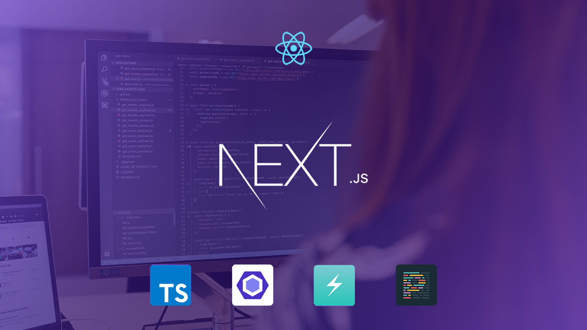
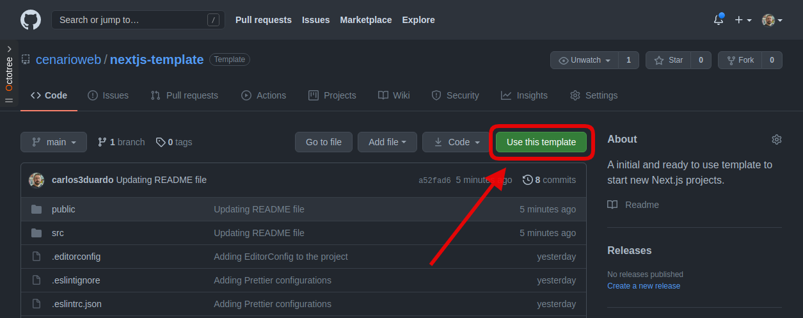
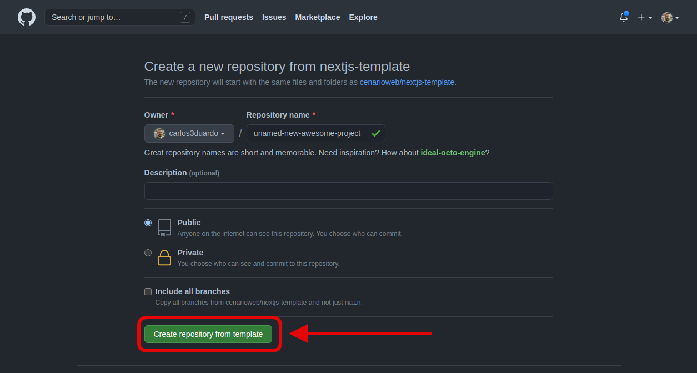
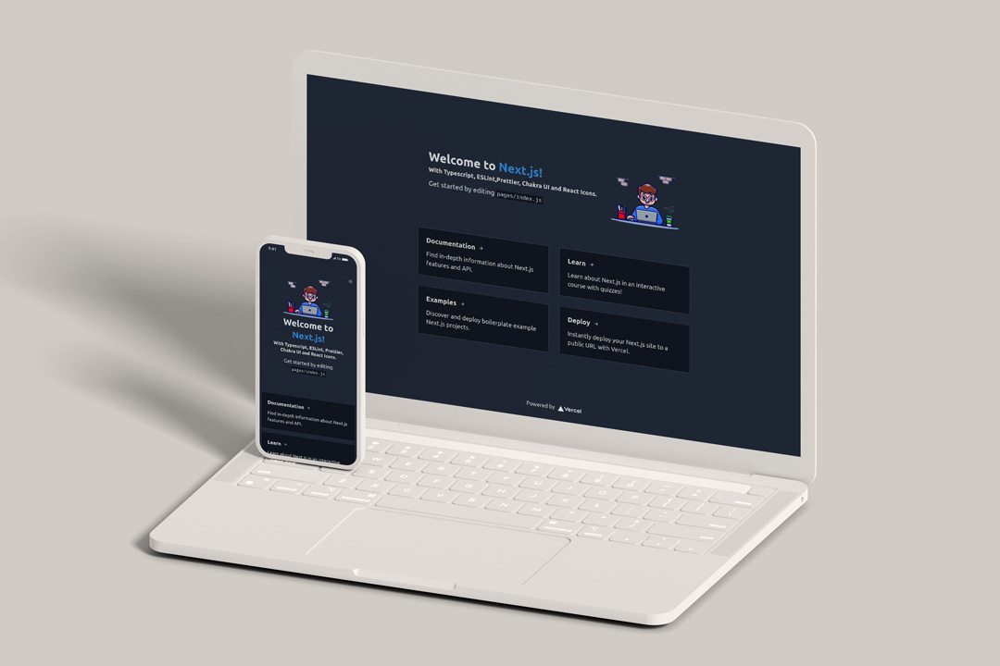

<p align="center">
  
</p>

## About

This is a ready [Next.js](https://nextjs.org) code structure with [TypeScript](https://www.typescriptlang.org), [ESLint](https://eslint.org), [Chakra UI](https://chakra-ui.com) and [Prettier](https://prettier.io) to start new projects.

Online demo: [https://nextjs-template-cenarioweb.vercel.app/](https://nextjs-template-cenarioweb.vercel.app/)

## Pre-requisites

Before you begin, you will need to have the following tools installed on your machine:

- [Git](https://git-scm.com)
- [Node.js](https://nodejs.org/en/)
- [Yarn](https://yarnpkg.com/)

In addition, it is good to have an editor to work with the code like [Visual Studio Code](https://code.visualstudio.com/).

## How to use

You just clone this repo or click in **Use this template** button to create a new project from this template.

<p align="center">
  
</p>

Input the name of your awesome project and click in **Create repository com template**.

<p align="center">
  
</p>

## Running the application

```bash

# Clone your repository create from this template
$ git clone git@github.com:<username>/<project-name> <project-folder>

# Access the project folder in your terminal
$ cd <project-folder>

# Install the dependencies
$ yarn

# Run the application in development mode
$ yarn dev

# The application will open on the port: 3000 - go to http://localhost:3000

```

## That's it. You done!

| Light mode | Dark Mode |
|------------|-----------|
|||

## Tech Stack

The following tools were used in the construction of the project. Open the links to know more.

-   [React](https://reactjs.org)
-   [Next.js](https://nextjs.org)
-   [Chakra UI](https://chakra-ui.com)
-   [Framer Motion](https://www.framer.com/motion)
-   [TypeScript](https://www.typescriptlang.org)
-   [ESLint](https://eslint.org)
-   [Prettier](https://prettier.io)
-   [React Icons](https://react-icons.github.io/react-icons)
-   [EditorConfig](https://editorConfig.org)

Check *package.json* for more packages include.

## Author

<div align="center">
 
 <br>
 <b>Carlos Eduardo</b><br><br>

[](https://github.com/carlos3duardo)
[](https://www.linkedin.com/in/cenarioweb)
[](https://www.instagram.com/carloseduardo)
[](https://www.twitter.com/carlos3duardo)
[](mailto:carloseduardo@cenarioweb.com.br)

</div>

## License

This project is under the license [MIT](./LICENSE).

