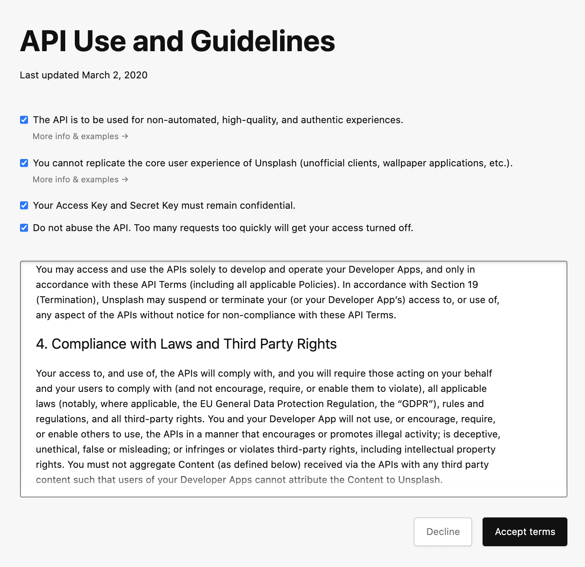
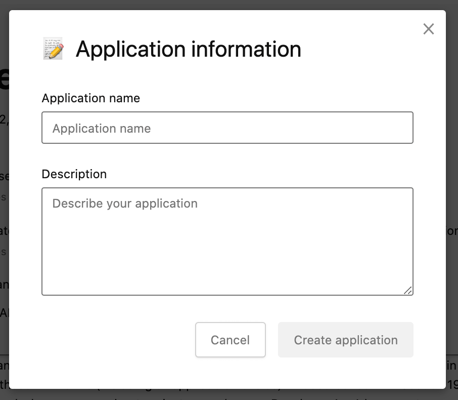
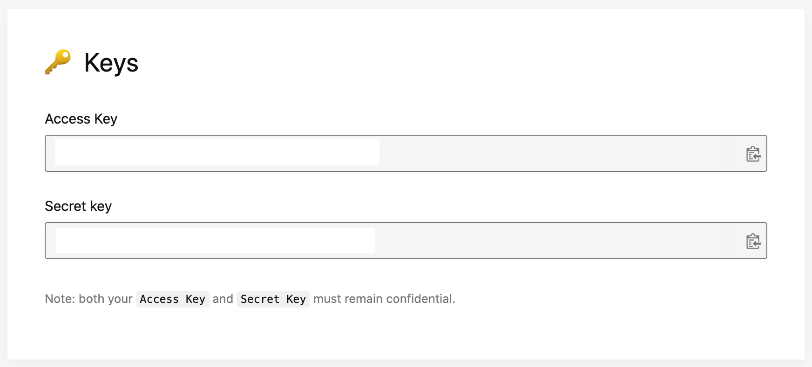

# Using Next.js with Unsplash API

This is an example of how [Unsplash](https://unsplash.com/) can be used with `Next.js`

## Deploy your own

[](https://vercel.com/new/clone?repository-url=https://github.com/vercel/next.js/tree/canary/examples/with-unsplash&project-name=with-unsplash&repository-name=with-unsplash&env=UNSPLASH_ACCESS_KEY,UNSPLASH_USER&envDescription=Required%20to%20connect%20the%20app%20with%20Unsplash&envLink=https://github.com/vercel/next.js/tree/canary/examples/with-unsplash%23step-2-set-up-environment-variables)

## How to use

Execute [`create-next-app`](https://github.com/vercel/next.js/tree/canary/packages/create-next-app) with [npm](https://docs.npmjs.com/cli/init), [Yarn](https://yarnpkg.com/lang/en/docs/cli/create/), or [pnpm](https://pnpm.io) to bootstrap the example:

```bash
npx create-next-app --example with-unsplash with-unsplash-app
```

```bash
yarn create next-app --example with-unsplash with-unsplash-app
```

```bash
pnpm create next-app --example with-unsplash with-unsplash-app
```

## Configuration

First, you'll need to [create an account on Unsplash](https://unsplash.com/) if you don't have one already. Once that's done, follow the steps below.

### Step 1. Create an app on Unsplash

Create a [new application on Unsplash](https://unsplash.com/oauth/applications/new).

Before creating an app you'll have to accept the terms for API use:



Then, fill the form with the app name and description, and click on on **Create application** to finish the creation of your app:



### Step 2. Set up environment variables

After creating the app, you should be able to see the API keys in the settings page of your app:



We'll need those API keys to connect the example with your Unsplash app.

First, copy the `.env.local.example` file in this directory to `.env.local` (which will be ignored by Git):

```bash
cp .env.local.example .env.local
```

Then set each variable on `.env.local`:

- `UNSPLASH_ACCESS_KEY` should be the **Access Key** of your Unsplash app
- `UNSPLASH_USER` should be any valid Unsplash username. The example will use the photos of the user selected here.

### Step 3. Run Next.js in development mode

```bash
npm install
npm run dev
# or
yarn install
yarn dev
# or
pnpm install
pnpm dev
```

Your app should be up and running on [http://localhost:3000](http://localhost:3000)! If it doesn't work, post on [GitHub discussions](https://github.com/vercel/next.js/discussions).

### Step 4. Deploy on Vercel

You can deploy this app to the cloud with [Vercel](https://vercel.com?utm_source=github&utm_medium=readme&utm_campaign=next-example) ([Documentation](https://nextjs.org/docs/deployment)).

#### Deploy Your Local Project

To deploy your local project to Vercel, push it to GitHub/GitLab/Bitbucket and [import to Vercel](https://vercel.com/new?utm_source=github&utm_medium=readme&utm_campaign=next-example).

**Important**: When you import your project on Vercel, make sure to click on **Environment Variables** and set them to match your `.env.local` file.

#### Deploy from Our Template

Alternatively, you can deploy using our template by clicking on the Deploy button below.

[](https://vercel.com/new/clone?repository-url=https://github.com/vercel/next.js/tree/canary/examples/with-unsplash&project-name=with-unsplash&repository-name=with-unsplash&env=UNSPLASH_ACCESS_KEY,UNSPLASH_USER&envDescription=Required%20to%20connect%20the%20app%20with%20Unsplash&envLink=https://github.com/vercel/next.js/tree/canary/examples/with-unsplash%23step-2-set-up-environment-variables)
