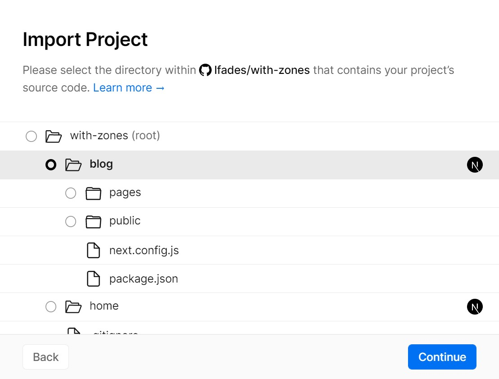
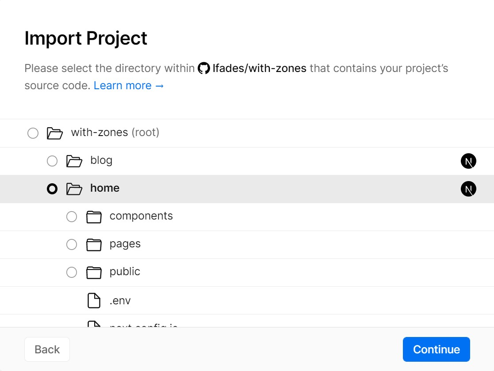

# Multi-Zone Next.js Applications

This is an example that demonstrates how to serve multiple Next.js applications from a single domain, called [Multi Zones](https://nextjs.org/docs/advanced-features/multi-zones).

Multi Zones are an approach to micro-frontends that separate a single large application on a domain into smaller applications that each serve a set of paths.
This is useful when there are collections of pages unrelated to the other pages in the application. By moving those pages to a separate zone, you can reduce the size of the application which improves build times and removes code that is only necessary for one of the zones.

Multi-Zone applications work by having one of the applications route requests for some paths to the other pages using the [`rewrites` feature](https://nextjs.org/docs/pages/api-reference/config/next-config-js/rewrites) of `next.config.js`. All URL paths should be unique across all the zones for the domain. For example:

- There are two zones in this application: `home` and `blog`.
- The `home` app is the main app and therefore it includes the rewrites that map to the `blog` app in [next.config.js](home/next.config.js)
- `home` will serve all paths that are not specifically routed to `blog`.
- `blog` will serve the `/blog` and `/blog/*` paths.
- The `blog` app sets [`basePath`](https://nextjs.org/docs/app/api-reference/config/next-config-js/basePath) to `/blog` so that generated pages, Next.js assets and public assets are unique to the `blog` zone and won't conflict with anything from the other zones.

NOTE: A `basePath` will prefix all pages in the application with the `basePath` automatically, including relative links. If you have many pages that don't share the same path prefix (for example, `/home` and `/blog` live in the same zone), you can use [`assetPrefix`](https://nextjs.org/docs/app/api-reference/config/next-config-js/assetPrefix) to add a unique prefix for Next.js assets without affecting the other pages.

## How to use

Execute [`create-next-app`](https://github.com/vercel/next.js/tree/canary/packages/create-next-app) with [npm](https://docs.npmjs.com/cli/init), [Yarn](https://yarnpkg.com/lang/en/docs/cli/create/), or [pnpm](https://pnpm.io) to bootstrap the example:

```bash
npx create-next-app --example with-zones with-zones-app
```

```bash
yarn create next-app --example with-zones with-zones-app
```

```bash
pnpm create next-app --example with-zones with-zones-app
```

With multi zones you have multiple Next.js apps over a single app, therefore every app has its own dependencies and it runs independently.

To start the `/home` run the following commands from the root directory:

```bash
cd home
npm install && npm run dev
# or
cd home
yarn && yarn dev
# or
cd home
pnpm install && pnpm dev
```

The `/home` app should be up and running in [http://localhost:3000](http://localhost:3000)!

Starting the `/blog` app follows a very similar process. In a new terminal, run the following commands from the root directory :

```bash
cd blog
npm install && npm run dev
# or
cd blog
yarn && yarn dev
# or
cd blog
pnpm install && pnpm dev
```

The `blog` app should be up and running in [http://localhost:4000/blog](http://localhost:4000/blog)!

## Deploy your own

Deploy the example using [Vercel](https://vercel.com?utm_source=github&utm_medium=readme&utm_campaign=next-example) or preview live with [StackBlitz](https://stackblitz.com/github/vercel/next.js/tree/canary/examples/with-zones)

[](https://vercel.com/new/clone?repository-url=https://github.com/vercel/next.js/tree/canary/examples/with-zones&project-name=with-zones&repository-name=with-zones)

### Deploy Your Local Project

To deploy the apps to Vercel, we'll use [monorepos support](https://vercel.com/blog/monorepos) to create a new project for each app.

To get started, push the example to GitHub/GitLab/Bitbucket and [import your repo to Vercel](https://vercel.com/new?utm_source=github&utm_medium=readme&utm_campaign=next-example). We're not interested in the root directory, so make sure to select the `blog` directory (do not start with `home`):



Click continue and finish the import process. After that's done copy the domain URL that was assigned to your project, paste it on `home/.env`, and push the change to your repo:

```bash
# Replace this URL with the URL of your blog app
BLOG_URL="https://with-zones-blog.vercel.app"
```

Now we'll go over the [import flow](https://vercel.com/new?utm_source=github&utm_medium=readme&utm_campaign=next-example) again using the same repo but this time select the `home` directory instead:



With the `home` app deployed you should now be able to see both apps running under the same domain!

Any future commits to the repo will trigger a deployment to the connected Vercel projects. See the [blog post about monorepos](https://vercel.com/blog/monorepos) to learn more.
