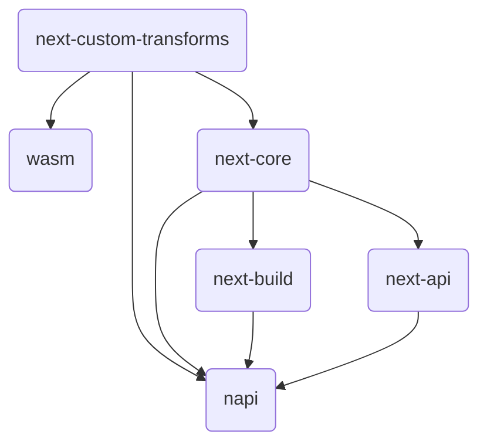

# `@next/swc`

This package is responsible for swc compilation customized for next.js

### Development

Run tests

```sh
cargo test

# Update snapshots and fixtures for tests
UPDATE=1 cargo test
```

Format code before submitting code

```
cargo fmt
```

Build the binary to integrate with next.js

```
pnpm build-native
```

Build wasm bindings to integrate with next.js

```
pnpm build-wasm
```

### napi bindings feature matrix

Due to platform differences napi bindings selectively enables supported features.
See below tables for the currently enabled features.

| arch\platform | Linux(gnu) | Linux(musl) | Darwin    | Win32     |
| ------------- | ---------- | ----------- | --------- | --------- |
| ia32          |            |             |           | a,b,d,e   |
| x64           | a,b,d,e,f  | a,b,d,e,f   | a,b,d,e,f | a,b,d,e,f |
| aarch64       | a,d,e,f    | a,d,e,f     | a,b,d,e,f | a,b,c,e   |

- a: `turbo_tasks_malloc`,
- b: `turbo_tasks_malloc_custom_allocator`,
- c: `native-tls`,
- d: `rustls-tls`,
- e: `image-extended` (webp)
- f: `plugin`

### Package hierarchies

`@next/swc` consist of multiple rust packages to enable features. See below for the high level hierarchies.



- `next-custom-transforms`: provides next-swc specific SWC transform visitors. Turbopack, and the plain next-swc bidnings (`transform`) use these transforms. Since this is a bottom package can be imported in any place (turbopack / next-swc / wasm), it is important package do not contain specific dependencies. For example, using Turbopack's VC in this package will cause build failures to wasm bindings.
- `next-core`: Implements Turbopack features for the next.js core functionality. This is also the place where Turbopack-specific transform providers (implementing `CustomTransformer`) lives, which wraps swc's transformer in the `next-custom-transforms`.
- `next-api`: Binding interface to the next.js provides a proper next.js functionaility using `next-core`.
- `napi` / `wasm`: The actual binding interfaces, napi for the node.js and wasm for the wasm. Note wasm bindings cannot import packages using turbopack's feature.

#### To add new swc transforms

1. Implements a new visitor in `next-custom-transforms`. It is highly encouraged to use `VisitMut` instead of `Fold` for the performance reasons.
2. Implements a new `CustomTransformer` under `packages/next-swc/crates/next-core/src/next_shared/transforms` to make Turbopack's ecma transform plugin, then adjust corresponding rules in `packages/next-swc/crates/next-core/src/(next_client|next_server)/context.rs`.
