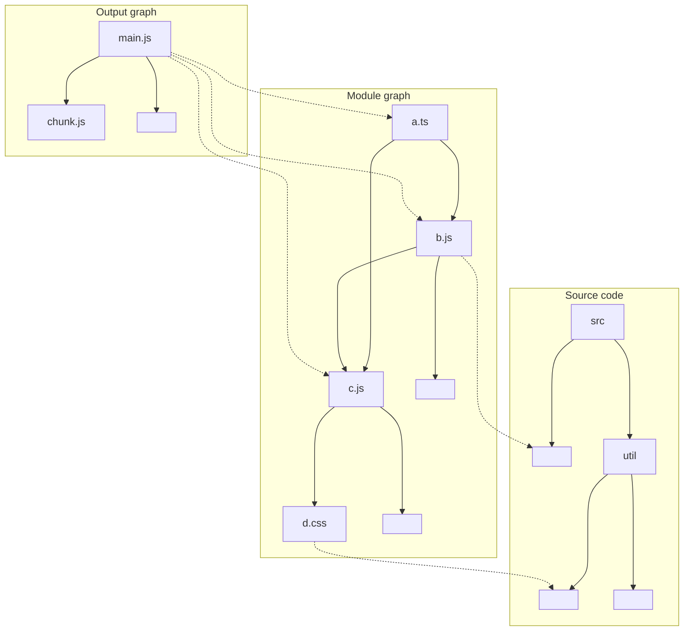
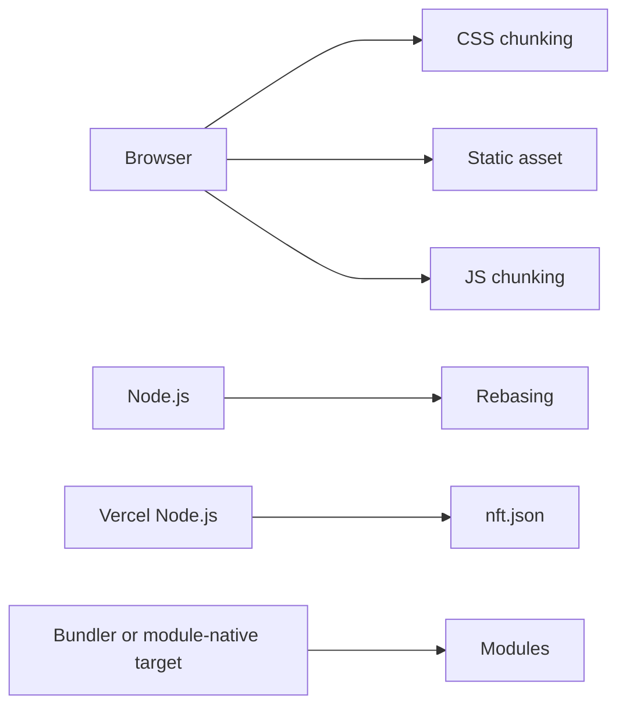
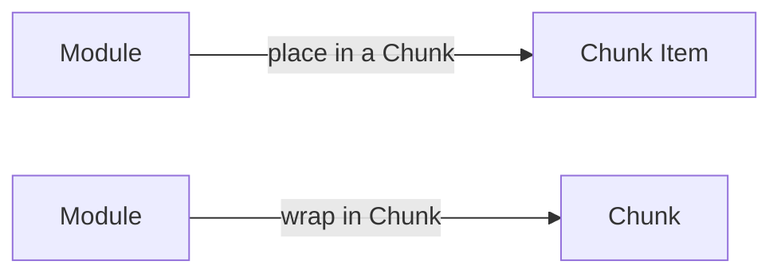

# Architecture

This is a high level overview of Turbopack's architecture. For a deeper understanding in specific topic, check out the following docs:

- [turbo tasks](turbo_tasks.md)

## Core Concepts

Turbopack has three guiding principles:

### Incremental

- Avoid operations that require broad/complete graph traversal
- Changes should only have local effects
- Avoid depending on "global" information (information from the whole app)
- Avoid "one to many" dependencies (depending on one piece of information from many sources)

### Lazy

- Avoid computing more information than needed for a given operation
- Put extra indirection when needed

### Extensible

- Use traits
- Avoid depending on concrete implementations (avoid casting)
- Make behavior configurable by passing options

## Layers

Turbopack models the user's code as it travels through Turbopack in multiple ways, each of which can be thought of as a layer in the system below:

```

┌───────────────┬──────────────────────────────┐
│  Source code  │                              │
├───────────────┘                              │
│                        What the user wrote as│
│                              application code│
└──────────────────────────────────────────────┘

┌───────────────┬──────────────────────────────┐
│    Modules    │                              │
├───────────────┘                              │
│           The compiler's understanding of the│
│                              application code│
└──────────────────────────────────────────────┘

┌───────────────┬──────────────────────────────┐
│ Output assets │                              │
├───────────────┘                              │
│    What the target environment understands as│
│                        executable application│
└──────────────────────────────────────────────┘

```

Each layer is implemented as a decorator/wrapper around the previous layer in top-down order. In contrast to tools like webpack, where whole {source,module,chunk} graphs are built in serial, Turbopack builds lazily by successively wrapping an asset in each layer and building only what's needed without blocking on everything in a particular phase.

### Source code

- This is the original, unmodified code from the user's application
- Does **not** model references (the relationships between files like through `import`)

### Modules

- Result of parsing and transpiling source code
- Includes references to other modules
- If references are followed, can traverse a subgraph of the application's transpiled code and its recursive dependencies

### Output asset

- These are chunks
- Result of transforming a module given an output format
- Includes references to other output assets
- Can be emitted to disk or served from the dev server



## Output format

An output format changes how a module is run in a specific target environment. The output format is chosen based on target environment and the input module.



| Target         | Input        | Output format                            |
| -------------- | ------------ | ---------------------------------------- |
| Script tags    | JS/TS        | JS Chunking                              |
| Link tags      | CSS          | CSS Chunking                             |
| Browser        | Static asset | Static Asset (no chunking)               |
| Node.js        | JS           | Rebasing (node-file trace build mode)    |
| Node.js@Vercel | JS           | nft.json file (node-file-trace annotate) |

In the future, Turbopack should support producing modules as an output format, to be used by other bundlers or runtimes that natively support ESM modules.

## Chunking

Chunking is the process that decides which modules are placed into which bundles, and the relationship between these bundles.



In order to be placed into chunks (bundles), a module must be wrapped in a Chunk Item. Doing so re-generates the module code, e.g. using `__turbopack_require__`. This still strictly wraps the content of a single module, meaning it assumes that any dependencies must be available to be required.

If a module is placeable in a chunk, it can be wrapped in a Chunk, which will traverse all of its references.

## Mix and match

Not only can Turbopack travel between these different layers, but it can do so across and between different environments.

- It's possible to transitions between Output Formats
  - For example, starting in ecmascript but referencing static assets with `new URL('./foo.png')`
- Embed/Reference Output Assets in Modules
  - e.g. embedding base64 data url of a chunk inside another chunk
- SSR Page references client chunks for hydration
  - embed urls to client-side chunks into server-generated html
  - references output assets from a different chunking root from a different environment
- Client Component referenced from Server Component
- Client component wrapper (Server Component) references client chunks of a client component

All of this is made possible by having a single graph that models all source, modules, and output assets across all different environments.

## Crates

Currently `turbopack` splits into `turbopack-core`, `turbopack-css`
, `turbopack-ecmascript` and `turbopack` (facade).

The `turbopack-*` crates (except for `turbopack-core`) add support for a certain
type of asset.

Each of them export a `ModuleAsset`, an implementation of `Asset`, which is able
to extract references from this kind of asset (and in the future generate an
optimized (either for dev or prod) version of it).

We are currently missing:

- `turbopack-node` (node native modules)
- `turbopack-wasm` (WASM in node and on the web)
- `turbopack-image` (images on the web)
- probably more? (e.g. `turbopack-svg`).
