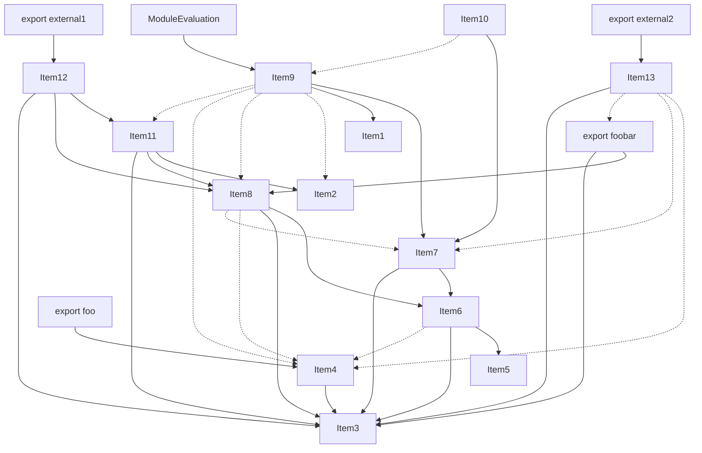
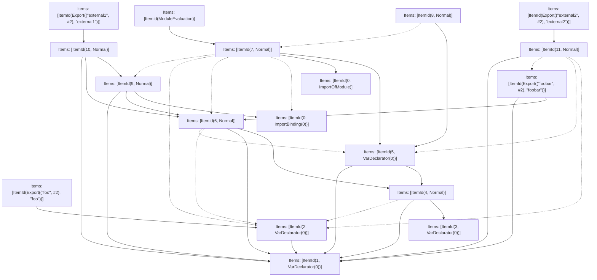

# Items

Count: 18

## Item 1: Stmt 0, `ImportOfModule`

```js
import { upper } from "module";

```

- Hoisted
- Side effects

## Item 2: Stmt 0, `ImportBinding(0)`

```js
import { upper } from "module";

```

- Hoisted
- Declares: `upper`

## Item 3: Stmt 1, `VarDeclarator(0)`

```js
export let foobar = "foo";

```

- Declares: `foobar`
- Write: `foobar`

## Item 4: Stmt 2, `VarDeclarator(0)`

```js
export const foo = foobar;

```

- Declares: `foo`
- Reads: `foobar`
- Write: `foo`

## Item 5: Stmt 3, `VarDeclarator(0)`

```js
const bar = "bar";

```

- Declares: `bar`
- Write: `bar`

## Item 6: Stmt 4, `Normal`

```js
foobar += bar;

```

- Reads: `bar`, `foobar`
- Write: `foobar`

## Item 7: Stmt 5, `VarDeclarator(0)`

```js
let foobarCopy = foobar;

```

- Declares: `foobarCopy`
- Reads: `foobar`
- Write: `foobarCopy`

## Item 8: Stmt 6, `Normal`

```js
foobar += "foo";

```

- Reads: `foobar`
- Write: `foobar`

## Item 9: Stmt 7, `Normal`

```js
console.log(foobarCopy);

```

- Side effects
- Reads: `foobarCopy`

## Item 10: Stmt 8, `Normal`

```js
foobarCopy += "Unused";

```

- Reads: `foobarCopy`
- Write: `foobarCopy`

## Item 11: Stmt 9, `Normal`

```js
function internal() {
    return upper(foobar);
}

```

- Hoisted
- Declares: `internal`
- Reads (eventual): `upper`, `foobar`
- Write: `internal`

## Item 12: Stmt 10, `Normal`

```js
export function external1() {
    return internal() + foobar;
}

```

- Hoisted
- Declares: `external1`
- Reads (eventual): `internal`, `foobar`
- Write: `external1`

## Item 13: Stmt 11, `Normal`

```js
export function external2() {
    foobar += ".";
}

```

- Hoisted
- Declares: `external2`
- Write: `external2`
- Write (eventual): `foobar`

# Phase 1

# Phase 2

# Phase 3

# Phase 4

# Final

# Entrypoints

```
{
    ModuleEvaluation: 0,
    Export(
        "external1",
    ): 1,
    Exports: 18,
    Export(
        "foo",
    ): 3,
    Export(
        "foobar",
    ): 4,
    Export(
        "external2",
    ): 2,
}
```


# Modules (dev)
## Part 0
```js
import "__TURBOPACK_PART__" assert {
    __turbopack_part__: 13
};
"module evaluation";

```
## Part 1
```js
import { a as external1 } from "__TURBOPACK_PART__" assert {
    __turbopack_part__: -16
};
export { external1 };

```
## Part 2
```js
import { b as external2 } from "__TURBOPACK_PART__" assert {
    __turbopack_part__: -17
};
export { external2 };

```
## Part 3
```js
import { c as foo } from "__TURBOPACK_PART__" assert {
    __turbopack_part__: -8
};
export { foo };

```
## Part 4
```js
import { d as foobar } from "__TURBOPACK_PART__" assert {
    __turbopack_part__: -7
};
import "__TURBOPACK_PART__" assert {
    __turbopack_part__: 12
};
export { foobar };

```
## Part 5
```js
import "module";

```
## Part 6
```js
import "__TURBOPACK_PART__" assert {
    __turbopack_part__: 5
};
import { upper } from "module";
export { upper as e } from "__TURBOPACK_VAR__" assert {
    __turbopack_var__: true
};

```
## Part 7
```js
let foobar = "foo";
export { foobar as d } from "__TURBOPACK_VAR__" assert {
    __turbopack_var__: true
};

```
## Part 8
```js
import { d as foobar } from "__TURBOPACK_PART__" assert {
    __turbopack_part__: -7
};
const foo = foobar;
export { foo as c } from "__TURBOPACK_VAR__" assert {
    __turbopack_var__: true
};

```
## Part 9
```js
const bar = "bar";
export { bar as f } from "__TURBOPACK_VAR__" assert {
    __turbopack_var__: true
};

```
## Part 10
```js
import { f as bar } from "__TURBOPACK_PART__" assert {
    __turbopack_part__: -9
};
import { d as foobar } from "__TURBOPACK_PART__" assert {
    __turbopack_part__: -7
};
import "__TURBOPACK_PART__" assert {
    __turbopack_part__: 8
};
foobar += bar;

```
## Part 11
```js
import { d as foobar } from "__TURBOPACK_PART__" assert {
    __turbopack_part__: -7
};
import "__TURBOPACK_PART__" assert {
    __turbopack_part__: 10
};
let foobarCopy = foobar;
export { foobarCopy as g } from "__TURBOPACK_VAR__" assert {
    __turbopack_var__: true
};

```
## Part 12
```js
import { d as foobar } from "__TURBOPACK_PART__" assert {
    __turbopack_part__: -7
};
import "__TURBOPACK_PART__" assert {
    __turbopack_part__: 10
};
import "__TURBOPACK_PART__" assert {
    __turbopack_part__: 8
};
import "__TURBOPACK_PART__" assert {
    __turbopack_part__: 11
};
foobar += "foo";

```
## Part 13
```js
import { g as foobarCopy } from "__TURBOPACK_PART__" assert {
    __turbopack_part__: -11
};
import "__TURBOPACK_PART__" assert {
    __turbopack_part__: 5
};
import "__TURBOPACK_PART__" assert {
    __turbopack_part__: 6
};
import "__TURBOPACK_PART__" assert {
    __turbopack_part__: 12
};
import "__TURBOPACK_PART__" assert {
    __turbopack_part__: 8
};
import "__TURBOPACK_PART__" assert {
    __turbopack_part__: 15
};
console.log(foobarCopy);

```
## Part 14
```js
import { g as foobarCopy } from "__TURBOPACK_PART__" assert {
    __turbopack_part__: -11
};
import "__TURBOPACK_PART__" assert {
    __turbopack_part__: 13
};
foobarCopy += "Unused";

```
## Part 15
```js
import { d as foobar } from "__TURBOPACK_PART__" assert {
    __turbopack_part__: -7
};
import { e as upper } from "__TURBOPACK_PART__" assert {
    __turbopack_part__: -6,
    __turbopack_original__: "module"
};
import "__TURBOPACK_PART__" assert {
    __turbopack_part__: 12
};
function internal() {
    return upper(foobar);
}
export { internal as h } from "__TURBOPACK_VAR__" assert {
    __turbopack_var__: true
};

```
## Part 16
```js
import { d as foobar } from "__TURBOPACK_PART__" assert {
    __turbopack_part__: -7
};
import { h as internal } from "__TURBOPACK_PART__" assert {
    __turbopack_part__: -15
};
import "__TURBOPACK_PART__" assert {
    __turbopack_part__: 12
};
function external1() {
    return internal() + foobar;
}
export { external1 as a } from "__TURBOPACK_VAR__" assert {
    __turbopack_var__: true
};

```
## Part 17
```js
import { d as foobar } from "__TURBOPACK_PART__" assert {
    __turbopack_part__: -7
};
import "__TURBOPACK_PART__" assert {
    __turbopack_part__: 8
};
import "__TURBOPACK_PART__" assert {
    __turbopack_part__: 11
};
import "__TURBOPACK_PART__" assert {
    __turbopack_part__: 4
};
function external2() {
    foobar += ".";
}
export { external2 as b } from "__TURBOPACK_VAR__" assert {
    __turbopack_var__: true
};

```
## Part 18
```js
export { external1 } from "__TURBOPACK_PART__" assert {
    __turbopack_part__: "export external1"
};
export { external2 } from "__TURBOPACK_PART__" assert {
    __turbopack_part__: "export external2"
};
export { foo } from "__TURBOPACK_PART__" assert {
    __turbopack_part__: "export foo"
};
export { foobar } from "__TURBOPACK_PART__" assert {
    __turbopack_part__: "export foobar"
};

```
## Merged (module eval)
```js
import "__TURBOPACK_PART__" assert {
    __turbopack_part__: 13
};
"module evaluation";

```
# Entrypoints

```
{
    ModuleEvaluation: 0,
    Export(
        "external1",
    ): 1,
    Exports: 18,
    Export(
        "foo",
    ): 3,
    Export(
        "foobar",
    ): 4,
    Export(
        "external2",
    ): 2,
}
```


# Modules (prod)
## Part 0
```js
import "__TURBOPACK_PART__" assert {
    __turbopack_part__: 13
};
"module evaluation";

```
## Part 1
```js
import { a as external1 } from "__TURBOPACK_PART__" assert {
    __turbopack_part__: -16
};
export { external1 };

```
## Part 2
```js
import { b as external2 } from "__TURBOPACK_PART__" assert {
    __turbopack_part__: -17
};
export { external2 };

```
## Part 3
```js
import { c as foo } from "__TURBOPACK_PART__" assert {
    __turbopack_part__: -8
};
export { foo };

```
## Part 4
```js
import { d as foobar } from "__TURBOPACK_PART__" assert {
    __turbopack_part__: -7
};
import "__TURBOPACK_PART__" assert {
    __turbopack_part__: 12
};
export { foobar };

```
## Part 5
```js
import "module";

```
## Part 6
```js
import "__TURBOPACK_PART__" assert {
    __turbopack_part__: 5
};
import { upper } from "module";
export { upper as e } from "__TURBOPACK_VAR__" assert {
    __turbopack_var__: true
};

```
## Part 7
```js
let foobar = "foo";
export { foobar as d } from "__TURBOPACK_VAR__" assert {
    __turbopack_var__: true
};

```
## Part 8
```js
import { d as foobar } from "__TURBOPACK_PART__" assert {
    __turbopack_part__: -7
};
const foo = foobar;
export { foo as c } from "__TURBOPACK_VAR__" assert {
    __turbopack_var__: true
};

```
## Part 9
```js
const bar = "bar";
export { bar as f } from "__TURBOPACK_VAR__" assert {
    __turbopack_var__: true
};

```
## Part 10
```js
import { f as bar } from "__TURBOPACK_PART__" assert {
    __turbopack_part__: -9
};
import { d as foobar } from "__TURBOPACK_PART__" assert {
    __turbopack_part__: -7
};
foobar += bar;

```
## Part 11
```js
import { d as foobar } from "__TURBOPACK_PART__" assert {
    __turbopack_part__: -7
};
import "__TURBOPACK_PART__" assert {
    __turbopack_part__: 10
};
let foobarCopy = foobar;
export { foobarCopy as g } from "__TURBOPACK_VAR__" assert {
    __turbopack_var__: true
};

```
## Part 12
```js
import { d as foobar } from "__TURBOPACK_PART__" assert {
    __turbopack_part__: -7
};
import "__TURBOPACK_PART__" assert {
    __turbopack_part__: 10
};
foobar += "foo";

```
## Part 13
```js
import { g as foobarCopy } from "__TURBOPACK_PART__" assert {
    __turbopack_part__: -11
};
import "__TURBOPACK_PART__" assert {
    __turbopack_part__: 5
};
console.log(foobarCopy);

```
## Part 14
```js
import { g as foobarCopy } from "__TURBOPACK_PART__" assert {
    __turbopack_part__: -11
};
foobarCopy += "Unused";

```
## Part 15
```js
import { d as foobar } from "__TURBOPACK_PART__" assert {
    __turbopack_part__: -7
};
import { e as upper } from "__TURBOPACK_PART__" assert {
    __turbopack_part__: -6,
    __turbopack_original__: "module"
};
import "__TURBOPACK_PART__" assert {
    __turbopack_part__: 12
};
function internal() {
    return upper(foobar);
}
export { internal as h } from "__TURBOPACK_VAR__" assert {
    __turbopack_var__: true
};

```
## Part 16
```js
import { d as foobar } from "__TURBOPACK_PART__" assert {
    __turbopack_part__: -7
};
import { h as internal } from "__TURBOPACK_PART__" assert {
    __turbopack_part__: -15
};
import "__TURBOPACK_PART__" assert {
    __turbopack_part__: 12
};
function external1() {
    return internal() + foobar;
}
export { external1 as a } from "__TURBOPACK_VAR__" assert {
    __turbopack_var__: true
};

```
## Part 17
```js
import { d as foobar } from "__TURBOPACK_PART__" assert {
    __turbopack_part__: -7
};
function external2() {
    foobar += ".";
}
export { external2 as b } from "__TURBOPACK_VAR__" assert {
    __turbopack_var__: true
};

```
## Part 18
```js
export { external1 } from "__TURBOPACK_PART__" assert {
    __turbopack_part__: "export external1"
};
export { external2 } from "__TURBOPACK_PART__" assert {
    __turbopack_part__: "export external2"
};
export { foo } from "__TURBOPACK_PART__" assert {
    __turbopack_part__: "export foo"
};
export { foobar } from "__TURBOPACK_PART__" assert {
    __turbopack_part__: "export foobar"
};

```
## Merged (module eval)
```js
import "__TURBOPACK_PART__" assert {
    __turbopack_part__: 13
};
"module evaluation";

```
