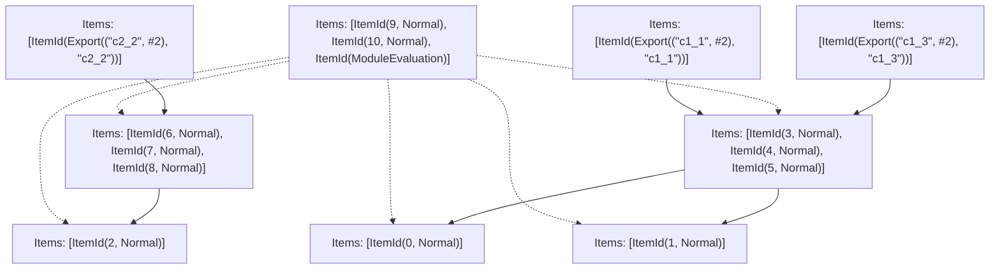

# Items

Count: 15

## Item 1: Stmt 0, `Normal`

```js
function d1() {}

```

- Hoisted
- Declares: `d1`
- Write: `d1`

## Item 2: Stmt 1, `Normal`

```js
function d2() {}

```

- Hoisted
- Declares: `d2`
- Write: `d2`

## Item 3: Stmt 2, `Normal`

```js
function d3() {}

```

- Hoisted
- Declares: `d3`
- Write: `d3`

## Item 4: Stmt 3, `Normal`

```js
export function c1_1() {
    return c1_2();
}

```

- Hoisted
- Declares: `c1_1`
- Reads (eventual): `c1_2`
- Write: `c1_1`

## Item 5: Stmt 4, `Normal`

```js
function c1_2() {
    return c1_3(d1);
}

```

- Hoisted
- Declares: `c1_2`
- Reads (eventual): `c1_3`, `d1`
- Write: `c1_2`

## Item 6: Stmt 5, `Normal`

```js
export function c1_3() {
    return c1_1(d2);
}

```

- Hoisted
- Declares: `c1_3`
- Reads (eventual): `c1_1`, `d2`
- Write: `c1_3`

## Item 7: Stmt 6, `Normal`

```js
function c2_1() {
    return c2_2(d3);
}

```

- Hoisted
- Declares: `c2_1`
- Reads (eventual): `c2_2`, `d3`
- Write: `c2_1`

## Item 8: Stmt 7, `Normal`

```js
export function c2_2() {
    return c2_3();
}

```

- Hoisted
- Declares: `c2_2`
- Reads (eventual): `c2_3`
- Write: `c2_2`

## Item 9: Stmt 8, `Normal`

```js
function c2_3() {
    return c2_1();
}

```

- Hoisted
- Declares: `c2_3`
- Reads (eventual): `c2_1`
- Write: `c2_3`

## Item 10: Stmt 9, `Normal`

```js
c1_3();

```

- Side effects
- Reads: `c1_3`

## Item 11: Stmt 10, `Normal`

```js
c2_2();

```

- Side effects
- Reads: `c2_2`

# Phase 1

# Phase 2

# Phase 3

# Phase 4

# Final

# Entrypoints

```
{
    ModuleEvaluation: 5,
    Export(
        "c1_1",
    ): 6,
    Export(
        "c1_3",
    ): 7,
    Export(
        "c2_2",
    ): 8,
    Exports: 9,
}
```


# Modules (dev)
## Part 0
```js
function d1() {}
export { d1 as a } from "__TURBOPACK_VAR__" assert {
    __turbopack_var__: true
};

```
## Part 1
```js
function d2() {}
export { d2 as b } from "__TURBOPACK_VAR__" assert {
    __turbopack_var__: true
};

```
## Part 2
```js
function d3() {}
export { d3 as c } from "__TURBOPACK_VAR__" assert {
    __turbopack_var__: true
};

```
## Part 3
```js
import { b as d2 } from "__TURBOPACK_PART__" assert {
    __turbopack_part__: -1
};
import { a as d1 } from "__TURBOPACK_PART__" assert {
    __turbopack_part__: -0
};
function c1_1() {
    return c1_2();
}
function c1_2() {
    return c1_3(d1);
}
function c1_3() {
    return c1_1(d2);
}
export { c1_1 as d } from "__TURBOPACK_VAR__" assert {
    __turbopack_var__: true
};
export { c1_2 as e } from "__TURBOPACK_VAR__" assert {
    __turbopack_var__: true
};
export { c1_3 as f } from "__TURBOPACK_VAR__" assert {
    __turbopack_var__: true
};

```
## Part 4
```js
import { c as d3 } from "__TURBOPACK_PART__" assert {
    __turbopack_part__: -2
};
function c2_1() {
    return c2_2(d3);
}
function c2_2() {
    return c2_3();
}
function c2_3() {
    return c2_1();
}
export { c2_1 as g } from "__TURBOPACK_VAR__" assert {
    __turbopack_var__: true
};
export { c2_2 as h } from "__TURBOPACK_VAR__" assert {
    __turbopack_var__: true
};
export { c2_3 as i } from "__TURBOPACK_VAR__" assert {
    __turbopack_var__: true
};

```
## Part 5
```js
import { f as c1_3 } from "__TURBOPACK_PART__" assert {
    __turbopack_part__: -3
};
import { h as c2_2 } from "__TURBOPACK_PART__" assert {
    __turbopack_part__: -4
};
import "__TURBOPACK_PART__" assert {
    __turbopack_part__: 2
};
import "__TURBOPACK_PART__" assert {
    __turbopack_part__: 1
};
import "__TURBOPACK_PART__" assert {
    __turbopack_part__: 0
};
c1_3();
c2_2();
"module evaluation";

```
## Part 6
```js
import { d as c1_1 } from "__TURBOPACK_PART__" assert {
    __turbopack_part__: -3
};
export { c1_1 };

```
## Part 7
```js
import { f as c1_3 } from "__TURBOPACK_PART__" assert {
    __turbopack_part__: -3
};
export { c1_3 };

```
## Part 8
```js
import { h as c2_2 } from "__TURBOPACK_PART__" assert {
    __turbopack_part__: -4
};
export { c2_2 };

```
## Part 9
```js
export { c1_1 } from "__TURBOPACK_PART__" assert {
    __turbopack_part__: "export c1_1"
};
export { c1_3 } from "__TURBOPACK_PART__" assert {
    __turbopack_part__: "export c1_3"
};
export { c2_2 } from "__TURBOPACK_PART__" assert {
    __turbopack_part__: "export c2_2"
};

```
## Merged (module eval)
```js
import { f as c1_3 } from "__TURBOPACK_PART__" assert {
    __turbopack_part__: -3
};
import { h as c2_2 } from "__TURBOPACK_PART__" assert {
    __turbopack_part__: -4
};
import "__TURBOPACK_PART__" assert {
    __turbopack_part__: 2
};
import "__TURBOPACK_PART__" assert {
    __turbopack_part__: 1
};
import "__TURBOPACK_PART__" assert {
    __turbopack_part__: 0
};
c1_3();
c2_2();
"module evaluation";

```
# Entrypoints

```
{
    ModuleEvaluation: 2,
    Export(
        "c1_1",
    ): 3,
    Export(
        "c1_3",
    ): 4,
    Export(
        "c2_2",
    ): 5,
    Exports: 6,
}
```


# Modules (prod)
## Part 0
```js
function d1() {}
function d2() {}
function c1_1() {
    return c1_2();
}
function c1_2() {
    return c1_3(d1);
}
function c1_3() {
    return c1_1(d2);
}
export { d1 as a } from "__TURBOPACK_VAR__" assert {
    __turbopack_var__: true
};
export { d2 as b } from "__TURBOPACK_VAR__" assert {
    __turbopack_var__: true
};
export { c1_1 as c } from "__TURBOPACK_VAR__" assert {
    __turbopack_var__: true
};
export { c1_2 as d } from "__TURBOPACK_VAR__" assert {
    __turbopack_var__: true
};
export { c1_3 as e } from "__TURBOPACK_VAR__" assert {
    __turbopack_var__: true
};

```
## Part 1
```js
function d3() {}
function c2_1() {
    return c2_2(d3);
}
function c2_2() {
    return c2_3();
}
function c2_3() {
    return c2_1();
}
export { d3 as f } from "__TURBOPACK_VAR__" assert {
    __turbopack_var__: true
};
export { c2_1 as g } from "__TURBOPACK_VAR__" assert {
    __turbopack_var__: true
};
export { c2_2 as h } from "__TURBOPACK_VAR__" assert {
    __turbopack_var__: true
};
export { c2_3 as i } from "__TURBOPACK_VAR__" assert {
    __turbopack_var__: true
};

```
## Part 2
```js
import { e as c1_3 } from "__TURBOPACK_PART__" assert {
    __turbopack_part__: -0
};
import { h as c2_2 } from "__TURBOPACK_PART__" assert {
    __turbopack_part__: -1
};
c1_3();
c2_2();
"module evaluation";

```
## Part 3
```js
import { c as c1_1 } from "__TURBOPACK_PART__" assert {
    __turbopack_part__: -0
};
export { c1_1 };

```
## Part 4
```js
import { e as c1_3 } from "__TURBOPACK_PART__" assert {
    __turbopack_part__: -0
};
export { c1_3 };

```
## Part 5
```js
import { h as c2_2 } from "__TURBOPACK_PART__" assert {
    __turbopack_part__: -1
};
export { c2_2 };

```
## Part 6
```js
export { c1_1 } from "__TURBOPACK_PART__" assert {
    __turbopack_part__: "export c1_1"
};
export { c1_3 } from "__TURBOPACK_PART__" assert {
    __turbopack_part__: "export c1_3"
};
export { c2_2 } from "__TURBOPACK_PART__" assert {
    __turbopack_part__: "export c2_2"
};

```
## Merged (module eval)
```js
import { e as c1_3 } from "__TURBOPACK_PART__" assert {
    __turbopack_part__: -0
};
import { h as c2_2 } from "__TURBOPACK_PART__" assert {
    __turbopack_part__: -1
};
c1_3();
c2_2();
"module evaluation";

```
# Entrypoints

```
{
    ModuleEvaluation: 2,
    Export(
        "c1_1",
    ): 3,
    Export(
        "c1_3",
    ): 4,
    Export(
        "c2_2",
    ): 5,
    Exports: 6,
}
```


## Merged (c1_3)
```js
import { e as c1_3 } from "__TURBOPACK_PART__" assert {
    __turbopack_part__: -0
};
export { c1_3 };

```
# Entrypoints

```
{
    ModuleEvaluation: 2,
    Export(
        "c1_1",
    ): 3,
    Export(
        "c1_3",
    ): 4,
    Export(
        "c2_2",
    ): 5,
    Exports: 6,
}
```


## Merged (c1_3,c2_2)
```js
import { e as c1_3 } from "__TURBOPACK_PART__" assert {
    __turbopack_part__: -0
};
import { h as c2_2 } from "__TURBOPACK_PART__" assert {
    __turbopack_part__: -1
};
export { c1_3 };
export { c2_2 };

```
