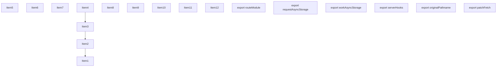
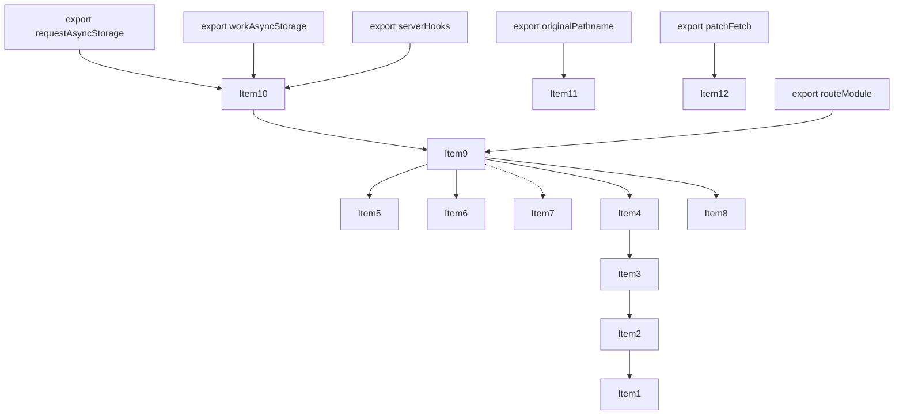
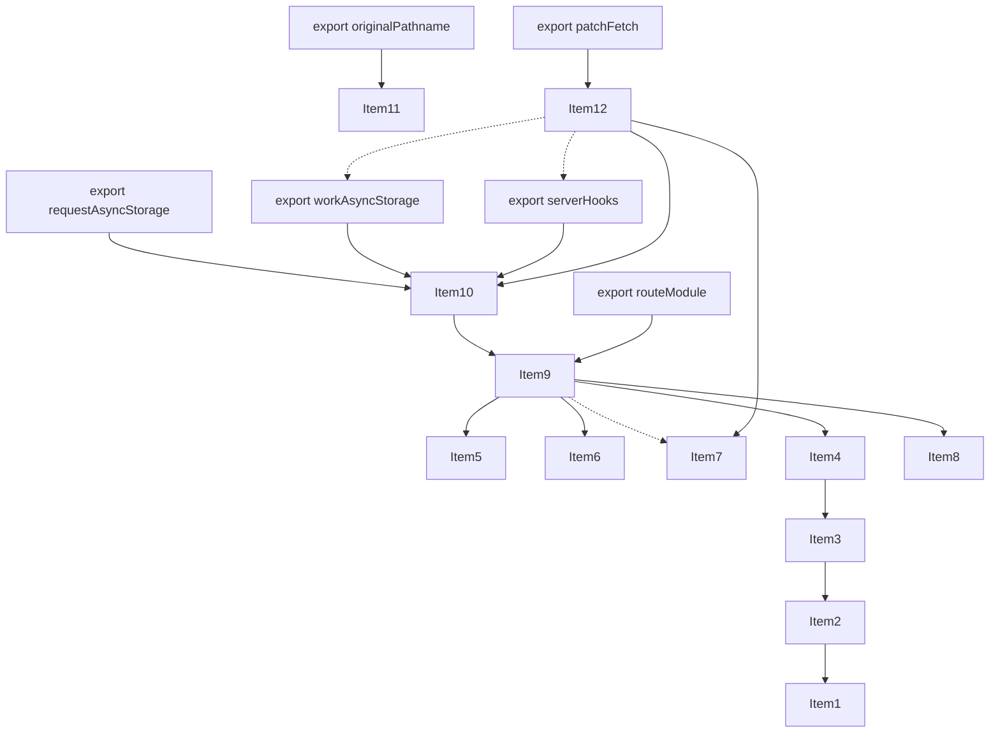
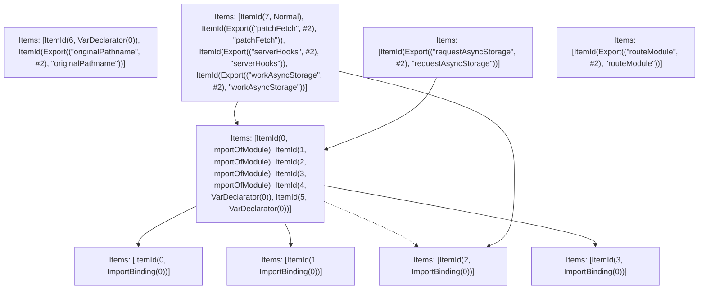

# Items

Count: 18

## Item 1: Stmt 0, `ImportOfModule`

```js
import { AppRouteRouteModule } from '../../server/future/route-modules/app-route/module.compiled';

```

- Hoisted
- Side effects

## Item 2: Stmt 0, `ImportBinding(0)`

```js
import { AppRouteRouteModule } from '../../server/future/route-modules/app-route/module.compiled';

```

- Hoisted
- Declares: `AppRouteRouteModule`

## Item 3: Stmt 1, `ImportOfModule`

```js
import { RouteKind } from '../../server/future/route-kind';

```

- Hoisted
- Side effects

## Item 4: Stmt 1, `ImportBinding(0)`

```js
import { RouteKind } from '../../server/future/route-kind';

```

- Hoisted
- Declares: `RouteKind`

## Item 5: Stmt 2, `ImportOfModule`

```js
import { patchFetch as _patchFetch } from '../../server/lib/patch-fetch';

```

- Hoisted
- Side effects

## Item 6: Stmt 2, `ImportBinding(0)`

```js
import { patchFetch as _patchFetch } from '../../server/lib/patch-fetch';

```

- Hoisted
- Declares: `_patchFetch`

## Item 7: Stmt 3, `ImportOfModule`

```js
import * as userland from 'VAR_USERLAND';

```

- Hoisted
- Side effects

## Item 8: Stmt 3, `ImportBinding(0)`

```js
import * as userland from 'VAR_USERLAND';

```

- Hoisted
- Declares: `userland`

## Item 9: Stmt 4, `VarDeclarator(0)`

```js
const routeModule = new AppRouteRouteModule({
    definition: {
        kind: RouteKind.APP_ROUTE,
        page: 'VAR_DEFINITION_PAGE',
        pathname: 'VAR_DEFINITION_PATHNAME',
        filename: 'VAR_DEFINITION_FILENAME',
        bundlePath: 'VAR_DEFINITION_BUNDLE_PATH'
    },
    resolvedPagePath: 'VAR_RESOLVED_PAGE_PATH',
    nextConfigOutput,
    userland
});

```

- Side effects
- Declares: `routeModule`
- Reads: `AppRouteRouteModule`, `RouteKind`, `userland`
- Write: `RouteKind`, `userland`, `routeModule`

## Item 10: Stmt 5, `VarDeclarator(0)`

```js
const { requestAsyncStorage, workAsyncStorage, serverHooks } = routeModule;

```

- Declares: `requestAsyncStorage`, `workAsyncStorage`, `serverHooks`
- Reads: `routeModule`
- Write: `requestAsyncStorage`, `workAsyncStorage`, `serverHooks`

## Item 11: Stmt 6, `VarDeclarator(0)`

```js
const originalPathname = 'VAR_ORIGINAL_PATHNAME';

```

- Declares: `originalPathname`
- Write: `originalPathname`

## Item 12: Stmt 7, `Normal`

```js
function patchFetch() {
    return _patchFetch({
        serverHooks,
        workAsyncStorage
    });
}

```

- Hoisted
- Declares: `patchFetch`
- Reads (eventual): `_patchFetch`, `serverHooks`, `workAsyncStorage`
- Write: `patchFetch`
- Write (eventual): `serverHooks`, `workAsyncStorage`

# Phase 1

# Phase 2

# Phase 3

# Phase 4

# Final

# Entrypoints

```
{
    ModuleEvaluation: 0,
    Export(
        "originalPathname",
    ): 5,
    Export(
        "patchFetch",
    ): 6,
    Export(
        "requestAsyncStorage",
    ): 7,
    Export(
        "routeModule",
    ): 8,
    Export(
        "serverHooks",
    ): 6,
    Export(
        "workAsyncStorage",
    ): 6,
    Exports: 9,
}
```


# Modules (dev)
## Part 0
```js
import { AppRouteRouteModule } from '../../server/future/route-modules/app-route/module.compiled';
import { RouteKind } from '../../server/future/route-kind';
import * as userland from 'VAR_USERLAND';
import "__TURBOPACK_PART__" assert {
    __turbopack_part__: 3
};
import '../../server/future/route-modules/app-route/module.compiled';
import '../../server/future/route-kind';
import '../../server/lib/patch-fetch';
import 'VAR_USERLAND';
const routeModule = new AppRouteRouteModule({
    definition: {
        kind: RouteKind.APP_ROUTE,
        page: 'VAR_DEFINITION_PAGE',
        pathname: 'VAR_DEFINITION_PATHNAME',
        filename: 'VAR_DEFINITION_FILENAME',
        bundlePath: 'VAR_DEFINITION_BUNDLE_PATH'
    },
    resolvedPagePath: 'VAR_RESOLVED_PAGE_PATH',
    nextConfigOutput,
    userland
});
const { requestAsyncStorage, workAsyncStorage, serverHooks } = routeModule;
export { routeModule as a } from "__TURBOPACK_VAR__" assert {
    __turbopack_var__: true
};
export { requestAsyncStorage as b } from "__TURBOPACK_VAR__" assert {
    __turbopack_var__: true
};
export { workAsyncStorage as c } from "__TURBOPACK_VAR__" assert {
    __turbopack_var__: true
};
export { serverHooks as d } from "__TURBOPACK_VAR__" assert {
    __turbopack_var__: true
};
export { };

```
## Part 1
```js

```
## Part 2
```js

```
## Part 3
```js

```
## Part 4
```js

```
## Part 5
```js
const originalPathname = 'VAR_ORIGINAL_PATHNAME';
export { originalPathname };
export { originalPathname as e } from "__TURBOPACK_VAR__" assert {
    __turbopack_var__: true
};

```
## Part 6
```js
import { c as workAsyncStorage } from "__TURBOPACK_PART__" assert {
    __turbopack_part__: -0
};
import "__TURBOPACK_PART__" assert {
    __turbopack_part__: 0
};
import { patchFetch as _patchFetch } from '../../server/lib/patch-fetch';
import { d as serverHooks } from "__TURBOPACK_PART__" assert {
    __turbopack_part__: -0
};
function patchFetch() {
    return _patchFetch({
        serverHooks,
        workAsyncStorage
    });
}
export { patchFetch };
export { serverHooks };
export { workAsyncStorage };
export { patchFetch as f } from "__TURBOPACK_VAR__" assert {
    __turbopack_var__: true
};

```
## Part 7
```js
import { b as requestAsyncStorage } from "__TURBOPACK_PART__" assert {
    __turbopack_part__: -0
};
export { requestAsyncStorage };

```
## Part 8
```js
import { a as routeModule } from "__TURBOPACK_PART__" assert {
    __turbopack_part__: -0
};
export { routeModule };

```
## Part 9
```js
export { originalPathname } from "__TURBOPACK_PART__" assert {
    __turbopack_part__: "export originalPathname"
};
export { patchFetch } from "__TURBOPACK_PART__" assert {
    __turbopack_part__: "export patchFetch"
};
export { serverHooks } from "__TURBOPACK_PART__" assert {
    __turbopack_part__: "export serverHooks"
};
export { workAsyncStorage } from "__TURBOPACK_PART__" assert {
    __turbopack_part__: "export workAsyncStorage"
};
export { requestAsyncStorage } from "__TURBOPACK_PART__" assert {
    __turbopack_part__: "export requestAsyncStorage"
};
export { routeModule } from "__TURBOPACK_PART__" assert {
    __turbopack_part__: "export routeModule"
};

```
## Merged (module eval)
```js
import { AppRouteRouteModule } from '../../server/future/route-modules/app-route/module.compiled';
import { RouteKind } from '../../server/future/route-kind';
import * as userland from 'VAR_USERLAND';
import "__TURBOPACK_PART__" assert {
    __turbopack_part__: 3
};
import '../../server/future/route-modules/app-route/module.compiled';
import '../../server/future/route-kind';
import '../../server/lib/patch-fetch';
import 'VAR_USERLAND';
const routeModule = new AppRouteRouteModule({
    definition: {
        kind: RouteKind.APP_ROUTE,
        page: 'VAR_DEFINITION_PAGE',
        pathname: 'VAR_DEFINITION_PATHNAME',
        filename: 'VAR_DEFINITION_FILENAME',
        bundlePath: 'VAR_DEFINITION_BUNDLE_PATH'
    },
    resolvedPagePath: 'VAR_RESOLVED_PAGE_PATH',
    nextConfigOutput,
    userland
});
const { requestAsyncStorage, workAsyncStorage, serverHooks } = routeModule;
export { routeModule as a } from "__TURBOPACK_VAR__" assert {
    __turbopack_var__: true
};
export { requestAsyncStorage as b } from "__TURBOPACK_VAR__" assert {
    __turbopack_var__: true
};
export { workAsyncStorage as c } from "__TURBOPACK_VAR__" assert {
    __turbopack_var__: true
};
export { serverHooks as d } from "__TURBOPACK_VAR__" assert {
    __turbopack_var__: true
};
export { };

```
# Entrypoints

```
{
    ModuleEvaluation: 6,
    Export(
        "originalPathname",
    ): 8,
    Export(
        "patchFetch",
    ): 9,
    Export(
        "requestAsyncStorage",
    ): 10,
    Export(
        "routeModule",
    ): 11,
    Export(
        "serverHooks",
    ): 4,
    Export(
        "workAsyncStorage",
    ): 12,
    Exports: 13,
}
```


# Modules (prod)
## Part 0
```js
import '../../server/future/route-modules/app-route/module.compiled';

```
## Part 1
```js
import "__TURBOPACK_PART__" assert {
    __turbopack_part__: 0
};

```
## Part 2
```js
import "__TURBOPACK_PART__" assert {
    __turbopack_part__: 0
};
import '../../server/future/route-kind';

```
## Part 3
```js
import "__TURBOPACK_PART__" assert {
    __turbopack_part__: 2
};

```
## Part 4
```js
import { a as serverHooks } from "__TURBOPACK_PART__" assert {
    __turbopack_part__: -6
};
import "__TURBOPACK_PART__" assert {
    __turbopack_part__: 2
};
import '../../server/lib/patch-fetch';
export { serverHooks };

```
## Part 5
```js

```
## Part 6
```js
import "__TURBOPACK_PART__" assert {
    __turbopack_part__: 0
};
import { AppRouteRouteModule } from '../../server/future/route-modules/app-route/module.compiled';
import "__TURBOPACK_PART__" assert {
    __turbopack_part__: 2
};
import { RouteKind } from '../../server/future/route-kind';
import * as userland from 'VAR_USERLAND';
import 'VAR_USERLAND';
const routeModule = new AppRouteRouteModule({
    definition: {
        kind: RouteKind.APP_ROUTE,
        page: 'VAR_DEFINITION_PAGE',
        pathname: 'VAR_DEFINITION_PATHNAME',
        filename: 'VAR_DEFINITION_FILENAME',
        bundlePath: 'VAR_DEFINITION_BUNDLE_PATH'
    },
    resolvedPagePath: 'VAR_RESOLVED_PAGE_PATH',
    nextConfigOutput,
    userland
});
const { requestAsyncStorage, workAsyncStorage, serverHooks } = routeModule;
export { routeModule as b } from "__TURBOPACK_VAR__" assert {
    __turbopack_var__: true
};
export { requestAsyncStorage as c } from "__TURBOPACK_VAR__" assert {
    __turbopack_var__: true
};
export { workAsyncStorage as d } from "__TURBOPACK_VAR__" assert {
    __turbopack_var__: true
};
export { serverHooks as a } from "__TURBOPACK_VAR__" assert {
    __turbopack_var__: true
};
export { };

```
## Part 7
```js

```
## Part 8
```js
const originalPathname = 'VAR_ORIGINAL_PATHNAME';
export { originalPathname };
export { originalPathname as e } from "__TURBOPACK_VAR__" assert {
    __turbopack_var__: true
};

```
## Part 9
```js
import { d as workAsyncStorage } from "__TURBOPACK_PART__" assert {
    __turbopack_part__: -6
};
import "__TURBOPACK_PART__" assert {
    __turbopack_part__: 4
};
import { patchFetch as _patchFetch } from '../../server/lib/patch-fetch';
import { a as serverHooks } from "__TURBOPACK_PART__" assert {
    __turbopack_part__: -6
};
function patchFetch() {
    return _patchFetch({
        serverHooks,
        workAsyncStorage
    });
}
export { patchFetch };
export { patchFetch as f } from "__TURBOPACK_VAR__" assert {
    __turbopack_var__: true
};

```
## Part 10
```js
import { c as requestAsyncStorage } from "__TURBOPACK_PART__" assert {
    __turbopack_part__: -6
};
export { requestAsyncStorage };

```
## Part 11
```js
import { b as routeModule } from "__TURBOPACK_PART__" assert {
    __turbopack_part__: -6
};
export { routeModule };

```
## Part 12
```js
import { d as workAsyncStorage } from "__TURBOPACK_PART__" assert {
    __turbopack_part__: -6
};
export { workAsyncStorage };

```
## Part 13
```js
export { serverHooks } from "__TURBOPACK_PART__" assert {
    __turbopack_part__: "export serverHooks"
};
export { originalPathname } from "__TURBOPACK_PART__" assert {
    __turbopack_part__: "export originalPathname"
};
export { patchFetch } from "__TURBOPACK_PART__" assert {
    __turbopack_part__: "export patchFetch"
};
export { requestAsyncStorage } from "__TURBOPACK_PART__" assert {
    __turbopack_part__: "export requestAsyncStorage"
};
export { routeModule } from "__TURBOPACK_PART__" assert {
    __turbopack_part__: "export routeModule"
};
export { workAsyncStorage } from "__TURBOPACK_PART__" assert {
    __turbopack_part__: "export workAsyncStorage"
};

```
## Merged (module eval)
```js
import "__TURBOPACK_PART__" assert {
    __turbopack_part__: 0
};
import { AppRouteRouteModule } from '../../server/future/route-modules/app-route/module.compiled';
import "__TURBOPACK_PART__" assert {
    __turbopack_part__: 2
};
import { RouteKind } from '../../server/future/route-kind';
import * as userland from 'VAR_USERLAND';
import 'VAR_USERLAND';
const routeModule = new AppRouteRouteModule({
    definition: {
        kind: RouteKind.APP_ROUTE,
        page: 'VAR_DEFINITION_PAGE',
        pathname: 'VAR_DEFINITION_PATHNAME',
        filename: 'VAR_DEFINITION_FILENAME',
        bundlePath: 'VAR_DEFINITION_BUNDLE_PATH'
    },
    resolvedPagePath: 'VAR_RESOLVED_PAGE_PATH',
    nextConfigOutput,
    userland
});
const { requestAsyncStorage, workAsyncStorage, serverHooks } = routeModule;
export { routeModule as b } from "__TURBOPACK_VAR__" assert {
    __turbopack_var__: true
};
export { requestAsyncStorage as c } from "__TURBOPACK_VAR__" assert {
    __turbopack_var__: true
};
export { workAsyncStorage as d } from "__TURBOPACK_VAR__" assert {
    __turbopack_var__: true
};
export { serverHooks as a } from "__TURBOPACK_VAR__" assert {
    __turbopack_var__: true
};
export { };

```
