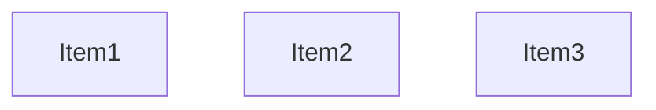
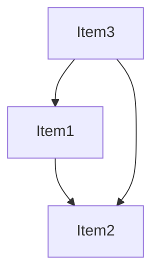
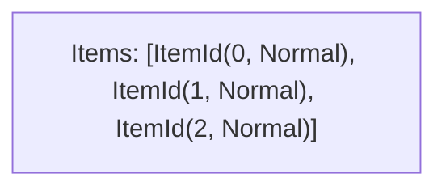

# Items

Count: 3

## Item 1: Stmt 0, `Normal`

```js
a = ()=>{};

```

- Write: `a`

## Item 2: Stmt 1, `Normal`

```js
function a() {}

```

- Hoisted
- Declares: `a`
- Write: `a`

## Item 3: Stmt 2, `Normal`

```js
console.log(a);

```

- Side effects
- Reads: `a`

# Phase 1

# Phase 2

# Phase 3

# Phase 4

# Final

# Entrypoints

```
{
    ModuleEvaluation: 0,
    Exports: 1,
}
```


# Modules (dev)
## Part 0
```js
a = ()=>{};
function a() {}
console.log(a);
export { a as a } from "__TURBOPACK_VAR__" assert {
    __turbopack_var__: true
};
export { };

```
## Part 1
```js

```
## Merged (module eval)
```js
a = ()=>{};
function a() {}
console.log(a);
export { a as a } from "__TURBOPACK_VAR__" assert {
    __turbopack_var__: true
};
export { };

```
# Entrypoints

```
{
    ModuleEvaluation: 0,
    Exports: 1,
}
```


# Modules (prod)
## Part 0
```js
a = ()=>{};
function a() {}
console.log(a);
export { a as a } from "__TURBOPACK_VAR__" assert {
    __turbopack_var__: true
};
export { };

```
## Part 1
```js

```
## Merged (module eval)
```js
a = ()=>{};
function a() {}
console.log(a);
export { a as a } from "__TURBOPACK_VAR__" assert {
    __turbopack_var__: true
};
export { };

```
