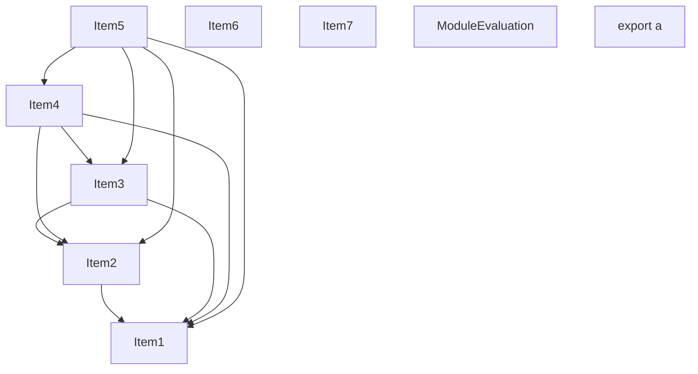
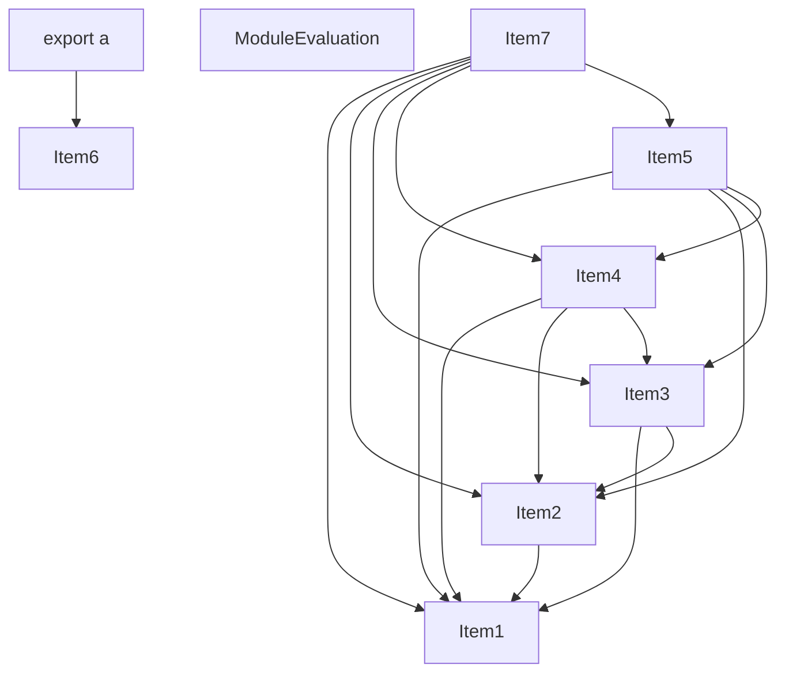
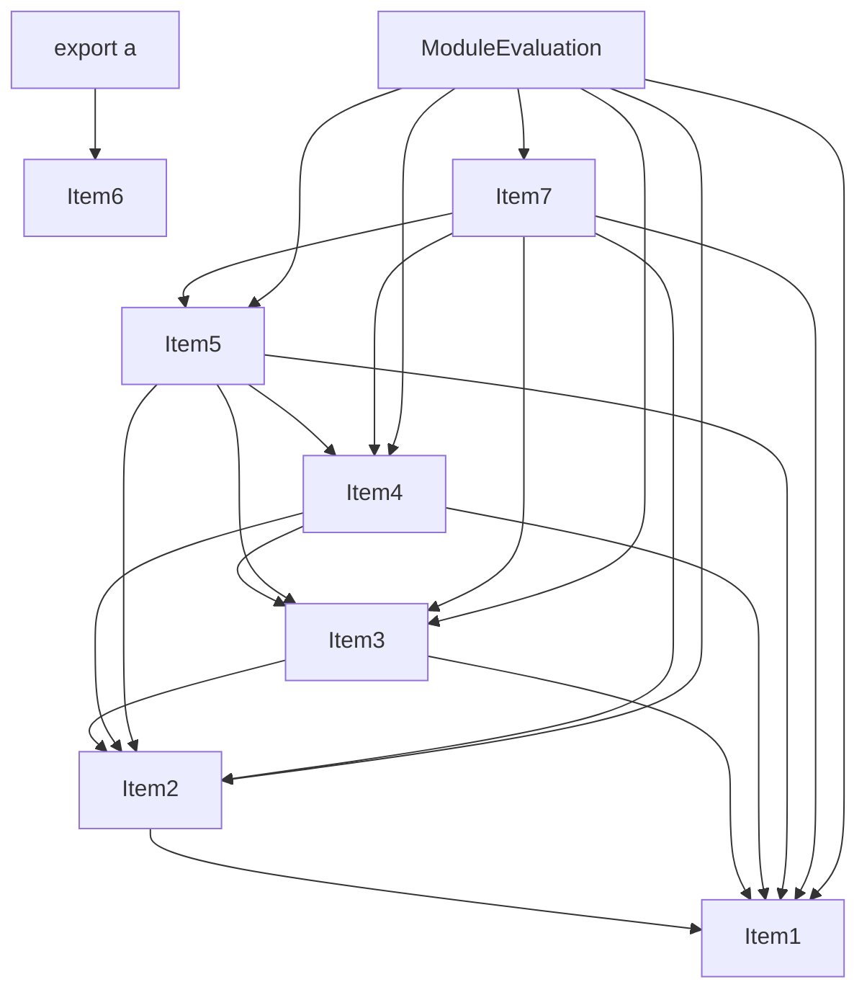
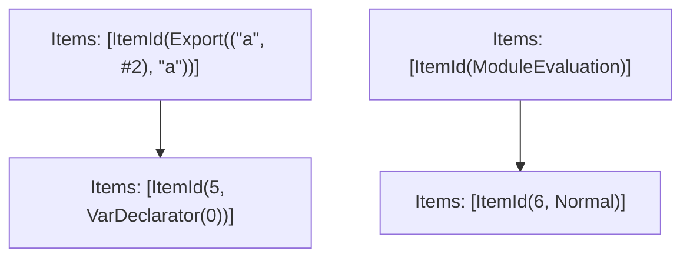

# Items

Count: 9

## Item 1: Stmt 0, `Normal`

```js
export * from './_1';

```

- Hoisted
- Side effects

## Item 2: Stmt 1, `Normal`

```js
export * from './_2';

```

- Hoisted
- Side effects

## Item 3: Stmt 2, `Normal`

```js
export * from './_3';

```

- Hoisted
- Side effects

## Item 4: Stmt 3, `Normal`

```js
export * from './_4';

```

- Hoisted
- Side effects

## Item 5: Stmt 4, `Normal`

```js
export * from './_5';

```

- Hoisted
- Side effects

## Item 6: Stmt 5, `VarDeclarator(0)`

```js
export const a = 1;

```

- Declares: `a`
- Write: `a`

## Item 7: Stmt 6, `Normal`

```js
console.log('foo');

```

- Side effects

# Phase 1

# Phase 2

# Phase 3

# Phase 4

# Final

# Entrypoints

```
{
    ModuleEvaluation: 3,
    Exports: 5,
    Export(
        "a",
    ): 1,
    StarReexports: 4,
}
```


# Modules (dev)
## Part 0
```js
const a = 1;
export { a as a } from "__TURBOPACK_VAR__" assert {
    __turbopack_var__: true
};

```
## Part 1
```js
import "__TURBOPACK_PART__" assert {
    __turbopack_part__: 0
};
import { a as a } from "__TURBOPACK_PART__" assert {
    __turbopack_part__: 0
};
export { a };

```
## Part 2
```js
console.log('foo');

```
## Part 3
```js
import "__TURBOPACK_PART__" assert {
    __turbopack_part__: 2
};
"module evaluation";

```
## Part 4
```js
export * from './_3';
export * from './_5';
export * from './_4';
export * from './_1';
export * from './_2';

```
## Part 5
```js
export { a } from "__TURBOPACK_PART__" assert {
    __turbopack_part__: "export a"
};
export * from "__TURBOPACK_PART__" assert {
    __turbopack_part__: "reexports"
};

```
## Merged (module eval)
```js
import "__TURBOPACK_PART__" assert {
    __turbopack_part__: 2
};
"module evaluation";

```
# Entrypoints

```
{
    ModuleEvaluation: 3,
    Exports: 5,
    Export(
        "a",
    ): 1,
    StarReexports: 4,
}
```


# Modules (prod)
## Part 0
```js
const a = 1;
export { a as a } from "__TURBOPACK_VAR__" assert {
    __turbopack_var__: true
};

```
## Part 1
```js
import "__TURBOPACK_PART__" assert {
    __turbopack_part__: 0
};
import { a as a } from "__TURBOPACK_PART__" assert {
    __turbopack_part__: 0
};
export { a };

```
## Part 2
```js
console.log('foo');

```
## Part 3
```js
import "__TURBOPACK_PART__" assert {
    __turbopack_part__: 2
};
"module evaluation";

```
## Part 4
```js
export * from './_3';
export * from './_5';
export * from './_4';
export * from './_1';
export * from './_2';

```
## Part 5
```js
export { a } from "__TURBOPACK_PART__" assert {
    __turbopack_part__: "export a"
};
export * from "__TURBOPACK_PART__" assert {
    __turbopack_part__: "reexports"
};

```
## Merged (module eval)
```js
import "__TURBOPACK_PART__" assert {
    __turbopack_part__: 2
};
"module evaluation";

```
