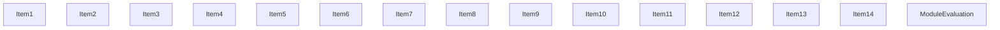
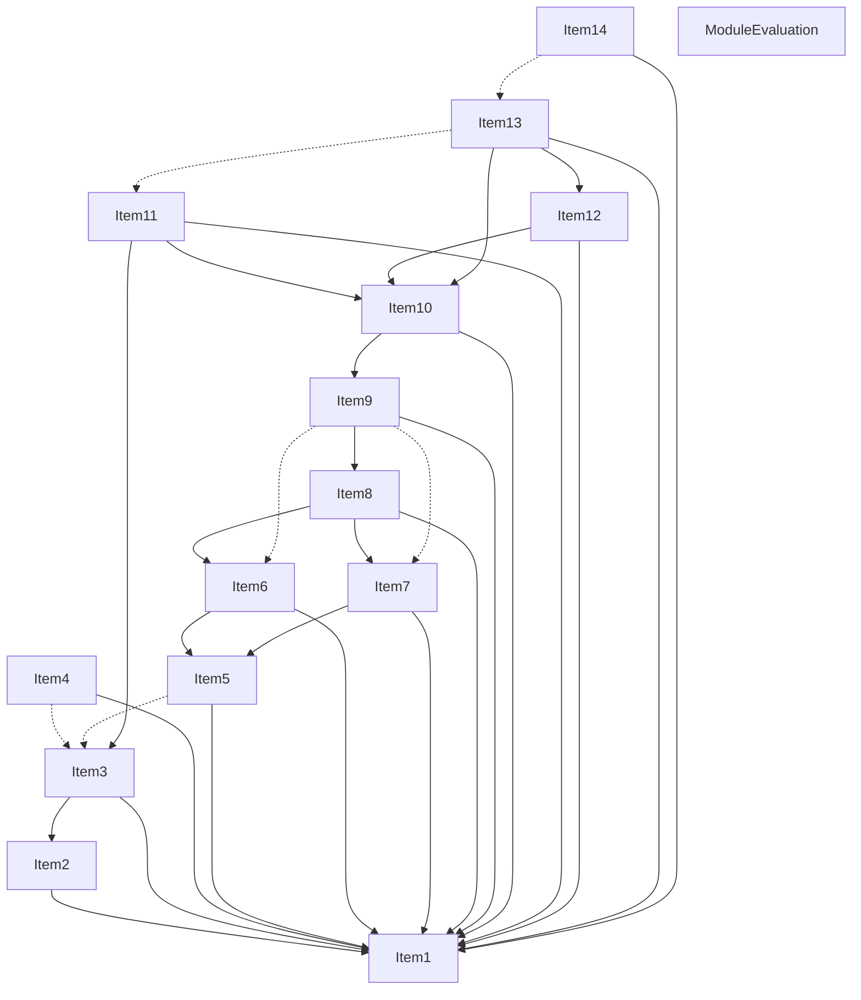
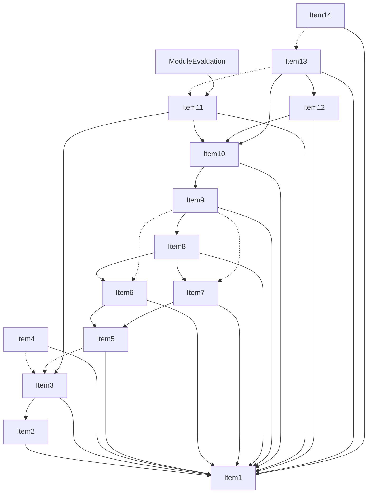
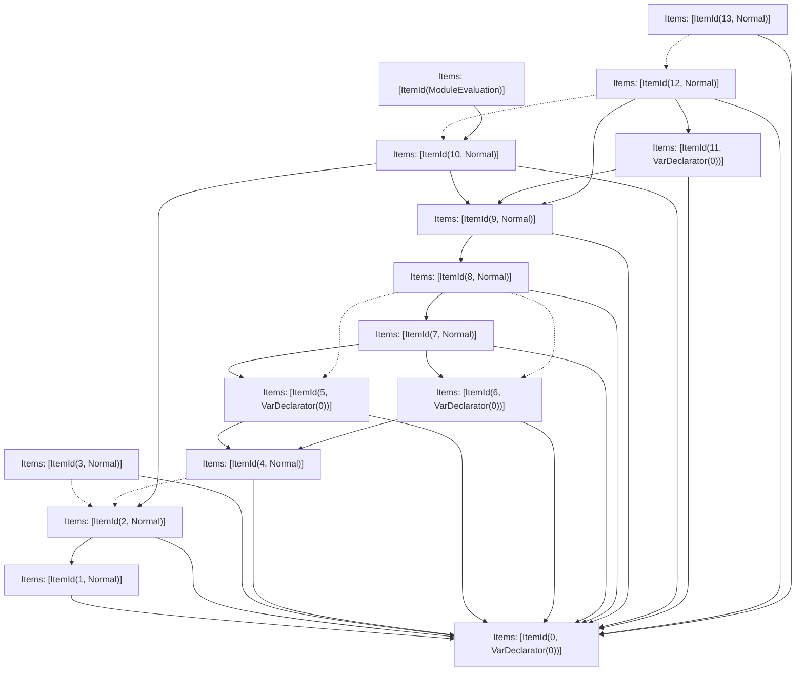

# Items

Count: 15

## Item 1: Stmt 0, `VarDeclarator(0)`

```js
let x = 0;

```

- Declares: `x`
- Write: `x`

## Item 2: Stmt 1, `Normal`

```js
console.log(x);

```

- Side effects
- Reads: `x`

## Item 3: Stmt 2, `Normal`

```js
console.log(x);

```

- Side effects
- Reads: `x`

## Item 4: Stmt 3, `Normal`

```js
x = 1;

```

- Write: `x`

## Item 5: Stmt 4, `Normal`

```js
x = 2;

```

- Write: `x`

## Item 6: Stmt 5, `VarDeclarator(0)`

```js
let y = x;

```

- Declares: `y`
- Reads: `x`
- Write: `y`

## Item 7: Stmt 6, `VarDeclarator(0)`

```js
let z = x;

```

- Declares: `z`
- Reads: `x`
- Write: `z`

## Item 8: Stmt 7, `Normal`

```js
x = y + z;

```

- Reads: `y`, `z`
- Write: `x`

## Item 9: Stmt 8, `Normal`

```js
x = x + 1;

```

- Reads: `x`
- Write: `x`

## Item 10: Stmt 9, `Normal`

```js
x *= 2;

```

- Reads: `x`
- Write: `x`

## Item 11: Stmt 10, `Normal`

```js
console.log(x);

```

- Side effects
- Reads: `x`

## Item 12: Stmt 11, `VarDeclarator(0)`

```js
let a = x;

```

- Declares: `a`
- Reads: `x`
- Write: `a`

## Item 13: Stmt 12, `Normal`

```js
x = x + a + 5;

```

- Reads: `x`, `a`
- Write: `x`

## Item 14: Stmt 13, `Normal`

```js
x = 100;

```

- Write: `x`

# Phase 1

# Phase 2

# Phase 3

# Phase 4

# Final

# Entrypoints

```
{
    ModuleEvaluation: 0,
    Exports: 15,
}
```


# Modules (dev)
## Part 0
```js
import "__TURBOPACK_PART__" assert {
    __turbopack_part__: 11
};
"module evaluation";

```
## Part 1
```js
let x = 0;
export { x as a } from "__TURBOPACK_VAR__" assert {
    __turbopack_var__: true
};

```
## Part 2
```js
import { a as x } from "__TURBOPACK_PART__" assert {
    __turbopack_part__: -1
};
console.log(x);

```
## Part 3
```js
import { a as x } from "__TURBOPACK_PART__" assert {
    __turbopack_part__: -1
};
import "__TURBOPACK_PART__" assert {
    __turbopack_part__: 2
};
console.log(x);

```
## Part 4
```js
import { a as x } from "__TURBOPACK_PART__" assert {
    __turbopack_part__: -1
};
import "__TURBOPACK_PART__" assert {
    __turbopack_part__: 3
};
x = 1;

```
## Part 5
```js
import { a as x } from "__TURBOPACK_PART__" assert {
    __turbopack_part__: -1
};
import "__TURBOPACK_PART__" assert {
    __turbopack_part__: 3
};
x = 2;

```
## Part 6
```js
import { a as x } from "__TURBOPACK_PART__" assert {
    __turbopack_part__: -1
};
import "__TURBOPACK_PART__" assert {
    __turbopack_part__: 5
};
let y = x;
export { y as b } from "__TURBOPACK_VAR__" assert {
    __turbopack_var__: true
};

```
## Part 7
```js
import { a as x } from "__TURBOPACK_PART__" assert {
    __turbopack_part__: -1
};
import "__TURBOPACK_PART__" assert {
    __turbopack_part__: 5
};
let z = x;
export { z as c } from "__TURBOPACK_VAR__" assert {
    __turbopack_var__: true
};

```
## Part 8
```js
import { b as y } from "__TURBOPACK_PART__" assert {
    __turbopack_part__: -6
};
import { c as z } from "__TURBOPACK_PART__" assert {
    __turbopack_part__: -7
};
import { a as x } from "__TURBOPACK_PART__" assert {
    __turbopack_part__: -1
};
x = y + z;

```
## Part 9
```js
import { a as x } from "__TURBOPACK_PART__" assert {
    __turbopack_part__: -1
};
import "__TURBOPACK_PART__" assert {
    __turbopack_part__: 8
};
import "__TURBOPACK_PART__" assert {
    __turbopack_part__: 6
};
import "__TURBOPACK_PART__" assert {
    __turbopack_part__: 7
};
x = x + 1;

```
## Part 10
```js
import { a as x } from "__TURBOPACK_PART__" assert {
    __turbopack_part__: -1
};
import "__TURBOPACK_PART__" assert {
    __turbopack_part__: 9
};
x *= 2;

```
## Part 11
```js
import { a as x } from "__TURBOPACK_PART__" assert {
    __turbopack_part__: -1
};
import "__TURBOPACK_PART__" assert {
    __turbopack_part__: 10
};
import "__TURBOPACK_PART__" assert {
    __turbopack_part__: 3
};
console.log(x);

```
## Part 12
```js
import { a as x } from "__TURBOPACK_PART__" assert {
    __turbopack_part__: -1
};
import "__TURBOPACK_PART__" assert {
    __turbopack_part__: 10
};
let a = x;
export { a as d } from "__TURBOPACK_VAR__" assert {
    __turbopack_var__: true
};

```
## Part 13
```js
import { a as x } from "__TURBOPACK_PART__" assert {
    __turbopack_part__: -1
};
import { d as a } from "__TURBOPACK_PART__" assert {
    __turbopack_part__: -12
};
import "__TURBOPACK_PART__" assert {
    __turbopack_part__: 10
};
import "__TURBOPACK_PART__" assert {
    __turbopack_part__: 11
};
x = x + a + 5;

```
## Part 14
```js
import { a as x } from "__TURBOPACK_PART__" assert {
    __turbopack_part__: -1
};
import "__TURBOPACK_PART__" assert {
    __turbopack_part__: 13
};
x = 100;

```
## Part 15
```js

```
## Merged (module eval)
```js
import "__TURBOPACK_PART__" assert {
    __turbopack_part__: 11
};
"module evaluation";

```
# Entrypoints

```
{
    ModuleEvaluation: 0,
    Exports: 15,
}
```


# Modules (prod)
## Part 0
```js
import "__TURBOPACK_PART__" assert {
    __turbopack_part__: 11
};
"module evaluation";

```
## Part 1
```js
let x = 0;
export { x as a } from "__TURBOPACK_VAR__" assert {
    __turbopack_var__: true
};

```
## Part 2
```js
import { a as x } from "__TURBOPACK_PART__" assert {
    __turbopack_part__: -1
};
console.log(x);

```
## Part 3
```js
import { a as x } from "__TURBOPACK_PART__" assert {
    __turbopack_part__: -1
};
import "__TURBOPACK_PART__" assert {
    __turbopack_part__: 2
};
console.log(x);

```
## Part 4
```js
import { a as x } from "__TURBOPACK_PART__" assert {
    __turbopack_part__: -1
};
x = 1;

```
## Part 5
```js
import { a as x } from "__TURBOPACK_PART__" assert {
    __turbopack_part__: -1
};
x = 2;

```
## Part 6
```js
import { a as x } from "__TURBOPACK_PART__" assert {
    __turbopack_part__: -1
};
import "__TURBOPACK_PART__" assert {
    __turbopack_part__: 5
};
let y = x;
export { y as b } from "__TURBOPACK_VAR__" assert {
    __turbopack_var__: true
};

```
## Part 7
```js
import { a as x } from "__TURBOPACK_PART__" assert {
    __turbopack_part__: -1
};
import "__TURBOPACK_PART__" assert {
    __turbopack_part__: 5
};
let z = x;
export { z as c } from "__TURBOPACK_VAR__" assert {
    __turbopack_var__: true
};

```
## Part 8
```js
import { b as y } from "__TURBOPACK_PART__" assert {
    __turbopack_part__: -6
};
import { c as z } from "__TURBOPACK_PART__" assert {
    __turbopack_part__: -7
};
import { a as x } from "__TURBOPACK_PART__" assert {
    __turbopack_part__: -1
};
x = y + z;

```
## Part 9
```js
import { a as x } from "__TURBOPACK_PART__" assert {
    __turbopack_part__: -1
};
import "__TURBOPACK_PART__" assert {
    __turbopack_part__: 8
};
x = x + 1;

```
## Part 10
```js
import { a as x } from "__TURBOPACK_PART__" assert {
    __turbopack_part__: -1
};
import "__TURBOPACK_PART__" assert {
    __turbopack_part__: 9
};
x *= 2;

```
## Part 11
```js
import { a as x } from "__TURBOPACK_PART__" assert {
    __turbopack_part__: -1
};
import "__TURBOPACK_PART__" assert {
    __turbopack_part__: 10
};
import "__TURBOPACK_PART__" assert {
    __turbopack_part__: 3
};
console.log(x);

```
## Part 12
```js
import { a as x } from "__TURBOPACK_PART__" assert {
    __turbopack_part__: -1
};
import "__TURBOPACK_PART__" assert {
    __turbopack_part__: 10
};
let a = x;
export { a as d } from "__TURBOPACK_VAR__" assert {
    __turbopack_var__: true
};

```
## Part 13
```js
import { a as x } from "__TURBOPACK_PART__" assert {
    __turbopack_part__: -1
};
import { d as a } from "__TURBOPACK_PART__" assert {
    __turbopack_part__: -12
};
import "__TURBOPACK_PART__" assert {
    __turbopack_part__: 10
};
x = x + a + 5;

```
## Part 14
```js
import { a as x } from "__TURBOPACK_PART__" assert {
    __turbopack_part__: -1
};
x = 100;

```
## Part 15
```js

```
## Merged (module eval)
```js
import "__TURBOPACK_PART__" assert {
    __turbopack_part__: 11
};
"module evaluation";

```
