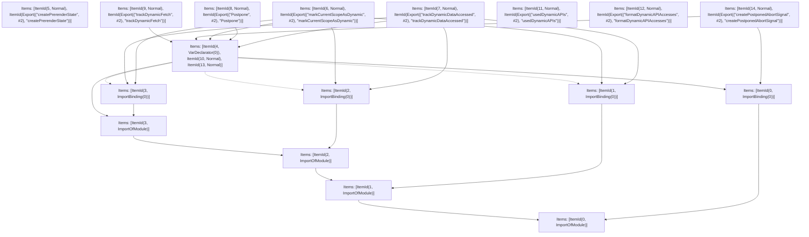

# Items

Count: 27

## Item 1: Stmt 0, `ImportOfModule`

```js
import React from 'react';

```

- Hoisted
- Side effects

## Item 2: Stmt 0, `ImportBinding(0)`

```js
import React from 'react';

```

- Hoisted
- Declares: `React`

## Item 3: Stmt 1, `ImportOfModule`

```js
import { DynamicServerError } from '../../client/components/hooks-server-context';

```

- Hoisted
- Side effects

## Item 4: Stmt 1, `ImportBinding(0)`

```js
import { DynamicServerError } from '../../client/components/hooks-server-context';

```

- Hoisted
- Declares: `DynamicServerError`

## Item 5: Stmt 2, `ImportOfModule`

```js
import { StaticGenBailoutError } from '../../client/components/static-generation-bailout';

```

- Hoisted
- Side effects

## Item 6: Stmt 2, `ImportBinding(0)`

```js
import { StaticGenBailoutError } from '../../client/components/static-generation-bailout';

```

- Hoisted
- Declares: `StaticGenBailoutError`

## Item 7: Stmt 3, `ImportOfModule`

```js
import { getPathname } from '../../lib/url';

```

- Hoisted
- Side effects

## Item 8: Stmt 3, `ImportBinding(0)`

```js
import { getPathname } from '../../lib/url';

```

- Hoisted
- Declares: `getPathname`

## Item 9: Stmt 4, `VarDeclarator(0)`

```js
const hasPostpone = typeof React.unstable_postpone === 'function';

```

- Side effects
- Declares: `hasPostpone`
- Reads: `React`
- Write: `React`, `hasPostpone`

## Item 10: Stmt 5, `Normal`

```js
export function createPrerenderState(isDebugSkeleton) {
    return {
        isDebugSkeleton,
        dynamicAccesses: []
    };
}

```

- Hoisted
- Declares: `createPrerenderState`
- Write: `createPrerenderState`

## Item 11: Stmt 6, `Normal`

```js
export function markCurrentScopeAsDynamic(store, expression) {
    const pathname = getPathname(store.urlPathname);
    if (store.isUnstableCacheCallback) {
        return;
    } else if (store.dynamicShouldError) {
        throw new StaticGenBailoutError(`Route ${pathname} with \`dynamic = "error"\` couldn't be rendered statically because it used \`${expression}\`. See more info here: https://nextjs.org/docs/app/building-your-application/rendering/static-and-dynamic#dynamic-rendering`);
    } else if (store.prerenderState) {
        postponeWithTracking(store.prerenderState, expression, pathname);
    } else {
        store.revalidate = 0;
        if (store.isStaticGeneration) {
            const err = new DynamicServerError(`Route ${pathname} couldn't be rendered statically because it used ${expression}. See more info here: https://nextjs.org/docs/messages/dynamic-server-error`);
            store.dynamicUsageDescription = expression;
            store.dynamicUsageStack = err.stack;
            throw err;
        }
    }
}

```

- Hoisted
- Declares: `markCurrentScopeAsDynamic`
- Reads (eventual): `getPathname`, `StaticGenBailoutError`, `postponeWithTracking`, `DynamicServerError`
- Write: `markCurrentScopeAsDynamic`

## Item 12: Stmt 7, `Normal`

```js
export function trackDynamicDataAccessed(store, expression) {
    const pathname = getPathname(store.urlPathname);
    if (store.isUnstableCacheCallback) {
        throw new Error(`Route ${pathname} used "${expression}" inside a function cached with "unstable_cache(...)". Accessing Dynamic data sources inside a cache scope is not supported. If you need this data inside a cached function use "${expression}" outside of the cached function and pass the required dynamic data in as an argument. See more info here: https://nextjs.org/docs/app/api-reference/functions/unstable_cache`);
    } else if (store.dynamicShouldError) {
        throw new StaticGenBailoutError(`Route ${pathname} with \`dynamic = "error"\` couldn't be rendered statically because it used \`${expression}\`. See more info here: https://nextjs.org/docs/app/building-your-application/rendering/static-and-dynamic#dynamic-rendering`);
    } else if (store.prerenderState) {
        postponeWithTracking(store.prerenderState, expression, pathname);
    } else {
        store.revalidate = 0;
        if (store.isStaticGeneration) {
            const err = new DynamicServerError(`Route ${pathname} couldn't be rendered statically because it used ${expression}. See more info here: https://nextjs.org/docs/messages/dynamic-server-error`);
            store.dynamicUsageDescription = expression;
            store.dynamicUsageStack = err.stack;
            throw err;
        }
    }
}

```

- Hoisted
- Declares: `trackDynamicDataAccessed`
- Reads (eventual): `getPathname`, `StaticGenBailoutError`, `postponeWithTracking`, `DynamicServerError`
- Write: `trackDynamicDataAccessed`

## Item 13: Stmt 8, `Normal`

```js
export function Postpone({ reason, prerenderState, pathname }) {
    postponeWithTracking(prerenderState, reason, pathname);
}

```

- Hoisted
- Declares: `Postpone`
- Reads (eventual): `postponeWithTracking`
- Write: `Postpone`

## Item 14: Stmt 9, `Normal`

```js
export function trackDynamicFetch(store, expression) {
    if (!store.prerenderState || store.isUnstableCacheCallback) return;
    postponeWithTracking(store.prerenderState, expression, store.urlPathname);
}

```

- Hoisted
- Declares: `trackDynamicFetch`
- Reads (eventual): `postponeWithTracking`
- Write: `trackDynamicFetch`

## Item 15: Stmt 10, `Normal`

```js
function postponeWithTracking(prerenderState, expression, pathname) {
    assertPostpone();
    const reason = `Route ${pathname} needs to bail out of prerendering at this point because it used ${expression}. ` + `React throws this special object to indicate where. It should not be caught by ` + `your own try/catch. Learn more: https://nextjs.org/docs/messages/ppr-caught-error`;
    prerenderState.dynamicAccesses.push({
        stack: prerenderState.isDebugSkeleton ? new Error().stack : undefined,
        expression
    });
    React.unstable_postpone(reason);
}

```

- Hoisted
- Declares: `postponeWithTracking`
- Reads (eventual): `assertPostpone`, `React`
- Write: `postponeWithTracking`
- Write (eventual): `React`

## Item 16: Stmt 11, `Normal`

```js
export function usedDynamicAPIs(prerenderState) {
    return prerenderState.dynamicAccesses.length > 0;
}

```

- Hoisted
- Declares: `usedDynamicAPIs`
- Write: `usedDynamicAPIs`

## Item 17: Stmt 12, `Normal`

```js
export function formatDynamicAPIAccesses(prerenderState) {
    return prerenderState.dynamicAccesses.filter((access)=>typeof access.stack === 'string' && access.stack.length > 0).map(({ expression, stack })=>{
        stack = stack.split('\n').slice(4).filter((line)=>{
            if (line.includes('node_modules/next/')) {
                return false;
            }
            if (line.includes(' (<anonymous>)')) {
                return false;
            }
            if (line.includes(' (node:')) {
                return false;
            }
            return true;
        }).join('\n');
        return `Dynamic API Usage Debug - ${expression}:\n${stack}`;
    });
}

```

- Hoisted
- Declares: `formatDynamicAPIAccesses`
- Write: `formatDynamicAPIAccesses`

## Item 18: Stmt 13, `Normal`

```js
function assertPostpone() {
    if (!hasPostpone) {
        throw new Error(`Invariant: React.unstable_postpone is not defined. This suggests the wrong version of React was loaded. This is a bug in Next.js`);
    }
}

```

- Hoisted
- Declares: `assertPostpone`
- Reads (eventual): `hasPostpone`
- Write: `assertPostpone`

## Item 19: Stmt 14, `Normal`

```js
export function createPostponedAbortSignal(reason) {
    assertPostpone();
    const controller = new AbortController();
    try {
        React.unstable_postpone(reason);
    } catch (x) {
        controller.abort(x);
    }
    return controller.signal;
}

```

- Hoisted
- Declares: `createPostponedAbortSignal`
- Reads (eventual): `assertPostpone`, `React`
- Write: `createPostponedAbortSignal`
- Write (eventual): `React`

# Phase 1

# Phase 2

# Phase 3

# Phase 4

# Final

# Entrypoints

```
{
    ModuleEvaluation: 8,
    Export(
        "Postpone",
    ): 12,
    Export(
        "createPostponedAbortSignal",
    ): 16,
    Export(
        "createPrerenderState",
    ): 9,
    Export(
        "formatDynamicAPIAccesses",
    ): 15,
    Export(
        "markCurrentScopeAsDynamic",
    ): 10,
    Export(
        "trackDynamicDataAccessed",
    ): 11,
    Export(
        "trackDynamicFetch",
    ): 13,
    Export(
        "usedDynamicAPIs",
    ): 14,
    Exports: 17,
}
```


# Modules (dev)
## Part 0
```js
import 'react';

```
## Part 1
```js
import "__TURBOPACK_PART__" assert {
    __turbopack_part__: 0
};

```
## Part 2
```js
import "__TURBOPACK_PART__" assert {
    __turbopack_part__: 0
};
import '../../client/components/hooks-server-context';

```
## Part 3
```js
import "__TURBOPACK_PART__" assert {
    __turbopack_part__: 2
};

```
## Part 4
```js
import "__TURBOPACK_PART__" assert {
    __turbopack_part__: 2
};
import '../../client/components/static-generation-bailout';

```
## Part 5
```js
import "__TURBOPACK_PART__" assert {
    __turbopack_part__: 4
};

```
## Part 6
```js
import "__TURBOPACK_PART__" assert {
    __turbopack_part__: 4
};
import '../../lib/url';

```
## Part 7
```js
import "__TURBOPACK_PART__" assert {
    __turbopack_part__: 6
};

```
## Part 8
```js
import "__TURBOPACK_PART__" assert {
    __turbopack_part__: 0
};
import React from 'react';
import "__TURBOPACK_PART__" assert {
    __turbopack_part__: 6
};
import "__TURBOPACK_PART__" assert {
    __turbopack_part__: 7
};
import "__TURBOPACK_PART__" assert {
    __turbopack_part__: 5
};
import "__TURBOPACK_PART__" assert {
    __turbopack_part__: 3
};
const hasPostpone = typeof React.unstable_postpone === 'function';
function postponeWithTracking(prerenderState, expression, pathname) {
    assertPostpone();
    const reason = `Route ${pathname} needs to bail out of prerendering at this point because it used ${expression}. ` + `React throws this special object to indicate where. It should not be caught by ` + `your own try/catch. Learn more: https://nextjs.org/docs/messages/ppr-caught-error`;
    prerenderState.dynamicAccesses.push({
        stack: prerenderState.isDebugSkeleton ? new Error().stack : undefined,
        expression
    });
    React.unstable_postpone(reason);
}
function assertPostpone() {
    if (!hasPostpone) {
        throw new Error(`Invariant: React.unstable_postpone is not defined. This suggests the wrong version of React was loaded. This is a bug in Next.js`);
    }
}
export { hasPostpone as a } from "__TURBOPACK_VAR__" assert {
    __turbopack_var__: true
};
export { postponeWithTracking as b } from "__TURBOPACK_VAR__" assert {
    __turbopack_var__: true
};
export { assertPostpone as c } from "__TURBOPACK_VAR__" assert {
    __turbopack_var__: true
};
export { };

```
## Part 9
```js
function createPrerenderState(isDebugSkeleton) {
    return {
        isDebugSkeleton,
        dynamicAccesses: []
    };
}
export { createPrerenderState };
export { createPrerenderState as d } from "__TURBOPACK_VAR__" assert {
    __turbopack_var__: true
};

```
## Part 10
```js
import "__TURBOPACK_PART__" assert {
    __turbopack_part__: 2
};
import { DynamicServerError } from '../../client/components/hooks-server-context';
import "__TURBOPACK_PART__" assert {
    __turbopack_part__: 6
};
import { getPathname } from '../../lib/url';
import "__TURBOPACK_PART__" assert {
    __turbopack_part__: 4
};
import { StaticGenBailoutError } from '../../client/components/static-generation-bailout';
import { b as postponeWithTracking } from "__TURBOPACK_PART__" assert {
    __turbopack_part__: -8
};
function markCurrentScopeAsDynamic(store, expression) {
    const pathname = getPathname(store.urlPathname);
    if (store.isUnstableCacheCallback) {
        return;
    } else if (store.dynamicShouldError) {
        throw new StaticGenBailoutError(`Route ${pathname} with \`dynamic = "error"\` couldn't be rendered statically because it used \`${expression}\`. See more info here: https://nextjs.org/docs/app/building-your-application/rendering/static-and-dynamic#dynamic-rendering`);
    } else if (store.prerenderState) {
        postponeWithTracking(store.prerenderState, expression, pathname);
    } else {
        store.revalidate = 0;
        if (store.isStaticGeneration) {
            const err = new DynamicServerError(`Route ${pathname} couldn't be rendered statically because it used ${expression}. See more info here: https://nextjs.org/docs/messages/dynamic-server-error`);
            store.dynamicUsageDescription = expression;
            store.dynamicUsageStack = err.stack;
            throw err;
        }
    }
}
export { markCurrentScopeAsDynamic };
export { markCurrentScopeAsDynamic as e } from "__TURBOPACK_VAR__" assert {
    __turbopack_var__: true
};

```
## Part 11
```js
import "__TURBOPACK_PART__" assert {
    __turbopack_part__: 2
};
import { DynamicServerError } from '../../client/components/hooks-server-context';
import "__TURBOPACK_PART__" assert {
    __turbopack_part__: 6
};
import { getPathname } from '../../lib/url';
import "__TURBOPACK_PART__" assert {
    __turbopack_part__: 4
};
import { StaticGenBailoutError } from '../../client/components/static-generation-bailout';
import { b as postponeWithTracking } from "__TURBOPACK_PART__" assert {
    __turbopack_part__: -8
};
function trackDynamicDataAccessed(store, expression) {
    const pathname = getPathname(store.urlPathname);
    if (store.isUnstableCacheCallback) {
        throw new Error(`Route ${pathname} used "${expression}" inside a function cached with "unstable_cache(...)". Accessing Dynamic data sources inside a cache scope is not supported. If you need this data inside a cached function use "${expression}" outside of the cached function and pass the required dynamic data in as an argument. See more info here: https://nextjs.org/docs/app/api-reference/functions/unstable_cache`);
    } else if (store.dynamicShouldError) {
        throw new StaticGenBailoutError(`Route ${pathname} with \`dynamic = "error"\` couldn't be rendered statically because it used \`${expression}\`. See more info here: https://nextjs.org/docs/app/building-your-application/rendering/static-and-dynamic#dynamic-rendering`);
    } else if (store.prerenderState) {
        postponeWithTracking(store.prerenderState, expression, pathname);
    } else {
        store.revalidate = 0;
        if (store.isStaticGeneration) {
            const err = new DynamicServerError(`Route ${pathname} couldn't be rendered statically because it used ${expression}. See more info here: https://nextjs.org/docs/messages/dynamic-server-error`);
            store.dynamicUsageDescription = expression;
            store.dynamicUsageStack = err.stack;
            throw err;
        }
    }
}
export { trackDynamicDataAccessed };
export { trackDynamicDataAccessed as f } from "__TURBOPACK_VAR__" assert {
    __turbopack_var__: true
};

```
## Part 12
```js
import { b as postponeWithTracking } from "__TURBOPACK_PART__" assert {
    __turbopack_part__: -8
};
function Postpone({ reason, prerenderState, pathname }) {
    postponeWithTracking(prerenderState, reason, pathname);
}
export { Postpone };
export { Postpone as g } from "__TURBOPACK_VAR__" assert {
    __turbopack_var__: true
};

```
## Part 13
```js
import { b as postponeWithTracking } from "__TURBOPACK_PART__" assert {
    __turbopack_part__: -8
};
function trackDynamicFetch(store, expression) {
    if (!store.prerenderState || store.isUnstableCacheCallback) return;
    postponeWithTracking(store.prerenderState, expression, store.urlPathname);
}
export { trackDynamicFetch };
export { trackDynamicFetch as h } from "__TURBOPACK_VAR__" assert {
    __turbopack_var__: true
};

```
## Part 14
```js
function usedDynamicAPIs(prerenderState) {
    return prerenderState.dynamicAccesses.length > 0;
}
export { usedDynamicAPIs };
export { usedDynamicAPIs as i } from "__TURBOPACK_VAR__" assert {
    __turbopack_var__: true
};

```
## Part 15
```js
function formatDynamicAPIAccesses(prerenderState) {
    return prerenderState.dynamicAccesses.filter((access)=>typeof access.stack === 'string' && access.stack.length > 0).map(({ expression, stack })=>{
        stack = stack.split('\n').slice(4).filter((line)=>{
            if (line.includes('node_modules/next/')) {
                return false;
            }
            if (line.includes(' (<anonymous>)')) {
                return false;
            }
            if (line.includes(' (node:')) {
                return false;
            }
            return true;
        }).join('\n');
        return `Dynamic API Usage Debug - ${expression}:\n${stack}`;
    });
}
export { formatDynamicAPIAccesses };
export { formatDynamicAPIAccesses as j } from "__TURBOPACK_VAR__" assert {
    __turbopack_var__: true
};

```
## Part 16
```js
import "__TURBOPACK_PART__" assert {
    __turbopack_part__: 0
};
import React from 'react';
import { c as assertPostpone } from "__TURBOPACK_PART__" assert {
    __turbopack_part__: -8
};
function createPostponedAbortSignal(reason) {
    assertPostpone();
    const controller = new AbortController();
    try {
        React.unstable_postpone(reason);
    } catch (x) {
        controller.abort(x);
    }
    return controller.signal;
}
export { createPostponedAbortSignal };
export { createPostponedAbortSignal as k } from "__TURBOPACK_VAR__" assert {
    __turbopack_var__: true
};

```
## Part 17
```js
export { createPrerenderState } from "__TURBOPACK_PART__" assert {
    __turbopack_part__: "export createPrerenderState"
};
export { markCurrentScopeAsDynamic } from "__TURBOPACK_PART__" assert {
    __turbopack_part__: "export markCurrentScopeAsDynamic"
};
export { trackDynamicDataAccessed } from "__TURBOPACK_PART__" assert {
    __turbopack_part__: "export trackDynamicDataAccessed"
};
export { Postpone } from "__TURBOPACK_PART__" assert {
    __turbopack_part__: "export Postpone"
};
export { trackDynamicFetch } from "__TURBOPACK_PART__" assert {
    __turbopack_part__: "export trackDynamicFetch"
};
export { usedDynamicAPIs } from "__TURBOPACK_PART__" assert {
    __turbopack_part__: "export usedDynamicAPIs"
};
export { formatDynamicAPIAccesses } from "__TURBOPACK_PART__" assert {
    __turbopack_part__: "export formatDynamicAPIAccesses"
};
export { createPostponedAbortSignal } from "__TURBOPACK_PART__" assert {
    __turbopack_part__: "export createPostponedAbortSignal"
};

```
## Merged (module eval)
```js
import "__TURBOPACK_PART__" assert {
    __turbopack_part__: 0
};
import React from 'react';
import "__TURBOPACK_PART__" assert {
    __turbopack_part__: 6
};
import "__TURBOPACK_PART__" assert {
    __turbopack_part__: 7
};
import "__TURBOPACK_PART__" assert {
    __turbopack_part__: 5
};
import "__TURBOPACK_PART__" assert {
    __turbopack_part__: 3
};
const hasPostpone = typeof React.unstable_postpone === 'function';
function postponeWithTracking(prerenderState, expression, pathname) {
    assertPostpone();
    const reason = `Route ${pathname} needs to bail out of prerendering at this point because it used ${expression}. ` + `React throws this special object to indicate where. It should not be caught by ` + `your own try/catch. Learn more: https://nextjs.org/docs/messages/ppr-caught-error`;
    prerenderState.dynamicAccesses.push({
        stack: prerenderState.isDebugSkeleton ? new Error().stack : undefined,
        expression
    });
    React.unstable_postpone(reason);
}
function assertPostpone() {
    if (!hasPostpone) {
        throw new Error(`Invariant: React.unstable_postpone is not defined. This suggests the wrong version of React was loaded. This is a bug in Next.js`);
    }
}
export { hasPostpone as a } from "__TURBOPACK_VAR__" assert {
    __turbopack_var__: true
};
export { postponeWithTracking as b } from "__TURBOPACK_VAR__" assert {
    __turbopack_var__: true
};
export { assertPostpone as c } from "__TURBOPACK_VAR__" assert {
    __turbopack_var__: true
};
export { };

```
# Entrypoints

```
{
    ModuleEvaluation: 8,
    Export(
        "Postpone",
    ): 12,
    Export(
        "createPostponedAbortSignal",
    ): 18,
    Export(
        "createPrerenderState",
    ): 9,
    Export(
        "formatDynamicAPIAccesses",
    ): 16,
    Export(
        "markCurrentScopeAsDynamic",
    ): 10,
    Export(
        "trackDynamicDataAccessed",
    ): 11,
    Export(
        "trackDynamicFetch",
    ): 13,
    Export(
        "usedDynamicAPIs",
    ): 15,
    Exports: 19,
}
```


# Modules (prod)
## Part 0
```js
import 'react';

```
## Part 1
```js
import "__TURBOPACK_PART__" assert {
    __turbopack_part__: 0
};

```
## Part 2
```js
import "__TURBOPACK_PART__" assert {
    __turbopack_part__: 0
};
import '../../client/components/hooks-server-context';

```
## Part 3
```js
import "__TURBOPACK_PART__" assert {
    __turbopack_part__: 2
};

```
## Part 4
```js
import "__TURBOPACK_PART__" assert {
    __turbopack_part__: 2
};
import '../../client/components/static-generation-bailout';

```
## Part 5
```js
import "__TURBOPACK_PART__" assert {
    __turbopack_part__: 4
};

```
## Part 6
```js
import "__TURBOPACK_PART__" assert {
    __turbopack_part__: 4
};
import '../../lib/url';

```
## Part 7
```js
import "__TURBOPACK_PART__" assert {
    __turbopack_part__: 6
};

```
## Part 8
```js
import "__TURBOPACK_PART__" assert {
    __turbopack_part__: 0
};
import React from 'react';
import "__TURBOPACK_PART__" assert {
    __turbopack_part__: 6
};
const hasPostpone = typeof React.unstable_postpone === 'function';
export { hasPostpone as a } from "__TURBOPACK_VAR__" assert {
    __turbopack_var__: true
};
export { };

```
## Part 9
```js
function createPrerenderState(isDebugSkeleton) {
    return {
        isDebugSkeleton,
        dynamicAccesses: []
    };
}
export { createPrerenderState };
export { createPrerenderState as b } from "__TURBOPACK_VAR__" assert {
    __turbopack_var__: true
};

```
## Part 10
```js
import "__TURBOPACK_PART__" assert {
    __turbopack_part__: 2
};
import { DynamicServerError } from '../../client/components/hooks-server-context';
import "__TURBOPACK_PART__" assert {
    __turbopack_part__: 6
};
import { getPathname } from '../../lib/url';
import "__TURBOPACK_PART__" assert {
    __turbopack_part__: 4
};
import { StaticGenBailoutError } from '../../client/components/static-generation-bailout';
import { c as postponeWithTracking } from "__TURBOPACK_PART__" assert {
    __turbopack_part__: -14
};
function markCurrentScopeAsDynamic(store, expression) {
    const pathname = getPathname(store.urlPathname);
    if (store.isUnstableCacheCallback) {
        return;
    } else if (store.dynamicShouldError) {
        throw new StaticGenBailoutError(`Route ${pathname} with \`dynamic = "error"\` couldn't be rendered statically because it used \`${expression}\`. See more info here: https://nextjs.org/docs/app/building-your-application/rendering/static-and-dynamic#dynamic-rendering`);
    } else if (store.prerenderState) {
        postponeWithTracking(store.prerenderState, expression, pathname);
    } else {
        store.revalidate = 0;
        if (store.isStaticGeneration) {
            const err = new DynamicServerError(`Route ${pathname} couldn't be rendered statically because it used ${expression}. See more info here: https://nextjs.org/docs/messages/dynamic-server-error`);
            store.dynamicUsageDescription = expression;
            store.dynamicUsageStack = err.stack;
            throw err;
        }
    }
}
export { markCurrentScopeAsDynamic };
export { markCurrentScopeAsDynamic as d } from "__TURBOPACK_VAR__" assert {
    __turbopack_var__: true
};

```
## Part 11
```js
import "__TURBOPACK_PART__" assert {
    __turbopack_part__: 2
};
import { DynamicServerError } from '../../client/components/hooks-server-context';
import "__TURBOPACK_PART__" assert {
    __turbopack_part__: 6
};
import { getPathname } from '../../lib/url';
import "__TURBOPACK_PART__" assert {
    __turbopack_part__: 4
};
import { StaticGenBailoutError } from '../../client/components/static-generation-bailout';
import { c as postponeWithTracking } from "__TURBOPACK_PART__" assert {
    __turbopack_part__: -14
};
function trackDynamicDataAccessed(store, expression) {
    const pathname = getPathname(store.urlPathname);
    if (store.isUnstableCacheCallback) {
        throw new Error(`Route ${pathname} used "${expression}" inside a function cached with "unstable_cache(...)". Accessing Dynamic data sources inside a cache scope is not supported. If you need this data inside a cached function use "${expression}" outside of the cached function and pass the required dynamic data in as an argument. See more info here: https://nextjs.org/docs/app/api-reference/functions/unstable_cache`);
    } else if (store.dynamicShouldError) {
        throw new StaticGenBailoutError(`Route ${pathname} with \`dynamic = "error"\` couldn't be rendered statically because it used \`${expression}\`. See more info here: https://nextjs.org/docs/app/building-your-application/rendering/static-and-dynamic#dynamic-rendering`);
    } else if (store.prerenderState) {
        postponeWithTracking(store.prerenderState, expression, pathname);
    } else {
        store.revalidate = 0;
        if (store.isStaticGeneration) {
            const err = new DynamicServerError(`Route ${pathname} couldn't be rendered statically because it used ${expression}. See more info here: https://nextjs.org/docs/messages/dynamic-server-error`);
            store.dynamicUsageDescription = expression;
            store.dynamicUsageStack = err.stack;
            throw err;
        }
    }
}
export { trackDynamicDataAccessed };
export { trackDynamicDataAccessed as e } from "__TURBOPACK_VAR__" assert {
    __turbopack_var__: true
};

```
## Part 12
```js
import { c as postponeWithTracking } from "__TURBOPACK_PART__" assert {
    __turbopack_part__: -14
};
function Postpone({ reason, prerenderState, pathname }) {
    postponeWithTracking(prerenderState, reason, pathname);
}
export { Postpone };
export { Postpone as f } from "__TURBOPACK_VAR__" assert {
    __turbopack_var__: true
};

```
## Part 13
```js
import { c as postponeWithTracking } from "__TURBOPACK_PART__" assert {
    __turbopack_part__: -14
};
function trackDynamicFetch(store, expression) {
    if (!store.prerenderState || store.isUnstableCacheCallback) return;
    postponeWithTracking(store.prerenderState, expression, store.urlPathname);
}
export { trackDynamicFetch };
export { trackDynamicFetch as g } from "__TURBOPACK_VAR__" assert {
    __turbopack_var__: true
};

```
## Part 14
```js
import "__TURBOPACK_PART__" assert {
    __turbopack_part__: 0
};
import React from 'react';
import { h as assertPostpone } from "__TURBOPACK_PART__" assert {
    __turbopack_part__: -17
};
import "__TURBOPACK_PART__" assert {
    __turbopack_part__: 8
};
function postponeWithTracking(prerenderState, expression, pathname) {
    assertPostpone();
    const reason = `Route ${pathname} needs to bail out of prerendering at this point because it used ${expression}. ` + `React throws this special object to indicate where. It should not be caught by ` + `your own try/catch. Learn more: https://nextjs.org/docs/messages/ppr-caught-error`;
    prerenderState.dynamicAccesses.push({
        stack: prerenderState.isDebugSkeleton ? new Error().stack : undefined,
        expression
    });
    React.unstable_postpone(reason);
}
export { postponeWithTracking as c } from "__TURBOPACK_VAR__" assert {
    __turbopack_var__: true
};

```
## Part 15
```js
function usedDynamicAPIs(prerenderState) {
    return prerenderState.dynamicAccesses.length > 0;
}
export { usedDynamicAPIs };
export { usedDynamicAPIs as i } from "__TURBOPACK_VAR__" assert {
    __turbopack_var__: true
};

```
## Part 16
```js
function formatDynamicAPIAccesses(prerenderState) {
    return prerenderState.dynamicAccesses.filter((access)=>typeof access.stack === 'string' && access.stack.length > 0).map(({ expression, stack })=>{
        stack = stack.split('\n').slice(4).filter((line)=>{
            if (line.includes('node_modules/next/')) {
                return false;
            }
            if (line.includes(' (<anonymous>)')) {
                return false;
            }
            if (line.includes(' (node:')) {
                return false;
            }
            return true;
        }).join('\n');
        return `Dynamic API Usage Debug - ${expression}:\n${stack}`;
    });
}
export { formatDynamicAPIAccesses };
export { formatDynamicAPIAccesses as j } from "__TURBOPACK_VAR__" assert {
    __turbopack_var__: true
};

```
## Part 17
```js
import { a as hasPostpone } from "__TURBOPACK_PART__" assert {
    __turbopack_part__: -8
};
function assertPostpone() {
    if (!hasPostpone) {
        throw new Error(`Invariant: React.unstable_postpone is not defined. This suggests the wrong version of React was loaded. This is a bug in Next.js`);
    }
}
export { assertPostpone as h } from "__TURBOPACK_VAR__" assert {
    __turbopack_var__: true
};

```
## Part 18
```js
import "__TURBOPACK_PART__" assert {
    __turbopack_part__: 0
};
import React from 'react';
import { h as assertPostpone } from "__TURBOPACK_PART__" assert {
    __turbopack_part__: -17
};
import "__TURBOPACK_PART__" assert {
    __turbopack_part__: 8
};
function createPostponedAbortSignal(reason) {
    assertPostpone();
    const controller = new AbortController();
    try {
        React.unstable_postpone(reason);
    } catch (x) {
        controller.abort(x);
    }
    return controller.signal;
}
export { createPostponedAbortSignal };
export { createPostponedAbortSignal as k } from "__TURBOPACK_VAR__" assert {
    __turbopack_var__: true
};

```
## Part 19
```js
export { createPrerenderState } from "__TURBOPACK_PART__" assert {
    __turbopack_part__: "export createPrerenderState"
};
export { markCurrentScopeAsDynamic } from "__TURBOPACK_PART__" assert {
    __turbopack_part__: "export markCurrentScopeAsDynamic"
};
export { trackDynamicDataAccessed } from "__TURBOPACK_PART__" assert {
    __turbopack_part__: "export trackDynamicDataAccessed"
};
export { Postpone } from "__TURBOPACK_PART__" assert {
    __turbopack_part__: "export Postpone"
};
export { trackDynamicFetch } from "__TURBOPACK_PART__" assert {
    __turbopack_part__: "export trackDynamicFetch"
};
export { usedDynamicAPIs } from "__TURBOPACK_PART__" assert {
    __turbopack_part__: "export usedDynamicAPIs"
};
export { formatDynamicAPIAccesses } from "__TURBOPACK_PART__" assert {
    __turbopack_part__: "export formatDynamicAPIAccesses"
};
export { createPostponedAbortSignal } from "__TURBOPACK_PART__" assert {
    __turbopack_part__: "export createPostponedAbortSignal"
};

```
## Merged (module eval)
```js
import "__TURBOPACK_PART__" assert {
    __turbopack_part__: 0
};
import React from 'react';
import "__TURBOPACK_PART__" assert {
    __turbopack_part__: 6
};
const hasPostpone = typeof React.unstable_postpone === 'function';
export { hasPostpone as a } from "__TURBOPACK_VAR__" assert {
    __turbopack_var__: true
};
export { };

```
