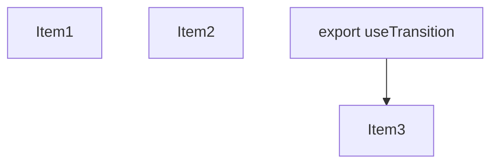
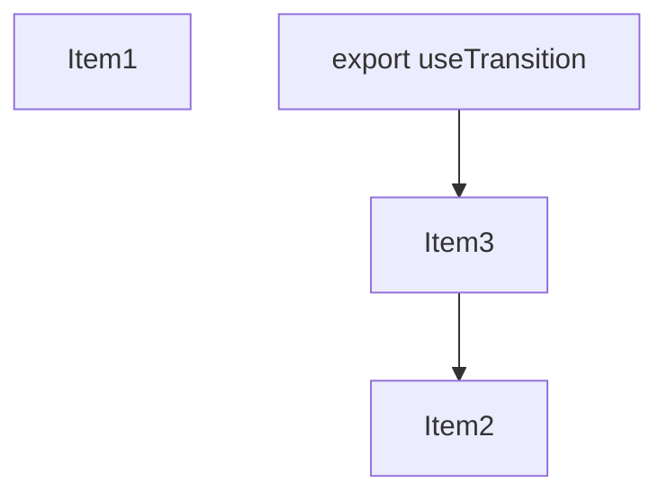
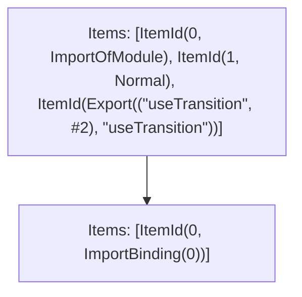

# Items

Count: 4

## Item 1: Stmt 0, `ImportOfModule`

```js
import { createTransition } from "./transition" assert {
    "turbopack-transition": "next-ssr"
};

```

- Hoisted
- Side effects

## Item 2: Stmt 0, `ImportBinding(0)`

```js
import { createTransition } from "./transition" assert {
    "turbopack-transition": "next-ssr"
};

```

- Hoisted
- Declares: `createTransition`

## Item 3: Stmt 1, `Normal`

```js
export function useTransition() {
    return createTransition();
}

```

- Hoisted
- Declares: `useTransition`
- Reads (eventual): `createTransition`
- Write: `useTransition`

# Phase 1

# Phase 2

# Phase 3

# Phase 4

# Final

# Entrypoints

```
{
    ModuleEvaluation: 0,
    Export(
        "useTransition",
    ): 0,
    Exports: 2,
}
```


# Modules (dev)
## Part 0
```js
import { createTransition } from "./transition" assert {
    "turbopack-transition": "next-ssr"
};
import "./transition" assert {
    "turbopack-transition": "next-ssr"
};
function useTransition() {
    return createTransition();
}
export { useTransition };
export { useTransition as a } from "__TURBOPACK_VAR__" assert {
    __turbopack_var__: true
};
export { };

```
## Part 1
```js
export { };

```
## Part 2
```js
export { useTransition } from "__TURBOPACK_PART__" assert {
    __turbopack_part__: "export useTransition"
};

```
## Merged (module eval)
```js
import { createTransition } from "./transition" assert {
    "turbopack-transition": "next-ssr"
};
import "./transition" assert {
    "turbopack-transition": "next-ssr"
};
function useTransition() {
    return createTransition();
}
export { useTransition };
export { useTransition as a } from "__TURBOPACK_VAR__" assert {
    __turbopack_var__: true
};
export { };

```
# Entrypoints

```
{
    ModuleEvaluation: 0,
    Export(
        "useTransition",
    ): 0,
    Exports: 2,
}
```


# Modules (prod)
## Part 0
```js
import { createTransition } from "./transition" assert {
    "turbopack-transition": "next-ssr"
};
import "./transition" assert {
    "turbopack-transition": "next-ssr"
};
function useTransition() {
    return createTransition();
}
export { useTransition };
export { useTransition as a } from "__TURBOPACK_VAR__" assert {
    __turbopack_var__: true
};
export { };

```
## Part 1
```js
export { };

```
## Part 2
```js
export { useTransition } from "__TURBOPACK_PART__" assert {
    __turbopack_part__: "export useTransition"
};

```
## Merged (module eval)
```js
import { createTransition } from "./transition" assert {
    "turbopack-transition": "next-ssr"
};
import "./transition" assert {
    "turbopack-transition": "next-ssr"
};
function useTransition() {
    return createTransition();
}
export { useTransition };
export { useTransition as a } from "__TURBOPACK_VAR__" assert {
    __turbopack_var__: true
};
export { };

```
