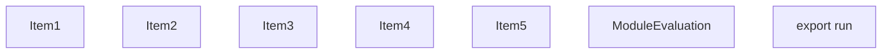
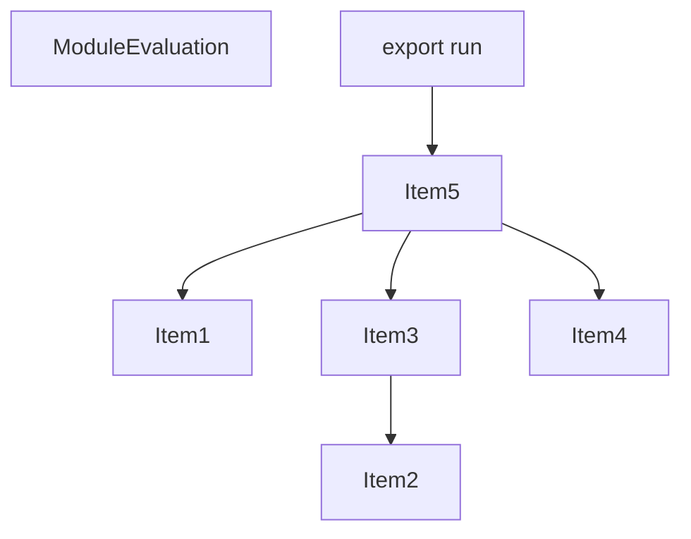
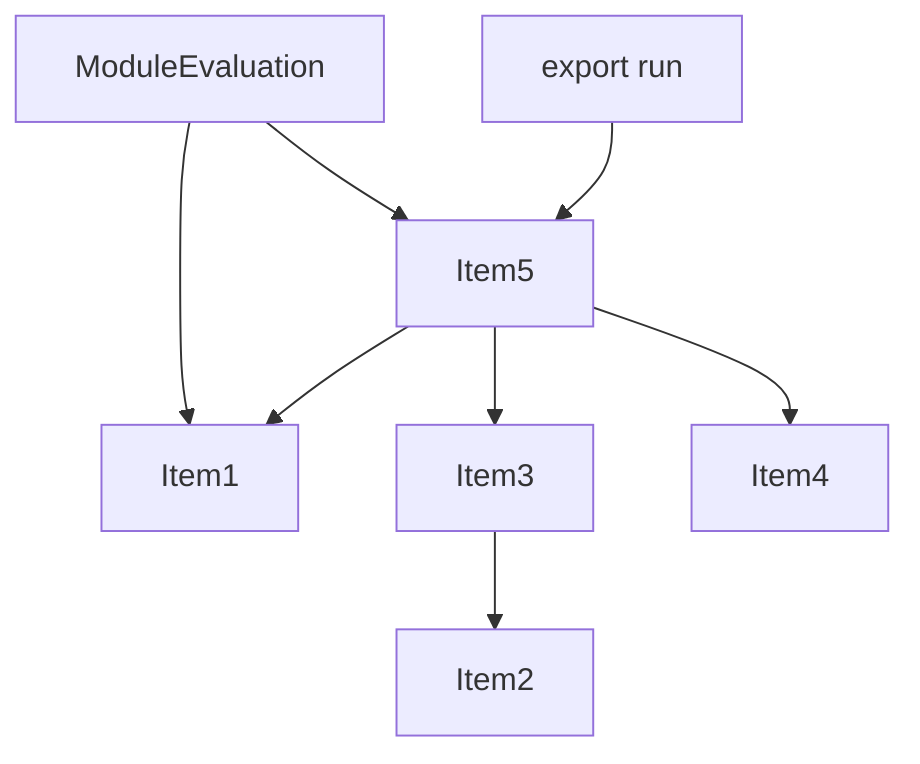
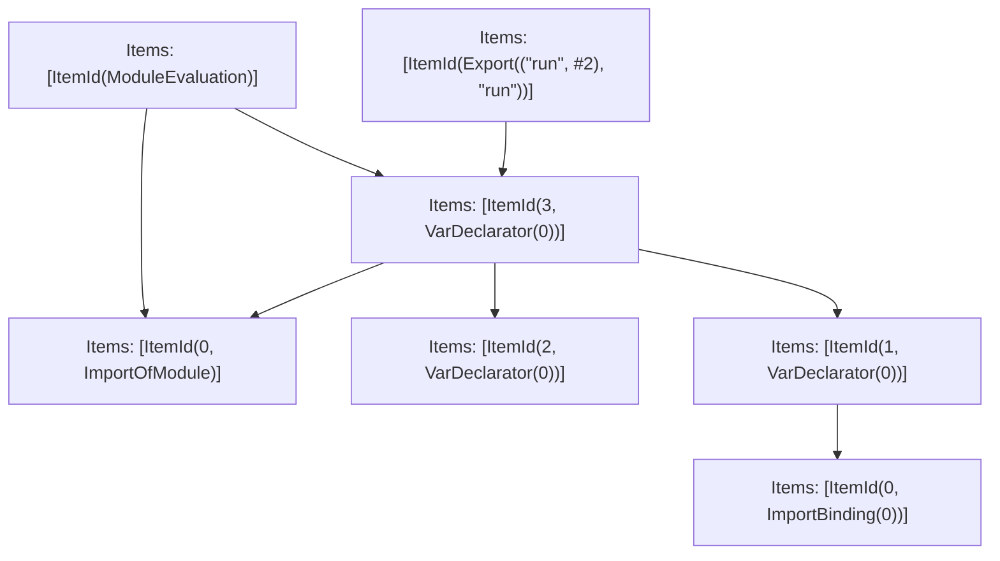

# Items

Count: 7

## Item 1: Stmt 0, `ImportOfModule`

```js
import { IPC } from "./index";

```

- Hoisted
- Side effects

## Item 2: Stmt 0, `ImportBinding(0)`

```js
import { IPC } from "./index";

```

- Hoisted
- Declares: `IPC`

## Item 3: Stmt 1, `VarDeclarator(0)`

```js
const ipc = IPC;

```

- Declares: `ipc`
- Reads: `IPC`
- Write: `ipc`

## Item 4: Stmt 2, `VarDeclarator(0)`

```js
const queue = [];

```

- Declares: `queue`
- Write: `queue`

## Item 5: Stmt 3, `VarDeclarator(0)`

```js
export const run = async (moduleFactory)=>{
    let nextId = 1;
    const requests = new Map();
    const internalIpc = {
        sendInfo: (message)=>ipc.send({
                type: "info",
                data: message
            }),
        sendRequest: (message)=>{
            const id = nextId++;
            let resolve, reject;
            const promise = new Promise((res, rej)=>{
                resolve = res;
                reject = rej;
            });
            requests.set(id, {
                resolve,
                reject
            });
            return ipc.send({
                type: "request",
                id,
                data: message
            }).then(()=>promise);
        },
        sendError: (error)=>{
            return ipc.sendError(error);
        }
    };
    let getValue;
    try {
        const module = await moduleFactory();
        if (typeof module.init === "function") {
            await module.init();
        }
        getValue = module.default;
        await ipc.sendReady();
    } catch (err) {
        await ipc.sendReady();
        await ipc.sendError(err);
    }
    let isRunning = false;
    const run = async ()=>{
        while(queue.length > 0){
            const args = queue.shift();
            try {
                const value = await getValue(internalIpc, ...args);
                await ipc.send({
                    type: "end",
                    data: value === undefined ? undefined : JSON.stringify(value, null, 2),
                    duration: 0
                });
            } catch (e) {
                await ipc.sendError(e);
            }
        }
        isRunning = false;
    };
    while(true){
        const msg = await ipc.recv();
        switch(msg.type){
            case "evaluate":
                {
                    queue.push(msg.args);
                    if (!isRunning) {
                        isRunning = true;
                        run();
                    }
                    break;
                }
            case "result":
                {
                    const request = requests.get(msg.id);
                    if (request) {
                        requests.delete(msg.id);
                        if (msg.error) {
                            request.reject(new Error(msg.error));
                        } else {
                            request.resolve(msg.data);
                        }
                    }
                    break;
                }
            default:
                {
                    console.error("unexpected message type", msg.type);
                    process.exit(1);
                }
        }
    }
};

```

- Side effects
- Declares: `run`
- Reads: `ipc`, `queue`
- Write: `ipc`, `queue`, `run`

# Phase 1

# Phase 2

# Phase 3

# Phase 4

# Final

# Entrypoints

```
{
    ModuleEvaluation: 5,
    Exports: 7,
    Export(
        "run",
    ): 6,
}
```


# Modules (dev)
## Part 0
```js
import "./index";

```
## Part 1
```js
const queue = [];
export { queue } from "__TURBOPACK_VAR__" assert {
    __turbopack_var__: true
};

```
## Part 2
```js
import { IPC } from "./index";
export { IPC } from "__TURBOPACK_VAR__" assert {
    __turbopack_var__: true
};

```
## Part 3
```js
import "__TURBOPACK_PART__" assert {
    __turbopack_part__: 2
};
import { IPC } from "__TURBOPACK_PART__" assert {
    __turbopack_part__: 2
};
const ipc = IPC;
export { ipc } from "__TURBOPACK_VAR__" assert {
    __turbopack_var__: true
};

```
## Part 4
```js
import "__TURBOPACK_PART__" assert {
    __turbopack_part__: 3
};
import "__TURBOPACK_PART__" assert {
    __turbopack_part__: 1
};
import "__TURBOPACK_PART__" assert {
    __turbopack_part__: 0
};
import { ipc } from "__TURBOPACK_PART__" assert {
    __turbopack_part__: 3
};
import { queue } from "__TURBOPACK_PART__" assert {
    __turbopack_part__: 1
};
const run = async (moduleFactory)=>{
    let nextId = 1;
    const requests = new Map();
    const internalIpc = {
        sendInfo: (message)=>ipc.send({
                type: "info",
                data: message
            }),
        sendRequest: (message)=>{
            const id = nextId++;
            let resolve, reject;
            const promise = new Promise((res, rej)=>{
                resolve = res;
                reject = rej;
            });
            requests.set(id, {
                resolve,
                reject
            });
            return ipc.send({
                type: "request",
                id,
                data: message
            }).then(()=>promise);
        },
        sendError: (error)=>{
            return ipc.sendError(error);
        }
    };
    let getValue;
    try {
        const module = await moduleFactory();
        if (typeof module.init === "function") {
            await module.init();
        }
        getValue = module.default;
        await ipc.sendReady();
    } catch (err) {
        await ipc.sendReady();
        await ipc.sendError(err);
    }
    let isRunning = false;
    const run = async ()=>{
        while(queue.length > 0){
            const args = queue.shift();
            try {
                const value = await getValue(internalIpc, ...args);
                await ipc.send({
                    type: "end",
                    data: value === undefined ? undefined : JSON.stringify(value, null, 2),
                    duration: 0
                });
            } catch (e) {
                await ipc.sendError(e);
            }
        }
        isRunning = false;
    };
    while(true){
        const msg = await ipc.recv();
        switch(msg.type){
            case "evaluate":
                {
                    queue.push(msg.args);
                    if (!isRunning) {
                        isRunning = true;
                        run();
                    }
                    break;
                }
            case "result":
                {
                    const request = requests.get(msg.id);
                    if (request) {
                        requests.delete(msg.id);
                        if (msg.error) {
                            request.reject(new Error(msg.error));
                        } else {
                            request.resolve(msg.data);
                        }
                    }
                    break;
                }
            default:
                {
                    console.error("unexpected message type", msg.type);
                    process.exit(1);
                }
        }
    }
};
export { run } from "__TURBOPACK_VAR__" assert {
    __turbopack_var__: true
};

```
## Part 5
```js
import "__TURBOPACK_PART__" assert {
    __turbopack_part__: 0
};
import "__TURBOPACK_PART__" assert {
    __turbopack_part__: 4
};
"module evaluation";

```
## Part 6
```js
import "__TURBOPACK_PART__" assert {
    __turbopack_part__: 4
};
import { run } from "__TURBOPACK_PART__" assert {
    __turbopack_part__: 4
};
export { run };

```
## Part 7
```js
export { run } from "__TURBOPACK_PART__" assert {
    __turbopack_part__: "export run"
};

```
## Merged (module eval)
```js
import "__TURBOPACK_PART__" assert {
    __turbopack_part__: 0
};
import "__TURBOPACK_PART__" assert {
    __turbopack_part__: 4
};
"module evaluation";

```
# Entrypoints

```
{
    ModuleEvaluation: 5,
    Exports: 7,
    Export(
        "run",
    ): 6,
}
```


# Modules (prod)
## Part 0
```js
import "./index";

```
## Part 1
```js
const queue = [];
export { queue } from "__TURBOPACK_VAR__" assert {
    __turbopack_var__: true
};

```
## Part 2
```js
import { IPC } from "./index";
export { IPC } from "__TURBOPACK_VAR__" assert {
    __turbopack_var__: true
};

```
## Part 3
```js
import "__TURBOPACK_PART__" assert {
    __turbopack_part__: 2
};
import { IPC } from "__TURBOPACK_PART__" assert {
    __turbopack_part__: 2
};
const ipc = IPC;
export { ipc } from "__TURBOPACK_VAR__" assert {
    __turbopack_var__: true
};

```
## Part 4
```js
import "__TURBOPACK_PART__" assert {
    __turbopack_part__: 3
};
import "__TURBOPACK_PART__" assert {
    __turbopack_part__: 1
};
import "__TURBOPACK_PART__" assert {
    __turbopack_part__: 0
};
import { ipc } from "__TURBOPACK_PART__" assert {
    __turbopack_part__: 3
};
import { queue } from "__TURBOPACK_PART__" assert {
    __turbopack_part__: 1
};
const run = async (moduleFactory)=>{
    let nextId = 1;
    const requests = new Map();
    const internalIpc = {
        sendInfo: (message)=>ipc.send({
                type: "info",
                data: message
            }),
        sendRequest: (message)=>{
            const id = nextId++;
            let resolve, reject;
            const promise = new Promise((res, rej)=>{
                resolve = res;
                reject = rej;
            });
            requests.set(id, {
                resolve,
                reject
            });
            return ipc.send({
                type: "request",
                id,
                data: message
            }).then(()=>promise);
        },
        sendError: (error)=>{
            return ipc.sendError(error);
        }
    };
    let getValue;
    try {
        const module = await moduleFactory();
        if (typeof module.init === "function") {
            await module.init();
        }
        getValue = module.default;
        await ipc.sendReady();
    } catch (err) {
        await ipc.sendReady();
        await ipc.sendError(err);
    }
    let isRunning = false;
    const run = async ()=>{
        while(queue.length > 0){
            const args = queue.shift();
            try {
                const value = await getValue(internalIpc, ...args);
                await ipc.send({
                    type: "end",
                    data: value === undefined ? undefined : JSON.stringify(value, null, 2),
                    duration: 0
                });
            } catch (e) {
                await ipc.sendError(e);
            }
        }
        isRunning = false;
    };
    while(true){
        const msg = await ipc.recv();
        switch(msg.type){
            case "evaluate":
                {
                    queue.push(msg.args);
                    if (!isRunning) {
                        isRunning = true;
                        run();
                    }
                    break;
                }
            case "result":
                {
                    const request = requests.get(msg.id);
                    if (request) {
                        requests.delete(msg.id);
                        if (msg.error) {
                            request.reject(new Error(msg.error));
                        } else {
                            request.resolve(msg.data);
                        }
                    }
                    break;
                }
            default:
                {
                    console.error("unexpected message type", msg.type);
                    process.exit(1);
                }
        }
    }
};
export { run } from "__TURBOPACK_VAR__" assert {
    __turbopack_var__: true
};

```
## Part 5
```js
import "__TURBOPACK_PART__" assert {
    __turbopack_part__: 0
};
import "__TURBOPACK_PART__" assert {
    __turbopack_part__: 4
};
"module evaluation";

```
## Part 6
```js
import "__TURBOPACK_PART__" assert {
    __turbopack_part__: 4
};
import { run } from "__TURBOPACK_PART__" assert {
    __turbopack_part__: 4
};
export { run };

```
## Part 7
```js
export { run } from "__TURBOPACK_PART__" assert {
    __turbopack_part__: "export run"
};

```
## Merged (module eval)
```js
import "__TURBOPACK_PART__" assert {
    __turbopack_part__: 0
};
import "__TURBOPACK_PART__" assert {
    __turbopack_part__: 4
};
"module evaluation";

```
