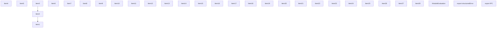
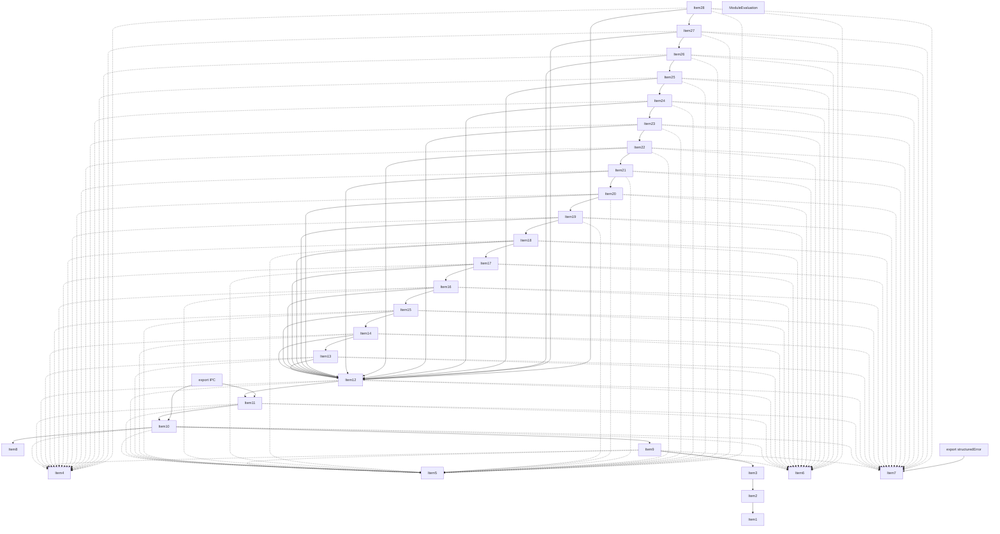
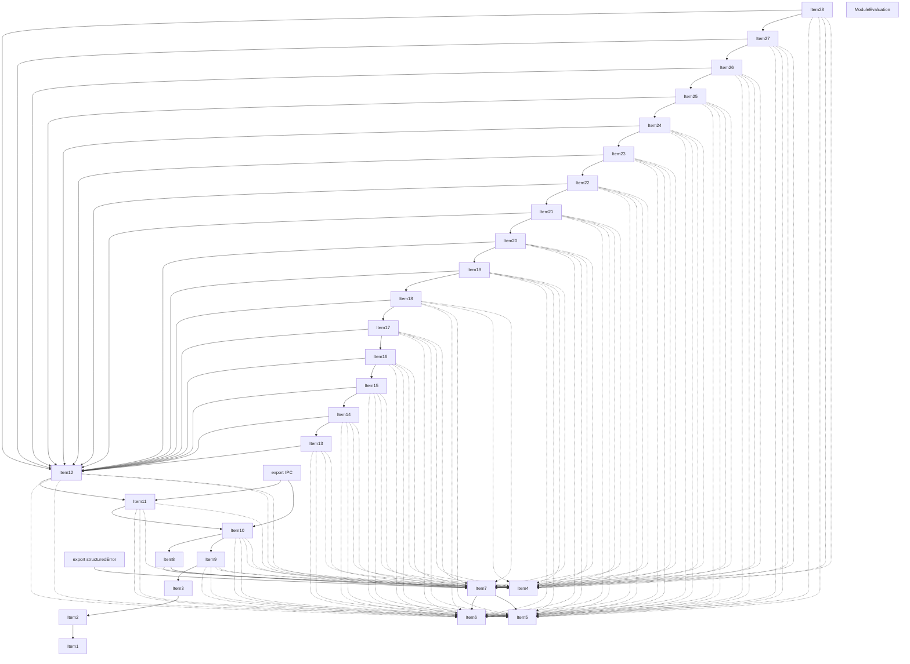
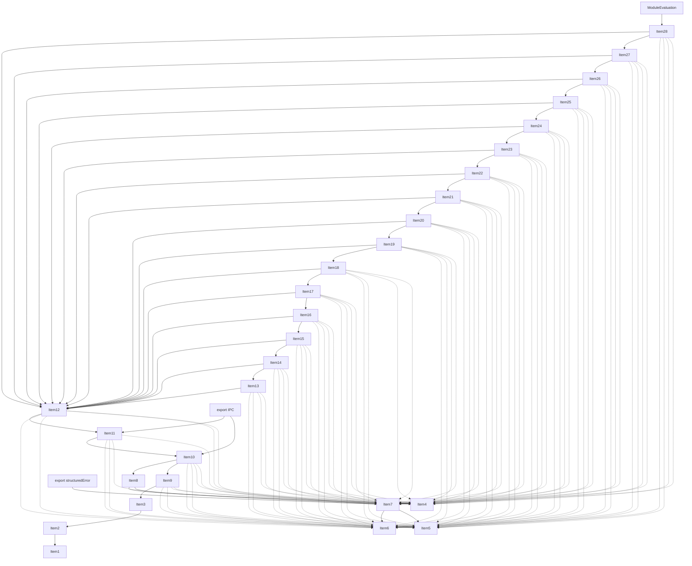
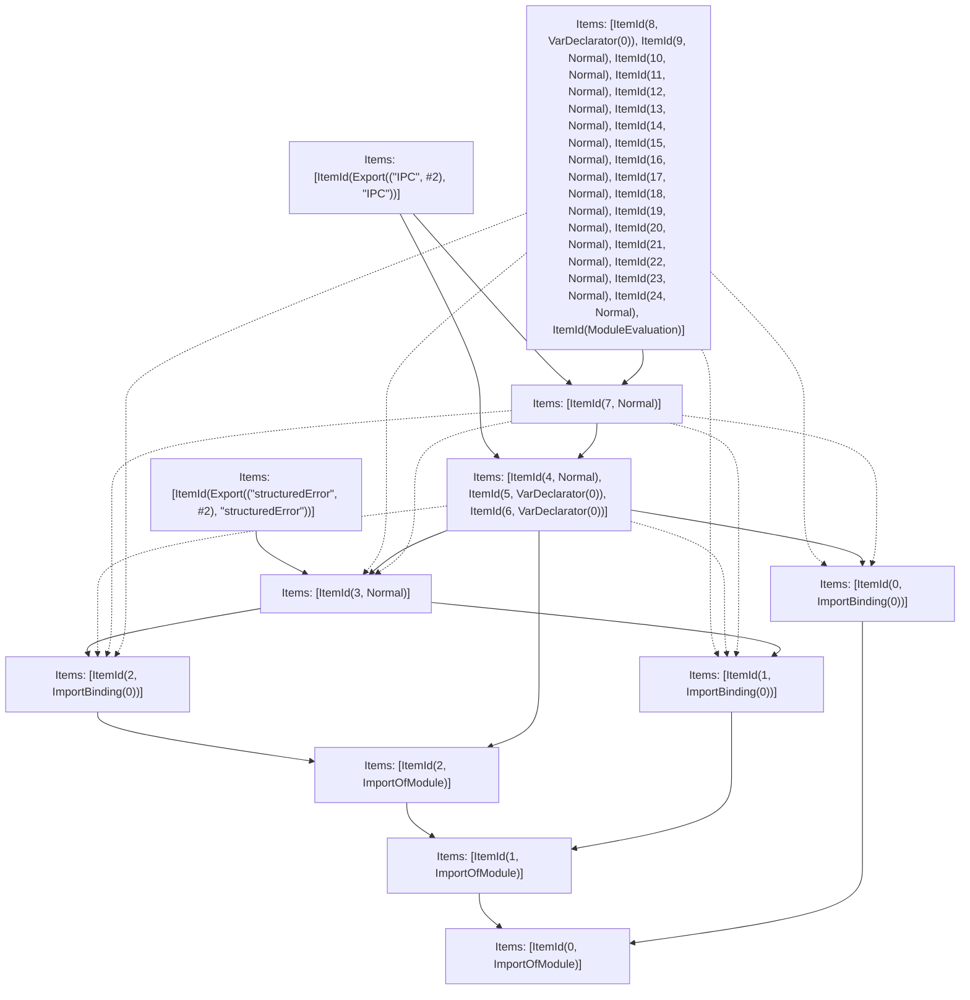

# Items

Count: 31

## Item 1: Stmt 0, `ImportOfModule`

```js
import { createConnection } from "node:net";

```

- Hoisted
- Side effects

## Item 2: Stmt 0, `ImportBinding(0)`

```js
import { createConnection } from "node:net";

```

- Hoisted
- Declares: `createConnection`

## Item 3: Stmt 1, `ImportOfModule`

```js
import { parse as parseStackTrace } from "../compiled/stacktrace-parser";

```

- Hoisted
- Side effects

## Item 4: Stmt 1, `ImportBinding(0)`

```js
import { parse as parseStackTrace } from "../compiled/stacktrace-parser";

```

- Hoisted
- Declares: `parseStackTrace`

## Item 5: Stmt 2, `ImportOfModule`

```js
import { getProperError } from "./error";

```

- Hoisted
- Side effects

## Item 6: Stmt 2, `ImportBinding(0)`

```js
import { getProperError } from "./error";

```

- Hoisted
- Declares: `getProperError`

## Item 7: Stmt 3, `Normal`

```js
export function structuredError(e) {
    e = getProperError(e);
    return {
        name: e.name,
        message: e.message,
        stack: typeof e.stack === "string" ? parseStackTrace(e.stack) : []
    };
}

```

- Hoisted
- Declares: `structuredError`
- Reads (eventual): `getProperError`, `parseStackTrace`
- Write: `structuredError`

## Item 8: Stmt 4, `Normal`

```js
function createIpc(port) {
    const socket = createConnection(port, "127.0.0.1");
    const packetQueue = [];
    const recvPromiseResolveQueue = [];
    function pushPacket(packet) {
        const recvPromiseResolve = recvPromiseResolveQueue.shift();
        if (recvPromiseResolve != null) {
            recvPromiseResolve(JSON.parse(packet.toString("utf8")));
        } else {
            packetQueue.push(packet);
        }
    }
    let state = {
        type: "waiting"
    };
    let buffer = Buffer.alloc(0);
    socket.once("connect", ()=>{
        socket.on("data", (chunk)=>{
            buffer = Buffer.concat([
                buffer,
                chunk
            ]);
            loop: while(true){
                switch(state.type){
                    case "waiting":
                        {
                            if (buffer.length >= 4) {
                                const length = buffer.readUInt32BE(0);
                                buffer = buffer.subarray(4);
                                state = {
                                    type: "packet",
                                    length
                                };
                            } else {
                                break loop;
                            }
                            break;
                        }
                    case "packet":
                        {
                            if (buffer.length >= state.length) {
                                const packet = buffer.subarray(0, state.length);
                                buffer = buffer.subarray(state.length);
                                state = {
                                    type: "waiting"
                                };
                                pushPacket(packet);
                            } else {
                                break loop;
                            }
                            break;
                        }
                }
            }
        });
    });
    socket.once("close", ()=>{
        process.exit(0);
    });
    function send(message) {
        const packet = Buffer.from(JSON.stringify(message), "utf8");
        const length = Buffer.alloc(4);
        length.writeUInt32BE(packet.length);
        socket.write(length);
        return new Promise((resolve, reject)=>{
            socket.write(packet, (err)=>{
                process.stderr.write(`TURBOPACK_OUTPUT_D\n`);
                process.stdout.write(`TURBOPACK_OUTPUT_D\n`);
                if (err != null) {
                    reject(err);
                } else {
                    resolve();
                }
            });
        });
    }
    function sendReady() {
        const length = Buffer.from([
            0,
            0,
            0,
            0
        ]);
        return new Promise((resolve, reject)=>{
            socket.write(length, (err)=>{
                process.stderr.write(`TURBOPACK_OUTPUT_D\n`);
                process.stdout.write(`TURBOPACK_OUTPUT_D\n`);
                if (err != null) {
                    reject(err);
                } else {
                    resolve();
                }
            });
        });
    }
    return {
        async recv () {
            const packet = packetQueue.shift();
            if (packet != null) {
                return JSON.parse(packet.toString("utf8"));
            }
            const result = await new Promise((resolve)=>{
                recvPromiseResolveQueue.push((result)=>{
                    resolve(result);
                });
            });
            return result;
        },
        send (message) {
            return send(message);
        },
        sendReady,
        async sendError (error) {
            try {
                await send({
                    type: "error",
                    ...structuredError(error)
                });
            } catch (err) {
                console.error("failed to send error back to rust:", err);
                process.exit(1);
            }
            process.exit(0);
        }
    };
}

```

- Hoisted
- Declares: `createIpc`
- Reads (eventual): `createConnection`, `loop`, `structuredError`
- Write: `createIpc`

## Item 9: Stmt 5, `VarDeclarator(0)`

```js
const PORT = process.argv[2];

```

- Side effects
- Declares: `PORT`
- Write: `PORT`

## Item 10: Stmt 6, `VarDeclarator(0)`

```js
export const IPC = createIpc(parseInt(PORT, 10));

```

- Side effects
- Declares: `IPC`
- Reads: `createIpc`, `PORT`
- Write: `IPC`

## Item 11: Stmt 7, `Normal`

```js
process.on("uncaughtException", (err)=>{
    IPC.sendError(err);
});

```

- Side effects
- Reads: `IPC`
- Write: `IPC`

## Item 12: Stmt 8, `VarDeclarator(0)`

```js
const improveConsole = (name, stream, addStack)=>{
    const original = console[name];
    const stdio = process[stream];
    console[name] = (...args)=>{
        stdio.write(`TURBOPACK_OUTPUT_B\n`);
        original(...args);
        if (addStack) {
            const stack = new Error().stack?.replace(/^.+\n.+\n/, "") + "\n";
            stdio.write("TURBOPACK_OUTPUT_S\n");
            stdio.write(stack);
        }
        stdio.write("TURBOPACK_OUTPUT_E\n");
    };
};

```

- Side effects
- Declares: `improveConsole`
- Write: `improveConsole`

## Item 13: Stmt 9, `Normal`

```js
improveConsole("error", "stderr", true);

```

- Side effects
- Reads: `improveConsole`

## Item 14: Stmt 10, `Normal`

```js
improveConsole("warn", "stderr", true);

```

- Side effects
- Reads: `improveConsole`

## Item 15: Stmt 11, `Normal`

```js
improveConsole("count", "stdout", true);

```

- Side effects
- Reads: `improveConsole`

## Item 16: Stmt 12, `Normal`

```js
improveConsole("trace", "stderr", false);

```

- Side effects
- Reads: `improveConsole`

## Item 17: Stmt 13, `Normal`

```js
improveConsole("log", "stdout", true);

```

- Side effects
- Reads: `improveConsole`

## Item 18: Stmt 14, `Normal`

```js
improveConsole("group", "stdout", true);

```

- Side effects
- Reads: `improveConsole`

## Item 19: Stmt 15, `Normal`

```js
improveConsole("groupCollapsed", "stdout", true);

```

- Side effects
- Reads: `improveConsole`

## Item 20: Stmt 16, `Normal`

```js
improveConsole("table", "stdout", true);

```

- Side effects
- Reads: `improveConsole`

## Item 21: Stmt 17, `Normal`

```js
improveConsole("debug", "stdout", true);

```

- Side effects
- Reads: `improveConsole`

## Item 22: Stmt 18, `Normal`

```js
improveConsole("info", "stdout", true);

```

- Side effects
- Reads: `improveConsole`

## Item 23: Stmt 19, `Normal`

```js
improveConsole("dir", "stdout", true);

```

- Side effects
- Reads: `improveConsole`

## Item 24: Stmt 20, `Normal`

```js
improveConsole("dirxml", "stdout", true);

```

- Side effects
- Reads: `improveConsole`

## Item 25: Stmt 21, `Normal`

```js
improveConsole("timeEnd", "stdout", true);

```

- Side effects
- Reads: `improveConsole`

## Item 26: Stmt 22, `Normal`

```js
improveConsole("timeLog", "stdout", true);

```

- Side effects
- Reads: `improveConsole`

## Item 27: Stmt 23, `Normal`

```js
improveConsole("timeStamp", "stdout", true);

```

- Side effects
- Reads: `improveConsole`

## Item 28: Stmt 24, `Normal`

```js
improveConsole("assert", "stderr", true);

```

- Side effects
- Reads: `improveConsole`

# Phase 1

# Phase 2

# Phase 3

# Phase 4

# Final

# Entrypoints

```
{
    ModuleEvaluation: 9,
    Export(
        "IPC",
    ): 10,
    Export(
        "structuredError",
    ): 11,
    Exports: 12,
}
```


# Modules (dev)
## Part 0
```js
import "node:net";

```
## Part 1
```js
import "__TURBOPACK_PART__" assert {
    __turbopack_part__: 0
};
import { createConnection } from "node:net";
export { createConnection as a } from "__TURBOPACK_VAR__" assert {
    __turbopack_var__: true
};

```
## Part 2
```js
import "__TURBOPACK_PART__" assert {
    __turbopack_part__: 0
};
import "../compiled/stacktrace-parser";

```
## Part 3
```js
import "__TURBOPACK_PART__" assert {
    __turbopack_part__: 2
};
import { parse as parseStackTrace } from "../compiled/stacktrace-parser";
export { parseStackTrace as b } from "__TURBOPACK_VAR__" assert {
    __turbopack_var__: true
};

```
## Part 4
```js
import "__TURBOPACK_PART__" assert {
    __turbopack_part__: 2
};
import "./error";

```
## Part 5
```js
import "__TURBOPACK_PART__" assert {
    __turbopack_part__: 4
};
import { getProperError } from "./error";
export { getProperError as c } from "__TURBOPACK_VAR__" assert {
    __turbopack_var__: true
};

```
## Part 6
```js
import "__TURBOPACK_PART__" assert {
    __turbopack_part__: 2
};
import { parse as parseStackTrace } from "../compiled/stacktrace-parser";
import "__TURBOPACK_PART__" assert {
    __turbopack_part__: 4
};
import { getProperError } from "./error";
function structuredError(e) {
    e = getProperError(e);
    return {
        name: e.name,
        message: e.message,
        stack: typeof e.stack === "string" ? parseStackTrace(e.stack) : []
    };
}
export { structuredError as d } from "__TURBOPACK_VAR__" assert {
    __turbopack_var__: true
};

```
## Part 7
```js
import { d as structuredError } from "__TURBOPACK_PART__" assert {
    __turbopack_part__: -6
};
import "__TURBOPACK_PART__" assert {
    __turbopack_part__: 0
};
import { createConnection } from "node:net";
import "__TURBOPACK_PART__" assert {
    __turbopack_part__: 5
};
import "__TURBOPACK_PART__" assert {
    __turbopack_part__: 3
};
import "__TURBOPACK_PART__" assert {
    __turbopack_part__: 4
};
function createIpc(port) {
    const socket = createConnection(port, "127.0.0.1");
    const packetQueue = [];
    const recvPromiseResolveQueue = [];
    function pushPacket(packet) {
        const recvPromiseResolve = recvPromiseResolveQueue.shift();
        if (recvPromiseResolve != null) {
            recvPromiseResolve(JSON.parse(packet.toString("utf8")));
        } else {
            packetQueue.push(packet);
        }
    }
    let state = {
        type: "waiting"
    };
    let buffer = Buffer.alloc(0);
    socket.once("connect", ()=>{
        socket.on("data", (chunk)=>{
            buffer = Buffer.concat([
                buffer,
                chunk
            ]);
            loop: while(true){
                switch(state.type){
                    case "waiting":
                        {
                            if (buffer.length >= 4) {
                                const length = buffer.readUInt32BE(0);
                                buffer = buffer.subarray(4);
                                state = {
                                    type: "packet",
                                    length
                                };
                            } else {
                                break loop;
                            }
                            break;
                        }
                    case "packet":
                        {
                            if (buffer.length >= state.length) {
                                const packet = buffer.subarray(0, state.length);
                                buffer = buffer.subarray(state.length);
                                state = {
                                    type: "waiting"
                                };
                                pushPacket(packet);
                            } else {
                                break loop;
                            }
                            break;
                        }
                }
            }
        });
    });
    socket.once("close", ()=>{
        process.exit(0);
    });
    function send(message) {
        const packet = Buffer.from(JSON.stringify(message), "utf8");
        const length = Buffer.alloc(4);
        length.writeUInt32BE(packet.length);
        socket.write(length);
        return new Promise((resolve, reject)=>{
            socket.write(packet, (err)=>{
                process.stderr.write(`TURBOPACK_OUTPUT_D\n`);
                process.stdout.write(`TURBOPACK_OUTPUT_D\n`);
                if (err != null) {
                    reject(err);
                } else {
                    resolve();
                }
            });
        });
    }
    function sendReady() {
        const length = Buffer.from([
            0,
            0,
            0,
            0
        ]);
        return new Promise((resolve, reject)=>{
            socket.write(length, (err)=>{
                process.stderr.write(`TURBOPACK_OUTPUT_D\n`);
                process.stdout.write(`TURBOPACK_OUTPUT_D\n`);
                if (err != null) {
                    reject(err);
                } else {
                    resolve();
                }
            });
        });
    }
    return {
        async recv () {
            const packet = packetQueue.shift();
            if (packet != null) {
                return JSON.parse(packet.toString("utf8"));
            }
            const result = await new Promise((resolve)=>{
                recvPromiseResolveQueue.push((result)=>{
                    resolve(result);
                });
            });
            return result;
        },
        send (message) {
            return send(message);
        },
        sendReady,
        async sendError (error) {
            try {
                await send({
                    type: "error",
                    ...structuredError(error)
                });
            } catch (err) {
                console.error("failed to send error back to rust:", err);
                process.exit(1);
            }
            process.exit(0);
        }
    };
}
const PORT = process.argv[2];
const IPC = createIpc(parseInt(PORT, 10));
export { createIpc as e } from "__TURBOPACK_VAR__" assert {
    __turbopack_var__: true
};
export { PORT as f } from "__TURBOPACK_VAR__" assert {
    __turbopack_var__: true
};
export { IPC as g } from "__TURBOPACK_VAR__" assert {
    __turbopack_var__: true
};

```
## Part 8
```js
import { g as IPC } from "__TURBOPACK_PART__" assert {
    __turbopack_part__: -7
};
import "__TURBOPACK_PART__" assert {
    __turbopack_part__: 5
};
import "__TURBOPACK_PART__" assert {
    __turbopack_part__: 3
};
import "__TURBOPACK_PART__" assert {
    __turbopack_part__: 1
};
import "__TURBOPACK_PART__" assert {
    __turbopack_part__: 6
};
process.on("uncaughtException", (err)=>{
    IPC.sendError(err);
});

```
## Part 9
```js
import "__TURBOPACK_PART__" assert {
    __turbopack_part__: 1
};
import "__TURBOPACK_PART__" assert {
    __turbopack_part__: 3
};
import "__TURBOPACK_PART__" assert {
    __turbopack_part__: 6
};
import "__TURBOPACK_PART__" assert {
    __turbopack_part__: 5
};
import "__TURBOPACK_PART__" assert {
    __turbopack_part__: 8
};
const improveConsole = (name, stream, addStack)=>{
    const original = console[name];
    const stdio = process[stream];
    console[name] = (...args)=>{
        stdio.write(`TURBOPACK_OUTPUT_B\n`);
        original(...args);
        if (addStack) {
            const stack = new Error().stack?.replace(/^.+\n.+\n/, "") + "\n";
            stdio.write("TURBOPACK_OUTPUT_S\n");
            stdio.write(stack);
        }
        stdio.write("TURBOPACK_OUTPUT_E\n");
    };
};
improveConsole("error", "stderr", true);
improveConsole("warn", "stderr", true);
improveConsole("count", "stdout", true);
improveConsole("trace", "stderr", false);
improveConsole("log", "stdout", true);
improveConsole("group", "stdout", true);
improveConsole("groupCollapsed", "stdout", true);
improveConsole("table", "stdout", true);
improveConsole("debug", "stdout", true);
improveConsole("info", "stdout", true);
improveConsole("dir", "stdout", true);
improveConsole("dirxml", "stdout", true);
improveConsole("timeEnd", "stdout", true);
improveConsole("timeLog", "stdout", true);
improveConsole("timeStamp", "stdout", true);
improveConsole("assert", "stderr", true);
"module evaluation";
export { improveConsole as h } from "__TURBOPACK_VAR__" assert {
    __turbopack_var__: true
};

```
## Part 10
```js
import { g as IPC } from "__TURBOPACK_PART__" assert {
    __turbopack_part__: -7
};
import "__TURBOPACK_PART__" assert {
    __turbopack_part__: 8
};
export { IPC };

```
## Part 11
```js
import { d as structuredError } from "__TURBOPACK_PART__" assert {
    __turbopack_part__: -6
};
export { structuredError };

```
## Part 12
```js
export { IPC } from "__TURBOPACK_PART__" assert {
    __turbopack_part__: "export IPC"
};
export { structuredError } from "__TURBOPACK_PART__" assert {
    __turbopack_part__: "export structuredError"
};

```
## Merged (module eval)
```js
import "__TURBOPACK_PART__" assert {
    __turbopack_part__: 1
};
import "__TURBOPACK_PART__" assert {
    __turbopack_part__: 3
};
import "__TURBOPACK_PART__" assert {
    __turbopack_part__: 6
};
import "__TURBOPACK_PART__" assert {
    __turbopack_part__: 5
};
import "__TURBOPACK_PART__" assert {
    __turbopack_part__: 8
};
const improveConsole = (name, stream, addStack)=>{
    const original = console[name];
    const stdio = process[stream];
    console[name] = (...args)=>{
        stdio.write(`TURBOPACK_OUTPUT_B\n`);
        original(...args);
        if (addStack) {
            const stack = new Error().stack?.replace(/^.+\n.+\n/, "") + "\n";
            stdio.write("TURBOPACK_OUTPUT_S\n");
            stdio.write(stack);
        }
        stdio.write("TURBOPACK_OUTPUT_E\n");
    };
};
improveConsole("error", "stderr", true);
improveConsole("warn", "stderr", true);
improveConsole("count", "stdout", true);
improveConsole("trace", "stderr", false);
improveConsole("log", "stdout", true);
improveConsole("group", "stdout", true);
improveConsole("groupCollapsed", "stdout", true);
improveConsole("table", "stdout", true);
improveConsole("debug", "stdout", true);
improveConsole("info", "stdout", true);
improveConsole("dir", "stdout", true);
improveConsole("dirxml", "stdout", true);
improveConsole("timeEnd", "stdout", true);
improveConsole("timeLog", "stdout", true);
improveConsole("timeStamp", "stdout", true);
improveConsole("assert", "stderr", true);
"module evaluation";
export { improveConsole as h } from "__TURBOPACK_VAR__" assert {
    __turbopack_var__: true
};

```
# Entrypoints

```
{
    ModuleEvaluation: 9,
    Export(
        "IPC",
    ): 10,
    Export(
        "structuredError",
    ): 11,
    Exports: 12,
}
```


# Modules (prod)
## Part 0
```js
import "node:net";

```
## Part 1
```js
import "__TURBOPACK_PART__" assert {
    __turbopack_part__: 0
};
import { createConnection } from "node:net";
export { createConnection as a } from "__TURBOPACK_VAR__" assert {
    __turbopack_var__: true
};

```
## Part 2
```js
import "__TURBOPACK_PART__" assert {
    __turbopack_part__: 0
};
import "../compiled/stacktrace-parser";

```
## Part 3
```js
import "__TURBOPACK_PART__" assert {
    __turbopack_part__: 2
};
import { parse as parseStackTrace } from "../compiled/stacktrace-parser";
export { parseStackTrace as b } from "__TURBOPACK_VAR__" assert {
    __turbopack_var__: true
};

```
## Part 4
```js
import "__TURBOPACK_PART__" assert {
    __turbopack_part__: 2
};
import "./error";

```
## Part 5
```js
import "__TURBOPACK_PART__" assert {
    __turbopack_part__: 4
};
import { getProperError } from "./error";
export { getProperError as c } from "__TURBOPACK_VAR__" assert {
    __turbopack_var__: true
};

```
## Part 6
```js
import "__TURBOPACK_PART__" assert {
    __turbopack_part__: 2
};
import { parse as parseStackTrace } from "../compiled/stacktrace-parser";
import "__TURBOPACK_PART__" assert {
    __turbopack_part__: 4
};
import { getProperError } from "./error";
function structuredError(e) {
    e = getProperError(e);
    return {
        name: e.name,
        message: e.message,
        stack: typeof e.stack === "string" ? parseStackTrace(e.stack) : []
    };
}
export { structuredError as d } from "__TURBOPACK_VAR__" assert {
    __turbopack_var__: true
};

```
## Part 7
```js
import { d as structuredError } from "__TURBOPACK_PART__" assert {
    __turbopack_part__: -6
};
import "__TURBOPACK_PART__" assert {
    __turbopack_part__: 0
};
import { createConnection } from "node:net";
import "__TURBOPACK_PART__" assert {
    __turbopack_part__: 4
};
function createIpc(port) {
    const socket = createConnection(port, "127.0.0.1");
    const packetQueue = [];
    const recvPromiseResolveQueue = [];
    function pushPacket(packet) {
        const recvPromiseResolve = recvPromiseResolveQueue.shift();
        if (recvPromiseResolve != null) {
            recvPromiseResolve(JSON.parse(packet.toString("utf8")));
        } else {
            packetQueue.push(packet);
        }
    }
    let state = {
        type: "waiting"
    };
    let buffer = Buffer.alloc(0);
    socket.once("connect", ()=>{
        socket.on("data", (chunk)=>{
            buffer = Buffer.concat([
                buffer,
                chunk
            ]);
            loop: while(true){
                switch(state.type){
                    case "waiting":
                        {
                            if (buffer.length >= 4) {
                                const length = buffer.readUInt32BE(0);
                                buffer = buffer.subarray(4);
                                state = {
                                    type: "packet",
                                    length
                                };
                            } else {
                                break loop;
                            }
                            break;
                        }
                    case "packet":
                        {
                            if (buffer.length >= state.length) {
                                const packet = buffer.subarray(0, state.length);
                                buffer = buffer.subarray(state.length);
                                state = {
                                    type: "waiting"
                                };
                                pushPacket(packet);
                            } else {
                                break loop;
                            }
                            break;
                        }
                }
            }
        });
    });
    socket.once("close", ()=>{
        process.exit(0);
    });
    function send(message) {
        const packet = Buffer.from(JSON.stringify(message), "utf8");
        const length = Buffer.alloc(4);
        length.writeUInt32BE(packet.length);
        socket.write(length);
        return new Promise((resolve, reject)=>{
            socket.write(packet, (err)=>{
                process.stderr.write(`TURBOPACK_OUTPUT_D\n`);
                process.stdout.write(`TURBOPACK_OUTPUT_D\n`);
                if (err != null) {
                    reject(err);
                } else {
                    resolve();
                }
            });
        });
    }
    function sendReady() {
        const length = Buffer.from([
            0,
            0,
            0,
            0
        ]);
        return new Promise((resolve, reject)=>{
            socket.write(length, (err)=>{
                process.stderr.write(`TURBOPACK_OUTPUT_D\n`);
                process.stdout.write(`TURBOPACK_OUTPUT_D\n`);
                if (err != null) {
                    reject(err);
                } else {
                    resolve();
                }
            });
        });
    }
    return {
        async recv () {
            const packet = packetQueue.shift();
            if (packet != null) {
                return JSON.parse(packet.toString("utf8"));
            }
            const result = await new Promise((resolve)=>{
                recvPromiseResolveQueue.push((result)=>{
                    resolve(result);
                });
            });
            return result;
        },
        send (message) {
            return send(message);
        },
        sendReady,
        async sendError (error) {
            try {
                await send({
                    type: "error",
                    ...structuredError(error)
                });
            } catch (err) {
                console.error("failed to send error back to rust:", err);
                process.exit(1);
            }
            process.exit(0);
        }
    };
}
const PORT = process.argv[2];
const IPC = createIpc(parseInt(PORT, 10));
export { createIpc as e } from "__TURBOPACK_VAR__" assert {
    __turbopack_var__: true
};
export { PORT as f } from "__TURBOPACK_VAR__" assert {
    __turbopack_var__: true
};
export { IPC as g } from "__TURBOPACK_VAR__" assert {
    __turbopack_var__: true
};

```
## Part 8
```js
import { g as IPC } from "__TURBOPACK_PART__" assert {
    __turbopack_part__: -7
};
process.on("uncaughtException", (err)=>{
    IPC.sendError(err);
});

```
## Part 9
```js
import "__TURBOPACK_PART__" assert {
    __turbopack_part__: 8
};
const improveConsole = (name, stream, addStack)=>{
    const original = console[name];
    const stdio = process[stream];
    console[name] = (...args)=>{
        stdio.write(`TURBOPACK_OUTPUT_B\n`);
        original(...args);
        if (addStack) {
            const stack = new Error().stack?.replace(/^.+\n.+\n/, "") + "\n";
            stdio.write("TURBOPACK_OUTPUT_S\n");
            stdio.write(stack);
        }
        stdio.write("TURBOPACK_OUTPUT_E\n");
    };
};
improveConsole("error", "stderr", true);
improveConsole("warn", "stderr", true);
improveConsole("count", "stdout", true);
improveConsole("trace", "stderr", false);
improveConsole("log", "stdout", true);
improveConsole("group", "stdout", true);
improveConsole("groupCollapsed", "stdout", true);
improveConsole("table", "stdout", true);
improveConsole("debug", "stdout", true);
improveConsole("info", "stdout", true);
improveConsole("dir", "stdout", true);
improveConsole("dirxml", "stdout", true);
improveConsole("timeEnd", "stdout", true);
improveConsole("timeLog", "stdout", true);
improveConsole("timeStamp", "stdout", true);
improveConsole("assert", "stderr", true);
"module evaluation";
export { improveConsole as h } from "__TURBOPACK_VAR__" assert {
    __turbopack_var__: true
};

```
## Part 10
```js
import { g as IPC } from "__TURBOPACK_PART__" assert {
    __turbopack_part__: -7
};
import "__TURBOPACK_PART__" assert {
    __turbopack_part__: 8
};
export { IPC };

```
## Part 11
```js
import { d as structuredError } from "__TURBOPACK_PART__" assert {
    __turbopack_part__: -6
};
export { structuredError };

```
## Part 12
```js
export { IPC } from "__TURBOPACK_PART__" assert {
    __turbopack_part__: "export IPC"
};
export { structuredError } from "__TURBOPACK_PART__" assert {
    __turbopack_part__: "export structuredError"
};

```
## Merged (module eval)
```js
import "__TURBOPACK_PART__" assert {
    __turbopack_part__: 8
};
const improveConsole = (name, stream, addStack)=>{
    const original = console[name];
    const stdio = process[stream];
    console[name] = (...args)=>{
        stdio.write(`TURBOPACK_OUTPUT_B\n`);
        original(...args);
        if (addStack) {
            const stack = new Error().stack?.replace(/^.+\n.+\n/, "") + "\n";
            stdio.write("TURBOPACK_OUTPUT_S\n");
            stdio.write(stack);
        }
        stdio.write("TURBOPACK_OUTPUT_E\n");
    };
};
improveConsole("error", "stderr", true);
improveConsole("warn", "stderr", true);
improveConsole("count", "stdout", true);
improveConsole("trace", "stderr", false);
improveConsole("log", "stdout", true);
improveConsole("group", "stdout", true);
improveConsole("groupCollapsed", "stdout", true);
improveConsole("table", "stdout", true);
improveConsole("debug", "stdout", true);
improveConsole("info", "stdout", true);
improveConsole("dir", "stdout", true);
improveConsole("dirxml", "stdout", true);
improveConsole("timeEnd", "stdout", true);
improveConsole("timeLog", "stdout", true);
improveConsole("timeStamp", "stdout", true);
improveConsole("assert", "stderr", true);
"module evaluation";
export { improveConsole as h } from "__TURBOPACK_VAR__" assert {
    __turbopack_var__: true
};

```
