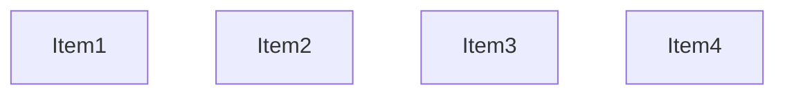
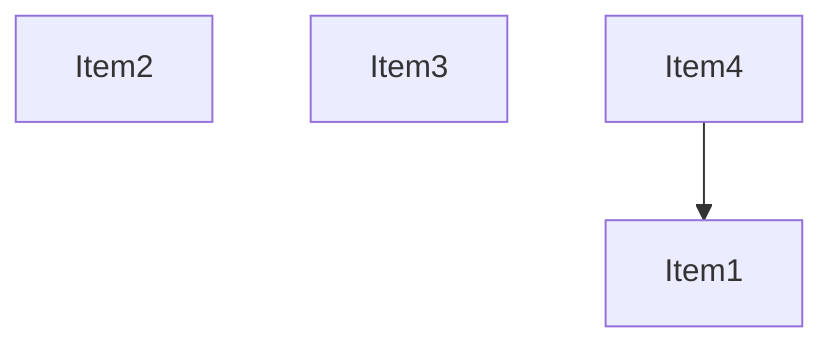
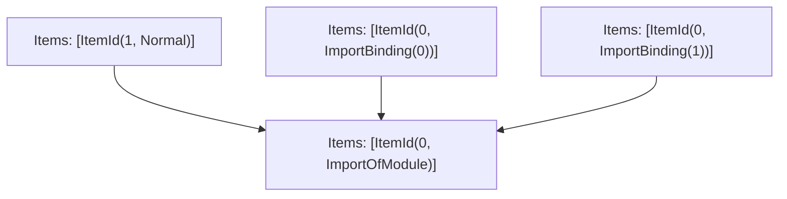

# Items

Count: 4

## Item 1: Stmt 0, `ImportOfModule`

```js
import { a, b } from "mod";

```

- Hoisted
- Side effects

## Item 2: Stmt 0, `ImportBinding(0)`

```js
import { a, b } from "mod";

```

- Hoisted
- Declares: `a`

## Item 3: Stmt 0, `ImportBinding(1)`

```js
import { a, b } from "mod";

```

- Hoisted
- Declares: `b`

## Item 4: Stmt 1, `Normal`

```js
console.log("hello");

```

- Side effects

# Phase 1

# Phase 2

# Phase 3

# Phase 4

# Final

# Entrypoints

```
{
    ModuleEvaluation: 3,
    Exports: 4,
}
```


# Modules (dev)
## Part 0
```js
import "mod";

```
## Part 1
```js
import "__TURBOPACK_PART__" assert {
    __turbopack_part__: 0
};

```
## Part 2
```js
import "__TURBOPACK_PART__" assert {
    __turbopack_part__: 0
};

```
## Part 3
```js
import "__TURBOPACK_PART__" assert {
    __turbopack_part__: 0
};
console.log("hello");
export { };

```
## Part 4
```js

```
## Merged (module eval)
```js
import "__TURBOPACK_PART__" assert {
    __turbopack_part__: 0
};
console.log("hello");
export { };

```
# Entrypoints

```
{
    ModuleEvaluation: 3,
    Exports: 4,
}
```


# Modules (prod)
## Part 0
```js
import "mod";

```
## Part 1
```js
import "__TURBOPACK_PART__" assert {
    __turbopack_part__: 0
};

```
## Part 2
```js
import "__TURBOPACK_PART__" assert {
    __turbopack_part__: 0
};

```
## Part 3
```js
import "__TURBOPACK_PART__" assert {
    __turbopack_part__: 0
};
console.log("hello");
export { };

```
## Part 4
```js

```
## Merged (module eval)
```js
import "__TURBOPACK_PART__" assert {
    __turbopack_part__: 0
};
console.log("hello");
export { };

```
