# Items

Count: 45

## Item 1: Stmt 0, `ImportOfModule`

```js
import style from './style';

```

- Hoisted
- Side effects

## Item 2: Stmt 0, `ImportBinding(0)`

```js
import style from './style';

```

- Hoisted
- Declares: `style`

## Item 3: Stmt 1, `ImportOfModule`

```js
import compose from './compose';

```

- Hoisted
- Side effects

## Item 4: Stmt 1, `ImportBinding(0)`

```js
import compose from './compose';

```

- Hoisted
- Declares: `compose`

## Item 5: Stmt 2, `ImportOfModule`

```js
import { createUnaryUnit, getValue } from './spacing';

```

- Hoisted
- Side effects

## Item 6: Stmt 2, `ImportBinding(0)`

```js
import { createUnaryUnit, getValue } from './spacing';

```

- Hoisted
- Declares: `createUnaryUnit`

## Item 7: Stmt 2, `ImportBinding(1)`

```js
import { createUnaryUnit, getValue } from './spacing';

```

- Hoisted
- Declares: `getValue`

## Item 8: Stmt 3, `ImportOfModule`

```js
import { handleBreakpoints } from './breakpoints';

```

- Hoisted
- Side effects

## Item 9: Stmt 3, `ImportBinding(0)`

```js
import { handleBreakpoints } from './breakpoints';

```

- Hoisted
- Declares: `handleBreakpoints`

## Item 10: Stmt 4, `ImportOfModule`

```js
import responsivePropType from './responsivePropType';

```

- Hoisted
- Side effects

## Item 11: Stmt 4, `ImportBinding(0)`

```js
import responsivePropType from './responsivePropType';

```

- Hoisted
- Declares: `responsivePropType`

## Item 12: Stmt 5, `VarDeclarator(0)`

```js
export const gap = (props)=>{
    if (props.gap !== undefined && props.gap !== null) {
        const transformer = createUnaryUnit(props.theme, 'spacing', 8, 'gap');
        const styleFromPropValue = (propValue)=>({
                gap: getValue(transformer, propValue)
            });
        return handleBreakpoints(props, props.gap, styleFromPropValue);
    }
    return null;
};

```

- Side effects
- Declares: `gap`
- Reads: `createUnaryUnit`, `getValue`, `handleBreakpoints`
- Write: `gap`

## Item 13: Stmt 6, `Normal`

```js
gap.propTypes = process.env.NODE_ENV !== 'production' ? {
    gap: responsivePropType
} : {};

```

- Side effects
- Reads: `gap`, `responsivePropType`
- Write: `gap`

## Item 14: Stmt 7, `Normal`

```js
gap.filterProps = [
    'gap'
];

```

- Reads: `gap`
- Write: `gap`

## Item 15: Stmt 8, `VarDeclarator(0)`

```js
export const columnGap = (props)=>{
    if (props.columnGap !== undefined && props.columnGap !== null) {
        const transformer = createUnaryUnit(props.theme, 'spacing', 8, 'columnGap');
        const styleFromPropValue = (propValue)=>({
                columnGap: getValue(transformer, propValue)
            });
        return handleBreakpoints(props, props.columnGap, styleFromPropValue);
    }
    return null;
};

```

- Side effects
- Declares: `columnGap`
- Reads: `createUnaryUnit`, `getValue`, `handleBreakpoints`
- Write: `columnGap`

## Item 16: Stmt 9, `Normal`

```js
columnGap.propTypes = process.env.NODE_ENV !== 'production' ? {
    columnGap: responsivePropType
} : {};

```

- Side effects
- Reads: `columnGap`, `responsivePropType`
- Write: `columnGap`

## Item 17: Stmt 10, `Normal`

```js
columnGap.filterProps = [
    'columnGap'
];

```

- Reads: `columnGap`
- Write: `columnGap`

## Item 18: Stmt 11, `VarDeclarator(0)`

```js
export const rowGap = (props)=>{
    if (props.rowGap !== undefined && props.rowGap !== null) {
        const transformer = createUnaryUnit(props.theme, 'spacing', 8, 'rowGap');
        const styleFromPropValue = (propValue)=>({
                rowGap: getValue(transformer, propValue)
            });
        return handleBreakpoints(props, props.rowGap, styleFromPropValue);
    }
    return null;
};

```

- Side effects
- Declares: `rowGap`
- Reads: `createUnaryUnit`, `getValue`, `handleBreakpoints`
- Write: `rowGap`

## Item 19: Stmt 12, `Normal`

```js
rowGap.propTypes = process.env.NODE_ENV !== 'production' ? {
    rowGap: responsivePropType
} : {};

```

- Side effects
- Reads: `rowGap`, `responsivePropType`
- Write: `rowGap`

## Item 20: Stmt 13, `Normal`

```js
rowGap.filterProps = [
    'rowGap'
];

```

- Reads: `rowGap`
- Write: `rowGap`

## Item 21: Stmt 14, `VarDeclarator(0)`

```js
export const gridColumn = style({
    prop: 'gridColumn'
});

```

- Declares: `gridColumn`
- Reads: `style`
- Write: `gridColumn`

## Item 22: Stmt 15, `VarDeclarator(0)`

```js
export const gridRow = style({
    prop: 'gridRow'
});

```

- Declares: `gridRow`
- Reads: `style`
- Write: `gridRow`

## Item 23: Stmt 16, `VarDeclarator(0)`

```js
export const gridAutoFlow = style({
    prop: 'gridAutoFlow'
});

```

- Declares: `gridAutoFlow`
- Reads: `style`
- Write: `gridAutoFlow`

## Item 24: Stmt 17, `VarDeclarator(0)`

```js
export const gridAutoColumns = style({
    prop: 'gridAutoColumns'
});

```

- Declares: `gridAutoColumns`
- Reads: `style`
- Write: `gridAutoColumns`

## Item 25: Stmt 18, `VarDeclarator(0)`

```js
export const gridAutoRows = style({
    prop: 'gridAutoRows'
});

```

- Declares: `gridAutoRows`
- Reads: `style`
- Write: `gridAutoRows`

## Item 26: Stmt 19, `VarDeclarator(0)`

```js
export const gridTemplateColumns = style({
    prop: 'gridTemplateColumns'
});

```

- Declares: `gridTemplateColumns`
- Reads: `style`
- Write: `gridTemplateColumns`

## Item 27: Stmt 20, `VarDeclarator(0)`

```js
export const gridTemplateRows = style({
    prop: 'gridTemplateRows'
});

```

- Declares: `gridTemplateRows`
- Reads: `style`
- Write: `gridTemplateRows`

## Item 28: Stmt 21, `VarDeclarator(0)`

```js
export const gridTemplateAreas = style({
    prop: 'gridTemplateAreas'
});

```

- Declares: `gridTemplateAreas`
- Reads: `style`
- Write: `gridTemplateAreas`

## Item 29: Stmt 22, `VarDeclarator(0)`

```js
export const gridArea = style({
    prop: 'gridArea'
});

```

- Declares: `gridArea`
- Reads: `style`
- Write: `gridArea`

## Item 30: Stmt 23, `VarDeclarator(0)`

```js
const grid = compose(gap, columnGap, rowGap, gridColumn, gridRow, gridAutoFlow, gridAutoColumns, gridAutoRows, gridTemplateColumns, gridTemplateRows, gridTemplateAreas, gridArea);

```

- Declares: `grid`
- Reads: `compose`, `gap`, `columnGap`, `rowGap`, `gridColumn`, `gridRow`, `gridAutoFlow`, `gridAutoColumns`, `gridAutoRows`, `gridTemplateColumns`, `gridTemplateRows`, `gridTemplateAreas`, `gridArea`
- Write: `grid`

## Item 31: Stmt 24, `Normal`

```js
export default grid;

```

- Side effects
- Declares: `__TURBOPACK__default__export__`
- Reads: `grid`
- Write: `__TURBOPACK__default__export__`

# Phase 1

```mermaid
graph TD
    Item1;
    Item6;
    Item2;
    Item7;
    Item3;
    Item8;
    Item9;
    Item4;
    Item10;
    Item5;
    Item11;
    Item12;
    Item13;
    Item14;
    Item15;
    Item16;
    Item17;
    Item18;
    Item19;
    Item20;
    Item21;
    Item22;
    Item23;
    Item24;
    Item25;
    Item26;
    Item27;
    Item28;
    Item29;
    Item30;
    Item31;
    Item32;
    Item32["ModuleEvaluation"];
    Item33;
    Item33["export gap"];
    Item34;
    Item34["export columnGap"];
    Item35;
    Item35["export rowGap"];
    Item36;
    Item36["export gridColumn"];
    Item37;
    Item37["export gridRow"];
    Item38;
    Item38["export gridAutoFlow"];
    Item39;
    Item39["export gridAutoColumns"];
    Item40;
    Item40["export gridAutoRows"];
    Item41;
    Item41["export gridTemplateColumns"];
    Item42;
    Item42["export gridTemplateRows"];
    Item43;
    Item43["export gridTemplateAreas"];
    Item44;
    Item44["export gridArea"];
    Item45;
    Item45["export default"];
    Item2 --> Item1;
    Item3 --> Item1;
    Item3 --> Item2;
    Item4 --> Item1;
    Item4 --> Item2;
    Item4 --> Item3;
    Item5 --> Item1;
    Item5 --> Item2;
    Item5 --> Item3;
    Item5 --> Item4;
```

# Phase 2

```mermaid
graph TD
    Item1;
    Item6;
    Item2;
    Item7;
    Item3;
    Item8;
    Item9;
    Item4;
    Item10;
    Item5;
    Item11;
    Item12;
    Item13;
    Item14;
    Item15;
    Item16;
    Item17;
    Item18;
    Item19;
    Item20;
    Item21;
    Item22;
    Item23;
    Item24;
    Item25;
    Item26;
    Item27;
    Item28;
    Item29;
    Item30;
    Item31;
    Item32;
    Item32["ModuleEvaluation"];
    Item33;
    Item33["export gap"];
    Item34;
    Item34["export columnGap"];
    Item35;
    Item35["export rowGap"];
    Item36;
    Item36["export gridColumn"];
    Item37;
    Item37["export gridRow"];
    Item38;
    Item38["export gridAutoFlow"];
    Item39;
    Item39["export gridAutoColumns"];
    Item40;
    Item40["export gridAutoRows"];
    Item41;
    Item41["export gridTemplateColumns"];
    Item42;
    Item42["export gridTemplateRows"];
    Item43;
    Item43["export gridTemplateAreas"];
    Item44;
    Item44["export gridArea"];
    Item45;
    Item45["export default"];
    Item2 --> Item1;
    Item3 --> Item1;
    Item3 --> Item2;
    Item4 --> Item1;
    Item4 --> Item2;
    Item4 --> Item3;
    Item5 --> Item1;
    Item5 --> Item2;
    Item5 --> Item3;
    Item5 --> Item4;
    Item12 --> Item8;
    Item12 --> Item9;
    Item12 --> Item10;
    Item12 --> Item1;
    Item12 --> Item2;
    Item12 --> Item3;
    Item12 --> Item4;
    Item12 --> Item5;
    Item13 --> Item12;
    Item13 --> Item11;
    Item13 --> Item1;
    Item13 --> Item2;
    Item13 --> Item3;
    Item13 --> Item4;
    Item13 --> Item5;
    Item14 --> Item13;
    Item14 --> Item12;
    Item15 --> Item8;
    Item15 --> Item9;
    Item15 --> Item10;
    Item15 --> Item1;
    Item15 --> Item2;
    Item15 --> Item3;
    Item15 --> Item4;
    Item15 --> Item5;
    Item15 --> Item12;
    Item15 --> Item13;
    Item16 --> Item15;
    Item16 --> Item11;
    Item16 --> Item1;
    Item16 --> Item2;
    Item16 --> Item3;
    Item16 --> Item4;
    Item16 --> Item5;
    Item16 --> Item12;
    Item16 --> Item13;
    Item17 --> Item16;
    Item17 --> Item15;
    Item18 --> Item8;
    Item18 --> Item9;
    Item18 --> Item10;
    Item18 --> Item1;
    Item18 --> Item2;
    Item18 --> Item3;
    Item18 --> Item4;
    Item18 --> Item5;
    Item18 --> Item12;
    Item18 --> Item13;
    Item18 --> Item15;
    Item18 --> Item16;
    Item19 --> Item18;
    Item19 --> Item11;
    Item19 --> Item1;
    Item19 --> Item2;
    Item19 --> Item3;
    Item19 --> Item4;
    Item19 --> Item5;
    Item19 --> Item12;
    Item19 --> Item13;
    Item19 --> Item15;
    Item19 --> Item16;
    Item20 --> Item19;
    Item20 --> Item18;
    Item21 --> Item6;
    Item22 --> Item6;
    Item23 --> Item6;
    Item24 --> Item6;
    Item25 --> Item6;
    Item26 --> Item6;
    Item27 --> Item6;
    Item28 --> Item6;
    Item29 --> Item6;
    Item30 --> Item7;
    Item30 --> Item14;
    Item30 --> Item12;
    Item30 --> Item17;
    Item30 --> Item15;
    Item30 --> Item20;
    Item30 --> Item18;
    Item30 --> Item21;
    Item30 --> Item22;
    Item30 --> Item23;
    Item30 --> Item24;
    Item30 --> Item25;
    Item30 --> Item26;
    Item30 --> Item27;
    Item30 --> Item28;
    Item30 --> Item29;
    Item31 --> Item30;
    Item31 --> Item1;
    Item31 --> Item2;
    Item31 --> Item3;
    Item31 --> Item4;
    Item31 --> Item5;
    Item31 --> Item12;
    Item31 --> Item13;
    Item31 --> Item15;
    Item31 --> Item16;
    Item31 --> Item18;
    Item31 --> Item19;
    Item33 --> Item14;
    Item33 --> Item12;
    Item34 --> Item17;
    Item34 --> Item15;
    Item35 --> Item20;
    Item35 --> Item18;
    Item36 --> Item21;
    Item37 --> Item22;
    Item38 --> Item23;
    Item39 --> Item24;
    Item40 --> Item25;
    Item41 --> Item26;
    Item42 --> Item27;
    Item43 --> Item28;
    Item44 --> Item29;
    Item45 --> Item31;
```

# Phase 3

# Phase 4

```mermaid
graph TD
    Item1;
    Item6;
    Item2;
    Item7;
    Item3;
    Item8;
    Item9;
    Item4;
    Item10;
    Item5;
    Item11;
    Item12;
    Item13;
    Item14;
    Item15;
    Item16;
    Item17;
    Item18;
    Item19;
    Item20;
    Item21;
    Item22;
    Item23;
    Item24;
    Item25;
    Item26;
    Item27;
    Item28;
    Item29;
    Item30;
    Item31;
    Item32;
    Item32["ModuleEvaluation"];
    Item33;
    Item33["export gap"];
    Item34;
    Item34["export columnGap"];
    Item35;
    Item35["export rowGap"];
    Item36;
    Item36["export gridColumn"];
    Item37;
    Item37["export gridRow"];
    Item38;
    Item38["export gridAutoFlow"];
    Item39;
    Item39["export gridAutoColumns"];
    Item40;
    Item40["export gridAutoRows"];
    Item41;
    Item41["export gridTemplateColumns"];
    Item42;
    Item42["export gridTemplateRows"];
    Item43;
    Item43["export gridTemplateAreas"];
    Item44;
    Item44["export gridArea"];
    Item45;
    Item45["export default"];
    Item2 --> Item1;
    Item3 --> Item1;
    Item3 --> Item2;
    Item4 --> Item1;
    Item4 --> Item2;
    Item4 --> Item3;
    Item5 --> Item1;
    Item5 --> Item2;
    Item5 --> Item3;
    Item5 --> Item4;
    Item12 --> Item8;
    Item12 --> Item9;
    Item12 --> Item10;
    Item12 --> Item1;
    Item12 --> Item2;
    Item12 --> Item3;
    Item12 --> Item4;
    Item12 --> Item5;
    Item13 --> Item12;
    Item13 --> Item11;
    Item13 --> Item1;
    Item13 --> Item2;
    Item13 --> Item3;
    Item13 --> Item4;
    Item13 --> Item5;
    Item14 --> Item13;
    Item14 --> Item12;
    Item15 --> Item8;
    Item15 --> Item9;
    Item15 --> Item10;
    Item15 --> Item1;
    Item15 --> Item2;
    Item15 --> Item3;
    Item15 --> Item4;
    Item15 --> Item5;
    Item15 --> Item12;
    Item15 --> Item13;
    Item16 --> Item15;
    Item16 --> Item11;
    Item16 --> Item1;
    Item16 --> Item2;
    Item16 --> Item3;
    Item16 --> Item4;
    Item16 --> Item5;
    Item16 --> Item12;
    Item16 --> Item13;
    Item17 --> Item16;
    Item17 --> Item15;
    Item18 --> Item8;
    Item18 --> Item9;
    Item18 --> Item10;
    Item18 --> Item1;
    Item18 --> Item2;
    Item18 --> Item3;
    Item18 --> Item4;
    Item18 --> Item5;
    Item18 --> Item12;
    Item18 --> Item13;
    Item18 --> Item15;
    Item18 --> Item16;
    Item19 --> Item18;
    Item19 --> Item11;
    Item19 --> Item1;
    Item19 --> Item2;
    Item19 --> Item3;
    Item19 --> Item4;
    Item19 --> Item5;
    Item19 --> Item12;
    Item19 --> Item13;
    Item19 --> Item15;
    Item19 --> Item16;
    Item20 --> Item19;
    Item20 --> Item18;
    Item21 --> Item6;
    Item22 --> Item6;
    Item23 --> Item6;
    Item24 --> Item6;
    Item25 --> Item6;
    Item26 --> Item6;
    Item27 --> Item6;
    Item28 --> Item6;
    Item29 --> Item6;
    Item30 --> Item7;
    Item30 --> Item14;
    Item30 --> Item12;
    Item30 --> Item17;
    Item30 --> Item15;
    Item30 --> Item20;
    Item30 --> Item18;
    Item30 --> Item21;
    Item30 --> Item22;
    Item30 --> Item23;
    Item30 --> Item24;
    Item30 --> Item25;
    Item30 --> Item26;
    Item30 --> Item27;
    Item30 --> Item28;
    Item30 --> Item29;
    Item31 --> Item30;
    Item31 --> Item1;
    Item31 --> Item2;
    Item31 --> Item3;
    Item31 --> Item4;
    Item31 --> Item5;
    Item31 --> Item12;
    Item31 --> Item13;
    Item31 --> Item15;
    Item31 --> Item16;
    Item31 --> Item18;
    Item31 --> Item19;
    Item33 --> Item14;
    Item33 --> Item12;
    Item34 --> Item17;
    Item34 --> Item15;
    Item35 --> Item20;
    Item35 --> Item18;
    Item36 --> Item21;
    Item37 --> Item22;
    Item38 --> Item23;
    Item39 --> Item24;
    Item40 --> Item25;
    Item41 --> Item26;
    Item42 --> Item27;
    Item43 --> Item28;
    Item44 --> Item29;
    Item45 --> Item31;
    Item32 --> Item1;
    Item32 --> Item2;
    Item32 --> Item3;
    Item32 --> Item4;
    Item32 --> Item5;
    Item32 --> Item12;
    Item32 --> Item13;
    Item32 --> Item15;
    Item32 --> Item16;
    Item32 --> Item18;
    Item32 --> Item19;
    Item32 --> Item31;
```

# Final

```mermaid
graph TD
    N0["Items: [ItemId(1, ImportBinding(0))]"];
    N1["Items: [ItemId(0, ImportBinding(0))]"];
    N2["Items: [ItemId(22, VarDeclarator(0))]"];
    N3["Items: [ItemId(Export((&quot;gridArea&quot;, #2), &quot;gridArea&quot;))]"];
    N4["Items: [ItemId(21, VarDeclarator(0))]"];
    N5["Items: [ItemId(Export((&quot;gridTemplateAreas&quot;, #2), &quot;gridTemplateAreas&quot;))]"];
    N6["Items: [ItemId(20, VarDeclarator(0))]"];
    N7["Items: [ItemId(Export((&quot;gridTemplateRows&quot;, #2), &quot;gridTemplateRows&quot;))]"];
    N8["Items: [ItemId(19, VarDeclarator(0))]"];
    N9["Items: [ItemId(Export((&quot;gridTemplateColumns&quot;, #2), &quot;gridTemplateColumns&quot;))]"];
    N10["Items: [ItemId(18, VarDeclarator(0))]"];
    N11["Items: [ItemId(Export((&quot;gridAutoRows&quot;, #2), &quot;gridAutoRows&quot;))]"];
    N12["Items: [ItemId(17, VarDeclarator(0))]"];
    N13["Items: [ItemId(Export((&quot;gridAutoColumns&quot;, #2), &quot;gridAutoColumns&quot;))]"];
    N14["Items: [ItemId(16, VarDeclarator(0))]"];
    N15["Items: [ItemId(Export((&quot;gridAutoFlow&quot;, #2), &quot;gridAutoFlow&quot;))]"];
    N16["Items: [ItemId(15, VarDeclarator(0))]"];
    N17["Items: [ItemId(Export((&quot;gridRow&quot;, #2), &quot;gridRow&quot;))]"];
    N18["Items: [ItemId(14, VarDeclarator(0))]"];
    N19["Items: [ItemId(Export((&quot;gridColumn&quot;, #2), &quot;gridColumn&quot;))]"];
    N20["Items: [ItemId(4, ImportBinding(0))]"];
    N21["Items: [ItemId(3, ImportBinding(0))]"];
    N22["Items: [ItemId(2, ImportBinding(1))]"];
    N23["Items: [ItemId(2, ImportBinding(0))]"];
    N24["Items: [ItemId(0, ImportOfModule)]"];
    N25["Items: [ItemId(1, ImportOfModule)]"];
    N26["Items: [ItemId(2, ImportOfModule)]"];
    N27["Items: [ItemId(3, ImportOfModule)]"];
    N28["Items: [ItemId(4, ImportOfModule)]"];
    N29["Items: [ItemId(5, VarDeclarator(0))]"];
    N30["Items: [ItemId(6, Normal)]"];
    N31["Items: [ItemId(8, VarDeclarator(0))]"];
    N32["Items: [ItemId(9, Normal)]"];
    N33["Items: [ItemId(11, VarDeclarator(0))]"];
    N34["Items: [ItemId(12, Normal)]"];
    N35["Items: [ItemId(13, Normal)]"];
    N36["Items: [ItemId(Export((&quot;rowGap&quot;, #2), &quot;rowGap&quot;))]"];
    N37["Items: [ItemId(10, Normal)]"];
    N38["Items: [ItemId(Export((&quot;columnGap&quot;, #2), &quot;columnGap&quot;))]"];
    N39["Items: [ItemId(7, Normal)]"];
    N40["Items: [ItemId(Export((&quot;gap&quot;, #2), &quot;gap&quot;))]"];
    N41["Items: [ItemId(23, VarDeclarator(0))]"];
    N42["Items: [ItemId(24, Normal)]"];
    N43["Items: [ItemId(ModuleEvaluation)]"];
    N44["Items: [ItemId(Export((&quot;__TURBOPACK__default__export__&quot;, #12), &quot;default&quot;))]"];
    N25 --> N24;
    N26 --> N24;
    N26 --> N25;
    N27 --> N24;
    N27 --> N25;
    N27 --> N26;
    N28 --> N24;
    N28 --> N25;
    N28 --> N26;
    N28 --> N27;
    N29 --> N23;
    N29 --> N22;
    N29 --> N21;
    N29 --> N24;
    N29 --> N25;
    N29 --> N26;
    N29 --> N27;
    N29 --> N28;
    N30 --> N29;
    N30 --> N20;
    N30 --> N24;
    N30 --> N25;
    N30 --> N26;
    N30 --> N27;
    N30 --> N28;
    N39 --> N30;
    N39 --> N29;
    N31 --> N23;
    N31 --> N22;
    N31 --> N21;
    N31 --> N24;
    N31 --> N25;
    N31 --> N26;
    N31 --> N27;
    N31 --> N28;
    N31 --> N29;
    N31 --> N30;
    N32 --> N31;
    N32 --> N20;
    N32 --> N24;
    N32 --> N25;
    N32 --> N26;
    N32 --> N27;
    N32 --> N28;
    N32 --> N29;
    N32 --> N30;
    N37 --> N32;
    N37 --> N31;
    N33 --> N23;
    N33 --> N22;
    N33 --> N21;
    N33 --> N24;
    N33 --> N25;
    N33 --> N26;
    N33 --> N27;
    N33 --> N28;
    N33 --> N29;
    N33 --> N30;
    N33 --> N31;
    N33 --> N32;
    N34 --> N33;
    N34 --> N20;
    N34 --> N24;
    N34 --> N25;
    N34 --> N26;
    N34 --> N27;
    N34 --> N28;
    N34 --> N29;
    N34 --> N30;
    N34 --> N31;
    N34 --> N32;
    N35 --> N34;
    N35 --> N33;
    N18 --> N1;
    N16 --> N1;
    N14 --> N1;
    N12 --> N1;
    N10 --> N1;
    N8 --> N1;
    N6 --> N1;
    N4 --> N1;
    N2 --> N1;
    N41 --> N0;
    N41 --> N39;
    N41 --> N29;
    N41 --> N37;
    N41 --> N31;
    N41 --> N35;
    N41 --> N33;
    N41 --> N18;
    N41 --> N16;
    N41 --> N14;
    N41 --> N12;
    N41 --> N10;
    N41 --> N8;
    N41 --> N6;
    N41 --> N4;
    N41 --> N2;
    N42 --> N41;
    N42 --> N24;
    N42 --> N25;
    N42 --> N26;
    N42 --> N27;
    N42 --> N28;
    N42 --> N29;
    N42 --> N30;
    N42 --> N31;
    N42 --> N32;
    N42 --> N33;
    N42 --> N34;
    N40 --> N39;
    N40 --> N29;
    N38 --> N37;
    N38 --> N31;
    N36 --> N35;
    N36 --> N33;
    N19 --> N18;
    N17 --> N16;
    N15 --> N14;
    N13 --> N12;
    N11 --> N10;
    N9 --> N8;
    N7 --> N6;
    N5 --> N4;
    N3 --> N2;
    N44 --> N42;
    N43 --> N24;
    N43 --> N25;
    N43 --> N26;
    N43 --> N27;
    N43 --> N28;
    N43 --> N29;
    N43 --> N30;
    N43 --> N31;
    N43 --> N32;
    N43 --> N33;
    N43 --> N34;
    N43 --> N42;
```

# Entrypoints

```
{
    ModuleEvaluation: 43,
    Export(
        "gap",
    ): 40,
    Export(
        "gridTemplateColumns",
    ): 9,
    Export(
        "gridAutoRows",
    ): 11,
    Export(
        "columnGap",
    ): 38,
    Export(
        "gridArea",
    ): 3,
    Exports: 45,
    Export(
        "gridAutoFlow",
    ): 15,
    Export(
        "gridColumn",
    ): 19,
    Export(
        "gridAutoColumns",
    ): 13,
    Export(
        "rowGap",
    ): 36,
    Export(
        "gridTemplateRows",
    ): 7,
    Export(
        "gridTemplateAreas",
    ): 5,
    Export(
        "default",
    ): 44,
    Export(
        "gridRow",
    ): 17,
}
```


# Modules (dev)
## Part 0
```js
import compose from './compose';
export { compose } from "__TURBOPACK_VAR__" assert {
    __turbopack_var__: true
};

```
## Part 1
```js
import style from './style';
export { style } from "__TURBOPACK_VAR__" assert {
    __turbopack_var__: true
};

```
## Part 2
```js
import "__TURBOPACK_PART__" assert {
    __turbopack_part__: 1
};
import { style } from "__TURBOPACK_PART__" assert {
    __turbopack_part__: 1
};
const gridArea = style({
    prop: 'gridArea'
});
export { gridArea } from "__TURBOPACK_VAR__" assert {
    __turbopack_var__: true
};

```
## Part 3
```js
import "__TURBOPACK_PART__" assert {
    __turbopack_part__: 2
};
import { gridArea } from "__TURBOPACK_PART__" assert {
    __turbopack_part__: 2
};
export { gridArea };

```
## Part 4
```js
import "__TURBOPACK_PART__" assert {
    __turbopack_part__: 1
};
import { style } from "__TURBOPACK_PART__" assert {
    __turbopack_part__: 1
};
const gridTemplateAreas = style({
    prop: 'gridTemplateAreas'
});
export { gridTemplateAreas } from "__TURBOPACK_VAR__" assert {
    __turbopack_var__: true
};

```
## Part 5
```js
import "__TURBOPACK_PART__" assert {
    __turbopack_part__: 4
};
import { gridTemplateAreas } from "__TURBOPACK_PART__" assert {
    __turbopack_part__: 4
};
export { gridTemplateAreas };

```
## Part 6
```js
import "__TURBOPACK_PART__" assert {
    __turbopack_part__: 1
};
import { style } from "__TURBOPACK_PART__" assert {
    __turbopack_part__: 1
};
const gridTemplateRows = style({
    prop: 'gridTemplateRows'
});
export { gridTemplateRows } from "__TURBOPACK_VAR__" assert {
    __turbopack_var__: true
};

```
## Part 7
```js
import "__TURBOPACK_PART__" assert {
    __turbopack_part__: 6
};
import { gridTemplateRows } from "__TURBOPACK_PART__" assert {
    __turbopack_part__: 6
};
export { gridTemplateRows };

```
## Part 8
```js
import "__TURBOPACK_PART__" assert {
    __turbopack_part__: 1
};
import { style } from "__TURBOPACK_PART__" assert {
    __turbopack_part__: 1
};
const gridTemplateColumns = style({
    prop: 'gridTemplateColumns'
});
export { gridTemplateColumns } from "__TURBOPACK_VAR__" assert {
    __turbopack_var__: true
};

```
## Part 9
```js
import "__TURBOPACK_PART__" assert {
    __turbopack_part__: 8
};
import { gridTemplateColumns } from "__TURBOPACK_PART__" assert {
    __turbopack_part__: 8
};
export { gridTemplateColumns };

```
## Part 10
```js
import "__TURBOPACK_PART__" assert {
    __turbopack_part__: 1
};
import { style } from "__TURBOPACK_PART__" assert {
    __turbopack_part__: 1
};
const gridAutoRows = style({
    prop: 'gridAutoRows'
});
export { gridAutoRows } from "__TURBOPACK_VAR__" assert {
    __turbopack_var__: true
};

```
## Part 11
```js
import "__TURBOPACK_PART__" assert {
    __turbopack_part__: 10
};
import { gridAutoRows } from "__TURBOPACK_PART__" assert {
    __turbopack_part__: 10
};
export { gridAutoRows };

```
## Part 12
```js
import "__TURBOPACK_PART__" assert {
    __turbopack_part__: 1
};
import { style } from "__TURBOPACK_PART__" assert {
    __turbopack_part__: 1
};
const gridAutoColumns = style({
    prop: 'gridAutoColumns'
});
export { gridAutoColumns } from "__TURBOPACK_VAR__" assert {
    __turbopack_var__: true
};

```
## Part 13
```js
import "__TURBOPACK_PART__" assert {
    __turbopack_part__: 12
};
import { gridAutoColumns } from "__TURBOPACK_PART__" assert {
    __turbopack_part__: 12
};
export { gridAutoColumns };

```
## Part 14
```js
import "__TURBOPACK_PART__" assert {
    __turbopack_part__: 1
};
import { style } from "__TURBOPACK_PART__" assert {
    __turbopack_part__: 1
};
const gridAutoFlow = style({
    prop: 'gridAutoFlow'
});
export { gridAutoFlow } from "__TURBOPACK_VAR__" assert {
    __turbopack_var__: true
};

```
## Part 15
```js
import "__TURBOPACK_PART__" assert {
    __turbopack_part__: 14
};
import { gridAutoFlow } from "__TURBOPACK_PART__" assert {
    __turbopack_part__: 14
};
export { gridAutoFlow };

```
## Part 16
```js
import "__TURBOPACK_PART__" assert {
    __turbopack_part__: 1
};
import { style } from "__TURBOPACK_PART__" assert {
    __turbopack_part__: 1
};
const gridRow = style({
    prop: 'gridRow'
});
export { gridRow } from "__TURBOPACK_VAR__" assert {
    __turbopack_var__: true
};

```
## Part 17
```js
import "__TURBOPACK_PART__" assert {
    __turbopack_part__: 16
};
import { gridRow } from "__TURBOPACK_PART__" assert {
    __turbopack_part__: 16
};
export { gridRow };

```
## Part 18
```js
import "__TURBOPACK_PART__" assert {
    __turbopack_part__: 1
};
import { style } from "__TURBOPACK_PART__" assert {
    __turbopack_part__: 1
};
const gridColumn = style({
    prop: 'gridColumn'
});
export { gridColumn } from "__TURBOPACK_VAR__" assert {
    __turbopack_var__: true
};

```
## Part 19
```js
import "__TURBOPACK_PART__" assert {
    __turbopack_part__: 18
};
import { gridColumn } from "__TURBOPACK_PART__" assert {
    __turbopack_part__: 18
};
export { gridColumn };

```
## Part 20
```js
import responsivePropType from './responsivePropType';
export { responsivePropType } from "__TURBOPACK_VAR__" assert {
    __turbopack_var__: true
};

```
## Part 21
```js
import { handleBreakpoints } from './breakpoints';
export { handleBreakpoints } from "__TURBOPACK_VAR__" assert {
    __turbopack_var__: true
};

```
## Part 22
```js
import { getValue } from './spacing';
export { getValue } from "__TURBOPACK_VAR__" assert {
    __turbopack_var__: true
};

```
## Part 23
```js
import { createUnaryUnit } from './spacing';
export { createUnaryUnit } from "__TURBOPACK_VAR__" assert {
    __turbopack_var__: true
};

```
## Part 24
```js
import './style';

```
## Part 25
```js
import "__TURBOPACK_PART__" assert {
    __turbopack_part__: 24
};
import './compose';

```
## Part 26
```js
import "__TURBOPACK_PART__" assert {
    __turbopack_part__: 24
};
import "__TURBOPACK_PART__" assert {
    __turbopack_part__: 25
};
import './spacing';

```
## Part 27
```js
import "__TURBOPACK_PART__" assert {
    __turbopack_part__: 24
};
import "__TURBOPACK_PART__" assert {
    __turbopack_part__: 25
};
import "__TURBOPACK_PART__" assert {
    __turbopack_part__: 26
};
import './breakpoints';

```
## Part 28
```js
import "__TURBOPACK_PART__" assert {
    __turbopack_part__: 24
};
import "__TURBOPACK_PART__" assert {
    __turbopack_part__: 25
};
import "__TURBOPACK_PART__" assert {
    __turbopack_part__: 26
};
import "__TURBOPACK_PART__" assert {
    __turbopack_part__: 27
};
import './responsivePropType';

```
## Part 29
```js
import "__TURBOPACK_PART__" assert {
    __turbopack_part__: 23
};
import "__TURBOPACK_PART__" assert {
    __turbopack_part__: 22
};
import "__TURBOPACK_PART__" assert {
    __turbopack_part__: 21
};
import "__TURBOPACK_PART__" assert {
    __turbopack_part__: 24
};
import "__TURBOPACK_PART__" assert {
    __turbopack_part__: 25
};
import "__TURBOPACK_PART__" assert {
    __turbopack_part__: 26
};
import "__TURBOPACK_PART__" assert {
    __turbopack_part__: 27
};
import "__TURBOPACK_PART__" assert {
    __turbopack_part__: 28
};
import { createUnaryUnit } from "__TURBOPACK_PART__" assert {
    __turbopack_part__: 23
};
import { getValue } from "__TURBOPACK_PART__" assert {
    __turbopack_part__: 22
};
import { handleBreakpoints } from "__TURBOPACK_PART__" assert {
    __turbopack_part__: 21
};
const gap = (props)=>{
    if (props.gap !== undefined && props.gap !== null) {
        const transformer = createUnaryUnit(props.theme, 'spacing', 8, 'gap');
        const styleFromPropValue = (propValue)=>({
                gap: getValue(transformer, propValue)
            });
        return handleBreakpoints(props, props.gap, styleFromPropValue);
    }
    return null;
};
export { gap } from "__TURBOPACK_VAR__" assert {
    __turbopack_var__: true
};

```
## Part 30
```js
import "__TURBOPACK_PART__" assert {
    __turbopack_part__: 29
};
import "__TURBOPACK_PART__" assert {
    __turbopack_part__: 20
};
import "__TURBOPACK_PART__" assert {
    __turbopack_part__: 24
};
import "__TURBOPACK_PART__" assert {
    __turbopack_part__: 25
};
import "__TURBOPACK_PART__" assert {
    __turbopack_part__: 26
};
import "__TURBOPACK_PART__" assert {
    __turbopack_part__: 27
};
import "__TURBOPACK_PART__" assert {
    __turbopack_part__: 28
};
import { gap } from "__TURBOPACK_PART__" assert {
    __turbopack_part__: 29
};
import { responsivePropType } from "__TURBOPACK_PART__" assert {
    __turbopack_part__: 20
};
gap.propTypes = process.env.NODE_ENV !== 'production' ? {
    gap: responsivePropType
} : {};

```
## Part 31
```js
import "__TURBOPACK_PART__" assert {
    __turbopack_part__: 23
};
import "__TURBOPACK_PART__" assert {
    __turbopack_part__: 22
};
import "__TURBOPACK_PART__" assert {
    __turbopack_part__: 21
};
import "__TURBOPACK_PART__" assert {
    __turbopack_part__: 24
};
import "__TURBOPACK_PART__" assert {
    __turbopack_part__: 25
};
import "__TURBOPACK_PART__" assert {
    __turbopack_part__: 26
};
import "__TURBOPACK_PART__" assert {
    __turbopack_part__: 27
};
import "__TURBOPACK_PART__" assert {
    __turbopack_part__: 28
};
import "__TURBOPACK_PART__" assert {
    __turbopack_part__: 29
};
import "__TURBOPACK_PART__" assert {
    __turbopack_part__: 30
};
import { createUnaryUnit } from "__TURBOPACK_PART__" assert {
    __turbopack_part__: 23
};
import { getValue } from "__TURBOPACK_PART__" assert {
    __turbopack_part__: 22
};
import { handleBreakpoints } from "__TURBOPACK_PART__" assert {
    __turbopack_part__: 21
};
const columnGap = (props)=>{
    if (props.columnGap !== undefined && props.columnGap !== null) {
        const transformer = createUnaryUnit(props.theme, 'spacing', 8, 'columnGap');
        const styleFromPropValue = (propValue)=>({
                columnGap: getValue(transformer, propValue)
            });
        return handleBreakpoints(props, props.columnGap, styleFromPropValue);
    }
    return null;
};
export { columnGap } from "__TURBOPACK_VAR__" assert {
    __turbopack_var__: true
};

```
## Part 32
```js
import "__TURBOPACK_PART__" assert {
    __turbopack_part__: 31
};
import "__TURBOPACK_PART__" assert {
    __turbopack_part__: 20
};
import "__TURBOPACK_PART__" assert {
    __turbopack_part__: 24
};
import "__TURBOPACK_PART__" assert {
    __turbopack_part__: 25
};
import "__TURBOPACK_PART__" assert {
    __turbopack_part__: 26
};
import "__TURBOPACK_PART__" assert {
    __turbopack_part__: 27
};
import "__TURBOPACK_PART__" assert {
    __turbopack_part__: 28
};
import "__TURBOPACK_PART__" assert {
    __turbopack_part__: 29
};
import "__TURBOPACK_PART__" assert {
    __turbopack_part__: 30
};
import { columnGap } from "__TURBOPACK_PART__" assert {
    __turbopack_part__: 31
};
import { responsivePropType } from "__TURBOPACK_PART__" assert {
    __turbopack_part__: 20
};
columnGap.propTypes = process.env.NODE_ENV !== 'production' ? {
    columnGap: responsivePropType
} : {};

```
## Part 33
```js
import "__TURBOPACK_PART__" assert {
    __turbopack_part__: 23
};
import "__TURBOPACK_PART__" assert {
    __turbopack_part__: 22
};
import "__TURBOPACK_PART__" assert {
    __turbopack_part__: 21
};
import "__TURBOPACK_PART__" assert {
    __turbopack_part__: 24
};
import "__TURBOPACK_PART__" assert {
    __turbopack_part__: 25
};
import "__TURBOPACK_PART__" assert {
    __turbopack_part__: 26
};
import "__TURBOPACK_PART__" assert {
    __turbopack_part__: 27
};
import "__TURBOPACK_PART__" assert {
    __turbopack_part__: 28
};
import "__TURBOPACK_PART__" assert {
    __turbopack_part__: 29
};
import "__TURBOPACK_PART__" assert {
    __turbopack_part__: 30
};
import "__TURBOPACK_PART__" assert {
    __turbopack_part__: 31
};
import "__TURBOPACK_PART__" assert {
    __turbopack_part__: 32
};
import { createUnaryUnit } from "__TURBOPACK_PART__" assert {
    __turbopack_part__: 23
};
import { getValue } from "__TURBOPACK_PART__" assert {
    __turbopack_part__: 22
};
import { handleBreakpoints } from "__TURBOPACK_PART__" assert {
    __turbopack_part__: 21
};
const rowGap = (props)=>{
    if (props.rowGap !== undefined && props.rowGap !== null) {
        const transformer = createUnaryUnit(props.theme, 'spacing', 8, 'rowGap');
        const styleFromPropValue = (propValue)=>({
                rowGap: getValue(transformer, propValue)
            });
        return handleBreakpoints(props, props.rowGap, styleFromPropValue);
    }
    return null;
};
export { rowGap } from "__TURBOPACK_VAR__" assert {
    __turbopack_var__: true
};

```
## Part 34
```js
import "__TURBOPACK_PART__" assert {
    __turbopack_part__: 33
};
import "__TURBOPACK_PART__" assert {
    __turbopack_part__: 20
};
import "__TURBOPACK_PART__" assert {
    __turbopack_part__: 24
};
import "__TURBOPACK_PART__" assert {
    __turbopack_part__: 25
};
import "__TURBOPACK_PART__" assert {
    __turbopack_part__: 26
};
import "__TURBOPACK_PART__" assert {
    __turbopack_part__: 27
};
import "__TURBOPACK_PART__" assert {
    __turbopack_part__: 28
};
import "__TURBOPACK_PART__" assert {
    __turbopack_part__: 29
};
import "__TURBOPACK_PART__" assert {
    __turbopack_part__: 30
};
import "__TURBOPACK_PART__" assert {
    __turbopack_part__: 31
};
import "__TURBOPACK_PART__" assert {
    __turbopack_part__: 32
};
import { rowGap } from "__TURBOPACK_PART__" assert {
    __turbopack_part__: 33
};
import { responsivePropType } from "__TURBOPACK_PART__" assert {
    __turbopack_part__: 20
};
rowGap.propTypes = process.env.NODE_ENV !== 'production' ? {
    rowGap: responsivePropType
} : {};

```
## Part 35
```js
import "__TURBOPACK_PART__" assert {
    __turbopack_part__: 34
};
import "__TURBOPACK_PART__" assert {
    __turbopack_part__: 33
};
import { rowGap } from "__TURBOPACK_PART__" assert {
    __turbopack_part__: 33
};
rowGap.filterProps = [
    'rowGap'
];

```
## Part 36
```js
import "__TURBOPACK_PART__" assert {
    __turbopack_part__: 35
};
import "__TURBOPACK_PART__" assert {
    __turbopack_part__: 33
};
import { rowGap } from "__TURBOPACK_PART__" assert {
    __turbopack_part__: 33
};
export { rowGap };

```
## Part 37
```js
import "__TURBOPACK_PART__" assert {
    __turbopack_part__: 32
};
import "__TURBOPACK_PART__" assert {
    __turbopack_part__: 31
};
import { columnGap } from "__TURBOPACK_PART__" assert {
    __turbopack_part__: 31
};
columnGap.filterProps = [
    'columnGap'
];

```
## Part 38
```js
import "__TURBOPACK_PART__" assert {
    __turbopack_part__: 37
};
import "__TURBOPACK_PART__" assert {
    __turbopack_part__: 31
};
import { columnGap } from "__TURBOPACK_PART__" assert {
    __turbopack_part__: 31
};
export { columnGap };

```
## Part 39
```js
import "__TURBOPACK_PART__" assert {
    __turbopack_part__: 30
};
import "__TURBOPACK_PART__" assert {
    __turbopack_part__: 29
};
import { gap } from "__TURBOPACK_PART__" assert {
    __turbopack_part__: 29
};
gap.filterProps = [
    'gap'
];

```
## Part 40
```js
import "__TURBOPACK_PART__" assert {
    __turbopack_part__: 39
};
import "__TURBOPACK_PART__" assert {
    __turbopack_part__: 29
};
import { gap } from "__TURBOPACK_PART__" assert {
    __turbopack_part__: 29
};
export { gap };

```
## Part 41
```js
import "__TURBOPACK_PART__" assert {
    __turbopack_part__: 0
};
import "__TURBOPACK_PART__" assert {
    __turbopack_part__: 39
};
import "__TURBOPACK_PART__" assert {
    __turbopack_part__: 29
};
import "__TURBOPACK_PART__" assert {
    __turbopack_part__: 37
};
import "__TURBOPACK_PART__" assert {
    __turbopack_part__: 31
};
import "__TURBOPACK_PART__" assert {
    __turbopack_part__: 35
};
import "__TURBOPACK_PART__" assert {
    __turbopack_part__: 33
};
import "__TURBOPACK_PART__" assert {
    __turbopack_part__: 18
};
import "__TURBOPACK_PART__" assert {
    __turbopack_part__: 16
};
import "__TURBOPACK_PART__" assert {
    __turbopack_part__: 14
};
import "__TURBOPACK_PART__" assert {
    __turbopack_part__: 12
};
import "__TURBOPACK_PART__" assert {
    __turbopack_part__: 10
};
import "__TURBOPACK_PART__" assert {
    __turbopack_part__: 8
};
import "__TURBOPACK_PART__" assert {
    __turbopack_part__: 6
};
import "__TURBOPACK_PART__" assert {
    __turbopack_part__: 4
};
import "__TURBOPACK_PART__" assert {
    __turbopack_part__: 2
};
import { compose } from "__TURBOPACK_PART__" assert {
    __turbopack_part__: 0
};
import { gap } from "__TURBOPACK_PART__" assert {
    __turbopack_part__: 29
};
import { columnGap } from "__TURBOPACK_PART__" assert {
    __turbopack_part__: 31
};
import { rowGap } from "__TURBOPACK_PART__" assert {
    __turbopack_part__: 33
};
import { gridColumn } from "__TURBOPACK_PART__" assert {
    __turbopack_part__: 18
};
import { gridRow } from "__TURBOPACK_PART__" assert {
    __turbopack_part__: 16
};
import { gridAutoFlow } from "__TURBOPACK_PART__" assert {
    __turbopack_part__: 14
};
import { gridAutoColumns } from "__TURBOPACK_PART__" assert {
    __turbopack_part__: 12
};
import { gridAutoRows } from "__TURBOPACK_PART__" assert {
    __turbopack_part__: 10
};
import { gridTemplateColumns } from "__TURBOPACK_PART__" assert {
    __turbopack_part__: 8
};
import { gridTemplateRows } from "__TURBOPACK_PART__" assert {
    __turbopack_part__: 6
};
import { gridTemplateAreas } from "__TURBOPACK_PART__" assert {
    __turbopack_part__: 4
};
import { gridArea } from "__TURBOPACK_PART__" assert {
    __turbopack_part__: 2
};
const grid = compose(gap, columnGap, rowGap, gridColumn, gridRow, gridAutoFlow, gridAutoColumns, gridAutoRows, gridTemplateColumns, gridTemplateRows, gridTemplateAreas, gridArea);
export { grid } from "__TURBOPACK_VAR__" assert {
    __turbopack_var__: true
};

```
## Part 42
```js
import "__TURBOPACK_PART__" assert {
    __turbopack_part__: 41
};
import "__TURBOPACK_PART__" assert {
    __turbopack_part__: 24
};
import "__TURBOPACK_PART__" assert {
    __turbopack_part__: 25
};
import "__TURBOPACK_PART__" assert {
    __turbopack_part__: 26
};
import "__TURBOPACK_PART__" assert {
    __turbopack_part__: 27
};
import "__TURBOPACK_PART__" assert {
    __turbopack_part__: 28
};
import "__TURBOPACK_PART__" assert {
    __turbopack_part__: 29
};
import "__TURBOPACK_PART__" assert {
    __turbopack_part__: 30
};
import "__TURBOPACK_PART__" assert {
    __turbopack_part__: 31
};
import "__TURBOPACK_PART__" assert {
    __turbopack_part__: 32
};
import "__TURBOPACK_PART__" assert {
    __turbopack_part__: 33
};
import "__TURBOPACK_PART__" assert {
    __turbopack_part__: 34
};
import { grid } from "__TURBOPACK_PART__" assert {
    __turbopack_part__: 41
};
const __TURBOPACK__default__export__ = grid;
export { __TURBOPACK__default__export__ } from "__TURBOPACK_VAR__" assert {
    __turbopack_var__: true
};

```
## Part 43
```js
import "__TURBOPACK_PART__" assert {
    __turbopack_part__: 24
};
import "__TURBOPACK_PART__" assert {
    __turbopack_part__: 25
};
import "__TURBOPACK_PART__" assert {
    __turbopack_part__: 26
};
import "__TURBOPACK_PART__" assert {
    __turbopack_part__: 27
};
import "__TURBOPACK_PART__" assert {
    __turbopack_part__: 28
};
import "__TURBOPACK_PART__" assert {
    __turbopack_part__: 29
};
import "__TURBOPACK_PART__" assert {
    __turbopack_part__: 30
};
import "__TURBOPACK_PART__" assert {
    __turbopack_part__: 31
};
import "__TURBOPACK_PART__" assert {
    __turbopack_part__: 32
};
import "__TURBOPACK_PART__" assert {
    __turbopack_part__: 33
};
import "__TURBOPACK_PART__" assert {
    __turbopack_part__: 34
};
import "__TURBOPACK_PART__" assert {
    __turbopack_part__: 42
};
"module evaluation";

```
## Part 44
```js
import "__TURBOPACK_PART__" assert {
    __turbopack_part__: 42
};
import { __TURBOPACK__default__export__ } from "__TURBOPACK_PART__" assert {
    __turbopack_part__: 42
};
export { __TURBOPACK__default__export__ as default };

```
## Part 45
```js
export { gridArea } from "__TURBOPACK_PART__" assert {
    __turbopack_part__: "export gridArea"
};
export { gridTemplateAreas } from "__TURBOPACK_PART__" assert {
    __turbopack_part__: "export gridTemplateAreas"
};
export { gridTemplateRows } from "__TURBOPACK_PART__" assert {
    __turbopack_part__: "export gridTemplateRows"
};
export { gridTemplateColumns } from "__TURBOPACK_PART__" assert {
    __turbopack_part__: "export gridTemplateColumns"
};
export { gridAutoRows } from "__TURBOPACK_PART__" assert {
    __turbopack_part__: "export gridAutoRows"
};
export { gridAutoColumns } from "__TURBOPACK_PART__" assert {
    __turbopack_part__: "export gridAutoColumns"
};
export { gridAutoFlow } from "__TURBOPACK_PART__" assert {
    __turbopack_part__: "export gridAutoFlow"
};
export { gridRow } from "__TURBOPACK_PART__" assert {
    __turbopack_part__: "export gridRow"
};
export { gridColumn } from "__TURBOPACK_PART__" assert {
    __turbopack_part__: "export gridColumn"
};
export { rowGap } from "__TURBOPACK_PART__" assert {
    __turbopack_part__: "export rowGap"
};
export { columnGap } from "__TURBOPACK_PART__" assert {
    __turbopack_part__: "export columnGap"
};
export { gap } from "__TURBOPACK_PART__" assert {
    __turbopack_part__: "export gap"
};
export { default } from "__TURBOPACK_PART__" assert {
    __turbopack_part__: "export default"
};

```
## Merged (module eval)
```js
import "__TURBOPACK_PART__" assert {
    __turbopack_part__: 24
};
import "__TURBOPACK_PART__" assert {
    __turbopack_part__: 25
};
import "__TURBOPACK_PART__" assert {
    __turbopack_part__: 26
};
import "__TURBOPACK_PART__" assert {
    __turbopack_part__: 27
};
import "__TURBOPACK_PART__" assert {
    __turbopack_part__: 28
};
import "__TURBOPACK_PART__" assert {
    __turbopack_part__: 29
};
import "__TURBOPACK_PART__" assert {
    __turbopack_part__: 30
};
import "__TURBOPACK_PART__" assert {
    __turbopack_part__: 31
};
import "__TURBOPACK_PART__" assert {
    __turbopack_part__: 32
};
import "__TURBOPACK_PART__" assert {
    __turbopack_part__: 33
};
import "__TURBOPACK_PART__" assert {
    __turbopack_part__: 34
};
import "__TURBOPACK_PART__" assert {
    __turbopack_part__: 42
};
"module evaluation";

```
# Entrypoints

```
{
    ModuleEvaluation: 43,
    Export(
        "gap",
    ): 40,
    Export(
        "gridTemplateColumns",
    ): 9,
    Export(
        "gridAutoRows",
    ): 11,
    Export(
        "columnGap",
    ): 38,
    Export(
        "gridArea",
    ): 3,
    Exports: 45,
    Export(
        "gridAutoFlow",
    ): 15,
    Export(
        "gridColumn",
    ): 19,
    Export(
        "gridAutoColumns",
    ): 13,
    Export(
        "rowGap",
    ): 36,
    Export(
        "gridTemplateRows",
    ): 7,
    Export(
        "gridTemplateAreas",
    ): 5,
    Export(
        "default",
    ): 44,
    Export(
        "gridRow",
    ): 17,
}
```


# Modules (prod)
## Part 0
```js
import compose from './compose';
export { compose } from "__TURBOPACK_VAR__" assert {
    __turbopack_var__: true
};

```
## Part 1
```js
import style from './style';
export { style } from "__TURBOPACK_VAR__" assert {
    __turbopack_var__: true
};

```
## Part 2
```js
import "__TURBOPACK_PART__" assert {
    __turbopack_part__: 1
};
import { style } from "__TURBOPACK_PART__" assert {
    __turbopack_part__: 1
};
const gridArea = style({
    prop: 'gridArea'
});
export { gridArea } from "__TURBOPACK_VAR__" assert {
    __turbopack_var__: true
};

```
## Part 3
```js
import "__TURBOPACK_PART__" assert {
    __turbopack_part__: 2
};
import { gridArea } from "__TURBOPACK_PART__" assert {
    __turbopack_part__: 2
};
export { gridArea };

```
## Part 4
```js
import "__TURBOPACK_PART__" assert {
    __turbopack_part__: 1
};
import { style } from "__TURBOPACK_PART__" assert {
    __turbopack_part__: 1
};
const gridTemplateAreas = style({
    prop: 'gridTemplateAreas'
});
export { gridTemplateAreas } from "__TURBOPACK_VAR__" assert {
    __turbopack_var__: true
};

```
## Part 5
```js
import "__TURBOPACK_PART__" assert {
    __turbopack_part__: 4
};
import { gridTemplateAreas } from "__TURBOPACK_PART__" assert {
    __turbopack_part__: 4
};
export { gridTemplateAreas };

```
## Part 6
```js
import "__TURBOPACK_PART__" assert {
    __turbopack_part__: 1
};
import { style } from "__TURBOPACK_PART__" assert {
    __turbopack_part__: 1
};
const gridTemplateRows = style({
    prop: 'gridTemplateRows'
});
export { gridTemplateRows } from "__TURBOPACK_VAR__" assert {
    __turbopack_var__: true
};

```
## Part 7
```js
import "__TURBOPACK_PART__" assert {
    __turbopack_part__: 6
};
import { gridTemplateRows } from "__TURBOPACK_PART__" assert {
    __turbopack_part__: 6
};
export { gridTemplateRows };

```
## Part 8
```js
import "__TURBOPACK_PART__" assert {
    __turbopack_part__: 1
};
import { style } from "__TURBOPACK_PART__" assert {
    __turbopack_part__: 1
};
const gridTemplateColumns = style({
    prop: 'gridTemplateColumns'
});
export { gridTemplateColumns } from "__TURBOPACK_VAR__" assert {
    __turbopack_var__: true
};

```
## Part 9
```js
import "__TURBOPACK_PART__" assert {
    __turbopack_part__: 8
};
import { gridTemplateColumns } from "__TURBOPACK_PART__" assert {
    __turbopack_part__: 8
};
export { gridTemplateColumns };

```
## Part 10
```js
import "__TURBOPACK_PART__" assert {
    __turbopack_part__: 1
};
import { style } from "__TURBOPACK_PART__" assert {
    __turbopack_part__: 1
};
const gridAutoRows = style({
    prop: 'gridAutoRows'
});
export { gridAutoRows } from "__TURBOPACK_VAR__" assert {
    __turbopack_var__: true
};

```
## Part 11
```js
import "__TURBOPACK_PART__" assert {
    __turbopack_part__: 10
};
import { gridAutoRows } from "__TURBOPACK_PART__" assert {
    __turbopack_part__: 10
};
export { gridAutoRows };

```
## Part 12
```js
import "__TURBOPACK_PART__" assert {
    __turbopack_part__: 1
};
import { style } from "__TURBOPACK_PART__" assert {
    __turbopack_part__: 1
};
const gridAutoColumns = style({
    prop: 'gridAutoColumns'
});
export { gridAutoColumns } from "__TURBOPACK_VAR__" assert {
    __turbopack_var__: true
};

```
## Part 13
```js
import "__TURBOPACK_PART__" assert {
    __turbopack_part__: 12
};
import { gridAutoColumns } from "__TURBOPACK_PART__" assert {
    __turbopack_part__: 12
};
export { gridAutoColumns };

```
## Part 14
```js
import "__TURBOPACK_PART__" assert {
    __turbopack_part__: 1
};
import { style } from "__TURBOPACK_PART__" assert {
    __turbopack_part__: 1
};
const gridAutoFlow = style({
    prop: 'gridAutoFlow'
});
export { gridAutoFlow } from "__TURBOPACK_VAR__" assert {
    __turbopack_var__: true
};

```
## Part 15
```js
import "__TURBOPACK_PART__" assert {
    __turbopack_part__: 14
};
import { gridAutoFlow } from "__TURBOPACK_PART__" assert {
    __turbopack_part__: 14
};
export { gridAutoFlow };

```
## Part 16
```js
import "__TURBOPACK_PART__" assert {
    __turbopack_part__: 1
};
import { style } from "__TURBOPACK_PART__" assert {
    __turbopack_part__: 1
};
const gridRow = style({
    prop: 'gridRow'
});
export { gridRow } from "__TURBOPACK_VAR__" assert {
    __turbopack_var__: true
};

```
## Part 17
```js
import "__TURBOPACK_PART__" assert {
    __turbopack_part__: 16
};
import { gridRow } from "__TURBOPACK_PART__" assert {
    __turbopack_part__: 16
};
export { gridRow };

```
## Part 18
```js
import "__TURBOPACK_PART__" assert {
    __turbopack_part__: 1
};
import { style } from "__TURBOPACK_PART__" assert {
    __turbopack_part__: 1
};
const gridColumn = style({
    prop: 'gridColumn'
});
export { gridColumn } from "__TURBOPACK_VAR__" assert {
    __turbopack_var__: true
};

```
## Part 19
```js
import "__TURBOPACK_PART__" assert {
    __turbopack_part__: 18
};
import { gridColumn } from "__TURBOPACK_PART__" assert {
    __turbopack_part__: 18
};
export { gridColumn };

```
## Part 20
```js
import responsivePropType from './responsivePropType';
export { responsivePropType } from "__TURBOPACK_VAR__" assert {
    __turbopack_var__: true
};

```
## Part 21
```js
import { handleBreakpoints } from './breakpoints';
export { handleBreakpoints } from "__TURBOPACK_VAR__" assert {
    __turbopack_var__: true
};

```
## Part 22
```js
import { getValue } from './spacing';
export { getValue } from "__TURBOPACK_VAR__" assert {
    __turbopack_var__: true
};

```
## Part 23
```js
import { createUnaryUnit } from './spacing';
export { createUnaryUnit } from "__TURBOPACK_VAR__" assert {
    __turbopack_var__: true
};

```
## Part 24
```js
import './style';

```
## Part 25
```js
import "__TURBOPACK_PART__" assert {
    __turbopack_part__: 24
};
import './compose';

```
## Part 26
```js
import "__TURBOPACK_PART__" assert {
    __turbopack_part__: 24
};
import "__TURBOPACK_PART__" assert {
    __turbopack_part__: 25
};
import './spacing';

```
## Part 27
```js
import "__TURBOPACK_PART__" assert {
    __turbopack_part__: 24
};
import "__TURBOPACK_PART__" assert {
    __turbopack_part__: 25
};
import "__TURBOPACK_PART__" assert {
    __turbopack_part__: 26
};
import './breakpoints';

```
## Part 28
```js
import "__TURBOPACK_PART__" assert {
    __turbopack_part__: 24
};
import "__TURBOPACK_PART__" assert {
    __turbopack_part__: 25
};
import "__TURBOPACK_PART__" assert {
    __turbopack_part__: 26
};
import "__TURBOPACK_PART__" assert {
    __turbopack_part__: 27
};
import './responsivePropType';

```
## Part 29
```js
import "__TURBOPACK_PART__" assert {
    __turbopack_part__: 23
};
import "__TURBOPACK_PART__" assert {
    __turbopack_part__: 22
};
import "__TURBOPACK_PART__" assert {
    __turbopack_part__: 21
};
import "__TURBOPACK_PART__" assert {
    __turbopack_part__: 24
};
import "__TURBOPACK_PART__" assert {
    __turbopack_part__: 25
};
import "__TURBOPACK_PART__" assert {
    __turbopack_part__: 26
};
import "__TURBOPACK_PART__" assert {
    __turbopack_part__: 27
};
import "__TURBOPACK_PART__" assert {
    __turbopack_part__: 28
};
import { createUnaryUnit } from "__TURBOPACK_PART__" assert {
    __turbopack_part__: 23
};
import { getValue } from "__TURBOPACK_PART__" assert {
    __turbopack_part__: 22
};
import { handleBreakpoints } from "__TURBOPACK_PART__" assert {
    __turbopack_part__: 21
};
const gap = (props)=>{
    if (props.gap !== undefined && props.gap !== null) {
        const transformer = createUnaryUnit(props.theme, 'spacing', 8, 'gap');
        const styleFromPropValue = (propValue)=>({
                gap: getValue(transformer, propValue)
            });
        return handleBreakpoints(props, props.gap, styleFromPropValue);
    }
    return null;
};
export { gap } from "__TURBOPACK_VAR__" assert {
    __turbopack_var__: true
};

```
## Part 30
```js
import "__TURBOPACK_PART__" assert {
    __turbopack_part__: 29
};
import "__TURBOPACK_PART__" assert {
    __turbopack_part__: 20
};
import "__TURBOPACK_PART__" assert {
    __turbopack_part__: 24
};
import "__TURBOPACK_PART__" assert {
    __turbopack_part__: 25
};
import "__TURBOPACK_PART__" assert {
    __turbopack_part__: 26
};
import "__TURBOPACK_PART__" assert {
    __turbopack_part__: 27
};
import "__TURBOPACK_PART__" assert {
    __turbopack_part__: 28
};
import { gap } from "__TURBOPACK_PART__" assert {
    __turbopack_part__: 29
};
import { responsivePropType } from "__TURBOPACK_PART__" assert {
    __turbopack_part__: 20
};
gap.propTypes = process.env.NODE_ENV !== 'production' ? {
    gap: responsivePropType
} : {};

```
## Part 31
```js
import "__TURBOPACK_PART__" assert {
    __turbopack_part__: 23
};
import "__TURBOPACK_PART__" assert {
    __turbopack_part__: 22
};
import "__TURBOPACK_PART__" assert {
    __turbopack_part__: 21
};
import "__TURBOPACK_PART__" assert {
    __turbopack_part__: 24
};
import "__TURBOPACK_PART__" assert {
    __turbopack_part__: 25
};
import "__TURBOPACK_PART__" assert {
    __turbopack_part__: 26
};
import "__TURBOPACK_PART__" assert {
    __turbopack_part__: 27
};
import "__TURBOPACK_PART__" assert {
    __turbopack_part__: 28
};
import "__TURBOPACK_PART__" assert {
    __turbopack_part__: 29
};
import "__TURBOPACK_PART__" assert {
    __turbopack_part__: 30
};
import { createUnaryUnit } from "__TURBOPACK_PART__" assert {
    __turbopack_part__: 23
};
import { getValue } from "__TURBOPACK_PART__" assert {
    __turbopack_part__: 22
};
import { handleBreakpoints } from "__TURBOPACK_PART__" assert {
    __turbopack_part__: 21
};
const columnGap = (props)=>{
    if (props.columnGap !== undefined && props.columnGap !== null) {
        const transformer = createUnaryUnit(props.theme, 'spacing', 8, 'columnGap');
        const styleFromPropValue = (propValue)=>({
                columnGap: getValue(transformer, propValue)
            });
        return handleBreakpoints(props, props.columnGap, styleFromPropValue);
    }
    return null;
};
export { columnGap } from "__TURBOPACK_VAR__" assert {
    __turbopack_var__: true
};

```
## Part 32
```js
import "__TURBOPACK_PART__" assert {
    __turbopack_part__: 31
};
import "__TURBOPACK_PART__" assert {
    __turbopack_part__: 20
};
import "__TURBOPACK_PART__" assert {
    __turbopack_part__: 24
};
import "__TURBOPACK_PART__" assert {
    __turbopack_part__: 25
};
import "__TURBOPACK_PART__" assert {
    __turbopack_part__: 26
};
import "__TURBOPACK_PART__" assert {
    __turbopack_part__: 27
};
import "__TURBOPACK_PART__" assert {
    __turbopack_part__: 28
};
import "__TURBOPACK_PART__" assert {
    __turbopack_part__: 29
};
import "__TURBOPACK_PART__" assert {
    __turbopack_part__: 30
};
import { columnGap } from "__TURBOPACK_PART__" assert {
    __turbopack_part__: 31
};
import { responsivePropType } from "__TURBOPACK_PART__" assert {
    __turbopack_part__: 20
};
columnGap.propTypes = process.env.NODE_ENV !== 'production' ? {
    columnGap: responsivePropType
} : {};

```
## Part 33
```js
import "__TURBOPACK_PART__" assert {
    __turbopack_part__: 23
};
import "__TURBOPACK_PART__" assert {
    __turbopack_part__: 22
};
import "__TURBOPACK_PART__" assert {
    __turbopack_part__: 21
};
import "__TURBOPACK_PART__" assert {
    __turbopack_part__: 24
};
import "__TURBOPACK_PART__" assert {
    __turbopack_part__: 25
};
import "__TURBOPACK_PART__" assert {
    __turbopack_part__: 26
};
import "__TURBOPACK_PART__" assert {
    __turbopack_part__: 27
};
import "__TURBOPACK_PART__" assert {
    __turbopack_part__: 28
};
import "__TURBOPACK_PART__" assert {
    __turbopack_part__: 29
};
import "__TURBOPACK_PART__" assert {
    __turbopack_part__: 30
};
import "__TURBOPACK_PART__" assert {
    __turbopack_part__: 31
};
import "__TURBOPACK_PART__" assert {
    __turbopack_part__: 32
};
import { createUnaryUnit } from "__TURBOPACK_PART__" assert {
    __turbopack_part__: 23
};
import { getValue } from "__TURBOPACK_PART__" assert {
    __turbopack_part__: 22
};
import { handleBreakpoints } from "__TURBOPACK_PART__" assert {
    __turbopack_part__: 21
};
const rowGap = (props)=>{
    if (props.rowGap !== undefined && props.rowGap !== null) {
        const transformer = createUnaryUnit(props.theme, 'spacing', 8, 'rowGap');
        const styleFromPropValue = (propValue)=>({
                rowGap: getValue(transformer, propValue)
            });
        return handleBreakpoints(props, props.rowGap, styleFromPropValue);
    }
    return null;
};
export { rowGap } from "__TURBOPACK_VAR__" assert {
    __turbopack_var__: true
};

```
## Part 34
```js
import "__TURBOPACK_PART__" assert {
    __turbopack_part__: 33
};
import "__TURBOPACK_PART__" assert {
    __turbopack_part__: 20
};
import "__TURBOPACK_PART__" assert {
    __turbopack_part__: 24
};
import "__TURBOPACK_PART__" assert {
    __turbopack_part__: 25
};
import "__TURBOPACK_PART__" assert {
    __turbopack_part__: 26
};
import "__TURBOPACK_PART__" assert {
    __turbopack_part__: 27
};
import "__TURBOPACK_PART__" assert {
    __turbopack_part__: 28
};
import "__TURBOPACK_PART__" assert {
    __turbopack_part__: 29
};
import "__TURBOPACK_PART__" assert {
    __turbopack_part__: 30
};
import "__TURBOPACK_PART__" assert {
    __turbopack_part__: 31
};
import "__TURBOPACK_PART__" assert {
    __turbopack_part__: 32
};
import { rowGap } from "__TURBOPACK_PART__" assert {
    __turbopack_part__: 33
};
import { responsivePropType } from "__TURBOPACK_PART__" assert {
    __turbopack_part__: 20
};
rowGap.propTypes = process.env.NODE_ENV !== 'production' ? {
    rowGap: responsivePropType
} : {};

```
## Part 35
```js
import "__TURBOPACK_PART__" assert {
    __turbopack_part__: 34
};
import "__TURBOPACK_PART__" assert {
    __turbopack_part__: 33
};
import { rowGap } from "__TURBOPACK_PART__" assert {
    __turbopack_part__: 33
};
rowGap.filterProps = [
    'rowGap'
];

```
## Part 36
```js
import "__TURBOPACK_PART__" assert {
    __turbopack_part__: 35
};
import "__TURBOPACK_PART__" assert {
    __turbopack_part__: 33
};
import { rowGap } from "__TURBOPACK_PART__" assert {
    __turbopack_part__: 33
};
export { rowGap };

```
## Part 37
```js
import "__TURBOPACK_PART__" assert {
    __turbopack_part__: 32
};
import "__TURBOPACK_PART__" assert {
    __turbopack_part__: 31
};
import { columnGap } from "__TURBOPACK_PART__" assert {
    __turbopack_part__: 31
};
columnGap.filterProps = [
    'columnGap'
];

```
## Part 38
```js
import "__TURBOPACK_PART__" assert {
    __turbopack_part__: 37
};
import "__TURBOPACK_PART__" assert {
    __turbopack_part__: 31
};
import { columnGap } from "__TURBOPACK_PART__" assert {
    __turbopack_part__: 31
};
export { columnGap };

```
## Part 39
```js
import "__TURBOPACK_PART__" assert {
    __turbopack_part__: 30
};
import "__TURBOPACK_PART__" assert {
    __turbopack_part__: 29
};
import { gap } from "__TURBOPACK_PART__" assert {
    __turbopack_part__: 29
};
gap.filterProps = [
    'gap'
];

```
## Part 40
```js
import "__TURBOPACK_PART__" assert {
    __turbopack_part__: 39
};
import "__TURBOPACK_PART__" assert {
    __turbopack_part__: 29
};
import { gap } from "__TURBOPACK_PART__" assert {
    __turbopack_part__: 29
};
export { gap };

```
## Part 41
```js
import "__TURBOPACK_PART__" assert {
    __turbopack_part__: 0
};
import "__TURBOPACK_PART__" assert {
    __turbopack_part__: 39
};
import "__TURBOPACK_PART__" assert {
    __turbopack_part__: 29
};
import "__TURBOPACK_PART__" assert {
    __turbopack_part__: 37
};
import "__TURBOPACK_PART__" assert {
    __turbopack_part__: 31
};
import "__TURBOPACK_PART__" assert {
    __turbopack_part__: 35
};
import "__TURBOPACK_PART__" assert {
    __turbopack_part__: 33
};
import "__TURBOPACK_PART__" assert {
    __turbopack_part__: 18
};
import "__TURBOPACK_PART__" assert {
    __turbopack_part__: 16
};
import "__TURBOPACK_PART__" assert {
    __turbopack_part__: 14
};
import "__TURBOPACK_PART__" assert {
    __turbopack_part__: 12
};
import "__TURBOPACK_PART__" assert {
    __turbopack_part__: 10
};
import "__TURBOPACK_PART__" assert {
    __turbopack_part__: 8
};
import "__TURBOPACK_PART__" assert {
    __turbopack_part__: 6
};
import "__TURBOPACK_PART__" assert {
    __turbopack_part__: 4
};
import "__TURBOPACK_PART__" assert {
    __turbopack_part__: 2
};
import { compose } from "__TURBOPACK_PART__" assert {
    __turbopack_part__: 0
};
import { gap } from "__TURBOPACK_PART__" assert {
    __turbopack_part__: 29
};
import { columnGap } from "__TURBOPACK_PART__" assert {
    __turbopack_part__: 31
};
import { rowGap } from "__TURBOPACK_PART__" assert {
    __turbopack_part__: 33
};
import { gridColumn } from "__TURBOPACK_PART__" assert {
    __turbopack_part__: 18
};
import { gridRow } from "__TURBOPACK_PART__" assert {
    __turbopack_part__: 16
};
import { gridAutoFlow } from "__TURBOPACK_PART__" assert {
    __turbopack_part__: 14
};
import { gridAutoColumns } from "__TURBOPACK_PART__" assert {
    __turbopack_part__: 12
};
import { gridAutoRows } from "__TURBOPACK_PART__" assert {
    __turbopack_part__: 10
};
import { gridTemplateColumns } from "__TURBOPACK_PART__" assert {
    __turbopack_part__: 8
};
import { gridTemplateRows } from "__TURBOPACK_PART__" assert {
    __turbopack_part__: 6
};
import { gridTemplateAreas } from "__TURBOPACK_PART__" assert {
    __turbopack_part__: 4
};
import { gridArea } from "__TURBOPACK_PART__" assert {
    __turbopack_part__: 2
};
const grid = compose(gap, columnGap, rowGap, gridColumn, gridRow, gridAutoFlow, gridAutoColumns, gridAutoRows, gridTemplateColumns, gridTemplateRows, gridTemplateAreas, gridArea);
export { grid } from "__TURBOPACK_VAR__" assert {
    __turbopack_var__: true
};

```
## Part 42
```js
import "__TURBOPACK_PART__" assert {
    __turbopack_part__: 41
};
import "__TURBOPACK_PART__" assert {
    __turbopack_part__: 24
};
import "__TURBOPACK_PART__" assert {
    __turbopack_part__: 25
};
import "__TURBOPACK_PART__" assert {
    __turbopack_part__: 26
};
import "__TURBOPACK_PART__" assert {
    __turbopack_part__: 27
};
import "__TURBOPACK_PART__" assert {
    __turbopack_part__: 28
};
import "__TURBOPACK_PART__" assert {
    __turbopack_part__: 29
};
import "__TURBOPACK_PART__" assert {
    __turbopack_part__: 30
};
import "__TURBOPACK_PART__" assert {
    __turbopack_part__: 31
};
import "__TURBOPACK_PART__" assert {
    __turbopack_part__: 32
};
import "__TURBOPACK_PART__" assert {
    __turbopack_part__: 33
};
import "__TURBOPACK_PART__" assert {
    __turbopack_part__: 34
};
import { grid } from "__TURBOPACK_PART__" assert {
    __turbopack_part__: 41
};
const __TURBOPACK__default__export__ = grid;
export { __TURBOPACK__default__export__ } from "__TURBOPACK_VAR__" assert {
    __turbopack_var__: true
};

```
## Part 43
```js
import "__TURBOPACK_PART__" assert {
    __turbopack_part__: 24
};
import "__TURBOPACK_PART__" assert {
    __turbopack_part__: 25
};
import "__TURBOPACK_PART__" assert {
    __turbopack_part__: 26
};
import "__TURBOPACK_PART__" assert {
    __turbopack_part__: 27
};
import "__TURBOPACK_PART__" assert {
    __turbopack_part__: 28
};
import "__TURBOPACK_PART__" assert {
    __turbopack_part__: 29
};
import "__TURBOPACK_PART__" assert {
    __turbopack_part__: 30
};
import "__TURBOPACK_PART__" assert {
    __turbopack_part__: 31
};
import "__TURBOPACK_PART__" assert {
    __turbopack_part__: 32
};
import "__TURBOPACK_PART__" assert {
    __turbopack_part__: 33
};
import "__TURBOPACK_PART__" assert {
    __turbopack_part__: 34
};
import "__TURBOPACK_PART__" assert {
    __turbopack_part__: 42
};
"module evaluation";

```
## Part 44
```js
import "__TURBOPACK_PART__" assert {
    __turbopack_part__: 42
};
import { __TURBOPACK__default__export__ } from "__TURBOPACK_PART__" assert {
    __turbopack_part__: 42
};
export { __TURBOPACK__default__export__ as default };

```
## Part 45
```js
export { gridArea } from "__TURBOPACK_PART__" assert {
    __turbopack_part__: "export gridArea"
};
export { gridTemplateAreas } from "__TURBOPACK_PART__" assert {
    __turbopack_part__: "export gridTemplateAreas"
};
export { gridTemplateRows } from "__TURBOPACK_PART__" assert {
    __turbopack_part__: "export gridTemplateRows"
};
export { gridTemplateColumns } from "__TURBOPACK_PART__" assert {
    __turbopack_part__: "export gridTemplateColumns"
};
export { gridAutoRows } from "__TURBOPACK_PART__" assert {
    __turbopack_part__: "export gridAutoRows"
};
export { gridAutoColumns } from "__TURBOPACK_PART__" assert {
    __turbopack_part__: "export gridAutoColumns"
};
export { gridAutoFlow } from "__TURBOPACK_PART__" assert {
    __turbopack_part__: "export gridAutoFlow"
};
export { gridRow } from "__TURBOPACK_PART__" assert {
    __turbopack_part__: "export gridRow"
};
export { gridColumn } from "__TURBOPACK_PART__" assert {
    __turbopack_part__: "export gridColumn"
};
export { rowGap } from "__TURBOPACK_PART__" assert {
    __turbopack_part__: "export rowGap"
};
export { columnGap } from "__TURBOPACK_PART__" assert {
    __turbopack_part__: "export columnGap"
};
export { gap } from "__TURBOPACK_PART__" assert {
    __turbopack_part__: "export gap"
};
export { default } from "__TURBOPACK_PART__" assert {
    __turbopack_part__: "export default"
};

```
## Merged (module eval)
```js
import "__TURBOPACK_PART__" assert {
    __turbopack_part__: 24
};
import "__TURBOPACK_PART__" assert {
    __turbopack_part__: 25
};
import "__TURBOPACK_PART__" assert {
    __turbopack_part__: 26
};
import "__TURBOPACK_PART__" assert {
    __turbopack_part__: 27
};
import "__TURBOPACK_PART__" assert {
    __turbopack_part__: 28
};
import "__TURBOPACK_PART__" assert {
    __turbopack_part__: 29
};
import "__TURBOPACK_PART__" assert {
    __turbopack_part__: 30
};
import "__TURBOPACK_PART__" assert {
    __turbopack_part__: 31
};
import "__TURBOPACK_PART__" assert {
    __turbopack_part__: 32
};
import "__TURBOPACK_PART__" assert {
    __turbopack_part__: 33
};
import "__TURBOPACK_PART__" assert {
    __turbopack_part__: 34
};
import "__TURBOPACK_PART__" assert {
    __turbopack_part__: 42
};
"module evaluation";

```
