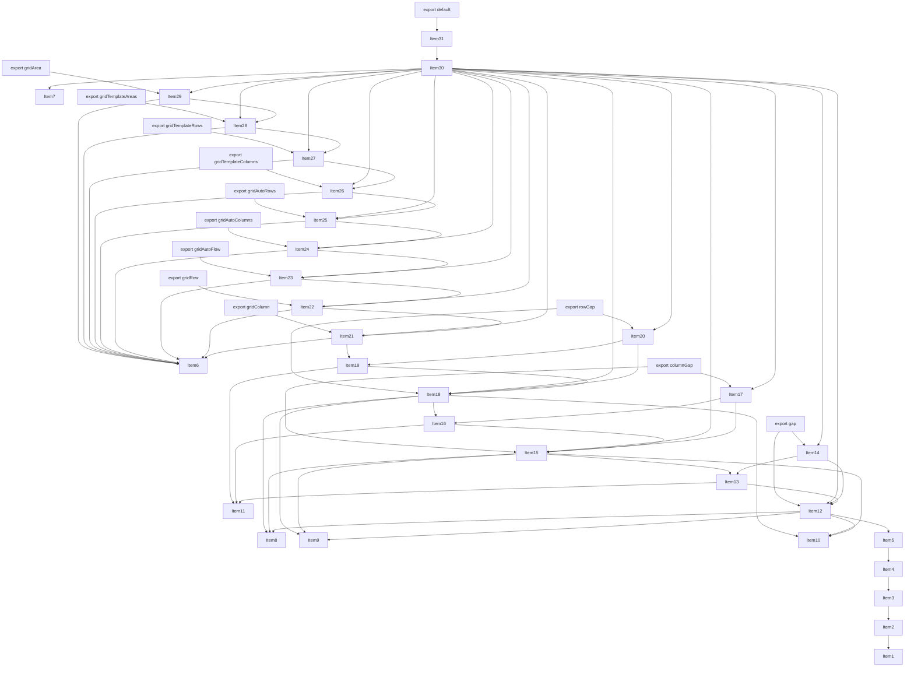

# Items

Count: 44

## Item 1: Stmt 0, `ImportOfModule`

```js
import style from './style';

```

- Hoisted
- Side effects

## Item 2: Stmt 0, `ImportBinding(0)`

```js
import style from './style';

```

- Hoisted
- Declares: `style`

## Item 3: Stmt 1, `ImportOfModule`

```js
import compose from './compose';

```

- Hoisted
- Side effects

## Item 4: Stmt 1, `ImportBinding(0)`

```js
import compose from './compose';

```

- Hoisted
- Declares: `compose`

## Item 5: Stmt 2, `ImportOfModule`

```js
import { createUnaryUnit, getValue } from './spacing';

```

- Hoisted
- Side effects

## Item 6: Stmt 2, `ImportBinding(0)`

```js
import { createUnaryUnit, getValue } from './spacing';

```

- Hoisted
- Declares: `createUnaryUnit`

## Item 7: Stmt 2, `ImportBinding(1)`

```js
import { createUnaryUnit, getValue } from './spacing';

```

- Hoisted
- Declares: `getValue`

## Item 8: Stmt 3, `ImportOfModule`

```js
import { handleBreakpoints } from './breakpoints';

```

- Hoisted
- Side effects

## Item 9: Stmt 3, `ImportBinding(0)`

```js
import { handleBreakpoints } from './breakpoints';

```

- Hoisted
- Declares: `handleBreakpoints`

## Item 10: Stmt 4, `ImportOfModule`

```js
import responsivePropType from './responsivePropType';

```

- Hoisted
- Side effects

## Item 11: Stmt 4, `ImportBinding(0)`

```js
import responsivePropType from './responsivePropType';

```

- Hoisted
- Declares: `responsivePropType`

## Item 12: Stmt 5, `VarDeclarator(0)`

```js
export const gap = (props)=>{
    if (props.gap !== undefined && props.gap !== null) {
        const transformer = createUnaryUnit(props.theme, 'spacing', 8, 'gap');
        const styleFromPropValue = (propValue)=>({
                gap: getValue(transformer, propValue)
            });
        return handleBreakpoints(props, props.gap, styleFromPropValue);
    }
    return null;
};

```

- Side effects
- Declares: `gap`
- Reads: `createUnaryUnit`, `getValue`, `handleBreakpoints`
- Write: `gap`

## Item 13: Stmt 6, `Normal`

```js
gap.propTypes = process.env.NODE_ENV !== 'production' ? {
    gap: responsivePropType
} : {};

```

- Side effects
- Reads: `gap`, `responsivePropType`
- Write: `gap`

## Item 14: Stmt 7, `Normal`

```js
gap.filterProps = [
    'gap'
];

```

- Reads: `gap`
- Write: `gap`

## Item 15: Stmt 8, `VarDeclarator(0)`

```js
export const columnGap = (props)=>{
    if (props.columnGap !== undefined && props.columnGap !== null) {
        const transformer = createUnaryUnit(props.theme, 'spacing', 8, 'columnGap');
        const styleFromPropValue = (propValue)=>({
                columnGap: getValue(transformer, propValue)
            });
        return handleBreakpoints(props, props.columnGap, styleFromPropValue);
    }
    return null;
};

```

- Side effects
- Declares: `columnGap`
- Reads: `createUnaryUnit`, `getValue`, `handleBreakpoints`
- Write: `columnGap`

## Item 16: Stmt 9, `Normal`

```js
columnGap.propTypes = process.env.NODE_ENV !== 'production' ? {
    columnGap: responsivePropType
} : {};

```

- Side effects
- Reads: `columnGap`, `responsivePropType`
- Write: `columnGap`

## Item 17: Stmt 10, `Normal`

```js
columnGap.filterProps = [
    'columnGap'
];

```

- Reads: `columnGap`
- Write: `columnGap`

## Item 18: Stmt 11, `VarDeclarator(0)`

```js
export const rowGap = (props)=>{
    if (props.rowGap !== undefined && props.rowGap !== null) {
        const transformer = createUnaryUnit(props.theme, 'spacing', 8, 'rowGap');
        const styleFromPropValue = (propValue)=>({
                rowGap: getValue(transformer, propValue)
            });
        return handleBreakpoints(props, props.rowGap, styleFromPropValue);
    }
    return null;
};

```

- Side effects
- Declares: `rowGap`
- Reads: `createUnaryUnit`, `getValue`, `handleBreakpoints`
- Write: `rowGap`

## Item 19: Stmt 12, `Normal`

```js
rowGap.propTypes = process.env.NODE_ENV !== 'production' ? {
    rowGap: responsivePropType
} : {};

```

- Side effects
- Reads: `rowGap`, `responsivePropType`
- Write: `rowGap`

## Item 20: Stmt 13, `Normal`

```js
rowGap.filterProps = [
    'rowGap'
];

```

- Reads: `rowGap`
- Write: `rowGap`

## Item 21: Stmt 14, `VarDeclarator(0)`

```js
export const gridColumn = style({
    prop: 'gridColumn'
});

```

- Side effects
- Declares: `gridColumn`
- Reads: `style`
- Write: `gridColumn`

## Item 22: Stmt 15, `VarDeclarator(0)`

```js
export const gridRow = style({
    prop: 'gridRow'
});

```

- Side effects
- Declares: `gridRow`
- Reads: `style`
- Write: `gridRow`

## Item 23: Stmt 16, `VarDeclarator(0)`

```js
export const gridAutoFlow = style({
    prop: 'gridAutoFlow'
});

```

- Side effects
- Declares: `gridAutoFlow`
- Reads: `style`
- Write: `gridAutoFlow`

## Item 24: Stmt 17, `VarDeclarator(0)`

```js
export const gridAutoColumns = style({
    prop: 'gridAutoColumns'
});

```

- Side effects
- Declares: `gridAutoColumns`
- Reads: `style`
- Write: `gridAutoColumns`

## Item 25: Stmt 18, `VarDeclarator(0)`

```js
export const gridAutoRows = style({
    prop: 'gridAutoRows'
});

```

- Side effects
- Declares: `gridAutoRows`
- Reads: `style`
- Write: `gridAutoRows`

## Item 26: Stmt 19, `VarDeclarator(0)`

```js
export const gridTemplateColumns = style({
    prop: 'gridTemplateColumns'
});

```

- Side effects
- Declares: `gridTemplateColumns`
- Reads: `style`
- Write: `gridTemplateColumns`

## Item 27: Stmt 20, `VarDeclarator(0)`

```js
export const gridTemplateRows = style({
    prop: 'gridTemplateRows'
});

```

- Side effects
- Declares: `gridTemplateRows`
- Reads: `style`
- Write: `gridTemplateRows`

## Item 28: Stmt 21, `VarDeclarator(0)`

```js
export const gridTemplateAreas = style({
    prop: 'gridTemplateAreas'
});

```

- Side effects
- Declares: `gridTemplateAreas`
- Reads: `style`
- Write: `gridTemplateAreas`

## Item 29: Stmt 22, `VarDeclarator(0)`

```js
export const gridArea = style({
    prop: 'gridArea'
});

```

- Side effects
- Declares: `gridArea`
- Reads: `style`
- Write: `gridArea`

## Item 30: Stmt 23, `VarDeclarator(0)`

```js
const grid = compose(gap, columnGap, rowGap, gridColumn, gridRow, gridAutoFlow, gridAutoColumns, gridAutoRows, gridTemplateColumns, gridTemplateRows, gridTemplateAreas, gridArea);

```

- Side effects
- Declares: `grid`
- Reads: `compose`, `gap`, `columnGap`, `rowGap`, `gridColumn`, `gridRow`, `gridAutoFlow`, `gridAutoColumns`, `gridAutoRows`, `gridTemplateColumns`, `gridTemplateRows`, `gridTemplateAreas`, `gridArea`
- Write: `grid`

## Item 31: Stmt 24, `Normal`

```js
export default grid;

```

- Side effects
- Declares: `__TURBOPACK__default__export__`
- Reads: `grid`
- Write: `__TURBOPACK__default__export__`

# Phase 1

```mermaid
graph TD
    Item1;
    Item6;
    Item2;
    Item7;
    Item3;
    Item8;
    Item9;
    Item4;
    Item10;
    Item5;
    Item11;
    Item12;
    Item13;
    Item14;
    Item15;
    Item16;
    Item17;
    Item18;
    Item19;
    Item20;
    Item21;
    Item22;
    Item23;
    Item24;
    Item25;
    Item26;
    Item27;
    Item28;
    Item29;
    Item30;
    Item31;
    Item32;
    Item32["export gap"];
    Item33;
    Item33["export columnGap"];
    Item34;
    Item34["export rowGap"];
    Item35;
    Item35["export gridColumn"];
    Item36;
    Item36["export gridRow"];
    Item37;
    Item37["export gridAutoFlow"];
    Item38;
    Item38["export gridAutoColumns"];
    Item39;
    Item39["export gridAutoRows"];
    Item40;
    Item40["export gridTemplateColumns"];
    Item41;
    Item41["export gridTemplateRows"];
    Item42;
    Item42["export gridTemplateAreas"];
    Item43;
    Item43["export gridArea"];
    Item44;
    Item44["export default"];
    Item2 --> Item1;
    Item3 --> Item2;
    Item4 --> Item3;
    Item5 --> Item4;
```

# Phase 2

# Phase 3

# Phase 4

# Final

```mermaid
graph TD
    N0["Items: [ItemId(0, ImportOfModule), ItemId(1, ImportOfModule), ItemId(2, ImportOfModule), ItemId(3, ImportOfModule), ItemId(4, ImportOfModule)]"];
    N1["Items: [ItemId(0, ImportBinding(0))]"];
    N2["Items: [ItemId(1, ImportBinding(0))]"];
    N3["Items: [ItemId(2, ImportBinding(0))]"];
    N4["Items: [ItemId(2, ImportBinding(1))]"];
    N5["Items: [ItemId(3, ImportBinding(0))]"];
    N6["Items: [ItemId(4, ImportBinding(0))]"];
    N7["Items: [ItemId(5, VarDeclarator(0)), ItemId(6, Normal), ItemId(7, Normal), ItemId(Export((&quot;gap&quot;, #2), &quot;gap&quot;))]"];
    N8["Items: [ItemId(8, VarDeclarator(0)), ItemId(9, Normal), ItemId(11, VarDeclarator(0)), ItemId(13, Normal), ItemId(Export((&quot;rowGap&quot;, #2), &quot;rowGap&quot;))]"];
    N9["Items: [ItemId(10, Normal), ItemId(Export((&quot;columnGap&quot;, #2), &quot;columnGap&quot;))]"];
    N10["Items: [ItemId(12, Normal), ItemId(14, VarDeclarator(0)), ItemId(15, VarDeclarator(0)), ItemId(16, VarDeclarator(0)), ItemId(17, VarDeclarator(0)), ItemId(18, VarDeclarator(0))]"];
    N11["Items: [ItemId(19, VarDeclarator(0)), ItemId(Export((&quot;gridAutoColumns&quot;, #2), &quot;gridAutoColumns&quot;))]"];
    N12["Items: [ItemId(20, VarDeclarator(0)), ItemId(21, VarDeclarator(0))]"];
    N13["Items: [ItemId(22, VarDeclarator(0)), ItemId(Export((&quot;gridArea&quot;, #2), &quot;gridArea&quot;))]"];
    N14["Items: [ItemId(23, VarDeclarator(0)), ItemId(24, Normal), ItemId(Export((&quot;__TURBOPACK__default__export__&quot;, #12), &quot;default&quot;))]"];
    N15["Items: [ItemId(Export((&quot;gridAutoFlow&quot;, #2), &quot;gridAutoFlow&quot;))]"];
    N16["Items: [ItemId(Export((&quot;gridAutoRows&quot;, #2), &quot;gridAutoRows&quot;))]"];
    N17["Items: [ItemId(Export((&quot;gridColumn&quot;, #2), &quot;gridColumn&quot;))]"];
    N18["Items: [ItemId(Export((&quot;gridRow&quot;, #2), &quot;gridRow&quot;))]"];
    N19["Items: [ItemId(Export((&quot;gridTemplateAreas&quot;, #2), &quot;gridTemplateAreas&quot;))]"];
    N20["Items: [ItemId(Export((&quot;gridTemplateColumns&quot;, #2), &quot;gridTemplateColumns&quot;))]"];
    N21["Items: [ItemId(Export((&quot;gridTemplateRows&quot;, #2), &quot;gridTemplateRows&quot;))]"];
    N8 --> N6;
    N13 --> N1;
    N11 --> N10;
    N6 --> N0;
    N7 --> N4;
    N7 --> N5;
    N7 --> N0;
    N7 --> N6;
    N8 --> N5;
    N7 --> N3;
    N10 --> N1;
    N16 --> N10;
    N19 --> N12;
    N11 --> N1;
    N8 --> N4;
    N8 --> N3;
    N12 --> N1;
    N10 --> N6;
    N13 --> N12;
```

# Entrypoints

```
{
    ModuleEvaluation: 14,
    Export(
        "columnGap",
    ): 9,
    Export(
        "default",
    ): 14,
    Export(
        "gap",
    ): 7,
    Export(
        "gridArea",
    ): 13,
    Export(
        "gridAutoColumns",
    ): 11,
    Export(
        "gridAutoFlow",
    ): 15,
    Export(
        "gridAutoRows",
    ): 16,
    Export(
        "gridColumn",
    ): 17,
    Export(
        "gridRow",
    ): 18,
    Export(
        "gridTemplateAreas",
    ): 19,
    Export(
        "gridTemplateColumns",
    ): 20,
    Export(
        "gridTemplateRows",
    ): 21,
    Export(
        "rowGap",
    ): 8,
    Exports: 22,
}
```


# Modules (dev)
## Part 0
```js
import './style';
import './compose';
import './spacing';
import './breakpoints';
import './responsivePropType';

```
## Part 1
```js

```
## Part 2
```js

```
## Part 3
```js

```
## Part 4
```js

```
## Part 5
```js

```
## Part 6
```js
import "__TURBOPACK_PART__" assert {
    __turbopack_part__: 0
};

```
## Part 7
```js
import "__TURBOPACK_PART__" assert {
    __turbopack_part__: 0
};
import { createUnaryUnit } from './spacing';
import "__TURBOPACK_PART__" assert {
    __turbopack_part__: 0
};
import { getValue } from './spacing';
import "__TURBOPACK_PART__" assert {
    __turbopack_part__: 0
};
import { handleBreakpoints } from './breakpoints';
import "__TURBOPACK_PART__" assert {
    __turbopack_part__: 0
};
import responsivePropType from './responsivePropType';
import "__TURBOPACK_PART__" assert {
    __turbopack_part__: 0
};
const gap = (props)=>{
    if (props.gap !== undefined && props.gap !== null) {
        const transformer = createUnaryUnit(props.theme, 'spacing', 8, 'gap');
        const styleFromPropValue = (propValue)=>({
                gap: getValue(transformer, propValue)
            });
        return handleBreakpoints(props, props.gap, styleFromPropValue);
    }
    return null;
};
gap.propTypes = process.env.NODE_ENV !== 'production' ? {
    gap: responsivePropType
} : {};
gap.filterProps = [
    'gap'
];
export { gap };
export { gap as a } from "__TURBOPACK_VAR__" assert {
    __turbopack_var__: true
};

```
## Part 8
```js
import "__TURBOPACK_PART__" assert {
    __turbopack_part__: 0
};
import { createUnaryUnit } from './spacing';
import "__TURBOPACK_PART__" assert {
    __turbopack_part__: 0
};
import { getValue } from './spacing';
import "__TURBOPACK_PART__" assert {
    __turbopack_part__: 0
};
import { handleBreakpoints } from './breakpoints';
import "__TURBOPACK_PART__" assert {
    __turbopack_part__: 0
};
import responsivePropType from './responsivePropType';
const columnGap = (props)=>{
    if (props.columnGap !== undefined && props.columnGap !== null) {
        const transformer = createUnaryUnit(props.theme, 'spacing', 8, 'columnGap');
        const styleFromPropValue = (propValue)=>({
                columnGap: getValue(transformer, propValue)
            });
        return handleBreakpoints(props, props.columnGap, styleFromPropValue);
    }
    return null;
};
columnGap.propTypes = process.env.NODE_ENV !== 'production' ? {
    columnGap: responsivePropType
} : {};
const rowGap = (props)=>{
    if (props.rowGap !== undefined && props.rowGap !== null) {
        const transformer = createUnaryUnit(props.theme, 'spacing', 8, 'rowGap');
        const styleFromPropValue = (propValue)=>({
                rowGap: getValue(transformer, propValue)
            });
        return handleBreakpoints(props, props.rowGap, styleFromPropValue);
    }
    return null;
};
rowGap.filterProps = [
    'rowGap'
];
export { rowGap };
export { columnGap as b } from "__TURBOPACK_VAR__" assert {
    __turbopack_var__: true
};
export { rowGap as c } from "__TURBOPACK_VAR__" assert {
    __turbopack_var__: true
};

```
## Part 9
```js
import { b as columnGap } from "__TURBOPACK_PART__" assert {
    __turbopack_part__: -8
};
columnGap.filterProps = [
    'columnGap'
];
export { columnGap };

```
## Part 10
```js
import { c as rowGap } from "__TURBOPACK_PART__" assert {
    __turbopack_part__: -8
};
import "__TURBOPACK_PART__" assert {
    __turbopack_part__: 0
};
import responsivePropType from './responsivePropType';
import "__TURBOPACK_PART__" assert {
    __turbopack_part__: 0
};
import style from './style';
rowGap.propTypes = process.env.NODE_ENV !== 'production' ? {
    rowGap: responsivePropType
} : {};
const gridColumn = style({
    prop: 'gridColumn'
});
const gridRow = style({
    prop: 'gridRow'
});
const gridAutoFlow = style({
    prop: 'gridAutoFlow'
});
const gridAutoColumns = style({
    prop: 'gridAutoColumns'
});
const gridAutoRows = style({
    prop: 'gridAutoRows'
});
export { gridColumn as d } from "__TURBOPACK_VAR__" assert {
    __turbopack_var__: true
};
export { gridRow as e } from "__TURBOPACK_VAR__" assert {
    __turbopack_var__: true
};
export { gridAutoFlow as f } from "__TURBOPACK_VAR__" assert {
    __turbopack_var__: true
};
export { gridAutoColumns as g } from "__TURBOPACK_VAR__" assert {
    __turbopack_var__: true
};
export { gridAutoRows as h } from "__TURBOPACK_VAR__" assert {
    __turbopack_var__: true
};

```
## Part 11
```js
import "__TURBOPACK_PART__" assert {
    __turbopack_part__: 0
};
import style from './style';
import { g as gridAutoColumns } from "__TURBOPACK_PART__" assert {
    __turbopack_part__: -10
};
const gridTemplateColumns = style({
    prop: 'gridTemplateColumns'
});
export { gridAutoColumns };
export { gridTemplateColumns as i } from "__TURBOPACK_VAR__" assert {
    __turbopack_var__: true
};

```
## Part 12
```js
import "__TURBOPACK_PART__" assert {
    __turbopack_part__: 0
};
import style from './style';
const gridTemplateRows = style({
    prop: 'gridTemplateRows'
});
const gridTemplateAreas = style({
    prop: 'gridTemplateAreas'
});
export { gridTemplateRows as j } from "__TURBOPACK_VAR__" assert {
    __turbopack_var__: true
};
export { gridTemplateAreas as k } from "__TURBOPACK_VAR__" assert {
    __turbopack_var__: true
};

```
## Part 13
```js
import "__TURBOPACK_PART__" assert {
    __turbopack_part__: 0
};
import style from './style';
import "__TURBOPACK_PART__" assert {
    __turbopack_part__: 12
};
const gridArea = style({
    prop: 'gridArea'
});
export { gridArea };
export { gridArea as l } from "__TURBOPACK_VAR__" assert {
    __turbopack_var__: true
};

```
## Part 14
```js
import "__TURBOPACK_PART__" assert {
    __turbopack_part__: 0
};
import compose from './compose';
import { a as gap } from "__TURBOPACK_PART__" assert {
    __turbopack_part__: -7
};
import { b as columnGap } from "__TURBOPACK_PART__" assert {
    __turbopack_part__: -8
};
import { c as rowGap } from "__TURBOPACK_PART__" assert {
    __turbopack_part__: -8
};
import { d as gridColumn } from "__TURBOPACK_PART__" assert {
    __turbopack_part__: -10
};
import { e as gridRow } from "__TURBOPACK_PART__" assert {
    __turbopack_part__: -10
};
import { f as gridAutoFlow } from "__TURBOPACK_PART__" assert {
    __turbopack_part__: -10
};
import { g as gridAutoColumns } from "__TURBOPACK_PART__" assert {
    __turbopack_part__: -10
};
import { h as gridAutoRows } from "__TURBOPACK_PART__" assert {
    __turbopack_part__: -10
};
import { i as gridTemplateColumns } from "__TURBOPACK_PART__" assert {
    __turbopack_part__: -11
};
import { j as gridTemplateRows } from "__TURBOPACK_PART__" assert {
    __turbopack_part__: -12
};
import { k as gridTemplateAreas } from "__TURBOPACK_PART__" assert {
    __turbopack_part__: -12
};
import { l as gridArea } from "__TURBOPACK_PART__" assert {
    __turbopack_part__: -13
};
const grid = compose(gap, columnGap, rowGap, gridColumn, gridRow, gridAutoFlow, gridAutoColumns, gridAutoRows, gridTemplateColumns, gridTemplateRows, gridTemplateAreas, gridArea);
const __TURBOPACK__default__export__ = grid;
export { __TURBOPACK__default__export__ as default };
export { grid as m } from "__TURBOPACK_VAR__" assert {
    __turbopack_var__: true
};
export { __TURBOPACK__default__export__ as n } from "__TURBOPACK_VAR__" assert {
    __turbopack_var__: true
};
export { };

```
## Part 15
```js
import { f as gridAutoFlow } from "__TURBOPACK_PART__" assert {
    __turbopack_part__: -10
};
export { gridAutoFlow };

```
## Part 16
```js
import { h as gridAutoRows } from "__TURBOPACK_PART__" assert {
    __turbopack_part__: -10
};
export { gridAutoRows };

```
## Part 17
```js
import { d as gridColumn } from "__TURBOPACK_PART__" assert {
    __turbopack_part__: -10
};
export { gridColumn };

```
## Part 18
```js
import { e as gridRow } from "__TURBOPACK_PART__" assert {
    __turbopack_part__: -10
};
export { gridRow };

```
## Part 19
```js
import { k as gridTemplateAreas } from "__TURBOPACK_PART__" assert {
    __turbopack_part__: -12
};
export { gridTemplateAreas };

```
## Part 20
```js
import { i as gridTemplateColumns } from "__TURBOPACK_PART__" assert {
    __turbopack_part__: -11
};
export { gridTemplateColumns };

```
## Part 21
```js
import { j as gridTemplateRows } from "__TURBOPACK_PART__" assert {
    __turbopack_part__: -12
};
export { gridTemplateRows };

```
## Part 22
```js
export { gap } from "__TURBOPACK_PART__" assert {
    __turbopack_part__: "export gap"
};
export { rowGap } from "__TURBOPACK_PART__" assert {
    __turbopack_part__: "export rowGap"
};
export { columnGap } from "__TURBOPACK_PART__" assert {
    __turbopack_part__: "export columnGap"
};
export { gridAutoColumns } from "__TURBOPACK_PART__" assert {
    __turbopack_part__: "export gridAutoColumns"
};
export { gridArea } from "__TURBOPACK_PART__" assert {
    __turbopack_part__: "export gridArea"
};
export { default } from "__TURBOPACK_PART__" assert {
    __turbopack_part__: "export default"
};
export { gridAutoFlow } from "__TURBOPACK_PART__" assert {
    __turbopack_part__: "export gridAutoFlow"
};
export { gridAutoRows } from "__TURBOPACK_PART__" assert {
    __turbopack_part__: "export gridAutoRows"
};
export { gridColumn } from "__TURBOPACK_PART__" assert {
    __turbopack_part__: "export gridColumn"
};
export { gridRow } from "__TURBOPACK_PART__" assert {
    __turbopack_part__: "export gridRow"
};
export { gridTemplateAreas } from "__TURBOPACK_PART__" assert {
    __turbopack_part__: "export gridTemplateAreas"
};
export { gridTemplateColumns } from "__TURBOPACK_PART__" assert {
    __turbopack_part__: "export gridTemplateColumns"
};
export { gridTemplateRows } from "__TURBOPACK_PART__" assert {
    __turbopack_part__: "export gridTemplateRows"
};

```
## Merged (module eval)
```js
import "__TURBOPACK_PART__" assert {
    __turbopack_part__: 0
};
import compose from './compose';
import { a as gap } from "__TURBOPACK_PART__" assert {
    __turbopack_part__: -7
};
import { b as columnGap } from "__TURBOPACK_PART__" assert {
    __turbopack_part__: -8
};
import { d as gridColumn } from "__TURBOPACK_PART__" assert {
    __turbopack_part__: -10
};
import { i as gridTemplateColumns } from "__TURBOPACK_PART__" assert {
    __turbopack_part__: -11
};
import { j as gridTemplateRows } from "__TURBOPACK_PART__" assert {
    __turbopack_part__: -12
};
import { l as gridArea } from "__TURBOPACK_PART__" assert {
    __turbopack_part__: -13
};
const grid = compose(gap, columnGap, rowGap, gridColumn, gridRow, gridAutoFlow, gridAutoColumns, gridAutoRows, gridTemplateColumns, gridTemplateRows, gridTemplateAreas, gridArea);
const __TURBOPACK__default__export__ = grid;
export { __TURBOPACK__default__export__ as default };
export { grid as m } from "__TURBOPACK_VAR__" assert {
    __turbopack_var__: true
};
export { __TURBOPACK__default__export__ as n } from "__TURBOPACK_VAR__" assert {
    __turbopack_var__: true
};
export { };

```
# Entrypoints

```
{
    ModuleEvaluation: 14,
    Export(
        "columnGap",
    ): 9,
    Export(
        "default",
    ): 14,
    Export(
        "gap",
    ): 7,
    Export(
        "gridArea",
    ): 13,
    Export(
        "gridAutoColumns",
    ): 11,
    Export(
        "gridAutoFlow",
    ): 15,
    Export(
        "gridAutoRows",
    ): 16,
    Export(
        "gridColumn",
    ): 17,
    Export(
        "gridRow",
    ): 18,
    Export(
        "gridTemplateAreas",
    ): 19,
    Export(
        "gridTemplateColumns",
    ): 20,
    Export(
        "gridTemplateRows",
    ): 21,
    Export(
        "rowGap",
    ): 8,
    Exports: 22,
}
```


# Modules (prod)
## Part 0
```js
import './style';
import './compose';
import './spacing';
import './breakpoints';
import './responsivePropType';

```
## Part 1
```js

```
## Part 2
```js

```
## Part 3
```js

```
## Part 4
```js

```
## Part 5
```js

```
## Part 6
```js
import "__TURBOPACK_PART__" assert {
    __turbopack_part__: 0
};

```
## Part 7
```js
import "__TURBOPACK_PART__" assert {
    __turbopack_part__: 0
};
import { createUnaryUnit } from './spacing';
import "__TURBOPACK_PART__" assert {
    __turbopack_part__: 0
};
import { getValue } from './spacing';
import "__TURBOPACK_PART__" assert {
    __turbopack_part__: 0
};
import { handleBreakpoints } from './breakpoints';
import "__TURBOPACK_PART__" assert {
    __turbopack_part__: 0
};
import responsivePropType from './responsivePropType';
import "__TURBOPACK_PART__" assert {
    __turbopack_part__: 0
};
const gap = (props)=>{
    if (props.gap !== undefined && props.gap !== null) {
        const transformer = createUnaryUnit(props.theme, 'spacing', 8, 'gap');
        const styleFromPropValue = (propValue)=>({
                gap: getValue(transformer, propValue)
            });
        return handleBreakpoints(props, props.gap, styleFromPropValue);
    }
    return null;
};
gap.propTypes = process.env.NODE_ENV !== 'production' ? {
    gap: responsivePropType
} : {};
gap.filterProps = [
    'gap'
];
export { gap };
export { gap as a } from "__TURBOPACK_VAR__" assert {
    __turbopack_var__: true
};

```
## Part 8
```js
import "__TURBOPACK_PART__" assert {
    __turbopack_part__: 0
};
import { createUnaryUnit } from './spacing';
import "__TURBOPACK_PART__" assert {
    __turbopack_part__: 0
};
import { getValue } from './spacing';
import "__TURBOPACK_PART__" assert {
    __turbopack_part__: 0
};
import { handleBreakpoints } from './breakpoints';
import "__TURBOPACK_PART__" assert {
    __turbopack_part__: 0
};
import responsivePropType from './responsivePropType';
const columnGap = (props)=>{
    if (props.columnGap !== undefined && props.columnGap !== null) {
        const transformer = createUnaryUnit(props.theme, 'spacing', 8, 'columnGap');
        const styleFromPropValue = (propValue)=>({
                columnGap: getValue(transformer, propValue)
            });
        return handleBreakpoints(props, props.columnGap, styleFromPropValue);
    }
    return null;
};
columnGap.propTypes = process.env.NODE_ENV !== 'production' ? {
    columnGap: responsivePropType
} : {};
const rowGap = (props)=>{
    if (props.rowGap !== undefined && props.rowGap !== null) {
        const transformer = createUnaryUnit(props.theme, 'spacing', 8, 'rowGap');
        const styleFromPropValue = (propValue)=>({
                rowGap: getValue(transformer, propValue)
            });
        return handleBreakpoints(props, props.rowGap, styleFromPropValue);
    }
    return null;
};
rowGap.filterProps = [
    'rowGap'
];
export { rowGap };
export { columnGap as b } from "__TURBOPACK_VAR__" assert {
    __turbopack_var__: true
};
export { rowGap as c } from "__TURBOPACK_VAR__" assert {
    __turbopack_var__: true
};

```
## Part 9
```js
import { b as columnGap } from "__TURBOPACK_PART__" assert {
    __turbopack_part__: -8
};
columnGap.filterProps = [
    'columnGap'
];
export { columnGap };

```
## Part 10
```js
import { c as rowGap } from "__TURBOPACK_PART__" assert {
    __turbopack_part__: -8
};
import "__TURBOPACK_PART__" assert {
    __turbopack_part__: 0
};
import responsivePropType from './responsivePropType';
import "__TURBOPACK_PART__" assert {
    __turbopack_part__: 0
};
import style from './style';
rowGap.propTypes = process.env.NODE_ENV !== 'production' ? {
    rowGap: responsivePropType
} : {};
const gridColumn = style({
    prop: 'gridColumn'
});
const gridRow = style({
    prop: 'gridRow'
});
const gridAutoFlow = style({
    prop: 'gridAutoFlow'
});
const gridAutoColumns = style({
    prop: 'gridAutoColumns'
});
const gridAutoRows = style({
    prop: 'gridAutoRows'
});
export { gridColumn as d } from "__TURBOPACK_VAR__" assert {
    __turbopack_var__: true
};
export { gridRow as e } from "__TURBOPACK_VAR__" assert {
    __turbopack_var__: true
};
export { gridAutoFlow as f } from "__TURBOPACK_VAR__" assert {
    __turbopack_var__: true
};
export { gridAutoColumns as g } from "__TURBOPACK_VAR__" assert {
    __turbopack_var__: true
};
export { gridAutoRows as h } from "__TURBOPACK_VAR__" assert {
    __turbopack_var__: true
};

```
## Part 11
```js
import "__TURBOPACK_PART__" assert {
    __turbopack_part__: 0
};
import style from './style';
import { g as gridAutoColumns } from "__TURBOPACK_PART__" assert {
    __turbopack_part__: -10
};
const gridTemplateColumns = style({
    prop: 'gridTemplateColumns'
});
export { gridAutoColumns };
export { gridTemplateColumns as i } from "__TURBOPACK_VAR__" assert {
    __turbopack_var__: true
};

```
## Part 12
```js
import "__TURBOPACK_PART__" assert {
    __turbopack_part__: 0
};
import style from './style';
const gridTemplateRows = style({
    prop: 'gridTemplateRows'
});
const gridTemplateAreas = style({
    prop: 'gridTemplateAreas'
});
export { gridTemplateRows as j } from "__TURBOPACK_VAR__" assert {
    __turbopack_var__: true
};
export { gridTemplateAreas as k } from "__TURBOPACK_VAR__" assert {
    __turbopack_var__: true
};

```
## Part 13
```js
import "__TURBOPACK_PART__" assert {
    __turbopack_part__: 0
};
import style from './style';
import "__TURBOPACK_PART__" assert {
    __turbopack_part__: 12
};
const gridArea = style({
    prop: 'gridArea'
});
export { gridArea };
export { gridArea as l } from "__TURBOPACK_VAR__" assert {
    __turbopack_var__: true
};

```
## Part 14
```js
import "__TURBOPACK_PART__" assert {
    __turbopack_part__: 0
};
import compose from './compose';
import { a as gap } from "__TURBOPACK_PART__" assert {
    __turbopack_part__: -7
};
import { b as columnGap } from "__TURBOPACK_PART__" assert {
    __turbopack_part__: -8
};
import { c as rowGap } from "__TURBOPACK_PART__" assert {
    __turbopack_part__: -8
};
import { d as gridColumn } from "__TURBOPACK_PART__" assert {
    __turbopack_part__: -10
};
import { e as gridRow } from "__TURBOPACK_PART__" assert {
    __turbopack_part__: -10
};
import { f as gridAutoFlow } from "__TURBOPACK_PART__" assert {
    __turbopack_part__: -10
};
import { g as gridAutoColumns } from "__TURBOPACK_PART__" assert {
    __turbopack_part__: -10
};
import { h as gridAutoRows } from "__TURBOPACK_PART__" assert {
    __turbopack_part__: -10
};
import { i as gridTemplateColumns } from "__TURBOPACK_PART__" assert {
    __turbopack_part__: -11
};
import { j as gridTemplateRows } from "__TURBOPACK_PART__" assert {
    __turbopack_part__: -12
};
import { k as gridTemplateAreas } from "__TURBOPACK_PART__" assert {
    __turbopack_part__: -12
};
import { l as gridArea } from "__TURBOPACK_PART__" assert {
    __turbopack_part__: -13
};
const grid = compose(gap, columnGap, rowGap, gridColumn, gridRow, gridAutoFlow, gridAutoColumns, gridAutoRows, gridTemplateColumns, gridTemplateRows, gridTemplateAreas, gridArea);
const __TURBOPACK__default__export__ = grid;
export { __TURBOPACK__default__export__ as default };
export { grid as m } from "__TURBOPACK_VAR__" assert {
    __turbopack_var__: true
};
export { __TURBOPACK__default__export__ as n } from "__TURBOPACK_VAR__" assert {
    __turbopack_var__: true
};
export { };

```
## Part 15
```js
import { f as gridAutoFlow } from "__TURBOPACK_PART__" assert {
    __turbopack_part__: -10
};
export { gridAutoFlow };

```
## Part 16
```js
import { h as gridAutoRows } from "__TURBOPACK_PART__" assert {
    __turbopack_part__: -10
};
export { gridAutoRows };

```
## Part 17
```js
import { d as gridColumn } from "__TURBOPACK_PART__" assert {
    __turbopack_part__: -10
};
export { gridColumn };

```
## Part 18
```js
import { e as gridRow } from "__TURBOPACK_PART__" assert {
    __turbopack_part__: -10
};
export { gridRow };

```
## Part 19
```js
import { k as gridTemplateAreas } from "__TURBOPACK_PART__" assert {
    __turbopack_part__: -12
};
export { gridTemplateAreas };

```
## Part 20
```js
import { i as gridTemplateColumns } from "__TURBOPACK_PART__" assert {
    __turbopack_part__: -11
};
export { gridTemplateColumns };

```
## Part 21
```js
import { j as gridTemplateRows } from "__TURBOPACK_PART__" assert {
    __turbopack_part__: -12
};
export { gridTemplateRows };

```
## Part 22
```js
export { gap } from "__TURBOPACK_PART__" assert {
    __turbopack_part__: "export gap"
};
export { rowGap } from "__TURBOPACK_PART__" assert {
    __turbopack_part__: "export rowGap"
};
export { columnGap } from "__TURBOPACK_PART__" assert {
    __turbopack_part__: "export columnGap"
};
export { gridAutoColumns } from "__TURBOPACK_PART__" assert {
    __turbopack_part__: "export gridAutoColumns"
};
export { gridArea } from "__TURBOPACK_PART__" assert {
    __turbopack_part__: "export gridArea"
};
export { default } from "__TURBOPACK_PART__" assert {
    __turbopack_part__: "export default"
};
export { gridAutoFlow } from "__TURBOPACK_PART__" assert {
    __turbopack_part__: "export gridAutoFlow"
};
export { gridAutoRows } from "__TURBOPACK_PART__" assert {
    __turbopack_part__: "export gridAutoRows"
};
export { gridColumn } from "__TURBOPACK_PART__" assert {
    __turbopack_part__: "export gridColumn"
};
export { gridRow } from "__TURBOPACK_PART__" assert {
    __turbopack_part__: "export gridRow"
};
export { gridTemplateAreas } from "__TURBOPACK_PART__" assert {
    __turbopack_part__: "export gridTemplateAreas"
};
export { gridTemplateColumns } from "__TURBOPACK_PART__" assert {
    __turbopack_part__: "export gridTemplateColumns"
};
export { gridTemplateRows } from "__TURBOPACK_PART__" assert {
    __turbopack_part__: "export gridTemplateRows"
};

```
## Merged (module eval)
```js
import "__TURBOPACK_PART__" assert {
    __turbopack_part__: 0
};
import compose from './compose';
import { a as gap } from "__TURBOPACK_PART__" assert {
    __turbopack_part__: -7
};
import { b as columnGap } from "__TURBOPACK_PART__" assert {
    __turbopack_part__: -8
};
import { d as gridColumn } from "__TURBOPACK_PART__" assert {
    __turbopack_part__: -10
};
import { i as gridTemplateColumns } from "__TURBOPACK_PART__" assert {
    __turbopack_part__: -11
};
import { j as gridTemplateRows } from "__TURBOPACK_PART__" assert {
    __turbopack_part__: -12
};
import { l as gridArea } from "__TURBOPACK_PART__" assert {
    __turbopack_part__: -13
};
const grid = compose(gap, columnGap, rowGap, gridColumn, gridRow, gridAutoFlow, gridAutoColumns, gridAutoRows, gridTemplateColumns, gridTemplateRows, gridTemplateAreas, gridArea);
const __TURBOPACK__default__export__ = grid;
export { __TURBOPACK__default__export__ as default };
export { grid as m } from "__TURBOPACK_VAR__" assert {
    __turbopack_var__: true
};
export { __TURBOPACK__default__export__ as n } from "__TURBOPACK_VAR__" assert {
    __turbopack_var__: true
};
export { };

```
